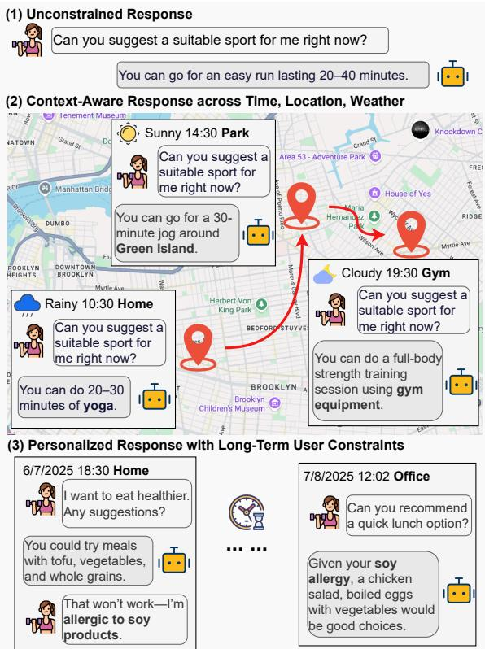
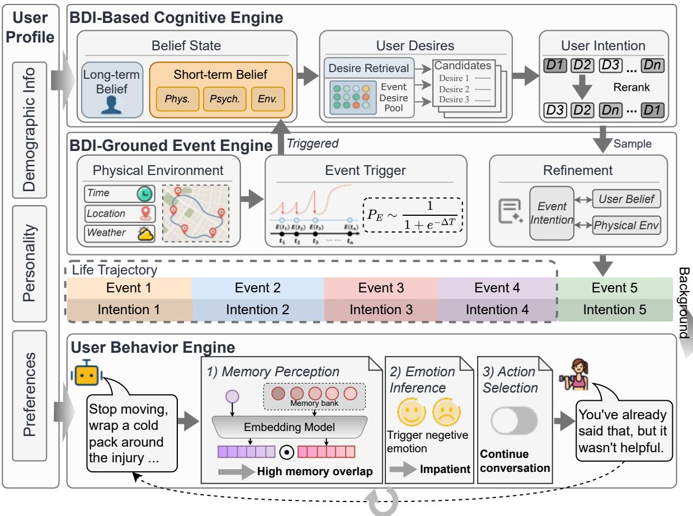
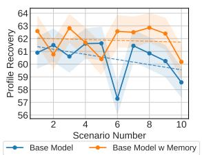
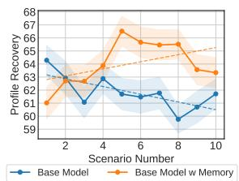
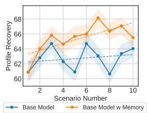
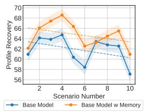
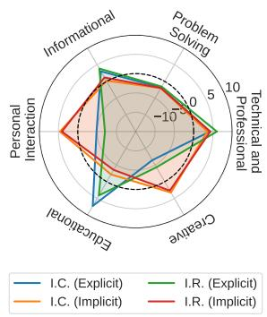
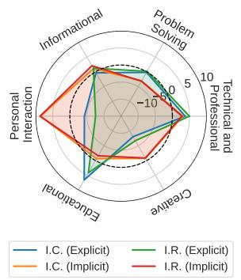
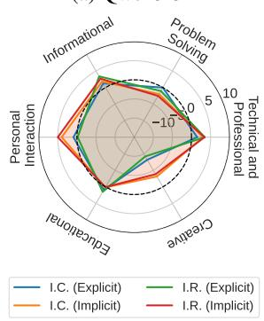
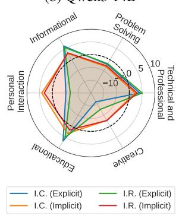

# LifeSim：用于个性化助手评估的长时程用户生活模拟器

Feiyu Duan1, Xuanjing Huang3, Zhongyu Wei1,2,4,5\* ,

1 复旦大学数据科学学院

2 上海创新研究院

3 复旦大学计算机科学技术学院、人工智能学院  
4 复旦大学国家发展与智能治理综合实验室  
5 复旦大学智能复杂体系基础理论与关键技术实验室  
fyduan25@m.fudan.edu.cn {xjhuang,zywei}@fudan.edu.cn

## 摘要

大语言模型（LLM）的快速发展加速了通用型 AI 助手的进步。然而，现有面向个性化助手的基准与真实世界中的用户-助手交互仍然存在错位，无法刻画外部情境和用户认知状态的复杂性。为弥补这一缺口，我们提出 LifeSim，一个用户模拟器：它在物理环境中基于 Belief-Desire-Intention（BDI，信念-欲望-意图）模型来建模用户认知，从而生成连贯的生活轨迹，并模拟由意图驱动的用户交互行为。基于 LifeSim，我们进一步提出 LifeSim-Eval，一个面向多场景、长时程个性化辅助的综合基准。LifeSim-Eval 覆盖 8 个生活领域、1200 个多样化场景，并采用多轮交互方式来评估模型完成显式和隐式意图、恢复用户画像以及生成高质量回复的能力。在单场景和长时程两种设定下，我们的实验表明：当前 LLM 在处理隐式意图和长期用户偏好建模方面仍存在明显局限。

## 1 引言

大语言模型（LLM）的快速发展显著拓展了 AI 助手在多种场景与任务中的能力，使得“Jarvis 式”通用数字助手的愿景正变得越来越可实现（Raza et al., 2025）。近期研究从多个角度提出了优化方法（Yuan et al., 2025; Jiang et al., 2025; Zhao et al., 2025b），不仅提升了模型处理复杂、知识密集型任务的能力，也增强了其社会智能（Mathur et al., 2024）。然而，当前评估框架与现实场景之间仍存在明显鸿沟，限制了个性化智能的发展（Jiang et al., 2025; Zhao et al., 2025a; Kim et al., 2024）。

  
图 1：扎根于长时程时空情境的个性化 AI 辅助示意图。用户行为会随外部环境演化，同时又反映相对稳定的个人特质。有效的回复不仅要求模型根据当前情境调整策略，还需要利用交互历史去推断用户状态。

如图 1 所示，理想的真实用户-助手交互与孤立式问答有本质区别，并包含两个关键复杂维度。  
(1) 复杂的外部环境：用户需求会随着时间、地点、天气和正在发生的生活事件等情境因素而变化（Kim et al., 2025b; Fan et al., 2025）。  
(2) 动态的用户认知状态：用户意图源于内部认知状态，而这些认知状态又共同受不断演化的生活经历，以及相对稳定的人格与偏好所塑造（Wu et al., 2024）。  
现实中的用户数据受到隐私和伦理约束，而跨越多年、涵盖多样场景的公开交互日志极其稀缺（Xu et al., 2022）。因此，现有 benchmark 往往不得不依赖静态或短上下文数据集，难以真实反映现实世界中用户与助手交互的动态本质。于是，如何大规模建立一个真实的、长期的用户-助手交互测试平台，就成为一个基础性问题。

  
图 2：LifeSim 框架总览。对于每个目标用户，用户画像由人口统计属性、人格特质和长期偏好组成，它们共同构成长程 belief state。基于 BDI 的认知引擎和事件引擎结合主观 belief state 与物理环境来生成用户意图。用户行为引擎则通过建模记忆感知、情绪推断和动作选择来生成对话。

为弥补上述缺口，我们提出长时程用户生活模拟器（Long-horizon user Life Simulator, LifeSim）。这是一个高保真框架，能够在内部认知模型与外部环境双重约束下，模拟多样化用户沿生活轨迹展开的行为。对于用户认知建模，我们采用 Belief-Desire-Intention（BDI）模型来构建用户内部推理过程。为模拟复杂外部环境，LifeSim 集成了一个事件引擎，在 BDI 模型指导下生成生活轨迹。为实现用户交互行为，LifeSim 纳入了用户行为引擎，使其能够生成与内部认知和外部情境一致的连贯回复。为了保证人群多样性，我们构建了一个百万级用户池，其中包含丰富的人口统计属性、人格特质与偏好信息。

在 LifeSim 之上，我们进一步构建了 LifeSim-Eval，用于评估模型在长期个性化交互中的能力。该基准包含 8 个常见生活领域中的 1200 个场景。LifeSim-Eval 采用在线交互协议，评估模型识别用户意图、给出与偏好一致的回复，以及在长期交互中回忆用户偏好的能力。我们在 10 余个开源和闭源模型上进行了系统实验。结果表明：  
(i) 当前 LLM 在处理显式意图时表现较强，但在隐式意图和长时程用户建模上仍然吃力；  
(ii) 简单的画像记忆机制收益有限，这说明有效的个性化不仅需要保留偏好信息，还需要稳定的偏好推理能力。

## 2 LifeSim 框架

图 2 展示了 LifeSim 的整体架构，它包含四个主要组成部分：基于 BDI 的认知引擎、以 BDI 为基础的事件引擎、用户行为引擎以及用户画像池。对于每次模拟，我们首先从画像池中采样一个用户画像，以初始化长期 belief state。给定该目标用户对应的空间轨迹后，LifeSim 会构建其生活轨迹，其中每个可能的服务点都关联一个用户意图以及相应生活事件。算法 1 概述了生活轨迹的生成过程。用户行为引擎则基于已生成的背景来模拟用户回复。下面的小节将详细介绍其架构与生成过程。

## 2.1 基于 BDI 的认知引擎

为刻画目标用户的内部推理过程，我们采用 Belief-Desire-Intention（BDI）模型（Bratman, 1987），它是关于人类实践推理的一种心理学模型。

**Belief State**  
Belief 总结了与用户当前决策状态相关的信息，包括：长期 belief，对应用户画像；以及短期 belief，反映用户对当前情境的认知。给定物理环境 Env，我们利用 LLM 根据用户的长期 belief 和近期生活经历生成事件假设 H，并将其作为用户的短期 belief。H 描述了在当前情境中合理且可能发生的事件。事件假设的设计遵循社会心理学中 Lewin 的公式（Heidbreder, 1937）：  

$$
B = f(P, Env)
$$

它强调，用户行为 B 来自个体 P 与环境 Env 的共同作用。

**User Desires**  
Desire 被概念化为在用户 belief 条件下的一组意图候选。在实现上，我们构建了一个 Desire Pool，其中包含广泛的潜在用户意图。每到一个服务点，我们都会根据用户的 belief state 从该池中检索 9 个候选意图。在构建 desire pool 时，每个意图都关联一个潜在事件语境，用来刻画该意图最可能出现的现实场景。为了兼顾广度与实用性，我们依据世界卫生组织生活质量框架（WHOQOL）中的高层生活领域对收集到的意图进行组织（Group et al., 1995）。其构建细节和统计信息见附录 C.2。

**User Intention**  
用户意图表示从 desires 中选出的、面向未来的承诺，即用户下一步准备追求什么。检索出的 desires 会首先根据用户的 belief state 和当前环境重新排序。在排序过程中，与用户 belief 或物理环境逻辑不一致的候选会被过滤掉。剩余候选随后通过对其排序值 r 施加 softmin 函数转成概率分布：

$$
P(I_i)=\frac{\exp(-r_i)}{\sum_k\exp(-r_k)} \tag{1}
$$

最终的意图从该分布中采样得到。

## 2.2 以 BDI 为基础的事件引擎

事件引擎会在真实物理环境中构建用户的生活轨迹。

**Physical Environment**  
我们将环境表示为 Env(T, L, W)，其中 T 表示时间、L 表示地点、W 表示天气。为保证真实性，环境扎根于用户移动轨迹，使得意图能够以符合日常规律的方式出现。我们收集了 3374 条用户轨迹，覆盖 251 个兴趣点（POI）。移动数据收集和画像匹配的详细流程见附录 C.1。

**Event Trigger**  
由于用户不会在每个轨迹点都请求服务，因此我们引入事件触发器，用于决定某个点是否生成事件。时间戳 t 处事件发生的概率记为 $P_E$，它是自上一次触发事件以来经过时间 $\Delta T$ 的函数，即 $P_E=f(\Delta T)$，其中

$$
f(z)=\frac{1}{1+e^{-z}}
$$

被具体设为 logistic 函数。随后，我们基于 $P_E$ 做 Bernoulli 采样，以决定当前点是否触发事件。若事件触发，则环境信息 Env 会被传递给认知引擎，用于构建用户的短期 belief。

<table><tr><td>意图类型</td><td>占比（%）</td></tr><tr><td>问题求解</td><td>43.4</td></tr><tr><td>信息获取</td><td>17.1</td></tr><tr><td>教育学习</td><td>11.5</td></tr><tr><td>个人互动</td><td>10.9</td></tr><tr><td>技术与专业事务</td><td>10.2</td></tr><tr><td>创意类</td><td>6.8</td></tr></table>

表 1：LifeSim-Eval 中各类意图的分布。

**Refinement**  
在认知引擎中生成意图后，事件引擎会利用其关联的事件语境，并将其落地到当前环境设定中。由于检索得到的事件和意图可能无法完全匹配具体环境条件或用户属性，事件引擎会进一步细化其细节，以确保整体一致性更强。

## 2.3 用户行为引擎

在给定意图后，用户行为引擎负责生成用户的对话行为。模拟过程中，每一轮用户发言都通过以下四个顺序阶段来建模：  
(1) **Memory Perception**：当助手回复 r 中包含信息价值时，会被抽象为一个 ⟨query, value⟩ 对并存储为记忆条目。同时，该回复还会与已有记忆做语义相似度比较；若相似度超过阈值 θ2，则触发一次负向记忆感知。  
(2) **Emotion Inference**：遵循 AnnaAgent（Wang et al., 2025）提出的 emotion-chain reasoning 范式，我们采用 GoEmotions 的情绪分类体系（Kalyuga, 2009），在生成每次回复之前预测用户当前的情绪状态。  
(3) **Action Selection**：基于上述推断信息，代理决定用户是否继续交互。  
(4) **Response Generation**：最终用户回复由记忆感知、情绪推断以及所选动作共同决定。

## 2.4 用户画像

每个用户从三个维度进行建模：  
(1) **人口统计属性**：描述年龄、性别、教育程度等粗粒度背景信息；  
(2) **人格特质**：使用大五人格理论，从五个经典维度进行表征；  
(3) **长期偏好**：反映用户对特定活动、需求或对话风格的稳定倾向，并在多场景中保持相对稳定。

为了构建大规模用户池，我们使用来源于 Twitter 的 SocioVerse 数据集（Zhang et al., 2025a）。经过疑似机器人账号过滤后，我们为每个保留下来的用户标注了 15 个核心人口统计属性。同时，我们采用 AlignX 数据集（Li et al., 2025），它基于 Maslow 需求层次与 Murray 需求系统，定义了一个覆盖心理和行为层面的 90 维人格与偏好空间。我们保留了其中最贴近日常生活与社会交互的若干人格特质和 40 个附加维度。最终，我们构建了一个包含 100 万人的用户池。

## 3 LifeSim-Eval 基准

在 LifeSim 的基础上，我们提出 LifeSim-Eval，这是一个面向长时程个性化助手的 benchmark，用于评估 AI 在动态演化交互场景中的表现。这类场景天然要求助手能够处理用户意图。然而，意图推断并不简单，因为有些意图会直接体现在当前话语中，而另一些则是隐含的（Allott, 2013）。这些隐式约束可能来自局部场景语境，也可能来自随时间积累的用户偏好与状态。因此，LifeSim-Eval 专门评估助手是否能同时满足显式与隐式意图。更多细节见附录 D。

**Single Scenario Setting**  
LifeSim-Eval 首先在无历史交互的单场景设定下评估助手行为。此时，隐式意图主要由用户画像或环境语境诱发。我们通过 Intent Recognition 与 Intent Completion 来评估助手是否正确识别并满足显式和隐式意图。为了进一步评估助手回复质量和用户建模能力，我们还报告四个辅助指标：Naturalness、Coherence、Preference Recovery 与 Persona Alignment。

<table><tr><td rowspan="2">模型</td><td colspan="2">Intent Recognition</td><td colspan="2">Intent Completion</td><td rowspan="2">Naturalness</td><td rowspan="2"></td><td rowspan="2">Coherence Profile Recov. Persona Align.</td><td rowspan="2"></td></tr><tr><td>explicit</td><td>implicit</td><td>explicit</td><td>implicit</td></tr><tr><td colspan="10">闭源模型</td></tr><tr><td>GPT-5</td><td>79.5</td><td>52.2</td><td>76.9</td><td>48.9</td><td>83.9</td><td>97.5</td><td>60.3</td><td>74.6</td></tr><tr><td>GPT-40</td><td>79.0</td><td>52.6</td><td>72.1</td><td>48.1</td><td>81.4</td><td>90.0</td><td>60.5</td><td>74.1</td></tr><tr><td>Claude-Sonnet-4.5</td><td>76.1</td><td>49.2</td><td>73.0</td><td>46.5</td><td>89.8</td><td>96.9</td><td>60.9</td><td>75.5</td></tr><tr><td colspan="9">开源模型</td></tr><tr><td>DeepSeek-V3.2</td><td>78.6</td><td>54.6</td><td>73.5</td><td>50.8</td><td>85.2</td><td>91.5</td><td>65.0</td><td>75.5</td></tr><tr><td>DeepSeek-V3.2 Thinking</td><td>80.6</td><td>59.3</td><td>75.8</td><td>58.2</td><td>84.1</td><td>92.1</td><td>63.4</td><td>74.0</td></tr><tr><td>Llama3.1-it 8B</td><td>70.3</td><td>40.3</td><td>58.4</td><td>33.8</td><td>69.3</td><td>72.8</td><td>58.5</td><td>73.8</td></tr><tr><td>Llama3.1-it 70B</td><td>71.7</td><td>41.4</td><td>60.9</td><td>35.5</td><td>79.6</td><td>84.8</td><td>60.4</td><td>73.5</td></tr><tr><td>Gemma3-it 12B</td><td>67.8</td><td>35.8</td><td>57.0</td><td>30.0</td><td>67.3</td><td>71.0</td><td>60.7</td><td>73.5</td></tr><tr><td>Gemma3-it 27B</td><td>72.7</td><td>44.2</td><td>65.4</td><td>39.3</td><td>78.4</td><td>81.3</td><td>61.8</td><td>75.6</td></tr><tr><td>gpt-oss 20B</td><td>76.9</td><td>43.7</td><td>72.6</td><td>41.1</td><td>83.4</td><td>91.0</td><td>57.1</td><td>75.2</td></tr><tr><td>gpt-oss 120B</td><td>76.4</td><td>44.3</td><td>73.3</td><td>42.6</td><td>85.8</td><td>93.0</td><td>59.8</td><td>74.2</td></tr><tr><td>Qwen3 8B</td><td>75.7</td><td>44.4</td><td>64.4</td><td>38.4</td><td>75.0</td><td>83.3</td><td>60.5</td><td>73.5</td></tr><tr><td>Qwen3 14B</td><td>77.0</td><td>46.3</td><td>68.3</td><td>41.3</td><td>79.1</td><td>86.8</td><td>61.8</td><td>74.7</td></tr><tr><td>Qwen3 32B</td><td>76.6</td><td>51.2</td><td>70.3</td><td>47.4</td><td>83.9</td><td>89.9</td><td>61.7</td><td>75.8</td></tr></table>

表 2：LifeSim-Eval 上开源与闭源 LLM 的评测结果，衡量其意图识别与完成、回复质量以及个性化用户建模表现。所有数值均线性映射到 [0,100] 区间。粗体表示开源或闭源模型中的最佳结果。缩写：Profile Recov. = Profile Recovery，Persona Align. = Persona Alignment。

指标定义见附录 D。我们采用 LLM-as-Judge 协议，并报告 GPT-4o3、Qwen3-32B（Yang et al., 2025）和 Llama3.1-it 70B（Dubey et al., 2024）三者评分的平均值。

**Long-Horizon Setting**  
我们还在长时程设定下进一步评估模型表现，此时模型需要基于 LifeSim 生成的历史对话进行判断。用户偏好会在第一个场景的对话中逐步显现，而助手则在轨迹最后一个场景中被评估。尽管当前场景中显式意图是给定的，但隐式意图必须从用户的 belief state 中推断出来，而该 belief state 同时整合了第一场景中的稳定偏好以及历史生活事件所形成的动态状态。在这一设定下，我们使用 Intent Completion 作为评估指标。

**Benchmark Construction**  
LifeSim-Eval 包含 120 个用户，每个用户对应一串 10 个事件，因此共生成 1200 个场景，并在 8 个生活领域中均匀分布，同一用户不会重复事件。我们采用 DeepSeek-V3.2 作为认知引擎和事件引擎的骨干模型，通过 LifeSim 生成这 1200 个场景。在单场景设定中，每个场景最多允许 20 轮交互，并使用 Iterative Proportional Fitting（IPF）进行平衡采样。在长时程设定中，交互限制为 3 轮。我们使用 Qwen-32B 作为用户模型、DeepSeek-Chat 作为助手，为 100 个用户模拟历史对话；事件序列长度为 1 到 10，总对话历史超过 14K tokens。所有历史与评测场景都经过人工核查，以保证时间和逻辑一致性。表 1 给出了意图类型分布，更多细节见附录 D。

## 4 主要实验

基于 LifeSim-Eval，我们评估主流 LLM 提供个性化服务的能力。

**Experimental Setup**  
为降低评估成本，所有实验都使用开源 Qwen3-32B 作为用户代理。被评估的助手模型覆盖多个系列和规模，包括闭源模型（GPT-5、GPT-4o、Claude Sonnet 4.5、DeepSeek-V3.2、DeepSeek-V3.2 Thinking）以及开源模型（Qwen3-8B/14B/32B、Gemma3-it 12B/27B、Llama3.1-it 8B/70B、gpt-oss-20B/120B）。所有实验均在 8 块 NVIDIA RTX 4090 GPU 上进行。推理服务采用 vLLM（Kwon et al., 2023），采样温度固定为 1.0。

**单场景设定下的表现**  
如表 2 所示，大多数模型在显式意图识别上表现良好，但在隐式意图识别上存在 20 分以上的显著差距。这说明当前模型虽然可以较可靠地处理用户明确提出的问题，但在挖掘潜在需求方面仍然有限，而这恰恰是现实交互体验中最关键的能力之一。  
在总体对话质量方面，gpt-oss-120B 表现最佳；但 DeepSeek-V3.2 在 Preference Recovery 上得分更高，并在 Persona Alignment 上取得最佳表现。值得注意的是，尽管 Gemma 系列在偏好恢复准确率上较强，但其 persona alignment 分数落后，说明它们在利用 persona 特征生成个性化回复方面能力有限。

<table><tr><td rowspan=1 colspan=1>Gemma3-it 27B</td><td rowspan=1 colspan=1>84</td><td rowspan=1 colspan=1>86</td><td rowspan=1 colspan=1>85</td><td rowspan=1 colspan=1>83</td><td rowspan=1 colspan=1>85</td><td rowspan=1 colspan=2>82 80</td></tr><tr><td rowspan=1 colspan=1>gpt-oss 20B</td><td rowspan=1 colspan=1>85</td><td rowspan=1 colspan=1>92</td><td rowspan=1 colspan=1>86</td><td rowspan=1 colspan=1>88</td><td rowspan=1 colspan=1>85</td><td rowspan=1 colspan=1>87</td><td rowspan=1 colspan=1>85</td></tr><tr><td rowspan=1 colspan=1>Llama3.1-it 8B</td><td rowspan=1 colspan=1>79</td><td rowspan=1 colspan=1>84</td><td rowspan=1 colspan=1>83</td><td rowspan=1 colspan=1>80</td><td rowspan=1 colspan=1>79</td><td rowspan=1 colspan=1>79</td><td rowspan=1 colspan=1>75</td></tr><tr><td rowspan=1 colspan=1>Qwen3 32B</td><td rowspan=1 colspan=1>85</td><td rowspan=1 colspan=1>87</td><td rowspan=1 colspan=1>87</td><td rowspan=1 colspan=1>89</td><td rowspan=1 colspan=1>82</td><td rowspan=1 colspan=1>82</td><td rowspan=1 colspan=1>75</td></tr><tr><td rowspan=1 colspan=1>Qwen3 14B</td><td rowspan=1 colspan=1>84</td><td rowspan=1 colspan=1>88</td><td rowspan=1 colspan=1>86</td><td rowspan=1 colspan=1>87</td><td rowspan=1 colspan=1>84</td><td rowspan=1 colspan=1>79</td><td rowspan=1 colspan=1>75</td></tr><tr><td rowspan=1 colspan=1>DeepSeek-V3.2</td><td rowspan=1 colspan=1>88</td><td rowspan=1 colspan=1>90</td><td rowspan=1 colspan=1>92</td><td rowspan=1 colspan=1>91</td><td rowspan=1 colspan=1>90</td><td rowspan=1 colspan=1>84</td><td rowspan=1 colspan=1>80</td></tr><tr><td rowspan=2 colspan=1></td><td rowspan=1 colspan=1>1K</td><td rowspan=1 colspan=1>3K</td><td rowspan=1 colspan=1>6K</td><td rowspan=1 colspan=1>8K</td><td rowspan=1 colspan=1>1iK</td><td rowspan=1 colspan=1>13K</td><td rowspan=1 colspan=1>16K</td></tr><tr><td rowspan=1 colspan=1></td><td rowspan=1 colspan=1>Im</td><td rowspan=1 colspan=1>plicit</td><td rowspan=1 colspan=1>ntent</td><td rowspan=1 colspan=1>on (I.</td><td rowspan=1 colspan=1></td><td rowspan=1 colspan=1></td></tr><tr><td rowspan=1 colspan=1>Gemma3-it 27B</td><td rowspan=1 colspan=1>50</td><td rowspan=1 colspan=1>44</td><td rowspan=1 colspan=1>41</td><td rowspan=1 colspan=1>45</td><td rowspan=1 colspan=1>43</td><td rowspan=1 colspan=1>42</td><td rowspan=1 colspan=1>2222</td></tr><tr><td rowspan=1 colspan=1>gpt-oss 20B</td><td rowspan=1 colspan=1>44</td><td rowspan=1 colspan=1>43</td><td rowspan=1 colspan=1>42</td><td rowspan=1 colspan=1>45</td><td rowspan=1 colspan=1>50</td><td rowspan=1 colspan=1>57</td><td rowspan=1 colspan=1>22</td></tr><tr><td rowspan=1 colspan=1>Llama3.1-it 8B</td><td rowspan=1 colspan=1>38</td><td rowspan=1 colspan=1>37</td><td rowspan=1 colspan=1>34</td><td rowspan=1 colspan=1>36</td><td rowspan=1 colspan=1>37</td><td rowspan=1 colspan=1>34</td><td rowspan=1 colspan=1>2225</td></tr><tr><td rowspan=1 colspan=1>Qwen3 32B</td><td rowspan=1 colspan=1>49</td><td rowspan=1 colspan=1>44</td><td rowspan=1 colspan=1>46</td><td rowspan=1 colspan=1>46</td><td rowspan=1 colspan=1>44</td><td rowspan=1 colspan=1>39</td><td rowspan=1 colspan=1>18</td></tr><tr><td rowspan=1 colspan=1>Qwen3 14B</td><td rowspan=1 colspan=1>43</td><td rowspan=1 colspan=1>44</td><td rowspan=1 colspan=1>40</td><td rowspan=1 colspan=1>44</td><td rowspan=1 colspan=1>34</td><td rowspan=1 colspan=1>38</td><td rowspan=1 colspan=1>25</td></tr><tr><td rowspan=1 colspan=1>DeepSeek-V3.2</td><td rowspan=1 colspan=1>57</td><td rowspan=1 colspan=1>55</td><td rowspan=1 colspan=1>54</td><td rowspan=1 colspan=1>55</td><td rowspan=1 colspan=1>56</td><td rowspan=1 colspan=1>59</td><td rowspan=1 colspan=1>30</td></tr><tr><td rowspan=2 colspan=1></td><td rowspan=1 colspan=1>1K</td><td rowspan=1 colspan=1>3K</td><td rowspan=1 colspan=1>6K</td><td rowspan=1 colspan=1>8K</td><td rowspan=1 colspan=1>1iK</td><td rowspan=1 colspan=1>13K</td><td rowspan=1 colspan=1>16K</td></tr><tr><td rowspan=1 colspan=1></td><td rowspan=1 colspan=3>Conversation History Tokens</td><td rowspan=1 colspan=2>cory Tokens</td><td rowspan=1 colspan=1></td></tr></table>

图 3：不同助手模型在长时程意图完成任务上的表现。热力图展示了意图完成（I.C.）分数如何随对话历史长度变化。

此外，除 DeepSeek 模型外，闭源模型整体上普遍优于开源模型，尤其在隐式意图识别与完成方面优势明显。模型规模增大也会在大多数指标上带来稳定收益。进一步地，DeepSeek-V3.2 Thinking 相比其基础版本在意图相关任务上有明显提升，说明推理型模型更擅长捕捉显式查询与潜在用户需求。

**长时程设定下的表现**  
表 3 的结果显示，在长历史交互中，模型对显式意图仍保持较强表现，且随着上下文变长，显式意图完成率基本稳定。相比之下，隐式意图需要整合长期对话历史与潜在用户偏好，其表现明显更弱；并且，随着对话历史不断增长，隐式意图完成率还会进一步下降。这说明当前模型即使在长上下文中也能处理明确说出的需求，但在基于长时程证据推断并满足隐式意图时仍明显不足。

  
(a) Qwen3 8B

  
(b) Qwen3 14B

  
(c) Gemma3-it 12B

  
(d) Gemma3-it 27B  
图 4：在生活事件序列中恢复用户偏好的表现。虚线表示由线性回归拟合得到的回归曲线。

**长时程设定中的画像恢复**  
我们进一步考察模型是否能在多场景交互中持续建模用户偏好。为此，我们引入一种简单的 profile memory 机制：在每个场景结束后，模型总结或修正用户偏好，并在后续场景中使用这份结构化偏好摘要。然后我们评估模型在整条用户轨迹上的偏好恢复准确率。

图 4 的结果表明，加入偏好记忆整体上会带来稳定收益。然而，Gemma3-it-12B 与 Qwen3-14B 在使用记忆后呈现明显上升趋势，而 Qwen3-8B 与 Gemma3-it-27B 则几乎持平，甚至略有下降。这说明，简单的外部记忆机制本身并不足以保证稳健的长期偏好建模。要获得可靠且可累积的长时程用户建模能力，不仅需要保留偏好信息，还需要在长期交互中持续进行稳定偏好推理。

  
(a) Qwen3 8B

  
(b) Qwen3 14B

  
(c) Gemma3-it 12B

  
(d) Gemma3-it 27B  
图 5：模型在不同意图类型上的相对表现。缩写：I.R. = Intent Recognition，I.C. = Intent Completion。

## 5 进一步分析

**不同主题和类型的影响**  
我们进一步从事件主题与意图类型两个维度分析模型表现。对于每个主题或类型，我们都减去整体平均分，以量化其相对表现。图 5 与图 6 揭示了不同类别之间存在系统性差异，说明模型的有效性并不均匀，而是取决于底层意图及交互情境的性质。尤其是，当任务以显式、任务导向的需求为主时，与当任务更依赖隐式、情感性推理时，模型表现会明显不同。这种异质性说明，当前模型在不同服务领域上的稳健性并不一致，因此需要更细粒度地改进个性化助手设计。

**用户行为引擎评估**  
为了评估 LifeSim 用户行为引擎的可靠性，我们使用 LifeSim 构建了 300 个场景。每个场景都包含明确的用户画像、事件背景和单一意图。助手模型固定为 DeepSeek-V3.2，用户模型则分别使用 Qwen3-32B、DeepSeek-V3.2 和 GPT-4o；此外，我们还在 Qwen3-32B 上做了消融实验。用户模拟质量从四个维度评估：  
(1) Intent Alignment：生成的对话是否准确反映预设意图；  
(2) Profile Consistency：话语是否体现给定 persona；  
(3) Contextual Consistency：是否遵守时间、空间和情境约束；  
(4) Naturalness：是否具有类似真实人类的流畅度。  
评估同时结合了 LLM-as-Judge 自动协议与人工评审：从中抽样 30 个场景，由 3 名熟练掌握英语的标注员独立评分。详细信息见附录 E.1。

如表 3 所示，所有模型在大多数指标上都取得了 90 分以上，说明我们的行为引擎整体表现稳健。消融实验进一步显示，当移除 memory 或 emotion 模块后，各维度表现都会下降，这凸显了它们在维持真实感和长程行为连贯性中的重要性。

**Human-LLM Judge Alignment**  
为了量化基于 LLM 的评估与人工判断之间的一致性，我们从单场景设定中随机抽取 150 个模拟结果，并计算 LLM 评分（GPT-4o、Qwen3-32B 与 Llama3.1-70B-Instruct 平均分）与三位独立标注员评分之间的 Krippendorff’s α。表 4 显示，所有标注员与 LLM 的一致性系数都高于 0.77，平均 α 为 0.80。这表明 LLM 的评分一致性与人工标注员高度接近，说明 LifeSim-Eval 的评测方式是有效的。

<table><tr><td>Model</td><td>I.A. P.C.</td><td>C.R.</td><td>N.</td></tr><tr><td colspan="2">LLM-as-Judge</td><td></td><td></td></tr><tr><td>GPT-40 DeepSeek-V3.2 Qwen3 32B 96.7</td><td>97.9 94.0 98.4 97.1 96.0</td><td>95.6 96.8 93.6</td><td>99.5 99.9 100.0</td></tr><tr><td>Qwen3 32B w/o Memory Perception Qwen3 32B w/o Emotion Inference</td><td>96.5 86.0 95.6 87.1</td><td>91.0 90.3</td><td>99.9 99.9</td></tr><tr><td colspan="2">Human Evaluation</td><td></td><td></td></tr><tr><td>GPT-40 DeepSeek-V3.2 Qwen3 32B</td><td>94.7 93.6 95.8 92.7 97.4 95.3</td><td>94.7 96.2 96.2</td><td>91.1 91.3 94.0</td></tr><tr><td>Qwen3 32B w/o Memory Perception</td><td>97.1</td><td>94.4 95.3</td><td>89.6</td></tr><tr><td>Qwen3 32B w/o Emotion Inference</td><td>96.7</td><td>93.8 96.2</td><td>92.2</td></tr></table>

表 3：不同模型基座下用户行为引擎在四个维度上的表现。粗体表示最高分。缩写：I.A. = Intent Alignment，P.C. = Persona Consistency，C.R. = Context Relevance，N. = Naturalness。

<table><tr><td>Pair</td><td>Krippendorff&#x27;s α</td></tr><tr><td>LLM vs. Annotator 1</td><td>0.77</td></tr><tr><td rowspan="2">LLM vs. Annotator 2 LLM vs. Annotator 3</td><td>0.84</td></tr><tr><td>0.81</td></tr><tr><td>Average</td><td>0.80</td></tr></table>

表 4：LLM 与人工标注员之间的一致性（Krippendorff’s α）。

**Case Study**  
我们对模拟生成的多轮交互进行了细致分析，并识别出几类反复出现的失败模式，见表 10、11 和 12。具体来说，基于 LLM 的助手往往会：  
(1) 依赖僵化推理，即不断重复最初建议，而不根据新增约束或情境线索调整；  
(2) 主动追问不足，在目标或约束尚不明确时直接作答，很少提出澄清问题；  
(3) 个性化能力薄弱，没有充分利用可用的用户画像与偏好，从而生成泛化甚至不一致的回复。  
更多细节见附录 B.6。

## 6 相关工作

**社会场景中的个体模拟**  
近年来，LLM 在个体模拟中的应用提升了行为逼真度，例如通过基于记忆的推理生成动作的社会感知型代理（Park et al., 2023），以及像 Sotopia（Zhou et al., 2023）和 AnnaAgent（Wang et al., 2025）这样的对话式社会智能 benchmark。然而，这些系统通常忽略了时空动态。虽然 LifelongSotopia（Goel and Zhu, 2025）将模拟扩展到了更长时间尺度，但其事件序列仍然以关系为中心，真实性和时间连贯性有限。ProPerSim（Kim et al., 2025a）虽然模拟了用户行为轨迹，但只支持单轮主动推荐交互。为弥补这些缺口，本文提出了一个扎根于真实物理环境的长时程用户模拟器。

**个性化 AI 助手评估**  
与社会交互“终身性”的特点相比（Clark, 1996），大多数 benchmark 仍聚焦于单轮指令跟随（Sap et al., 2019），或局限于单一场景内的多轮对话（Zhao et al., 2025c），缺乏跨时间、跨情境的评估。另一些工作则依赖长对话历史上的生成式或选择式任务来考察模型是否记住用户偏好（Maharana et al., 2024; Jiang et al., 2025; Zhao et al., 2025a; Kim et al., 2024）。但这类评估通常是离线的、非交互式的，而且测试项本身也较为简化，难以充分刻画模型在真实动态交互中的综合表现。User-SimCRS（Afzali et al., 2023）使用基于 agenda 的对话用户模拟来评估助手，但其时间跨度仍较短，且用户回复生成依赖规则。相比之下，我们提出了一个具备认知基础、物理情境真实的模拟环境，专门用于评估模型在长时间跨度、多轮交互中的能力。

表 5 展示了 LifeSim 与其他相关 benchmark 的比较。

<table><tr><td>Benchmark</td><td>多轮对话</td><td></td><td>长时程 动态事件驱动 复合意图 隐式意图</td><td></td><td></td></tr><tr><td>UserSimCRS (Afzali et al., 2023)</td><td>✓</td><td>×&gt;</td><td>×</td><td>×</td><td>×</td></tr><tr><td>ProPerSim (Kim et al., 2025a)</td><td>×</td><td></td><td>×</td><td>×</td><td>×</td></tr><tr><td>LOCOMO (Maharana et al., 2024)</td><td>×</td><td>✓</td><td>✓</td><td>×</td><td>×</td></tr><tr><td>PrefEval (Zhao et al., 2025a)</td><td>×</td><td>✓</td><td>×</td><td>×</td><td>✓</td></tr><tr><td>PersonaLens (Zhao et al., 2025c)</td><td>✓</td><td>×</td><td>×</td><td>×</td><td>×</td></tr><tr><td>LifeSim (本文)</td><td>✓</td><td>√</td><td>✓</td><td>✓</td><td>✓</td></tr></table>

表 5：现有个性化助手 benchmark 与 LifeSim 的比较。

## 7 结论

本文提出了 LifeSim，一个用于建模用户认知、生活轨迹和交互行为的长时程用户模拟器。在此基础上，我们进一步提出 LifeSim-Eval，一个综合性 benchmark，用于在多场景、长时程交互设定下评估个性化助手。通过在多种 LLM 上进行大规模实验，我们表明：当前模型在处理显式用户请求方面仍然有效，但在满足隐式意图和进行长期用户偏好建模方面存在明显局限。这些发现表明，我们需要超越表层指令跟随，转向更加持续、认知感知型的个性化评估框架与建模方法。

## 8 局限性

尽管取得了较强的实证结果，LifeSim 仍存在若干值得进一步研究的局限：

**高风险领域覆盖有限**  
当前 LifeSim-Eval 主要关注日常生活中的常见场景，这些场景能够代表现实中的用户-助手交互。然而，医疗、法律咨询、金融决策等高度专业且高风险的领域尚未纳入。这些领域需要更严格的专业知识，涉及更复杂的监管与伦理约束，并且错误或失配回复的代价也更高。

**缺乏多模态用户信号**  
目前，LifeSim 主要通过文本交互来建模用户行为动态。但在真实世界中，用户意图、情绪状态和情境感知往往还通过视觉语境、生理信号等丰富的多模态线索来表达。引入多模态信息是提升真实性的重要方向，但同时也会带来数据采集、跨模态对齐和伦理方面的新挑战。

## A 伦理

用户模拟和长时程交互建模可能引发与隐私、数据滥用和偏见表示相关的伦理问题。LifeSim 在设计上明确规避了这些风险：它不使用真实的长期对话日志，而是依赖可控、去标识化的用户画像和事件序列来进行评估。此外，LifeSim 被定位为面向研究的模拟框架，而非可直接部署的系统，这也降低了直接操纵用户或产生现实负面影响的风险。尽管建模假设仍可能引入偏差，但 LifeSim 结构化且透明的设计使其能够被系统性检查与审计。  
同时，本文还组织了人工评估，由受招募的标注员评估用户行为引擎的保真度以及 LLM-as-a-Judge 的有效性。标注员仅评估生成内容，除基本知情同意外不提供个人数据。整个研究不收集敏感信息，也不存在干预或行为操控。

---

说明：
- 本译稿优先翻译主文（摘要、1 到 8 节和伦理部分）。
- 参考文献、附录大段 prompt 模板与案例表未在这一版中继续完整翻译。
- 原始提取稿中个别表格与图注存在版式错位，本译稿尽量保留其含义，不对原始数值做二次修订。
