Provided for non-commercial research and education use. Not for reproduction, distribution or commercial use.

  
Volume 113, Number 3, December 2009

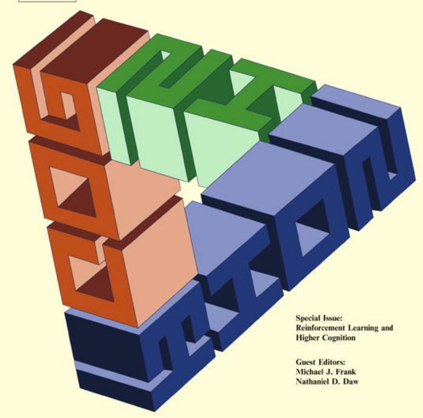

This article appeared in a journal published by Elsevier. The attached copy is furnished to the author for internal non-commercial research and education use, including for instruction at the authors institution and sharing with colleagues.

Other uses, including reproduction and distribution, or selling or licensing copies, or posting to personal, institutional or third party websites are prohibited.

In most cases authors are permitted to post their version of the article (e.g. in Word or Tex form) to their personal website or institutional repository. Authors requiring further information regarding Elsevier’s archiving and manuscript policies are encouraged to visit:

http://www.elsevier.com/copyright

# A Bayesian formulation of behavioral control

Quentin J.M. Huys a,b,\*, Peter Dayan a

a Gatsby Computational Neuroscience Unit, UCL, 17 Queen Square, London WC1N 3AR, UK

b Center for Theoretical Neuroscience, Columbia University, 1051 Riverside Drive, New York, NY 10025, USA

## a r t i c l e i n f o

Article history: Received 16 October 2007 Revised 25 January 2009 Accepted 25 January 2009

Keywords:   
Helplessness   
Depression   
Computational   
Bayesian   
Computational psychiatry   
Animal behavior   
Learned helplessness   
Reinforcement learning   
Controllability   
Animal models of depression

## a b s t r a c t

Helplessness, a belief that the world is not subject to behavioral control, has long been central to our understanding of depression, and has influenced cognitive theories, animal models and behavioral treatments. However, despite its importance, there is no fully accepted definition of helplessness or behavioral control in psychology or psychiatry, and the formal treatments in engineering appear to capture only limited aspects of the intuitive concepts. Here, we formalize controllability in terms of characteristics of prior distributions over affectively charged environments. We explore the relevance of this notion of control to reinforcement learning methods of optimising behavior in such environments and consider how apparently maladaptive beliefs can result from normative inference processes. These results are discussed with reference to depression and animal models thereof.

- 2009 Elsevier B.V. All rights reserved.

## 1. Introduction

The notions of control and controllability have long been central to the understanding and empirical modeling of anxiety and depression (Abramson, Seligman, & Teasdale, 1978; Abramson et al., 1998; Maier & Watkins, 2005; Seligman & Maier, 1967; Willner, 1985b; Williams, 1992). The main postulate is that subjects’ depressed (and anxious) behaviors can be understood as emanating from a belief that reinforcements are beyond their influence, implying that rewards and punishments will be less efficiently exploitable or avoidable. Despite important criticisms (see, e.g., Blaney, 1977; Buchwald, Coyne, & Cole, 1978; Costello, 1978; Frazer & Morilak, 2005; Willner, 1986; Willner & Mitchell, 2003, Chapter 2), cognitive formulations of the concept of helplessness are powerful predictors of depression in healthy individuals (Alloy et al., 1999) and help underpin cognitive behavioral therapy, a major non-pharmacological treatment for depression (Alloy & Abramson, 1982; Alloy et al., 1999; Beck, 1967; Beck, 1987; Beck, Rush, Shaw, & Emery, 1979; Williams, 1992). Further, experimental manipulations of controllability in animal models such as learned helplessness (LH), chronic mild stress (CMS), tail suspension tests and forced swimming tests (Anisman & Matheson, 2005; Willner, 1985b, 1995, 1997; Willner & Mitchell, 2002, 2003) are key to a modern understanding of depression, and are an important testbed for antidepressant drugs (e.g., for LH, Dulawa & Hen, 2005; Frazer & Morilak, 2005; Willner, 1985a, 1986; Willner & Mitchell, 2002).

In these animal models, healthy subjects are first exposed to a particular set of environmental reinforcers, such as electric shocks, that they cannot control. The effect of that experience on their behavior in other environments is then measured in a generalization task, for instance by looking at how quickly the uncontrollably shocked animals learn to perform an escape response. The animal models implicitly make at least two types of fundamental claims about the psychological processes underlying the generalizations:

1. The statistical claim that animals’ behavior in novel environments is sensitive to prior knowledge or expectation.

2. The aetiological claim that animals learn these (potentially maladaptive) prior beliefs, and then generalize them. That is, animals with a history of past uncontrollable shock exposure come to expect shocks to be uncontrollable in novel situations too, and because of this belief, fail to attempt to control shocks in new environments (Maier & Watkins, 2005).

The precise nature of the link with pathology deserves detailed attention. Crucially, these psychological processes are assumed to be functioning normally in healthy subjects. That is, the animals are seen as being able to assess correctly the extent to which they have control, and to generalize this knowledge appropriately to the novel environment, with normative consequences for the sloth of subsequent learning. To the extent that these models capture important aspects of depressive behavioral phenotypes, this leads to two routes to the psychiatric conditions in humans, both of which are based on maladaptive prior beliefs. One is that the dysfunction arises as a (possibly extreme) facet of completely normative inference. That is, the experience of negative events, particularly when characterised by a perception of inevitability and uncontrollability, would have a causative role in the genesis of depressive disorders (Blaney, 1977; Beck et al., 1979; Kendler et al., 1995; Kendler, Gardner, & Prescott, 2002; Kendler, Hettema, Butera, Gardner, & Prescott, 2003; Miller & Seligman, 1975; Peterson, Maier, & Seligman, 1993). The second route is for inference to be normal, but to be based on a prior distribution that is incorrectly too pessimistic or negative. This may provide a way for genetically encoded prior information acquired over longer timescales to interact with information in particular environments, as postulated by influential recent accounts of genetic factors in depression (Caspi et al., 2003).

In this paper, we provide a computational characterization of the psychological processes, in terms of a formal, normative, Bayesian reinforcement learning (RL) treatment of control and controllability. We interpret controllability in terms of particular characteristics of the prior distributions over decision problems. We consider a setting in which subjects face a short sequence of decisions, but where they are uncertain about the exact structure of the world, and hence about the consequences of their actions. In such situations, subjects should apply informative priors, which capture the statistics about controllability, to help decision-making. We draw out the specific implications these priors have for subjects’ expectations as to what their actions will achieve in terms of transitions between states of the environment and the attainment of rewards and punishments.

In the language of engineering, a system is controllable if (roughly speaking) a sequence of commands exists to bring it from any state to any other state. However, this notion has only a loose connection to the psychological concepts inherent in paradigms such as LH, and our first task (in Section 2) is therefore to develop a more suitable formalization. We begin with a view close to that entertained in the original literature (Maier & Seligman, 1976), namely the contingency, reliability or entropy of the mapping between actions and outcomes. We describe the strengths of this concept, and use it to motivate two further, more global, notions of control, which consider how many, and how desirable, are the outcomes that can be dependably achieved by any action. Our emphasis is on developing these notions and their consequences in a RL setting, rather than detailed comparisons with experimental animal or human depression data. Section 3 illustrates the consequences of prior beliefs about control in a RL setting, and Section 4 applies it to LH. In Section 5, we discuss these concepts in terms of a number of related issues, including the distinction between goal-directed and habitual choice, the role of dopamine, which is closely associated with the neural realization of habitual and Pavlovian behavior, and (a) symmetries between reward and punishment.

## 2. Notions of control

We first present an overview of three major notions of control, which offer increasingly specific possibilities to account for the behavioral data. The notions build on each other, incrementally capturing additional specific aspects of what could, in different circumstances, be meant by ‘control’. The first notion captures the reliability of outcomes; the second captures the extent to which any outcome can be achieved reliably; and the third relates to the reliable attainability of specifically desirable outcomes. All the mathematical details are available as online Supplementary material.

For simplicity, we consider an austere class of environments or domains, a good example of which is an imperfectly operating vending machine. There is just one state, a number jAj of different, discrete actions a (pressing one of the buttons on the vending machine), each of which has jOj possible outcomes (the different candy bars one might get). The (possibly probabilistic) mapping of actions to outcomes is initially unknown to the subjects (the buttons are unlabelled), although they may have a few trials’ worth of experience. However, the subjects are assumed to know the utilities of the outcomes (i.e., the worths of the bars). We consider that subjects may make a sequence of D further actions, and pay specific attention to the fact that it might be optimal for subjects to use their early choices to explore incompletely known actions in order to make their later choices potentially more effective.

Entropy: The first, most basic, notion of control (which was formulated by Maier & Seligman, 1976 and underlies the work on ‘‘depressive realism”; Abramson, Metalsky, & Alloy, 1979; Alloy & Abramson, 1982; Alloy & Tabachnik, 1984; Msetfi, Murphy, Simpson, & Kornbrot, 2005), is related to the breadth or spread of different outcomes for each action (Fig. 1A). We formalize this in terms of the outcome entropy. If $p _ { o }$ are the probabilities of the various outcomes for an action, the entropy of the outcome distribution is

A  
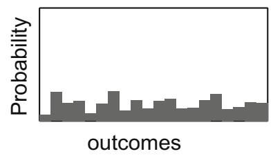

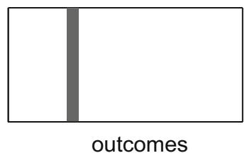

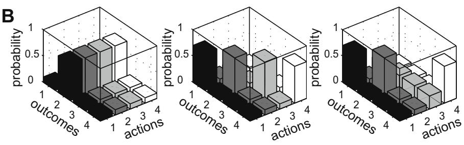

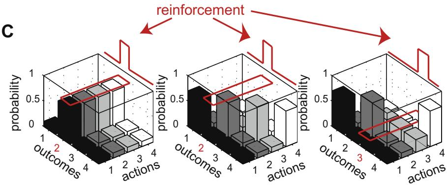  
Fig. 1. Notions of control. These plots show probability distributions over outcomes given choices of action. (A): Entropy. There is less control if an action randomly produces many outcomes with similar probability (left) than if only few outcomes are likely (right). (B): Fraction of controllably achievable outcomes. If there is more than one action, the relationship between the outcomes of the different actions is important. In these bar charts, each column represents the outcome distribution of one action. There are four actions, each with four outcomes. Consider the leftmost bar chart. All actions preferentially lead to one and the same outcome, like a vending machine which produces the same chocolate bar most of the time, whichever button is pressed. For the middle bar chart, each action tends to lead to a different outcome. The rightmost bar chart shows a case in between, where the vending machine reliably yields only three out of the four outcomes advertised. Outcome 3 does occur, but no action action preferentially produces it over other outcomes. Control is commensurate with the dependability with which all outcomes in an environment can be achieved. (C): Fraction of controllably achievable reinforcement. There is most control if specifically affectively salient outcomes are under behavioral control. The red bar represents the reinforcement associated with each outcome. In the left case, all reinforcement is associated with the most likely outcome for all actions. All vending machine buttons tend to yield the one chocolate bar we desire. In the middle bar chart, there is one button which preferentially yields the desired bar, the others tend to yield outcomes associated with no reward. There is extensive control over rewards in both these cases. However, if the reinforcement is as indicated by the red bar in the right bar chart, then all but the reward-carrying outcome can be reliably evoked; the one chocolate bar that is desired is most likely produced by an action that yields all possible outcomes randomly. In this case there is little controllably achievable reward. (For interpretation of the references to color in this figure legend, the reader is referred to the web version of this article).

$$
\mathcal { H } = - \sum _ { o } p _ { o } \log ( p _ { o } ) .
$$

We will consider there to be more control when an action leads more deterministically to one outcome (having low entropy) than if it leads to many different outcomes with similar probabilities (and thus has high entropy). In terms of the vending machine, there is more control if we always receive the same chocolate bar when we press the same button, than if we receive many different ones. For convenience, we use the number of possible outcomes (the outcome set size) as a suitable proxy for the entropy (see Supplementary material Section 1).

Achievable outcomes: The entropy measure considers actions in isolation. This leads to anomalies when multiple actions are possible, for instance assigning a high level of control when all available actions deterministically lead to the same outcome (Fig. 1B, left). For the vending machine, this corresponds to all buttons yielding the same chocolate bar (even for chocophobic subjects). We thus extend the notion of control to take into account whether any possible outcome can be reliably achieved. Combining this with the previous measure, an agent is said to have more control if all its actions (i) have low outcome entropy and (ii) lead to different outcomes. Fig. 1B illustrates this notion. This notion of control is close to the standard engineering notion (Moore, 1981, see, for instance).

Achievable rewards: The two previous notions are agnostic between different possible outcomes. However, consider the case that subjects have one predominant need and there are actions available leading deterministically to all outcomes other than those satisfying that need. For example, we might want a particular chocolate bar from the vending machine, but the buttons yield all kinds of bars and sweets other than the one we desire. More pertinently, a standard LH paradigm involves two key groups of subjects (master and yoked), which receive exactly the same shocks, but with the master in sole control of their duration. The yoked rats can typically perform a variety of actions, but none of them determines when the shock is terminated. We thus define the controllable reinforcement $\chi$ as the fraction of reward that can be earned from outcomes that are controlled by any action (see Fig. 1C). This third notion re-frames the first two notions. Rather than weighing all outcomes equally, outcomes offering large relative rewards are weighted more than those offering little. For convenience, our formal treatment only considers rewards. It can cope with punishments by the mathematical trick of comparing actions to the worst possible outcome, thus making them all appear either neutral or beneficial (Mowrer, 1947, & creating a form of safety signal). There are important asymmetries in the behavioral consequences of rewards and punishments (Bolles, 1970; Dickinson & Pearce, 1977; Dayan & Huys, in press); however learned helplessness does appear to generalize between rewards and punishment (Goodkin, 1976), as we discuss at the end.

## 2.1. Generalization

As in the standard experiments into LH, we assume that subjects explore an environment by taking actions and observing outcomes, and that they use this information to infer the extent to which they are in control (i.e., to infer posterior distributions over these controllability measures). A critical question is how this knowledge generalizes or transfers to new decision problems in new environments in the future.

There are therefore two independent issues: First is the question about the shape of the prior, for which we just introduced three options. Second is the question about how different environments relate, and more specifically to what extent they share the extent to which they are controllable (in terms of these options). Fig. 2 points out the two extremes. In panel A, environments do not share the extent to which they are controllable. Knowledge about one environment does not generalize at all to any other environment. Panel B is the diametric opposite: all environments are exactly equal. Information gathered in one environment applies without fail to others.

These two extremes are in fact motivated by a distinction which exists both in research on human depression and animal models thereof. The only factor that is really constant across a wide variety of environments is the actor itself. Thus, the assumption that environments share characteristics of control might correspond to the belief that it is the actor himself who determines how much control is really achievable. In the human literature, this has been called ‘locus of control’ (Lefcourt, 1982), and has been seen as an aspect of a person’s attributional style (Abramson et al., 1978). A similar distinction can be made between the classical LH experiments and CMS. In the latter the animal is exposed to many environments, each of which is stressful (albeit to a lesser degree). This may well encourage animals to assign the absence of control more to an internal, generalizable, variable, rather than to external variability amongst environments (Huys, 2007).

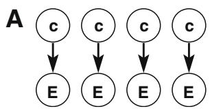

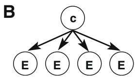  
Fig. 2. Two extremes of generalization. (A): No generalization: every environment E has its own, independent, setting of control c. (B): Full generalization: all environments share one and the same setting of control c.

It should be emphasized that the behaviors observed in animals, and their putative equivalents in humans, all rely on relatively strong generalization. We will thus here concentrate on cases where prior beliefs about the controllability are shared between different environments.

## 3. Consequences of prior beliefs about control

Prior expectations about a decision problem have a major impact over three key aspects of normative action selection, namely exploration, the propensity to try out different possible actions repeatedly; the expected reward, the utilities to which subjects can look forward; and the appetitive contrast between actions, the degree of preference subjects can expect to develop between different choices. In this section, we describe how the different forms and degrees of control influence these aspects; quantitative details can be found in the Supplementary material.

For concreteness, we continue in the setting of the vending machine. Consider the choice between two (unlabelled) buttons on the vending machine, k and u, each of which has $L = 5$ possible outcomes, with outcome $o \in \{ 1 , \ldots , 5 \}$ yielding reward $R _ { o } = o .$ Assume we have pressed button k(nown) three times already, with the outcomes displayed in the inset of Fig. 3A, but that nothing else about it is known. The u(nknown) button has never been pressed. Nothing but the prior distribution is known about its outcome distribution, which is therefore flat. If the subject only has a single choice to make, the optimal policy is to press the button affording the highest expected reward. The expected reward for action $a _ { k }$ (pressing button k) is simply $\begin{array} { r } { \sum _ { o } c _ { o } ^ { a _ { k } } R _ { o } , } \end{array}$ , where $c _ { o } ^ { a _ { k } }$ is the probability of observing outcome o upon action $a _ { k } .$ . The true expected reward cannot be calculated because the true outcome probabilities $c _ { o } ^ { a _ { k } }$ are unknown. However, given the observations (the so-called sufficient statistics here are just counts of outcome frequencies $\mathbf { n } ^ { a _ { k } } )$ , a posterior distribution over the outcome probabilities can be derived by combining the observations with a prior according to Bayes’ rule:

$$
p ( \mathbf { c } ^ { a _ { k } } | \mathbf { n } ^ { a _ { k } } ) \propto p ( \mathbf { n } ^ { a _ { k } } | \mathbf { c } ^ { a _ { k } } ) p ( \mathbf { c } ^ { a _ { k } } )\tag{ð1Þ}
$$

Here, the first factor $p ( \mathbf { n } ^ { a _ { k } } | \mathbf { c } ^ { a _ { k } } )$ is the likelihood of the observations $\mathbf { n } ^ { a _ { k } }$ associated with the action given some true underlying (unknown) discrete outcome distribution $\mathbf { c } ^ { a _ { k } }$ . The second factor $p ( \mathbf { c } ^ { a _ { k } } )$ is the prior belief about what kinds of outcome distributions are likely. It is through this factor that we consider these types of control to be implemented. Control here only affects which outcomes are predicted, not what their associated reward might be. Exactly the same quantities apply to $a _ { u }$ and thus $\mathbf { c } ^ { a _ { u } }$ , except that $\mathbf { n } ^ { a _ { u } } = \mathbf { 0 } .$

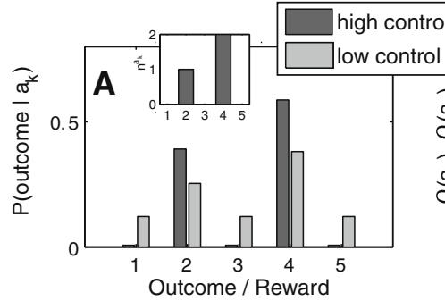

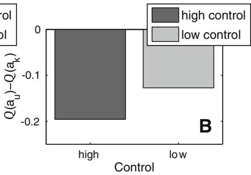

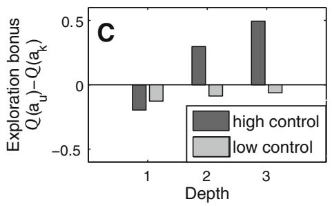

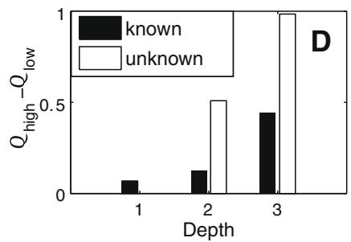  
Fig. 3. Effect of prior belief about outcome entropy on Q values and exploration in an example vending machine with two actions and five outcomes. (A): The prior belief that outcome distributions have low entropy leads to predictions that are concentrated on the observations. Button ‘k’ (for known) on a vending machine was pressed 3 times, with outcomes 2 and 4 being observed once and twice, respectively, (nak , inset). The main panel shows the predictions for observing any one outcome. The dark bars show the predictions when the observations are combined with a prior belief that outcome distributions are narrow (high-control, D=1), and the light grey bars the predictions when the observations are combined with a prior belief that outcome distributions are broad (low-control, D=1). (B): The expected immediate reward is a little higher for the high-control than for the low-control prior. This is because the observations are slightly skewed and the low-control prior attenuates the skew. The comparison is with the unknown button ‘u’ which has expected value $Q ( a _ { u } ) = 3 .$ (C): Exploration bonus: difference between the Q value of known and unknown buttons, when there are $D = 1 , 2 , 3$ choices remaining. An exploration bonus is only apparent with the high-control prior. (D): Difference between the Q values of each action under high- and lowcontrol priors. This is a different view of the data in panel C.

From the posterior distributions, we derive all the quantities required by averaging over all possible probability distributions. This includes the expected reward

$$
Q ( a _ { k } ) = \sum _ { o } R _ { o } \left[ \int _ { { \bf c } ^ { a _ { k } } } d { \bf c } ^ { a _ { k } } p ( { \bf c } ^ { a _ { k } } | { \bf n } ^ { a _ { k } } ) { \bf c } ^ { a _ { k } } \right] _ { o }
$$

and the predictive distributions $p ( n _ { D + 1 } | \mathbf { n } )$ over the outcomes on the next choice of an action. Both of these will depend on a set of parameters h determining the prior belief about the extent to which the environment is controllable.

## 3.1. Outcome entropy of individual actions

The outcome entropy determines how many different chocolate bars will be dispensed when repeatedly pressing any one of the vending machine’s buttons. For this case, example predictive distributions are shown for high and low levels of control in Fig. 3A (see also Supplementary material Eq. (10)). If a subject strongly believes it has extensive control, the prior $p ( \mathbf { c } ^ { a _ { k } } )$ will be such that distributions with low entropy are inherently more probable, and it will take a lot of persuasion from data to convince the subject that it has no control. Thus, under a high-control prior, all the predictive probability mass $\left( p ( n _ { D + 1 } | \mathbf { n } ) \right)$ is concentrated on the outcomes that have already been observed. Conversely for a low-control prior the predictive distribution is broader. Example consequences of the predictions are displayed in Fig. 3B–D, which we now unpack.

## 3.1.1. Exploration, incentive contrast and average reward

The predictive distribution of the unexplored action $a _ { u }$ is flat, which means that the expected worth of just once taking that action $Q ^ { 1 } ( a _ { u } )$ (with the sometime superscript on Q indicating the number of actions left to choose) is 3. However, for the known action, outcome 4 (worth 4 units of reward) was observed twice, and outcome 2 (worth 2) only once. Thus, the expected worth $Q ^ { 1 } ( a _ { k } )$ of action $a _ { k }$ under both high and low-control priors exceeds that of action $a _ { u }$ , though more so in the high- than in the low-control situation (Fig. 3B).

However, if more than one action remains to be taken, it can become worth trying out the unknown button $a _ { u }$ to ascertain whether its utility might exceed that of $a _ { k } .$ In this case, it would be worth exploiting in future choice(s). The value of this uncertainty about $a _ { u }$ is exactly its potential benefit, and motivates exploring the option. In reinforcement learning, it is called an exploration bonus (Dayan & Sejnowski, 1996; Sutton, 1991). In our particular case, the Q value of $a _ { u }$ is calculated from the decision tree in a conventional manner, and incorporates the value of exploration directly, as ignorance about $\mathbf { c } ^ { a _ { u } }$ is explicitly captured.

However, this is only possible because of the small sizes of our domains. The optimal strategy is also known in one very constrained class of more realistic optimal exploration problems, in terms of what are called Gittins indices Gittins, 1989. 1 However, Gittins indices are structurally brittle, and do not apply in general circumstances; it is typically necessary to approximate exploration bonuses.

The magnitude of the exploration bonus is a function of the degree of control. To see this, imagine that button $a _ { u }$ was chosen and yielded outcome (and thus reward) 5 (a scrumptiously delicious chocolate bar). Under the highcontrol prior, the predictive distribution will now be strongly peaked at outcome 5, mandating the same button $a _ { u }$ to be chosen again. However, under the low-control prior, this individual outcome affects the predictive distribution rather little. The subject would ascribe obtaining outcome 5 to pure chance, and would not expect this fortuitous event to be repeated by pressing $a _ { u } .$ The consequence is that $a _ { k }$ would remain apparently superior, preventing exploration.

Thus, under high-control priors, not only are actions that lead to good outcomes aggressively exploited (and actions with negative outcomes equally avoided), but the possibility of future exploitation also makes exploration worthwhile in the face of uncertainty. The opposite is true under low-control priors, with outcomes biasing action choice only weakly, and the lack of future exploitability diminishing exploration bonuses. Fig. 3C shows the difference $Q ^ { D } ( a _ { u } ) - Q ^ { D } ( a _ { k } )$ for $D = 1 , 2 , 3$ remaining action choices for the two control cases. This is positive for high control, which is the effect of the uncertainty bonus; the absolute size of the difference is also larger in this case. To put it another way, as shown in Fig. 3D, under high-control priors, there is greater incentive contrast between actions. Furthermore, because rewards are exploitable and punishments avoidable, the overall expected reward under high-control priors is always greater (or at worst equal to) that under low-control priors.

## 3.1.2. Generalization

The next critical question is whether accurate knowledge about the level of control in an environment is informative. To put it another way, does knowledge about the true extent to which an environment is controllable lead to better behavior? If this is true and control is informative, then it may be advantageous to generalize it across environments that share controllability. One conclusion that can be drawn from the previous section is that assuming that the environment affords less control than is really the case is disadvantageous, in that exploitable actions will be missed. Fig. 4 considers the converse, showing the consequence of over-estimating the controllability of the actions available in an environment. As can be seen, in this case, only an underestimate of control is problematic; overestimating control, on average, does not hurt performance, since if outcomes have high entropy, any action is nearly as good (or as bad) as any other. In sum, reward-maximising behavior arises from a fixed assumption of low outcome entropy. Knowledge of the true extent to which the environment is controllable does not translate into higher average reward. This conclusion is not true for the more sophisticated notions of control to which we now turn.

## 3.2. Controllably achievable outcomes

When the notion of control additionally encompasses where the peaks of the outcome distributions across actions might be situated, not just the fact that there is such a peak for each action individually, it becomes advantageous to infer the true level of control and to generalize it to new environments. The second notion of control, that of controllably achievable outcomes, does just that.

Our simplified formulation defines priors over the joint outcome probabilities $p ( \mathbf { C } )$ for all the actions through the medium of an auxiliary binary matrix M, whose $i j ^ { \mathrm { { t h } } }$ entry determines whether outcome i is ‘‘controllably achievable” by action j. Each action can have at most one controllably achievable outcome; thus, if a column of the matrix M has a unity entry at some outcome, then the outcome probability distribution for that action is peaked at that outcome. The total number of columns with one unity entry is just the number of actions with a controllably achievable outcome. The number of separate outcomes jMj amongst these (obviously, $| M | \leqslant L )$ is the number of controllably achievable outcomes. If there are L possible actions, jMj=L is the ‘‘fraction of controllably achievable outcomes”. When this fraction is one, any outcome will be the controllable consequence of at least one action. Matrix M then formalizes the underlying structure of control. Supplementary material Section 2 provides a more indepth discussion of the formulation.

The matrix C, which is generated from M, determines the actual probabilities of each outcome from each action. When $\mathbf { M } _ { i j } = 1 , \mathbf { C } _ { i j } = c$ and $\begin{array} { r } { \mathbf { C } _ { k j } = ( 1 - c ) / ( L - 1 ) \forall k \neq i . } \end{array}$ Thus, as jMj ! L and as c ! 1, the outcome distributions of different actions diverge. Here, c captures the effect of the entropy notion of control discussed above. If action j has no controllably achievable outcome, then $\begin{array} { r } { \mathbf { C } _ { i j } = 1 / L , \forall i , } \end{array}$ i.e., is maximally entropic. Supplementary material Section 2.1 gives an explicit example of how this formulation replicates the effects illustrated above for the prior on outcome entropy, and uses the notion of exploration depth to illustrate some differences.

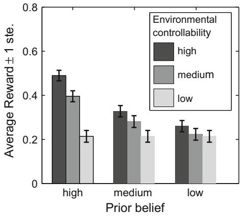  
Fig. 4. Mismatch between environmental controllability and subjective beliefs. The figure shows the average earned reinforcements for varying subjective prior beliefs and environmental controllability. Only underestimation, but not overestimation, of the extent to which the environment is controllable (in the entropy sense) has adverse consequences. When the environment is highly stochastic, subjects’ behavior (and hence their prior beliefs) have very little impact.

Fig. 5 illustrates that it now does become advantageous to generalize an accurate estimate of control. It does so in a simple setting where only two out of the five possible outcomes (1 and 5) yield rewards (0.3 and 0.7 respectively), and only the inferior one (0.3) is controllably achievable. Specifically, the auxiliary matrix M, the outcome distributions ${ \bf C } = \{ { \bf c } ^ { a } \} _ { a = 1 } ^ { 5 }$ , of the 5 outcomes, the reward vectors R, and the resulting vectors of true expected outcomes of each action taken once individually Q- are

$$
\begin{array}{c} \begin{array} { r l } & { \mathbf { M } = [ \begin{array} { l l l l l } { 1 } & { 0 } & { 0 } & { 0 } & { 0 } \\ { 0 } & { 0 } & { 0 } & { 0 } & { 0 } \\ { 0 } & { 0 } & { 0 } & { 0 } & { 0 } \\ { 0 } & { 0 } & { 0 } & { 0 } & { 0 } \end{array} ] ; \mathbf { C } = [ \begin{array} { l l l l l } { 8 } & { 2 } & { 2 } & { 2 } & { 2 } \\ { 0 5 } & { 2 } & { 2 } & { 2 } & { 2 } \\ { 0 5 } & { 2 } & { 2 } & { 2 } & { 2 } \\ { 0 5 } & { 2 } & { 2 } & { 2 } & { 2 } \\ { 0 5 } & { 2 } & { 2 } & { 2 } & { 2 } \end{array} ] ; } \\ & { \mathbf { R } = [ \begin{array} { l } { 3 } \\ { 0 } \\ { 0 } \\ { 0 } \\ { 0 } \\ { 0 } \\ { 0 } \end{array} ] } \\ & { \mathcal { I } = [ 2 7 5 } \end{array} ]  \end{array}\tag{ð2Þ}
$$

As mentioned above, the matrix M indicates both where and whether there is a peak in the outcome distribution. By contrast, C contains the actual outcome distributions. Here, jMj ¼ 1. As action 1 controllably achieves outcome 1 some 80% of the time, it is the optimal action. This is despite the fact that it does not reliably lead to the single best possible outcome.

The existence of the parameter c means that this notion of controllability inherits most of the properties of the notion based on the entropy of individual actions (see Supplementary material Section 2.1 for a more in-depth example). However, unlike the case for the entropy, assuming too many actions are achievably controllable can be deleterious. Fig. 5 demonstrates this explicitly.

A varying number of observations were generated from random action choices. For each observation, a random action was chosen, and an outcome picked based on the true distribution C. The posterior and predictive distributions given this data and the various priors were then evaluated. The prior distribution allowed jMj controllable outcomes, i.e. it allowed matrices C that were consistent with jMj ¼ 1 (Fig. 5A–D), jMj ¼ 2 (Fig. 5E–H) etc. The graphs show the frequency with which each action was chosen in the first of two extra picks, i.e., the proportion of cases for which $Q ^ { 2 } ( a _ { i } | \bar { \bf N } ) > Q ^ { 2 } ( a _ { k } | \bar { \bf N } )$ ; 8k–i based on the experience N. We used $Q ^ { 2 }$ to include the effect of an exploration bonus.

Fig. 5A–D shows that the correct assumption that only one outcome is controllably achievable leads to the exploitation of action 1. As more outcomes are assumed achievable, there is more persistent exploration. In the extreme case that all outcomes are assumed achievable, action 1 ends up being avoided despite being optimal. This pattern becomes clearer when more prior observations are used to infer the predictive probabilities (rightmost column, Fig. 5D and 5T), but is already apparent after few observations (on average two per action, leftmost column). As long as the maximal reward is not exploitable, an assumption that more outcomes are controllably achievable than is actually the case will lead to more persistent exploration and prevent adequate exploitation. The controllably achievable fraction of outcomes is hence an informative characteristic of an environment, making it legitimate that it be generalized.

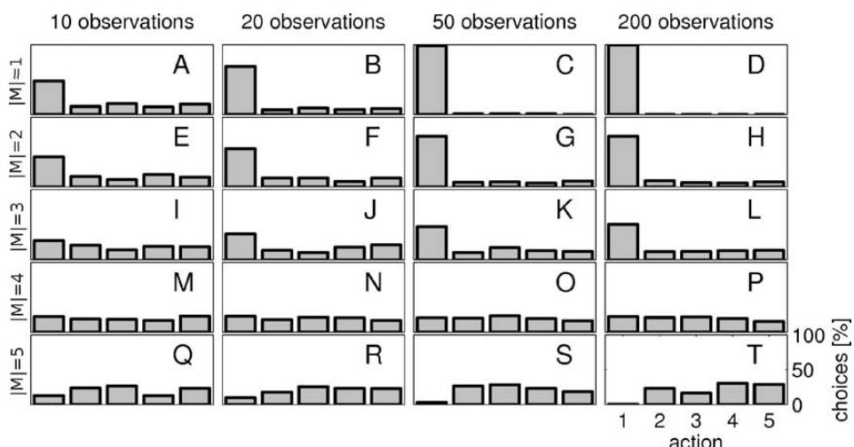  
Fig. 5. An illusion of too much control can be deleterious. The panels show the fraction of times each of the five available actions was chosen, as a function of the prior number of observations (columns) and of the prior belief on the number of controllably achievable outcomes. As more observations are used, we see that the optimal action 1 is exploited most for the correct prior that assumes jMj ¼ 1 controllable outcomes. For the prior that assumes that all outcomes must be controllable (jMj ¼ 5), we see to the contrary that this optimal action 1 is avoided.

## 3.3. Controllably achievable rewards

We have so far described two aspects of outcome distributions that are important in relation to control: outcome entropy, which relates more to ideas in psychology, and outcome achievability, which is closer the notion of controllability in engineering. One last, important, ingredient is reinforcement. Arguably, it is not the crude number of controllable outcomes that matters; but rather only control over those outcomes associated with most reinforcement. In animal models, control tends to be defined in terms of the availability of an action to achieve a desirable goal. Similarly, helplessness in humans is typically characterised in terms of high level rewards in interpersonal relationships or at work (Beck et al., 1979; Peterson et al., 1993; Williams, 1992).

We therefore turn to our third and final notion of control, that of the fraction of controllably achievable reinforcements within an environment (Fig. 1C). Again, in a highly abstracted environmental model, we use the variable v (Supplementary material Eq. (20)) to characterize the fraction of reinforcements that are available via controllably achievable outcomes. For example, for the case in Fig. 5 (matrices in Eq. (2), $\chi = 0 . 2 4$ , as only 0.3 of the total reinforcement is available via a controllably achievable outcome (the action/ button 1 in matrix M), and the extent of control is $C _ { 1 1 } = 0 . 8$

This notion of controllability again inherits the main properties of the previous notions. However, its focus on reinforcement gives it greater psychological refinement. Fig. 6 shows the effect of $\chi$ and the reinforcement structure on the predictive distribution. In this case, each of $| A | = 5$ actions has already been taken three times, always leading to outcome $o = a$ for action a (Fig. 6A), i.e. there is ample evidence of perfect control. Fig. 6D and E are obtained with the reward structure in panel B, where all outcomes carry some reward, though not equal amounts. In panel $\mathrm { D } , \chi = 1$ and thus only matrices M that have one unit entry in each column, and correspondingly low entropy outcome probability vectors $\mathbf { c } ^ { a } ,$ , are allowed to contribute to the predictions. Overall, a very low entropy predictive distribution is recovered for all actions, as all actions carry rewards. However, when $\chi$ is set to zero, the predictive distribution changes. Now, to the extent that actions lead to rewarding outcomes, the prior suggests that they will not do so with low entropy. Thus, since all actions lead to some reward, the entropies of their outcome distributions are all increased. However, this effect is most pronounced for the action leading to the largest reward, here action 1. Fig. 6F shows a more extreme version of this when action 1 is the only action leading to a reinforced outcome. Now all actions are predicted to lead to outcomes deterministically, apart from the one action which produces rewards. Thus, the notion of controllable reward fraction allows us to capture the aspect of helplessness that is directed towards reinforcements.

## 4. Learned helplessness

We next consider how reward-sensitive control can account for the main features of LH. The standard experimental setup is presented in Fig. 7 with master, yoked and control subjects. Shock-based helplessness training proceeds in one environment, with shocks for master and yoked rats starting at unpredictable times and stopping when the master performs a particular escape action, no matter what the yoked rats do. We assume that subjects extract from this a distribution over the degree of controllability v, and then use this distribution to derive predictions in a second environment in which they have to learn an (actually perfectly controllable) escape response (for which action 1 leads to reward 0 and all other actions to reward -1). Section 3.1.2 showed that optimal performance generally ensues from correctly setting the control parameters; we here show again that using a too small (but correctly inferred) value of v in the second environment has a strong effect on escape training. In Supplementary material Section 3, we show that a maximum likelihood estimate of v for the first environment can be inferred from past observations N (Supplementary material Section 3 and Fig. 5), and that past observations can be included as an additional constraint on v when deriving a predictive distribution (see Supplementary material Section 3 and Eq. (22)). As mentioned above, we turn punishment avoidance into appetitive safety by comparing outcomes to the worst possible case:

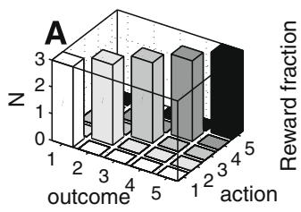

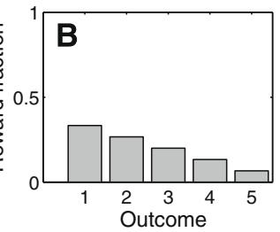

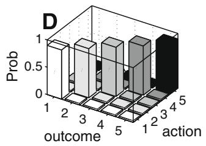

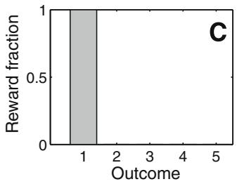

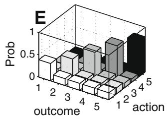

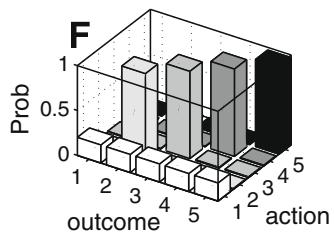  
Fig. 6. Reinforcement-sensitive control. (A): For each action a, outcome o ¼ a was observed 3 times. (B): Reward fractions for each outcome as used in figures D and E. Here, all outcomes, and thus all actions, carry sizeable reinforcements. (C): Reward fractions as used in panel F. One outcome carries all the reward. (D–F): Inferred action-outcome matrices. Because the tree is constructed from repeated choices, these are also inferred transition matrices. (D): With the assumption that a large fraction of the rewards in panel B is controllably achievable $( \chi = 1 ) ,$ low entropy predictive distributions $p ( n _ { D + 1 } | \mathbf { N } , \boldsymbol { \chi } )$ are recovered for all actions. (E): However, when $\chi = 0 ,$ the predictive distributions all have a high entropy, and to a greater extent when the reward of the outcome associated with the action is higher. The rewards here are still those from panel B. (F): The more extreme reward distribution of panel C, combined with $\chi = 0 ,$ results in a predictive distribution that has low entropy for the actions that do not lead to rewards, but a high entropy for the one action that leads to the only reward available in this environment. Throughout, $\sigma = 0 . 0 5$ . Smaller r accentuates the effect further. See Supplementary material Eq. (21) for the definition of r.

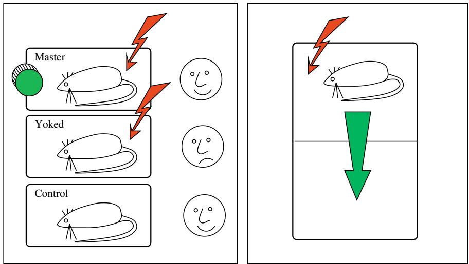  
Fig. 7. The learned helplessness paradigm. Three sets of rats are used in a sequence of two tasks. In the first task, rats are exposed to escapable or inescapable unpredictable shocks. The master rats are given escapable shocks: they can switch off each shock by performing an action; usually turning a wheel. The yoked rats are exposed to precisely the same shocks as the master rats, i.e. its shocks are terminated when the master rats terminate the shock. Thus their shocks are inescapable. A third set of rats is not exposed to shocks. Then, all three sets of rats are exposed to a shuttle box escape task. Shocks again come on at random times, and rats have to shuttle to the other side of the box to terminate the shock. Only the yoked rats fail to acquire the escape response.

$$
\tilde { R } _ { i } = R _ { i } - \operatorname* { m i n } _ { j } R _ { j } ,\tag{ð3Þ}
$$

a manoeuvre whose validity we discuss in more depth in the discussion.

Fig. 8A and B show the posterior distributions over v given the observations in two initial environments affording substantial (v ¼ 0:9) or little (v ¼ 0:1) controllably achievable reinforcement respectively. In both cases, there were 80 observations overall, generated by random action choices, and the posterior distributions are correctly peaked around high and low values of v respectively. Subjects were then transferred to a different environment and experience a further 80 outcomes, but this time each action a led to a fixed, deterministic2 outcome o ¼ a. Using the prior derived from the first environment, and the observations in the second environment, the predictive distribution over future outcomes for each hypothetical value of v is obtained and averaged over the distributions in Fig. 8A and B (Supplementary material Eq. (23)).

Fig. 8C shows that when the distribution from Fig. 8A is used, the predictions have high entropy; while Fig. 8D shows that the distribution from Fig. 8B leads to low entropy predictions. As before, the predictive distributions can be used to find the Q values of each action. Fig. 8E shows that action 1 has a much higher value after exposure to controllable reinforcements, and that the difference between actions is larger. Further, the average value is higher (not shown). The second point is explored in more detail in panel F, which shows the difference between actions 1 and 2 as a function of the shock size of actions 2-4. As expected, the impact of an alteration of shock size on the Q values is greater after exposure to escapable than inescapable shock. Finally, Fig. 8G; H show the action choice probabilities, again as the shock size is varied. Just as for the difference between the Q values of actions 1 and 2, differences in choice probabilities grow more rapidly after controllable shocks. After extensive exposure to the controllable test environment, the differences between the groups vanish (not shown), because there is continued learning about v.

The model replicates part of the generalization finding of Maier & Watkins (2005), who showed that yoked animals do not favor escape even though they might initially escape correctly. Here, subjects initially choose actions randomly, not knowing which outcomes they lead to. Even after being given good evidence that they can escape the shock, they will give little preference to escape (Fig. 8A and C). The model also replicates the finding of Jackson, Maier, & Rapaport (1978) that an increase in shock size can ameliorate the effect of LH. Consider the case that shocks of size 5 had been given in the escape task, so that the escapably shocked animals are at ceiling. Increases in shock strength will not increase the probability that the master rats choose to escape, but it will increase the probability that the inescapably shocked animals will do so, since these animals are still influenced by the actual Q values.

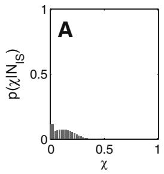

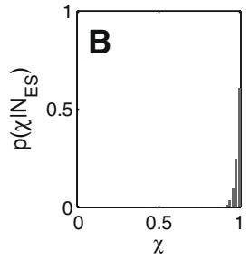

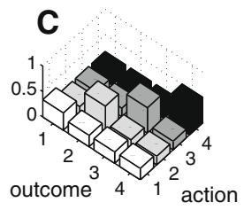

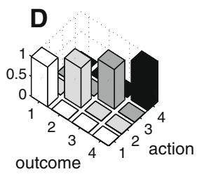

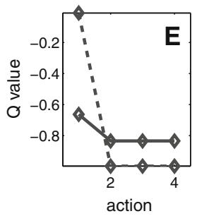

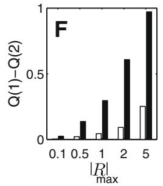

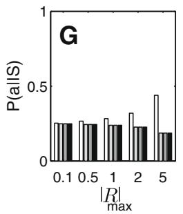

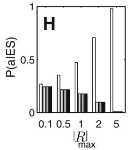  
Fig. 8. Learned helplessness after acute severe shock. LH was simulated by first inferring distributions over $\chi$ in one environment and then using this as a prior over $\chi$ in a second environment. In the first environment, all but outcome 4 were negative, in the second environment, all but outcome 1 were negative. $( \mathbf { A } ) \colon$ posterior distribution over controllably achievable reinforcement $\chi p ( \chi | \mathbf { N } _ { I S } )$ given 80 observations $\mathbf { N } _ { I S }$ in a low-control $( \chi = 0 . 1 )$ environment in which inescapable shocks (IS) are presented. The distribution is concentrated on low values. (B): posterior distribution $p ( \chi | \mathbf { N } _ { E S } )$ given 80 observations $\mathbf { N } _ { E S }$ in a high-control $( \chi = 0 . 9 )$ environment in which escapable shocks (ES) are presented. (C) and (D): Predictive distributions over outcomes for each action in the test environment. For each action a in the test environment, outcome $o = a$ was observed 20 times, providing very strong evidence for full control. However, given the low-control prior over $\mathcal { X }$ from panel A, the predictive distributions have high entropy. By comparison, given the high-control prior from panel B, the predictive distributions have low entropy. (E): Q values of the four actions in the test environment (correcting back from the comparison to the worst possible outcome). The best action (action 1) has smaller expected reward after exposure to uncontrollable reinforcement (solid line) than after exposure to controllable reinforcement (dashed line). The difference between the actions is attenuated by exposure to uncontrollable rewards. (F): Increasing the size of the punishment in the test environment has more drastic effects on the advantage of action 1 over the other actions after exposure to controllable than uncontrollable reinforcers. Dark bars show difference between the Q value of action 1 and action 2 after ES, light bars after IS. (G) and (H): If the Q values are used to derive a probabilistic policy via a softmax function, preference for action 1 (white bar) over other actions (light grey to dark grey bars) increases faster with increasing reinforcer strength after controllable (H) than uncontrollable (G) reinforcement.

## 5. Discussion

Simply put, by making rewards exploitable and punishments avoidable, control renders the world more pleasant, more colorful, and more worth exploring. This holds for all three notions of control we presented. The different notions are increasingly powerful and subsume each other: the fraction of achievable outcomes relies on the notion of outcome entropy, and the notion of achievable rewards in turn adds a critical extra feature to straight achievability.

To focus on the concepts, we used rather impoverished and arbitrary mathematical formulations. For example, at times we wrote outcome distributions as a mixture of a uniform and a delta function (and, partly because of this, replaced the Shannon entropy with a measure of the output set size). We also considered the case of only a single state. Clearly, these are very drastic reductions. However, the machine learning and Bayesian reinforcement learning literatures contain methods such as correlated Dirichlet processes that could be used to express similar underlying notions about the priors pðcÞ over more general decision problems with substantially greater flexibility, conciseness and elegance (Dearden, Friedman, & Russell, 1998; Dearden, Friedman, & Andre, 1999; Friedman & Singer, 1999; Huys, Vogelstein, & Dayan, 2009; Strens, 2000).

Even in our simple formulation, significant differences were apparent between the different notions of controllability. In particular, the results on generalization suggest that, unlike the other notions, outcome entropy by itself is not a quantity that is worth inferring and projecting into a new environment. Of course, it may be a simply computed proxy for quantities which are more useful in restricted classes of environment. Certainly an important avenue of future research will be the creation and use of specific behavioral tests to differentiate and enrich the various notions.

## 5.1. Learned helplessness

We presented a qualitative interpretation of LH through a quantity we defined as the fraction of controllably achievable reinforcement that an environment affords. The generalization of this quantity to new environments can account for an acquired escape deficit in yoked animals; it accounts for the sensitivity of the escape deficit to the shock size used in the escape condition; and it replicates the finding that the escape deficit persists against good evidence that escape is effective in switching off the shock (Jackson et al., 1978; Maier & Watkins, 2005). In humans, while our models can offer a qualitative account for some data (Miller & Seligman, 1975), there is a severe dearth of strictly behavioral findings, and we refrained from attempting to model explicit judgements. We hope that these formulations will make it possible to collect more precise data on control and helplessness in humans.

Nevertheless, there are several major limitations of this work. Perhaps the most significant mismatch is that none of the stress-induced animal models is devoid of anxiety; LH itself has been proposed to be a better model of posttraumatic stress disorder than depression (Maier & Watkins, 2005). Even a single exposure to a stressor can have lasting effects (Cordero, Venero, Kruyt, & Sandi, 2003; Mitra, Jadhav, McEwen, Vyas, & Chattarji, 2005). In a very detailed, in-depth study, Strekalova, Spanagel, Bartsch, Henn, & Gass (2004) found that anxious effects are not limited to LH, but that milder forms such as chronic mild stress also tend to produce anhedonia in combination with anxiety. In a sense, appetitive LH (Goodkin, 1976; Overmier, Patterson, & Wielkiewicz, 1980) is a more precise test of the theory; otherwise, we need to combine a more complete picture of aversive processing together with these priors. Computational views on aversion, and the difference between aversive and appetitive processing are evolving (Dayan & Huys, in press; Daw, Kakade, & Dayan, 2002; Klopf, Weaver, & Morgan, 1993; Moutoussis, Bentall, Williams, & Dayan, 2008; Schmajuk & Zanutto, 1997) but they are not ready to be combined with the sort of analysis we have presented here.

Next, we have oversimplified the treatment of generalization. As we mentioned above, aspects such as predictions about the mean valence of actions are likely to generalize too. Most complex is the possibility that Pavlovian effects (notably withdrawal directly associated with predictions of aversive outcomes) could perturb goal-directed and/or habitual control to greater or lesser degrees, particularly in the aversive domain. The complexities of this interaction are only just starting to be examined and modelled (Dayan, Niv, Seymour, & Daw, 2006; Dayan & Huys, 2008; Dayan & Huys, in press). In our treatment of LH, the agent effectively assumed that there is just one level of controllability which applies to both environments. Chronic mild stress models point in a different direction. Here, animals are exposed to a sequence of only mildly aversive and uncontrollable environments. Animals only generalize to a new environment once they have been exposed to several such environments. Thus, animals initially treat environments somewhat separately, and only generalize once there is good evidence that all environments share an aversive nature. Such effects can be accommodated using hierarchical and mixture models of control, which also speak to the notion of a ‘locus of control’ in humans (Huys, 2007).

Finally, we only presented an application of the most complex notion of control to learned helplessness. The extent to which the other two notions of control could provide an account depends on the precise setup. In chronic mild stress, for instance, although animals are exposed to mildly aversive stimuli in many environments, they are often still free to roam and experience controllable reinforcements in other aspects of their behavior. Similarly, in learned helplessness, animals are exposed to uncontrollable shocks for only about one hour. The rest of the time they are in their home cages. Overall then, it is not the case that they do not have control at all. Rather, they do not have control over some, specific and affectively very salient, outcomes. It is this that makes the last notion of controllably achievable reward most appropriate for LH.

## 5.2. Depression

This paper is an attempt to consider findings relevant to psychiatry in a framework of normative affective decisionmaking. The consequences we derived all result from applying standard, normative, probabilistic and operations research principles of inference and optimal action selection, and thus suggest that what are termed models of disease might be optimal reactions to classes of events in subjects’ environments. This is, of course, not a novel statement. Rather, it is already implicit in animal models of psychiatric disorders which induce abnormalities in healthy animals by environmental manipulations (see Huys, 2007 for further discussion). It is important to point out that while both animal and the present models suggest that a normal response to environmental contingencies might look like depression, they cannot, and do not attempt to, claim that this is the only route to the disease. As noted in the introduction, even in the context of our model, it could well be that inference proceeds normatively and correctly within any environment, but that this inference is confounded by a prior on control, or a tendency to generalize, that is non-normative. Such maladaptive priors or generalization tendencies might be the consequence of a number of malfunctions in learning about or recalling prior environmental contingencies, aspects of which are most likely genetically encoded. Finally, it is conceivable that such interactions between priors and environments could capture some of the effects of so-called gene-environment interactions (Caspi et al., 2003).

Our account amounts to a very spartan view of one part of a highly complex and incompletely-understood disease. The animal models on which we have focused most directly are themselves starkly simplified from the true disorder. As such, the present model is emphatically not intended to be a model’of depression’. Rather, the aim was to achieve a computational formulation of a concept that is crucial to our understanding of depression. As pointed out in the introduction, there is no accepted definition of control. We hope that the definitions provided here, which are loosely based on notions in psychology, psychiatry and systems control, will help to refine the phenomenon in terms that link reinforcement learning and psychiatric disorders. Such a formulation should help bridge human and animal studies, and promote more specific dissection of the phenomena, for instance through elicitation of a subject’s or patient’s prior beliefs in a purely behavioral setting (Huys et al., 2009), independently of the origin of these prior beliefs.

Our account does differ from certain other computational, or normative, explorations of psychiatric conditions.

# Author's personal copy

We do not argue that depression is an adaptive means to achieve a particular goal (Nesse, 2000; Stevens & Price, 2000); rather, depressive behavior results from a mismatch between the environment’s characteristics and a subject’s assumptions about them. Mismatches in parameters of this sort have been considered in previous work (Smith, Li, Becker, & Kapur, 2004; Smith, Becker, & Kapur, 2005; Smith, Li, Becker, & Kapur, 2006; Williams & Dayan, 2005) Again, the claim that there is a ‘normative’ route to depression opens up aspects of psychiatric diseases to powerful, formal, analyses. We believe that this is their major strength.

## 5.3. Goal-directed and habitual choices

We also presented a rather impoverished view of the way that the key reinforcement learning concepts to which we have referred map onto the neural architecture of affective control (and thereby link to the behavioral neuroscience of the animal models). Very briefly, there are rather direct mappings; but they can only be understood in the context of the substantial recent work devoted to distinguishing different algorithmic and anatomical structures that influence action choice, notably separating habitual or cached control from goal-directed or forward modelbased control (Dickinson & Balleine, 2002; Daw, Niv, & Dayan, 2005). These different decision-makers incorporate the sort of prior knowledge we have been discussing in different ways, potentially leading to different outcomes.

Goal-directed or model-based control involves building a model of the environment and performing a form of treelike search to find the best action (Bertsekas & Tsitsiklis, 1996; Sutton & Barto, 1998). Since we formulated our notions of controllability exactly as Bayesian priors over such learnable models, they could straightforwardly influence goal-directed decision-making. This is also implied in various experimental studies (Abramson et al., 1979; Alloy & Abramson, 1982; Maier & Seligman, 1976). In addition, the human literature on LH focuses substantially on conscious and goal-directed behavior and choice (Alloy et al., 1999; Miller & Seligman, 1975; Peterson et al., 1993; Seligman, 1975), and recent investigations of the neurobiological substrates of learned helplessness have implicated regions that are involved in goal-directed control (Amat et al., 2005), whose human analogues are important in depression and also in normal higher cognitive function (Mayberg et al., 2005).

By contrast, in habitual control, animals are assumed to use experience to acquire cached values for actions, which obviates the need for tree search in making decisions (Daw et al., 2005). Habitual learning does not make use of learned models of the environment, and so cannot readily incorporate the effects of priors over such models on the cached values. Nevertheless, general consequences of some such priors, such as the degree of variability in the environment (which is related to entropy) (Yu & Dayan, 2005) and even the overall expected reward, can affect the course of habitual learning. Indeed, the conventional animal paradigms of LH have been interpreted in a habitual rather than goal-directed context (Bouton, 2006; Overmier & Seligman, 1967; Seligman, 1975), and these aspects have been addressed (Huys, 2007) using the different psychological and psychiatric concept of blunting (Rottenberg, Gross, & Gotlib, 2005), which involves a suppression of the responsiveness of basic systems that evaluate reinforcing inputs. However, unlike plausible models of blunting, some aspects of controllability are known to generalize across reinforcer valence, with rats exposed to inescapable shocks showing pure appetitive learning deficits, and those exposed to uncontrollable positive reinforcements equally exhibiting an escape deficit (Goodkin, 1976; Overmier et al., 1980). Certainly, more work on separating out the effect of priors on different decision-making systems is pressing.

## 5.4. Dopamine

One important influence on this study that flows through the use of concepts from reinforcement learning, is the roles in affective decision-making ascribed to neuromodulators that are prominent in psychiatry (Doya, 2002; Montague, Dayan, & Sejnowski, 1996; Niv, Daw, Joel, & Dayan, 2007; Schultz, 1998; Servan-Schreiber, Printz, & Cohen, 1990; Yu & Dayan, 2005). In particular, dopamine has relatively strong links to depression, with tonic levels of this neuromodulator appearing, by some lights, to be the most natural neurobiological substrate for control (Willner, 1983; Willner, 1985b). Mania is characterised by delusions of control, and is treated with DA antagonists (note that dopamine has also been linked to ‘‘cognitive control”, Cohen, Braver, & O’Reilly, 1996, which is a very different sense of the word control than ours here). Increases in tonic DA increase specific motivational drives but also actions in general.

Niv, Daw, & Dayan (2005), Niv et al. (2007) give a detailed, quantitative account of various of these effects by proposing that tonic DA reports the average reward expected from emitting actions per unit time. This then acts as a form of opportunity cost penalizing sloth and determining the appropriate vigor of responding. This notion is related to the formulation of controllably achievable reward here in the sense that as v ! 1, actions are increasingly worth the effort. Indeed, there are some indicators that tonic DA is not only enhanced by rewards, but also by controllable punishments (Cabib & Puglisi-Allegra, 1996; Horvitz, 2000), both of which need to inspire appropriate actions. A litmus test of a link between control and dopamine would be to measure tonic DA levels in situations of uncontrollable rewards.

In terms of depression, this account predicts a correlation between motivational deficits and prior expectations of no control. Certainly, the most severely depressed patients appear to suffer both from a motivational deficit and feelings of helplessness (Parker & Hadzi-Pavlovic, 1996), but specific tests are needed before this question can be answered precisely.

Nevertheless, this is clearly not the whole story. We have argued that controllability is a complex construct of the goal-directed system. However, dopamine is more closely associated with appetitive habitual control, and so its ability to represent a variable like controllable reinforcement independent of valence could be questioned. Further, we currently lack a descriptively adequate model of the effect of general motivation on goal-directed control.

# Author's personal copy

## 5.5. Symmetry between rewards and punishments

A particular spur to this formulation of controllability was the observation that exposure to uncontrollable reinforcers has effects that generalize across reinforcer valence (Brickman, Coates, & Janoff-Bulman, 1978; Gambarana et al., 1999; Gardner & Oswald, 2001; Goodkin, 1976; Job, 2002; Mineka & Hendersen, 1985; Muscat & Willner, 1992; Overmier et al., 1980; Willner, 1997; Zacharko, Bowers, Kokkinidis, & Anisman, 1983; Zacharko & Anisman, 1991). This is specially important given the very different neurobiological substrates of reward and punishment processing. It is also the main aspect of LH that cannot be straightforwardly accounted for by habits devoid of the notion of control (Huys, 2007), since no link exists between analgesia (which is known to be inducible by shocks and stress), and decreased reward sensitivity (indeed, opioids tend towards the opposite effect, enhancing positive values). To account for the blunting symmetry seen in LH, our formulation of controllably achievable reinforcement is valence-free, in that it is a measure only of the normalised fraction of the total reinforcement available in the environment (Eq. (3) and Supplementary material Section 3).

In the absence of experiments that directly assess goaldirected learning (such as reinforcer devaluation; Balleine & Dickinson, 1998; Dickinson & Balleine, 2002) in these models of depression, it appears that a behavioral insensitivity to reinforcers which is symmetrical in terms of valence is the strongest index for an involvement of a goaldirected notion of control as proposed here. Unfortunately, the data on human depression are not strong enough to buttress any conclusions. Some studies on the primary sensitivity to reinforcers (e.g., physiological responses to emotional scenes in movies; Rottenberg, Kasch, Gross, & Gotlib, 2002) have reported symmetrical effects, but these are not informative about the goal-directed system. Questionnaire data on the other hand seems to indicate a perceived hypersensitivity to punishments together with a hyposensitivity to rewards (Lewinsohn, Youngren, & Grosscup, 1979; Wichers et al., 2007), but this data is confounded both by reports and by potential changes in primary sensitivity.

In human depression, the cognitive (Beck et al., 1979), LH (Maier & Seligman, 1976) and hopelessness theories (Abramson, Metalsky, & Alloy, 1989), while not directly interpretable in the behavioral reinforcement learning terms used here, do posit that a decreased perception of control is central to depression, in a manner that is applied without difference to both positive and negatively valenced events. Notably, depressed people generally attribute positive events to chance, and negative events to stable causes beyond their reach. This means that they cannot exploit positive or avoid negative events – precisely what is expected from the sort of general lack of control we have discussed.

## 6. Conclusion

In summary, we have developed three formulations of controllability in terms of characteristics of the priors over the outcomes afforded by an environment. Assuming that subjects infer degrees of control from one set of environments and generalize them to other environments, we showed that we could qualitatively capture many aspects of animal models of depression, a condition in which controllability is believed to play a significant role. We offer our precise formalizations as a new substrate for clarification and categorization in patients.

## Acknowledgements

We thank Nathaniel Daw, Hanneke Den Ouden, Karl Friston, Máté Lengyel, Steven Maier, Yael Niv, Barbara Sahakian, Jonathan Williams and Paul Willner for discussions and comments on earlier versions of this paper. This work was funded by the Gatsby Charitable foundation (P.D. and Q.H.) and a UCL Bogue Fellowship (Q.H.). Earlier versions of this work have appeared at Computational Systems in Neuroscience (CoSyNe) 2007, and in Q.H.’s dissertation (available at: www.gatsby.ucl.ac.uk/\~qhuys/ pub/Huys07.pdf).

## Appendix A. Supplementary material

Supplementary data associated with this article can be found, in the online version, at doi:10.1016/j.cognition. 2009.01.008.

## References

Abramson, L. Y., Alloy, L. B., Hogan, M. E., Whitehouse, W. G., Cornette, M., Akhavan, S., et al (1998). Suicidality and cognitive vulnerability to depression among college students: A prospective study. Journal of Adolescence, 21(4), 473–487.

Abramson, L. Y., Metalsky, G. I., & Alloy, L. B. (1979). Judgment of contingency in depressed and nondepressed students: Sadder but wiser? Journal of Experimental Psychology: General, 108(4), 441–485.

Abramson, L. Y., Metalsky, G. I., & Alloy, L. B. (1989). Hopelessness depression: A theory-based subtype of depression. Psychological Review, 96(2), 358–372.

Abramson, L. Y., Seligman, M. E., & Teasdale, J. D. (1978). Learned helplessness in humans: Critique and reformulation. Journal of Abnormal Psychology, 87(1), 49–74.

Alloy, L. B., & Abramson, L. Y. (1982). Learned helplessness, depression, and the illusion of control. Journal of Personality and Social Psychology, 42(6), 1114–1126.

Alloy, L. B., Abramson, L. Y., Whitehouse, W. G., Hogan, M. E., Tashman, N. A., Steinberg, D. L., et al (1999). Depressogenic cognitive styles: Predictive validity, information processing and personality characteristics, and developmental origins. Behaviour Research and Therapy, 37(6), 503–531.

Alloy, L. B., & Tabachnik, N. (1984). Assessment of covariation by humans and animals: The joint influence of prior expectations and current situational information. Psychological Review, 91(1), 112–149.

Amat, J., Baratta, M. V., Paul, E., Bland, S. T., Watkins, L. R., & Maier, S. F. (2005). Medial prefrontal cortex determines how stressor controllability affects behavior and dorsal raphe nucleus. Nature Neuroscience, 8(3), 365–371.

Anisman, H., & Matheson, K. (2005). Stress, depression, and anhedonia: Caveats concerning animal models. Neuroscience and Biobehavioral Reviews, 29(4–5), 525–546.

Balleine, B. W., & Dickinson, A. (1998). Goal-directed instrumental action: Contingency and incentive learning and their cortical substrates. Neuropharmacology, 37(4–5), 407–419.

Beck, A. T. (1967). Depression: Clinical, experimental and theoretical aspects. New York: Harper & Row.

Beck, A. T. (1987). Cognitive models of depression. Journal of Cognitive Psychotherapy, An International Quarterly, 1, 5–37.

Beck, A. T., Rush, A. J., Shaw, B. F., & Emery, G. (1979). Cognitive therapy of depression (1st ed.). The Guilford clinical psychology and psychotherapy series. Guilford Press.

Bertsekas, D. P., & Tsitsiklis, J. N. (1996). Neuro-dynamic programming. Athena Scientific.

Blaney, P. H. (1977). Contemporary theories of depression: Critique and comparison. Journal of Abnormal Psychology, 86(3), 203–223.

Bolles, R. C. (1970). Species-specific defense reactions and avoidance learning. Psychological Review, 77, 32–48.

Bouton, M. E. (2006). Learning and behavior: A contemporary synthesis. Sinauer.

Brickman, P., Coates, D., & Janoff-Bulman, R. (1978). Lottery winners and accident victims: Is happiness relative? Journal of Personality and Social Psychology, 36(8), 917–927.

Buchwald, A. M., Coyne, J. C., & Cole, C. S. (1978). A critical evaluation of the learned helplessness model of depression. Journal of Abnormal Psychology, 87(1), 180–193.

Cabib, S., & Puglisi-Allegra, S. (1996). Stress, depression and the mesolimbic dopamine system. Psychopharmacology (Berl), 128(4), 331–342.

Caspi, A., Sugden, K., Moffitt, T. E., Taylor, A., Craig, I. W., Harrington, W., et al (2003). Influence of life stress on depression: Moderation by a polymorphism in the 5-HTt gene. Science, 301, 386–389.

Cohen, J. D., Braver, T. S., & O’Reilly, R. C. (1996). A computational approach to prefrontal cortex, cognitive control and schizophrenia: Recent developments and current challenges. Philosophical Transactions of the Royal Society of London. Series B: Biological Sciences, 351(1346), 1515–1527.

Cordero, M. I., Venero, C., Kruyt, N. D., & Sandi, C. (2003). Prior exposure to a single stress session facilitates subsequent contextual fear conditioning in rats. Evidence for a role of corticosterone. Hormones and Behavior, 44, 338–345.

Costello, C. G. (1978). A critical review of seligman’s laboratory experiments on learned helplessness and depression in humans. Journal of Abnormal Psychology, 87(1), 21–31.

Daw, N. D., Kakade, S., & Dayan, P. (2002). Opponent interactions between serotonin and dopamine. Neural Networks, 15, 603–616.

Daw, N. D., Niv, Y., & Dayan, P. (2005). Uncertainty-based competition between prefrontal and dorsolateral striatal systems for behavioral control. Nature Neuroscience, 8(12), 1704–1711.

Dayan, P., & Huys, Q. J. M. (in press). Serotonin in affective control. Annual Reviews in Neuroscience.

Dayan, P., & Huys, Q. J. M. (2008). Serotonin, inhibition, and negative mood. PLoS Computational Biology, 4(2), e4.

Dayan, P., Niv, Y., Seymour, B., & Daw, N. D. (2006). The misbehavior of value and the discipline of the will. Neural Networks, 19(8), 1153–1160.

Dayan, P., & Sejnowski, T. (1996). Exploration bonuses and dual control. Machine Learning, 25, 5–22.

Dearden, R., Friedman, N., & Russell, S. (1998). Bayesian Q-learning. In Proceedings of the fifteenth national conference on artificial intelligence (pp. 761–768).

Dearden, R., Friedman, N., & Andre, D. (1999). Model-based Bayesian exploration. In Proceedings of the fifteenth conference on uncertainty in artificial intelligence (pp. 150–159). Stockholm.

Dickinson, A., & Balleine, B. (2002). The role of learning in the operation of motivational systems. In R. Gallistel (Ed.). Stevens’ handbook of experimental psychology (Vol. 3, pp. 497–534). New York: Wiley.

Dickinson, A., & Pearce, J. (1977). Inhibitory interactions between appetitive and aversive stimuli. Psychological Bulletin, 84, 690–711.

Doya, K. (2002). Metalearning and neuromodulation. Neural Networks, 15(4–6), 495–506.

Dulawa, S. C., & Hen, R. (2005). Recent advances in animal models of chronic antidepressant effects: The novelty-induced hypophagia test. Neuroscience and Biobehavioral Reviews, 29(4–5), 771–783.

Frazer, A., & Morilak, D. A. (2005). What should animal models of depression model? Neuroscience and Biobehavioral Reviews, 29, 5150523.

Friedman, N., & Singer, Y. (1999). Efficient Bayesian parameter estimation in large discrete domains. In S. A. Solla, T. K. Leen, & K.-R. Müller (Eds.). Advances in neural information processing systems (Vol. 11). MIT Press.

Gambarana, C., Masi, F., Tagliamonte, A., Scheggi, S., Ghiglieri, O., & De Montis, M. G. (1999). A chronic stress that impairs reactivity in rats also decreases dopaminergic transmission in the nucleus accumbens. Journal of Neurochemistry, 72(5), 2039–2046.

Gardner, J., & Oswald, A. (2001). Does money buy happiness? A longitudinal study using data on windfalls. Technical report. University of Warwick; <http://www.nber.org/confer/2001/ midmf01/oswald.pdf>.

Gittins, J. C. (1989). Multi-armed bandit allocation indices. Wiley interscience series in systems and optimization. John Wiley & Sons Inc.

Goodkin, F. (1976). Rats learn the relationship between responding and environmental events: An expansion of the learned helplessness hypothesis. Learning and Motivation, 7, 382–393.

Horvitz, J. C. (2000). Mesolimbocortical and nigrostriatal dopamine responses to salient non-reward events. Neuroscience, 96(4), 651–656.

Huys, Q. J. M. (2007). Reinforcers and control. Towards a computational tiology of depression. Ph.D. Thesis. Gatsby Computational Neuroscience Unit, UCL, University of London.

Huys, Q. J. M., Vogelstein, J., & Dayan, P. (2009). Psychiatry: Insights into depression through normative decision-making models. In D. Koller, D. Schuurmans, Y. Bengio, & L. Bottou (Eds.). Advances in neural information processing systems (Vol. 21). MIT Press.

Jackson, R. L., Maier, S. F., & Rapaport, P. M. (1978). Exposure to inescapable shock produces both activity and associative deficits in the rat. Learning and Motivation, 9, 69–98.

Job, R. F. S. (2002). The effects of uncontrollable, unpredictable aversive and appetitive events: Similar effects warrant similar, but not identical, explanations? Integrative Physiological and Behavioral Science: The Official Journal of the Pavlovian Society, 37(1), 59–81.

Kendler, K. S., Gardner, C. O., & Prescott, C. A. (2002). Toward a comprehensive developmental model for major depression in women. The American Journal of Psychiatry, 159(7), 1133–1145.

Kendler, K. S., Hettema, J. M., Butera, F., Gardner, C. O., & Prescott, C. A. (2003). Life event dimensions of loss, humiliation, entrapment, and danger in the prediction of onsets of major depression and generalized anxiety. Archives of General Psychiatry, 60(8), 789–796.

Kendler, K. S., Kessler, R. C., Walters, E. E., MacLean, C., Neale, M. C., Heath, A. C., et al (1995). Stressful life events, genetic liability, and onset of an episode of major depression in women. The American Journal of Psychiatry, 152(6), 833–842.

Klopf, A., Weaver, S., & Morgan, J. (1993). A hierarchical network of control systems that learn: Modeling nervous system function during classical and instrumental conditioning. Adaptive Behavior, 1(3), 263–319.

Lefcourt, H. (1982). Locus of control: Current trends in theory and research. Lawrence Erlbaum Associates.

Lewinsohn, P., Youngren, M., & Grosscup, S. (1979). Reinforcement and depression. In R. A. Depue (Ed.), The psychobiology of depressive disorders: Implications for the effects of stress (pp. 291–316). New York: Academic Press.

Maier, S., & Seligman, M. (1976). Learned helplessness: Theory and evidence. Journal of Experimental Psychology: General, 105(1), 3–46.

Maier, S. F., & Watkins, L. R. (2005). Stressor controllability and learned helplessness: The roles of the dorsal raphe nucleus, serotonin, and corticotropin-releasing factor. Neuroscience and Biobehavioral Reviews, 29(4-5), 829–841.

Mayberg, H., Lozano, A., Voon, V., McNeely, H., Seminowicz, D., Hamani, C., et al (2005). Deep brain stimulation for treatment-resistant depression. Neuron, 45(5), 651–660.

Miller, W. R., & Seligman, M. E. (1975). Depression and learned helplessness in man. Journal of Abnormal Psychology, 84(3), 228– 238.

Mineka, S., & Hendersen, R. W. (1985). Controllability and predictability in acquired motivation. Annual Review of Psychology, 36, 495–529.

Mitra, R., Jadhav, S., McEwen, B. S., Vyas, A., & Chattarji, S. (2005). Stress duration modulates the spatiotemporal patterns of spine formation in the basolateral amygdala. Proceedings of the National Academy of Sciences of the United States of America, 102(26), 9371–9376.

Montague, P. R., Dayan, P., & Sejnowski, T. J. (1996). A framework for mesencephalic dopamine systems based on predictive hebbian learning. Journal of Neuroscience, 16(5), 1936–1947.

Moore, B. (1981). Principal component analysis in linear systems: Controllability, observability, and model reduction. Automatic Control, IEEE Transactions on, 26(1), 17–32.

Moutoussis, M., Bentall, R. P., Williams, J., & Dayan, P. (2008). A temporal difference account of avoidance learning. Network, 19(2), 137– 160.

Mowrer, O. (1947). On the dual nature of learning: A reinterpretation of conditionin and problem-solving. Harvard Educational Review, 17(2), 102–150.

Msetfi, R. M., Murphy, R. A., Simpson, J., & Kornbrot, D. E. (2005). Depressive realism and outcome density bias in contingency judgments: The effect of the context and intertrial interval. Journal of Experimental Psychology: General, 134(1), 10–22.

Muscat, R., & Willner, P. (1992). Suppression of sucrose drinking by chronic mild unpredictable stress: A methodological analysis. Neuroscience and Biobehavioral Reviews, 16(4), 507–517.

Nesse, R. M. (2000). Is depression and adaptation? Archives of General Psychiatry, 57, 14–20.

Niv, Y., Daw, N., & Dayan, P. (2005). How fast to work: Response vigor, motivation and tonic dopamine. In Advances in neural information processing (pp. 1019–1026). MIT Press.

Niv, Y., Daw, N. D., Joel, D., & Dayan, P. (2007). Tonic dopamine: Opportunity costs and the control of response vigor. Psychopharmacology (Berl), 191(3), 507–520.

Overmier, J. B., Patterson, J., & Wielkiewicz, R. M. (1980). Environmental contingencies as sources of stress in animals. In S. Levine & H. Ursin (Eds.), Coping and health. Plenum Press.

Overmier, J. B., & Seligman, M. E. (1967). Effects of inescapable shock upon subsequent escape and avoidance responding. Journal of Comparative and Physiological Psychology, 63(1), 28–33.

Parker, G., & Hadzi-Pavlovic, D. (1996). Melancholia: A disorder of movement and mood. Cambridge University Press.

Peterson, C., Maier, S. F., & Seligman, M. E. P. (1993). Learned helplessness: A theory for the age of personal control. Oxford, UK: OUP.

Rottenberg, J., Gross, J. J., & Gotlib, I. H. (2005). Emotion context insensitivity in major depressive disorder. Journal of Abnormal Psychology, 114(4), 627–639.

Rottenberg, J., Kasch, K. L., Gross, J. J., & Gotlib, I. H. (2002). Sadness and amusement reactivity differentially predict concurrent and prospective functioning in major depressive disorder. Emotion, 2(2), 135–146.

Schmajuk, N., & Zanutto, B. (1997). Escape, avoidance, and imitation: A neural network approach. Adaptive Behavior, 6(1), 63.

Schultz, W. (1998). Predictive reward signal of dopamine neurons. Journal of Neurophysiology, 80(1), 1–27.

Seligman, M. E. P. (1975). Helplessness on depression, development and death. San Francisco, USA: W.H. Freeman & Co.

Seligman, M. E., & Maier, S. F. (1967). Failure to escape traumatic shock. Journal of Experimental Psychology: General, 74(1), 1–9.

Servan-Schreiber, D., Printz, H., & Cohen, J. D. (1990). A network model of catecholamine effects: Gain, signal-to-noise ratio, and behavior. Science, 249(4971), 892–895.

Smith, A. J., Becker, S., & Kapur, S. (2005). A computational model of the functional role of the ventral-striatal d2 receptor in the expression of previously acquired behaviors. Neural Computation, 17(2), 361–395.

Smith, A., Li, M., Becker, S., & Kapur, S. (2004). A model of antipsychotic action in conditioned avoidance: A computational approach. Neuropsychopharmacology, 29(6), 1040–1049.

Smith, A., Li, M., Becker, S., & Kapur, S. (2006). Dopamine, prediction error and associative learning: A model-based account. Network, 17(1), 61–84.

Stevens, A., & Price, J. (2000). Evolutionary psychiatry. A new beginning (2nd ed.). London, UK: Routledge.

Strekalova, T., Spanagel, R., Bartsch, D., Henn, F. A., & Gass, P. (2004). Stress-induced anhedonia in mice is associated with deficits in forced swimming and exploration. Neuropsychopharmacology, 29(11), 2007–2011.

Strens, M. (2000). A Bayesian framework for reinforcement learning. In Proceeedings of the 17th international conference on machine learning (ICML).

Sutton, R. (1991). Dyna, an integrated architecture for learning, planning and reacting. Sigart Bulletin, 2, 160–163.

Sutton, R. S., & Barto, A. G. (1998). Reinforcement learning: An introduction. Cambridge, MA: MIT Press.

Wichers, M., Myin-Germeys, I., Jacobs, N., Peeters, F., Kenis, G., Derom, C., et al (2007). Genetic risk of depression and stress-induced negative affect in daily life. The British Journal of Psychiatry: The Journal of Mental Science, 191, 218–223.

Williams, J. M. G. (1992). The psychological treatment of depression. Routledge.

Williams, J., & Dayan, P. (2005). Dopamine, learning, and impulsivity: A biological account of attention-deficit/hyperactivity disorder. Journal of Child and Adolescent Psychopharmacology, 15(2), 160–179. Discussion 157–159.

Willner, P. (1983). Dopamine and depression: A review of recent evidence. I. Empirical studies. Brain Research Reviews, 287(3), 211–224.

Willner, P. (1985a). Antidepressants and serotonergic neurotransmission: An integrative review. Psychopharmacology (Berl), 85(4), 387–404.

Willner, P. (1985b). Depression: A psychobiological synthesis. New York: John Wiley & Sons.

Willner, P. (1986). Validation criteria for animal models of human mental disorders: Learned helplessness as a paradigm case. Progress in Neuro-Psychopharmacology & Biological Psychiatry, 10(6), 677–690.

Willner, P. (1995). Animal models of depression: Validity and applications. Advances in Biochemical Psychopharmacology, 49, 19–41.

Willner, P. (1997). Validity, reliability and utility of the chronic mild stress model of depression: A 10-year review and evaluation. Psychopharmacology (Berl), 134, 319–329.

Willner, P., & Mitchell, P. J. (2002). The validity of animal models of predisposition to depression. Behavioural Pharmacology, 13(3), 169–188.

Willner, P., & Mitchell, P. J. (2003). Animal models of subtypes of depression. In S. Kasper, J. A. den Boer, & J. M. A. Sitsen (Eds.), Handbook of depression and anxiety (2nd ed., pp. 505–544). Marcel Dekker.

Yu, A. J., & Dayan, P. (2005). Uncertainty, neuromodulation, and attention. Neuron, 46(4), 681–692.

Zacharko, R. M., & Anisman, H. (1991). Stressor-induced anhedonia in the mesocorticolimbic system. Neuroscience and Biobehavioral Reviews, 15(3), 391–405.

Zacharko, R. M., Bowers, W. J., Kokkinidis, L., & Anisman, H. (1983). Region-specific reductions of intracranial self-stimulation after uncontrollable stress: Possible effects on reward processes. Behavioural Brain Research, 9(2), 129–141.

# A Bayesian formulation of behavioral control

Quentin JM Huys1,2 and Peter Dayan 1

1Gatsby Computational Neuroscience Unit, UCL, 17 Queen Square, London WC1N 3AR, UK

2Center for Theoretical Neuroscience, Columbia University, 1051 Riverside Drive, New York 10025, NY, USA qhuys@cantab.net, dayan@gatsby.ucl.ac.uk

September 10, 2008

Supplementary Online Material

## Mathematical formulations of behavioral control

We here give the mathematical details of the various models of control: outcome entropy; fraction of controllably achievable outcomes and fraction of controllably achievable reinforcement.

Briefly, the general setup is the following: Environments are assumed to be characterised by particular levels of control, i.e. the likelihood of observations is parametrised according to some suitably defined control parameter. Organisms collect observations in one (or a few) training environments, and based on this infer a posterior distribution over the setting of the control parameter in the training environments. Organisms are then transferred to a test environment and exposed to a limited number of observations. Organisms combine their prior expectations about the level of control in the test environment (derived in a suitable manner from the posterior distributions over control in the training environments) with the likelihood of the observations in the test environment and arrive at a predictive distribution for future observations in the test environment. Actions in the test environment are chosen according to the predictive probabilities of outcomes.

## 1 Control as conditional entropy / outcome set size

The first and most basic notion of control is that of the entropy of the probability distribution over outcomes, conditioned on an individual action (Maier and Seligman, 1976; Overmier et al., 1980; Gibbon et al., 1974). This is closely related to the effect of outcome set sizes of independent actions, i.e. the number of outcomes that are potentially observable for any one action. The outcome set size is related to the conditional entropy, but is analytically much more convenient. We follow the work of Friedman and Singer (1999); Dearden et al. (1998, 1999) closely. The setup is thus the following: given a number of action-outcome observations, and a prior belief about how many different observations are likely to be observed, what is the optimal action choice? The optimal action choice will be derived from the predictions about which outcomes are likely for the action.

Let us first consider a single action, with L possible outcomes. Let X be an unordered subset of these outcomes and |X| be the cardinality of that set, i.e. the number of different elements in the set, e.g. for the subset $X = \{ 1 , 2 , L \}$ (for $L > 2 )$ , $| X | = 3 .$ There are ${ \binom { L } { | X | } } = L ! / ( | X | ! ( L - | X | ) ! )$ such sets of a given size for a total number of L outcomes. We will now put a prior distribution $p ( | X | )$ on the size of the outcome set, i.e. on the number of different outcomes expected for a particular action, and assume that all sets of the same cardinality have equal probability. This leads to a prior on sets

$$
\begin{array} { c c l } { { p ( X ) } } & { { = } } & { { { \binom { L } { | X | } } ^ { - 1 } p ( | X | ) } } \end{array}\tag{1}
$$

Let us furthermore parametrise the prior on set size $p ( | X | )$ in equation 1 as a truncated geometric distribution with parameter ζ:

$$
\begin{array} { r l r } { p ( | X | | \zeta ) } & { = } & { \left\{ \begin{array} { l l } { 1 / L } & { \quad \mathrm { i f } \quad \quad \zeta = 1 } \\ { \zeta ^ { | X | - 1 } \frac { 1 - \zeta } { 1 - \zeta ^ { L } } \quad } & { \quad \mathrm { e l s e } } \end{array} \right. } \end{array}\tag{2}
$$

where as $\zeta  - \infty$ only set size 1 is allowed, and as $\zeta  \infty$ all but set size L is prohibited. Thus, the parameter ζ determines the set size, and is our parametrisation of control for this subsection.

To illustrate the pure effect of a prior on outcome size, we need to integrate out the effect of the actual probability distribution over that set. Let c denote the outcome probability vector of an action, i.e. the probability of observing outcome i is $c _ { i }$ , and the likelihood of observing outcome i $n _ { i }$ times is a multinomial

$$
\begin{array} { r c l } { p ( { \bf n } | { \bf c } ) } & { = } & { \displaystyle \frac { ( \sum _ { i } n _ { i } ) ! } { \prod _ { i } n _ { i } ! } \prod _ { i } c _ { i } ^ { n _ { i } } } \end{array}\tag{3}
$$

It is now possible to put a Dirichlet prior, parametrised by the outcome set $X _ { \ast }$ , on the multinomial vector of outcome probabilities c:

$$
p ( \mathbf { c } | X , \alpha ) = \frac { \Gamma ( | X | \alpha ) } { \prod _ { i \in X } \Gamma ( \alpha ) } \prod _ { i \in X } c _ { i } ^ { \alpha - 1 }\tag{4}
$$

(5)

which puts mass on vectors c with $| X |$ nonzero elements. We let α be relatively large to ensure that all outcomes $o \in X$ have a large probability of actually generating data (putting most probability mass on vectors c such that $c _ { i } \approx c _ { j } \forall i , j \in X )$ . The predictive probability that the outcome at the next action $D + 1$ , given that D outcomes have already been observed, is a standard multinomial as a Dirichlet prior is conjugate to the multinomial:

$$
\begin{array} { r l r } { p ( n _ { D + 1 } = j | { \bf n } , X , \alpha ) } & { = } & { \left\{ \begin{array} { l l } { \frac { \alpha + n _ { i } } { | X | \alpha + N } } & { \mathrm { i f ~ } j \in X } \\ { 0 } & { \mathrm { e l s e } } \end{array} \right. } \end{array}\tag{6}
$$

Note importantly, that this only applies to outcomes within the set X on which we condition. Given our prior over sets in equation 1, this allows us to derive the probability of observing any outcome by averaging over set sizes. Note however, that sets that do not contain the set of previously observed outcomes (call this set Y ) have zero likelihood and thus do not contribute to the predictive distribution:

$$
\begin{array} { l l l } { p ( n _ { D + 1 } = j | { \bf n } , \alpha ) } & { = } & { \displaystyle \sum _ { X \geq \{ Y , j \} } p ( n _ { D + 1 } | { \bf n } , X ) p ( X | { \bf n } , \alpha ) } \end{array}\tag{7}
$$

$$
\begin{array} { l c l } { { p ( { \bf n } | X , \alpha ) } } & { { = } } & { { \displaystyle \int d { \bf c } p ( { \bf n } | { \bf c } ) p ( { \bf c } | X , \alpha ) } } \end{array}
$$

$$
{ \frac { N ! } { \prod _ { i \in X } n _ { i } ! } } { \frac { \Gamma ( | X | \alpha ) } { \Gamma ( | X | \alpha + N ) } } \prod _ { i \in X } { \frac { \Gamma ( \alpha + n _ { i } ) } { \Gamma ( \alpha ) } }\tag{8}
$$

$$
\begin{array} { r l r } { p ( X | { \bf n } , \alpha ) } & { = } & { \frac { p ( { \bf n } | X , \alpha ) p ( X ) } { \sum _ { X } p ( { \bf n } | X , \alpha ) p ( X ) } = \frac { B ( X ) } { \sum _ { X \geq Y } B ( X ) } } \end{array}\tag{9}
$$

$$
\begin{array} { r c l } { { { \cal B } ( X ) } } & { { = } } & { { \displaystyle \frac { \Gamma ( | X | \alpha ) } { \Gamma ( | X | \alpha + N ) } \prod _ { i \in X } \frac { \Gamma ( \alpha + n _ { i } ) } { \Gamma ( \alpha ) } \binom { L } { | X | } ^ { - 1 } p ( | X | ) } } \end{array}
$$

$$
\begin{array} { c c l } { \displaystyle \Rightarrow p ( n _ { D + 1 } = j | { \bf n } , \alpha ) } & { = } & { \frac { \sum _ { X \supseteq \{ Y , j \} } \frac { \alpha + n _ { j } } { | X | \alpha + N } B ( X ) } { \sum _ { X \supseteq Y } B ( X ) } } \end{array}\tag{10}
$$

Equation 8 is a standard Dirichlet integral, equation 9 is Bayes theorem and equation 10 is the predictive distribution given previous observations. As we will here mainly be dealing with problems in which L is small, say around $^ { 6 , }$ we can evaluate these sums explicitly. For bigger problems, it is possible to approximate the sumes by sampling from the sets X with nonzero likelihood.

To ensure that this parametrization does indeed affect environments in a recognisable manner, we perform inference of $\zeta$ based on a set of observations, drawn from independent actions, via Expectation Maximisation (MacKay, 2003). Figure 1 shows the result of this. For large $\zeta ,$ accurate inference is possible even when very few samples have been observed, but at low ζ the inference is much noisier. At low sample numbers, the likelihood appears to contain two modes, one at low, and one at high ζ, to account for the few cases in which 2 or more outcomes are observed for a particular action. The second mode however disappears rapidly with added sampling, or is eliminated by adding in even a weak prior (data not shown).

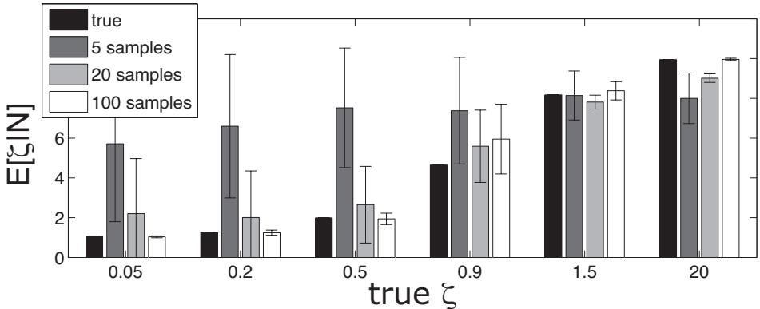  
Figure 1: Inferring ζ from observations on $L = 2 0$ independent actions with $L = 1 0$ possible outcomes each, averaging over c with $\alpha = 2 0$

## 2 Multiple actions with independent outcomes

The second notion of control incorporates both the outcome entropy above, but additionally measures the extent to which all outcomes in an environmenta are controllably achievable. That is, we here define control in a manner that takes into account whether different actions achieve outcomes reliably, where they achieve different outcomes, and whether these cover the range of outcomes possible in an environment.

Individual action outcome distribution: For mathematical convencience we will only deal with a simplified set of outcome distributions. We parametrise the conditional distribution of one action very simply as a mixture of a uniform distribution and a Kronecker delta, i.e. we write the probability of a set of observations $\mathbf { n } , n _ { i }$ being the number of times outcome i has been observed following the choice of action a

$$
P ( { \bf n } | c , { \bf m } ) = \frac { ( \sum _ { i } n _ { i } ) ! } { \prod _ { i } n _ { i } ! } c ^ { { \bf n } ^ { \mathrm { T } } { \bf m } } \bar { c } ^ { { \bf n } ^ { \mathrm { T } } ( 1 - { \bf m } ) } \bar { c } = \left( \frac { 1 - c } { L - 1 } \right)\tag{11}
$$

where $\mathbf { m } = [ 0 \ldots 0 1 0 \ldots 0 ] ^ { \mathrm { T } }$ denotes one of the outcomes as the “controllably attainable” one for that particular action. The scalar variable c (not to be confused with the outcome probability vector c in the previous subsection) determines the mixing distributions. We will say that it regulates the degree to which the outcome is “controllably achievable”. The outcomes not designated by m all have equal probability. n is the vector of outcome counts. L is the number of potential outcomes, and for simplicity we assume that the number of available actions is equally L (though it is straightforward to relax this).

For $c \to 1$ , only one outcome (the one for which $m _ { i } = 1$ is true) is observed, whereas as $c  1 / L$

any outcome might be observed. The outcome entropy for that action

$$
\mathcal { H } = - \sum _ { i } p _ { i } \log p _ { i } = - c \log ( c ) - ( 1 - c ) \log \frac { 1 - c } { L - 1 }\tag{12}
$$

is a strictly monotonically decreasing function of c for $L > 2$ . Thus, c captures the original notion of control as outcome entropy.

Multiple actions: For a set of independent actions, we can write the likelihood of observations (assuming independent observations for different actions):

$$
P ( \mathbf { N } | \boldsymbol { c } , \mathbf { M } ) \propto \prod _ { a } c ^ { ( \mathbf { n } ^ { a } ) ^ { \mathrm { T } } \mathbf { m } ^ { a } } \bar { c } ^ { ( \mathbf { n } ^ { a } ) ^ { \mathrm { T } } ( 1 - \mathbf { m } ^ { a } ) } \propto \prod _ { i j } C _ { i j } ^ { N _ { i j } }\tag{13}
$$

where we have assigned the $a ^ { \mathrm { t h } }$ column vector $\mathbf { m } ^ { a }$ of the matrix M to action a and the matrix C is defined below. N is a matrix consisting of the column vector observations for each of the actions. The meaning of M is important: each column stands for one action, each row for one outcome. A unity entry in a column designates that outcome as the main “controllably achievable” outcome for that action. A goal-directed actor would chose that action in order to maximise the chances of obtaining that outcome. The variable c determines the probability of actually observing the designated outcome as opposed to any other one.

The second notion of control now becomes apparent, in the relationship between the columns of M, i.e. between the controllably achievable outcomes of different actions. Consider the matrices M and their associated matrices $\mathbf { C } ,$ whose entry denotes the probability of outcome $o = i$ given action $a = j$ was chosen $C _ { i j } = p ( o = i | a = j )$

$$
\mathbf { M } _ { 0 } = { \left[ \begin{array} { l l l l } { 0 } & { 0 } & { 0 } & { 0 } \\ { 1 } & { 1 } & { 1 } & { 1 } \\ { 0 } & { 0 } & { 0 } & { 0 } \\ { 0 } & { 0 } & { 0 } & { 0 } \end{array} \right] }
$$

$$
\mathbf { C } _ { 0 } = \left[ \begin{array} { c c c c } { \frac { 1 - c } { L - 1 } } & { \frac { 1 - c } { L - 1 } } & { \frac { 1 - c } { L - 1 } } & { \frac { 1 - c } { L - 1 } } \\ { c } & { c } & { c } & { c } \\ { \frac { 1 - c } { L - 1 } } & { \frac { 1 - c } { L - 1 } } & { \frac { 1 - c } { L - 1 } } & { \frac { 1 - c } { L - 1 } } \\ { \frac { 1 - c } { L - 1 } } & { \frac { 1 - c } { L - 1 } } & { \frac { 1 - c } { L - 1 } } & { \frac { 1 - c } { L - 1 } } \end{array} \right]
$$

$$
\mathbf { M } _ { 1 } = { \left[ \begin{array} { l l l l } { 1 } & { 0 } & { 0 } & { 0 } \\ { 0 } & { 1 } & { 0 } & { 0 } \\ { 0 } & { 0 } & { 1 } & { 0 } \\ { 0 } & { 0 } & { 0 } & { 1 } \end{array} \right] }
$$

$$
\mathbf { C } _ { 1 } = \left[ \begin{array} { r r r r } { c } & { \frac { 1 - c } { L - 1 } } & { \frac { 1 - c } { L - 1 } } & { \frac { 1 - c } { L - 1 } } \\ { \frac { 1 - c } { L - 1 } } & { c } & { \frac { 1 - c } { L - 1 } } & { \frac { 1 - c } { L - 1 } } \\ { \frac { 1 - c } { L - 1 } } & { \frac { 1 - c } { L - 1 } } & { c } & { \frac { 1 - c } { L - 1 } } \\ { \frac { 1 - c } { L - 1 } } & { \frac { 1 - c } { L - 1 } } & { \frac { 1 - c } { L - 1 } } & { c } \end{array} \right]
$$

$$
\mathbf { M } _ { 2 } = { \left[ \begin{array} { l l l l } { 1 } & { 0 } & { 0 } & { 0 } \\ { 0 } & { 1 } & { 0 } & { 0 } \\ { 0 } & { 0 } & { 0 } & { 0 } \\ { 0 } & { 0 } & { 0 } & { 1 } \end{array} \right] }
$$

$$
\mathbf { C } _ { 2 } = \left[ \begin{array} { c c c c } { c } & { \frac { 1 - c } { L - 1 } } & { 1 / L } & { \frac { 1 - c } { L - 1 } } \\ { \frac { 1 - c } { L - 1 } } & { c } & { 1 / L } & { \frac { 1 - c } { L - 1 } } \\ { \frac { 1 - c } { L - 1 } } & { \frac { 1 - c } { L - 1 } } & { 1 / L } & { \frac { 1 - c } { L - 1 } } \\ { \frac { 1 - c } { L - 1 } } & { \frac { 1 - c } { L - 1 } } & { 1 / L } & { c } \end{array} \right]
$$

$$
\begin{array} { r } { \mathbf { M } _ { 3 } = \left[ \begin{array} { l l l l } { 1 } & { 1 } & { 0 } & { 0 } \\ { 0 } & { 1 } & { 0 } & { 0 } \\ { 1 } & { 0 } & { 0 } & { 0 } \\ { 0 } & { 0 } & { 0 } & { 1 } \end{array} \right] } \end{array}
$$

$$
\mathbf { C } _ { 3 } = \left[ \begin{array} { c c c c } { c / 2 } & { c / 2 } & { 1 / L } & { \frac { 1 - c } { L - 1 } } \\ { \frac { 1 - c } { L - 2 } } & { c / 2 } & { 1 / L } & { \frac { 1 - c } { L - 1 } } \\ { c / 2 } & { \frac { 1 - c } { L - 2 } } & { 1 / L } & { \frac { 1 - c } { L - 1 } } \\ { \frac { 1 - c } { L - 2 } } & { \frac { 1 - c } { L - 2 } } & { 1 / L } & { c } \end{array} \right]\tag{14}
$$

These have very different implications. For large $c ,$ these matrices now exemplify various dimensions along which a putative control variable may change.

$\mathbf { M } _ { 0 } \colon$ outcome 2 is attainable, but it is also the only one attainable. For $c \to 1$ , all actions deterministically lead to outcome 2.

$\mathbf { M } _ { 1 } \mathbf { : }$ one action available for each of the outcomes. As $c \to 1$ , all actions can deterministically attain their outcomes. In this case, all outcomes would be controllably achievable.

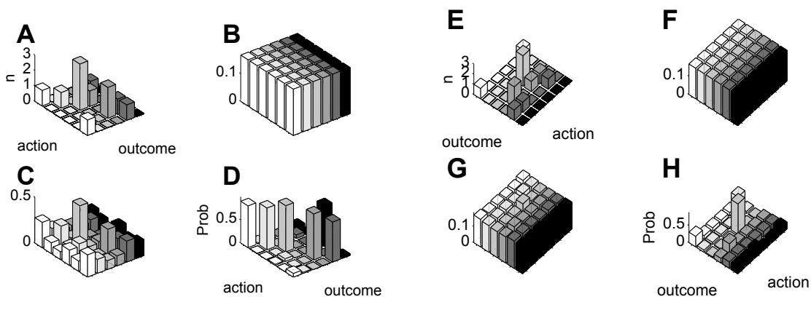  
Figure 2: Prior on achievable fraction of outcomes. Effect of entropy (c) and assumed achievable fraction on predictive distributions. Panels B-D show mean of posterior distribution over matrices M given observations N in panel A, and given different levels of entropy as determined by c. In these panels, the prior assumed that all outcomes were achievable. Panel B shows the posterior mean for $c = 1 / L = 0 . 1 6 .$ , i.e. no control at all due to the outcome entropy; C for $c = 0 . 2 5$ and D for $c = 0 . 9$ . The posterior mean becomes more dominated by a single matrix satisfying the constraints in equation 15 the higher c. No outcomes have as yet been observed for action $^ { 6 , }$ but at higher levels of control, its outcome is still inferred with high certainty due to the constraint that all actions lead to a different outcome. The four panels on the right show the effect of relaxing the prior by decreasing $| M |$ . E shows the data, which is the same as in A but rotated for clarity. F shows that for $c = 1 / L$ the same predictive distribution is inferred. In comparison to $\mathrm { C } ,$ G shows that a small value of c now leads to much more uncertainty, as outcomes from different actions can no more be used to constrain each other “by elimination”. H shows that for $c = 0 . 9$ , low-entropy posteriors are only seen for those actions where outcomes have been observed. Note that for action 6, the posterior mean is flat.

$\mathbf { M } _ { 2 } \mathbf { : }$ : actions available for a fraction (here 3/4) of the outcomes.

$\mathbf { M } _ { 3 } \mathbf { : }$ actions lead to more than a unique outcome, even for high c this does not lead to full control. We will not consider this setting any further.

as $c  1 / L ,$ , the observations these matrices generate the same, flat, uncontrollable outcomes. Later, we will also consider the notion that control is “about” some particularly reinforcing outcome.

When more than a single action is considered, we thus need to take the relationship between actions into consideration as illustrated in equation 14. We return to the simple case of equation 13, constraining the matrix M to have one unit entry in each column and row. If there are L actions and L outcomes, there are L! such matrices. For small L, the relevant integrals can be evaluated explicitly. We write the likelihood of observations as in equation 13, and add a prior

$$
\begin{array} { r c l } { p ( { \bf M } ) } & { = } & { \displaystyle \frac { 1 } { L ! } \left( \prod _ { j } \delta ( 1 - \sum _ { i } M _ { i j } ) \right) \left( \prod _ { i } \delta ( 1 - \sum _ { j } M _ { i j } ) \right) } \end{array}
$$

to enforce the constraint that each row and column must contain one unit entry. Given a set of observations N, this allows us to write the posterior distribution over M and the predictive

distributions for action a as:

$$
\begin{array} { r c l } { p ( \mathbf { M } | \mathbf { N } , c ) } & { = } & { \frac { p ( \mathbf { N } | c , \mathbf { M } ) p ( \mathbf { M } ) } { p ( \mathbf { N } | c ) } } \end{array}\tag{15}
$$

$$
\begin{array} { r c l } { p ( n _ { D + 1 } = j | { \bf N } , c , a ) } & { \propto } & { \displaystyle \sum _ { { \bf M } } c ^ { ( { \bf m } ^ { a } ) ^ { \mathrm { T } } { \bf d } ^ { j } } \bar { c } ^ { ( 1 - { \bf m } ^ { a } ) ^ { \mathrm { T } } { \bf d } ^ { j } } p ( { \bf M } | { \bf N } , c ) } \end{array}\tag{16}
$$

where $d _ { i } ^ { j } \ = \ \delta _ { i j }$ . Figure 2A shows the mean of the posterior distribution $p ( \mathbf { M } | \mathbf { N } , c )$ for three different values of c. As the c is shared between actions, and M assumes that all outcomes are achievable, this would mean that either, for $c \to 1$ , all outcomes are achievable by precisely one action, or, for $c  1 / L$ , no outcome is controllably achievable. Figure 2A-D illustrates the effects of such a constraint.

To relax this assumption, we allow the number |M | of actions with controllably attainable outcomes to vary, i.e. each row and column of the matrix M can have either one unity entry, or none, as illustrated by $\mathbf { M } _ { 2 }$ in equation 14. Analogous to the previous subsection, we write a prior $p ( | M | )$ over the set size $\begin{array} { r } { | M | = \sum _ { i j } M _ { i j } \le L } \end{array}$ of controllably achievable outcomes and then integrate over it, leading to a prior over matrices

$$
\begin{array} { r c l } { { p ( { \bf M } ) } } & { { = } } & { { \displaystyle \sum _ { | M | = 1 } ^ { L } p ( | M | ) \left[ \left( \begin{array} { c } { { L } } \\ { { | M | } } \end{array} \right) \frac { L ! } { ( L - | M | ) ! } \right] ^ { - 1 } B ( { \bf M } ) \delta \left( \sum _ { i j } M _ { i j } - | M | \right) } } \\ { { { } } } & { { } } & { { } } \\ { { { \cal B } ( { \bf M } ) } } & { { = } } & { { \displaystyle \left( \prod _ { j } \left[ \delta \left( 1 - \sum _ { i } M _ { i j } \right) + \delta \left( \sum _ { i } M _ { i j } \right) \right] \right) \times } } \\ { { } } & { { } } & { { \displaystyle \left( \prod _ { i } \left[ \delta \left( 1 - \sum _ { j } M _ { i j } \right) + \delta \left( \sum _ { j } M _ { i j } \right) \right] \right) } } \end{array}\tag{17}
$$

where $B ( \mathbf { M } )$ ensures that there is at most one unity entry in each row and column of the matrix M. In equation 17 we let all matrices with the same number of entries have equal prior probability. For a matrix of size $L \times L$ with $| M | = k ,$ there are $\textstyle { \binom { L } { k } }$ ways of choosing the columns, and $L ! / ( L - k ) !$ ! ways of filling the columns, as we care about the order.

In order to do prediction, we need to find the posterior distribution on the number of controllably achievable outcomes |M |, given the data. It is also desirable to do inference to ensure that this formulation is an invertible generative model. The posterior is given by:

$$
\begin{array} { r l r } { p ( | { \cal M } | = k | { \bf n } , c ) } & { = } & { \frac { \sum _ { { \bf M } : | { \cal M } | = k } p ( { \bf N } | { \bf M } , c ) p ( { \bf M } | k ) } { \sum _ { | { \cal M } | } p ( | { \cal M } | ) \sum _ { { \bf M } : | { \cal M } | = k } p ( { \bf N } | { \bf M } , c ) p ( { \bf M } | k ) } \quad \quad } \end{array}\tag{18}
$$

Thus if the prior $p ( | M | ) = \delta ( | M | - L )$ , we return to the previous setting where all outcomes have to be achievable if c is large enough. For priors that have mass on smaller $| M | ,$ not all outcomes have a dedicated action. Figure 2E-H provide an illustration of the consequence of decreasing |M|.

As a further check that the parametrisation indeed has effects that are identifiable, we will infer the ML setting of c and $| M | _ { \mathbf { \lambda } }$ , conditional on observations. This is again straightforward doing Expectation Maxmisation. Figure 3A displays the characteristics of inference of c from data N. Inference is very accurate. We will also look at the characteristics of generalisation based on |M | and would thus like to infer it. Figure 3B and C show the performance of this inference. At small observation numbers, there is naturally little evidence for the low-control settings, and |M | is overestimated.

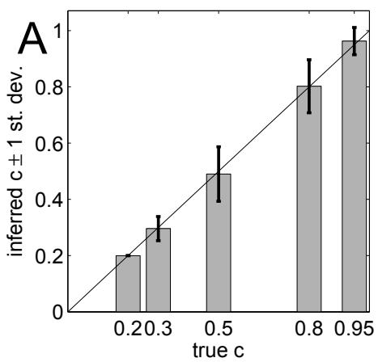

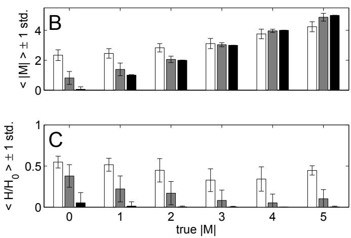  
Figure 3: A: Inference of c from outcome data by averaging over $p ( \mathbf { M } )$ as defined in equation 17 using EM. For each inference, a total of 20 observations were obtained from a randomly chosen matrix M with the true underlying c, i.e. approx. 4 observations on each of $L = 5$ actions. B: Inferring |M | from outcome data using EM. White bars are for a total of 20 observations, grey bars for 50 and black bars for 100 observations. The black bars are very near the true values. $L = 5$ and $c = 0 . 9$ . For small numbers of observations, the number of controllably achievable outcomes |M| is overestimated, but with little confidence. C: Ratio of entropy of $p ( k | \mathbf { N } , c )$ and a flat distribution with entropy $\mathcal { H } = - \log ( 1 / N ) \approx 1 . 6$

## 2.1 Exploration, incentive contrast and average reward with multiple actions

To illustrate both the commonalities and the differences with the previous setting that neglected relations between actions, we again apply it to the vending machine with $| { \cal A } | = 5$ buttons, $L =$ 5 possible outcomes and in which we are allowed to press $D = 4$ buttons. Pressing button o preferentially leads to outcome o. Only one button (button 1) has ever been taken before (4 times) and it has always yielded outcome 1 with reward 0. Let the rewards for the outcomes be $R = \mathrm { [ 0 ~ 0 . 2 ~ 0 . 2 3 ~ 0 . 2 7 ~ 0 . 3 ] }$ which has the property that the expected value of unexplored actions $( 1 / L \sum _ { o } R _ { o } = 0 . 1 9 6 )$ is just smaller than the reward associated with the second action. The four other buttons $a _ { i }$ result in one particular outcome $o \ = \ i$ with highest probability. Button 5 is therefore, unbeknownst to us, the best action. For illustration, let us force exploration to proceed in an ordered manner, from action 1 to 5, i.e. if we decide to try a new button we have to try the next one in the sequence — we can’t just jump ahead and try button 5 (there is also no reason why we should want to, given that we know nothing about either of the buttons 2-5). Then, the exploration depth — the action at which exploration ceases — is a measure of the degree of exploration “drive”. Figure 4A shows the consequences of different priors on the exploration depth. Priors are hard and only allow predictions exactly consistent with M matrices of a particular |M |.

• $| M | = 0 ;$ : We believe that no button will reliably lead to any outcome. Even after observing the first outcome 4 times, the predictive distribution is flat for all actions, including button 1. Button 1 looks as good as all other buttons about which no information has been gathered. Figure 4A shows that all four draws for a prior that enforces $| M | = 0$ result in the choice of button 1.

$| M | = 1$ : We believe that one button will reliably lead to one of the outcomes. The ML estimate of M has its only nonzero entry on button 1 and outcome 1, all other buttons are assumed to generate any of the $L$ outcomes randomly. Due to our choice of $R ,$ button 2 is advantageous over button 1. Thereafter, button 2 will be chosen, as its outcomes (outcome 2 with $R _ { 2 } = 0 . 2 )$ are marginally larger than those from the unknown actions. Figure 4A shows that all four actions for a prior that enforces $| M | = 1$ result in the choice of button 2.

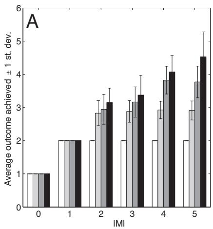

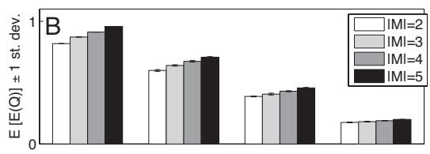

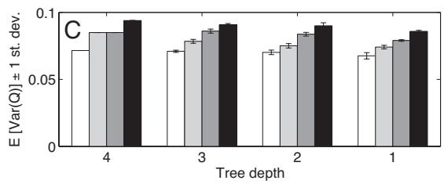  
Figure 4: Effect of prior belief about fraction of controllable outcomes on exploration and expected rewards. A: Exploration. $D = 4$ remaining actions, with $A = L = 5$ actions/outcomes. The bars show which action is taken on the first (white, $D = 4 )$ , second (light grey $\left( D = 3 \right) )$ , third (dark grey $\left( D = 2 \right) )$ and fourth (black $( D = 1 ) )$ trials on average over many trials. The bar groups for priors putting exclusive mass on $| M | = \{ 0 , 1 \cdots 5 \}$ controllable outcomes. As more outcomes are assumed to be controllably achievable, exploration proceeds further. Action 5 was reached 40% of the time when the prior assumes that all actions are controllably achievable $( | M | = 5 )$ and only 5% of the time when $| M | = 4$ . However, for $| M | = 5$ the variance of the third and fourth trials are large as well because a spurious high reward on one of the other actions (which here occurred in $2 / 1 0$ trials) leads to exploitation of that action. B: $\mathcal { Q }$ values for priors peaked on $| M | = \{ 2 \cdots 5 \}$ . Bars show the mean of the average $\mathcal { Q }$ values across all states, over all trials. The error bars indicate the standard deviation over trials. In all cases, a prior that assumes larger fraction of controllably achievable outcomes on average leads to higher expected rewards. C: Variance of the $\mathcal { Q }$ values across states. Bars indicate mean variance, error bars indicate standard deviation of the Q-value variance over trials. A high control prior leads to larger differences between the value of actions—a larger incentive contrast between actions.

• $| M | = 2 \colon$ We believe that two buttons will reliably lead to two different outcomes (one outcome each). Again, button 2 looks better than button 1 for the first action choice. Thereafter, however, there is a chance that the second nonzero entry is assigned to button $3 \mathrm { ~ / ~ }$ outcome 3. The predictive distribution for button 3 will not be flat, and thus the expected outcome for that button will be greater than the expected reward for button 2. However, exploration will mostly stop at button $^ { 3 , }$ as shown by the set of columns in figure 4A for $| M | = 2$

• As the matrix M is constrained to contain more nonzero entries in different columns, i.e. as we believe more and more of the outcomes are achieveable through some button, exploration proceeds until all buttons have been explored.

These exploration effects are due to a graded analogue of the effects shown in figure 2. Figure 4B and C also show that, similarly to the previous setting, the average Q values increase as the priors put more mass on larger $| M |$ , and that larger |M | mean actions differ more in their expected rewards.

## 3 Control over desirable outcomes

We now proceed to define the third notion of control, which is written as a function of the fraction of total available positive reinforcement (or equivalanetly safety), that is controllably achievable. Let R be the vector of reinforcements for each of the outcomes for all actions. To ensure the present definition holds for both punishments and rewards, define $\tilde { \mathbf { R } } = \mathbf { R } - \operatorname* { m i n } _ { i } R _ { i }$ , and then the fractional positive reinforcement for each outcome as $\begin{array} { r } { \mathbf { r } = \tilde { \mathbf { R } } / \sum _ { j } \tilde { R } _ { j } } \end{array}$ . It would also be possible to divide by the maximal reinforcement. A matrix M then allows control over a fraction $\mathbf { r } ^ { \mathrm { { T } } } \mathbf { M }$ of the reinforcers, and given the data, the average fraction of reinforcers that is controllably achievable can be written as:

$$
\chi _ { M } = \sum _ { i } r _ { i } \sum _ { j } \left[ \mathbb { E } [ \mathbf { M } | \mathbf { N } , c ] \right] _ { i j }\tag{19}
$$

If the expectation is over the set of matrices that have at most one unity entry per column, then $0 \leq$ $\chi _ { M } \leq 1$ . This definition has a strange relation to $c ,$ which is used in the construction of the posterior $p ( \mathbf { M } | \mathbf { N } , c )$ , but neglected thereafter. For example, for c close to $1 / L ,$ it may still be that the posterior mean is dominated by a full-rank M, which would imply high fraction of controllably achievable outcomes although each of the actions has very little preference for a particular outcome. The above metric is readily corrected by a linear mapping:

$$
\chi \quad = \quad \frac { L c - 1 } { L - 1 } \chi _ { M }\tag{20}
$$

which now incorporates c fully. A value of $\chi ,$ given a known reward vector $\mathbf { R } ,$ can be incorporated as an additional linear constraint on M. We write, instead of equation 17, the following:

$$
\begin{array} { r l r } { p ^ { * } ( c , \mathbf { M } | \chi ) } & { = } & { \exp \left( - \frac { ( \chi - \frac { L c - 1 } { L - 1 } \mathbf { r } ^ { \mathrm { T } } \mathbf { M } \mathbb { I } ) ^ { 2 } } { 2 \sigma ^ { 2 } } \right) } \end{array}\tag{21}
$$

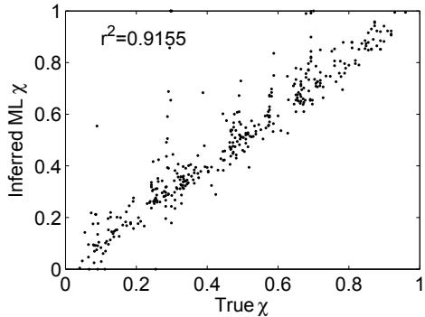  
Figure 5: Inference of controllable reinforcement parameter $\chi$ from outcome observations N via EM. The parameter $\chi$ is recovered accurately throughout the parameter’s range.

where I stands for a column vector of ones and the superscript ∗ indicates that it is an unnormalised quantity. The value of σ defines how strictly $\chi$ is imposed. We will evaluate the integral over c by importance sampling, and generally let $\sigma$ be small.

The prediction of new events $n _ { D + 1 }$ given D observations now has the following shape:

$$
\begin{array} { r l r } { p ( n _ { D + 1 } | { \bf N } , \chi , { \bf r } ) } & { = } & { \displaystyle \sum _ { { \bf M } } \int d c p ( n _ { D + 1 } | { \bf M } , c ) \frac { p ( { \bf N } | { \bf M } , c ) p ( c , { \bf M } | \chi ) } { \sum _ { { \bf M } } \int d c p ( { \bf N } | { \bf M } , c ) p ( c , { \bf M } | \chi ) } } \end{array}\tag{22}
$$

Figure 5 shows that $\chi$ again has identifiable effects on observations.

For the application to learned helplessness (Figure 7 in the main text), we will instead evaluate the posterior probability at a number of points and construct an approximation to the posterior distribution:

$$
p ( \chi | { \bf N } ) \approx \sum _ { i } w _ { i } \delta ( \chi - \chi _ { i } )\tag{23}
$$

$$
\begin{array} { r c l } { w _ { i } ^ { * } } & { = } & { \displaystyle \frac { p ( \chi _ { i } ) } { p ( \mathbf { N } ) } \sum _ { \mathbf { M } } \int d c p ( \mathbf { N } | \mathbf { M } , c ) p ( c , \mathbf { M } | \chi _ { i } ) } \end{array}\tag{24}
$$

where $\begin{array} { r } { w _ { i } = w _ { i } ^ { * } / \sum _ { j } w _ { j } ^ { * } } \end{array}$ , where the posterior is represented as a sum of delta functions, and where the integral is evaluated by importance sampling.

## References

Dearden, R., Friedman, N., and Andre, D. (1999). Model-based Bayesian exploration. In Proceedings of the fifteenth Conference on Uncertainty in Artificial Intelligence, pages 150–9, Stockholm. 2

Dearden, R., Friedman, N., and Russell, S. (1998). Bayesian Q-learning. In Proceedings of the fifteenth National Conference on Artificial Intelligence, pages 761–8. 2

Friedman, N. and Singer, Y. (1999). Efficient Bayesian Parameter Estimation in Large Discrete Domains. In Solla, S. A., Leen, T. K., and Muller, K.-R., editors, ¨ Advances in Neural Information Processing Systems, volume 11. MIT Press. 2

Gibbon, J., Berryman, R., and Thompson, R. L. (1974). Contingency spaces and measures in classical and instrumental conditioning. J Exp Anal Behav, 21(3):585–605. 2

MacKay, D. J. (2003). Information theory, inference and learning algorithms. Cambridge University Press, Cambridge, UK. 3

Maier, S. and Seligman, M. (1976). Learned Helplessness: Theory and Evidence. Journal of Experimental Psychology: General, 105(1):3–46. 2

Overmier, J. B., Patterson, J., and Wielkiewicz, R. M. (1980). Environmental contingencies as sources of stress in animals. In Levine, S. and Ursin, H., editors, Coping and Health. Plenum Press. 2