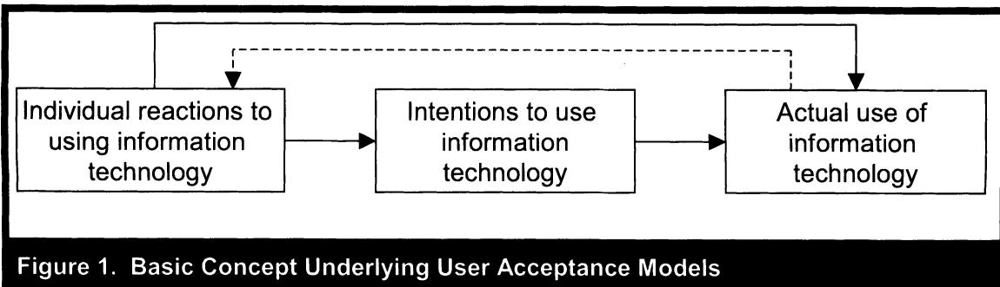
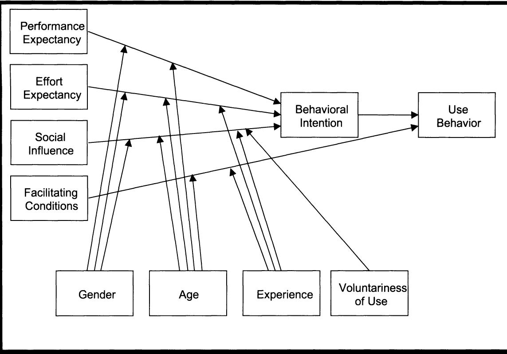

User Acceptance of Information Technology: Toward a Unified View   
Author(s): Viswanath Venkatesh, Michael G. Morris, Gordon B. Davis and Fred D. Davis   
Source: MIS Quarterly, Vol. 27, No. 3 (Sep., 2003), pp. 425-478   
Published by: Management Information Systems Research Center, University of Minnesota   
Stable URL: https://www.jstor.org/stable/30036540   
Accessed: 11-04-2019 02:05 UTC

J o facilitate new forms of scholarship. For more information about JTOR, please contact support@jstor.org.

Your use of the JSTOR archive indicates your acceptance of the Terms & Conditions of Use, available at https://about.jstor.org/terms

REseARch ArtiClE

# User Acceptance Of Information TEChnolOgy: Toward a Unified View1

By: Viswanath Venkatesh Robert H. Smith School of Business University of Maryland Van Munching Hall College Park, MD 20742 U.S.A. vvenkate@rhsmith.umd.edu

Michael G. Morris   
Mclntire School of Commerce University of Virginia   
Monroe Hall   
Charlottesville, VA 22903-2493 U.S.A.   
mmorris@virginia.edu Gordon B. Davis   
Carlson School of Management University of Minnesota   
321 19th Avenue South   
Minneapolis, MN 55455   
U.S.A.   
gdavis@csom.umn.edu Fred D. Davis   
Sam M. Walton College of Business University of Arkansas   
Fayetteville, AR 72701-1201   
U.S.A.   
fdavis@walton.uark.edu

## Abstract

Information technology (IT) acceptance research has yielded many competing models, each with different sets of acceptance determinants. In this paper, we (1) review user acceptance literature and discuss eight prominent models, (2) empirically compare the eight models and their extensions, (3) formulate a unified model that integrates elements across the eight models, and (4) empirically validate the unified model. The eight models reviewed are the theory of reasoned action, the technology acceptance model, the motivational model, the theory of planned behavior, a model combining the technology acceptance model and the theory of planned behavior, the model of PC utilization, the innovation diffusion theory, and the social cognitive theory. Using data from four organizations over a six-month period with three points of measurement, the eight models explained between 17 percent and 53 percent of the variance in user intentions to use information technology. Next, a unified model, called the Unified Theory of Acceptance and Use of Technology (UTAUT), was formulated, with four core determinants of intention and usage, and up to four moderators of key relationships. UTAUT was then tested using the original data and found to outperform the eight individual models (adjusted R² of 69 percent). UTAUT was then confirmed with data from two new organizations with similar results (adjusted R² of 70 percent). UTAUT thus provides a useful tool for managers needing to

assess the likelihood of success for new technology introductions and helps them understand the drivers of acceptance in order to proactively design interventions (including training, marketing, etc.) targeted at populations of users that may be less inclined to adopt and use new systems. The paper also makes several recommendations for future research including developing a deeper understanding of the dynamic influences studied here, refining measurement of the core constructs used in UTAUT, and understanding the organizational outcomes associated with new technology use.

Keywords: Theory of planned behavior, innovation characteristics, technology acceptance model, social cognitive theory, unified model, integrated model

## Introduction

The presence of computer and information technologies in today's organizations has expanded dramatically. Some estimates indicate that, since the 1980s, about 50 percent of all new capital investment in organizations has been in information technology (Westland and Clark 2000). Yet, for technologies to improve productivity, they must be accepted and used by employees in organizations. Explaining user acceptance of new technology is often described as one of the most mature research areas in the contemporary information systems (IS) literature (e.g., Hu et al. 1999). Research in this area has resulted in several theoretical models, with roots in information systems, psychology, and sociology, that routinely explain over 40 percent of the variance in individual intention to use technology (e.g., Davis et al. 1989; Taylor and Todd 1995b; Venkatesh and Davis 2000). Researchers are confronted with a choice among a multitude of models and find that they must "pick and choose" constructs across the models, or choose a "favored model" and largely ignore the contributions from alternative models. Thus, there is a need for a review and synthesis in order to progress toward a unified view of user acceptance.

The current work has the following objectives:

(1) To review the extant user acceptance models: The primary purpose of this review is to assess the current state of knowledge with respect to understanding individual acceptance of new information technologies. This review identifies eight prominent models and discusses their similarities and differences. Some authors have previously observed some of the similarities across models.² However, our review is the first to assess similarities and differences across all eight models, a necessary first step toward the ultimate goal of the paper: the development of a unified theory of individual acceptance of technology. The review is presented in the following section.

(2) To empirically compare the eight models: We conduct a within-subjects, longitudinal validation and comparison of the eight models using data from four organizations. This provides a baseline assessment of the relative explanatory power of the individual models against which the unified model can be compared. The empirical model comparison is presented in the third section.

()To formulate the Unified Theory of Acceptance and Use of Technology (UTAUT): Based upon conceptual and empirical similarities across models, we formulate a unified model. The formulation of UTAUT is presented in the fourth section.

To empirically validate UTAUT: An empirical test of UTAUT on the original data provides preliminary support for our contention that UTAUT outperforms each of the eight original models. UTAUT is then cross-validated using data from two new organizations. The empirical validation of UTAUT is presented in the fifth section.

## Review of Extant User Acceptance Models

## Description of Models and Constructs

IS research has long studied how and why individuals adopt new information technologies. Within this broad area of inquiry, there have been several streams of research. One stream of research focuses on individual acceptance of technology by using intention or usage as a dependent variable (e.g., Compeau and Higgins 1995b; Davis et al. 1989). Other streams have focused on implementation success at the organizational level (Leonard-Barton and Deschamps 1988) and tasktechnology fit (Goodhue 1995; Goodhue and Thompson 1995), among others. While each of these streams makes important and unique contributions to the literature on user acceptance of information technology, the theoretical models to be included in the present review, comparison, and synthesis employ intention and/or usage as the key dependent variable. The goal here is to understand usage as the dependent variable. The role of intention as a predictor of behavior (e.g., usage) is critical and has been well-established in IS and the reference disciplines (see Ajzen 1991; Sheppard et al. 1988; Taylor and Todd 1995b). Figure 1 presents the basic conceptual framework underlying the class of models explaining individual acceptance of information technology that forms the basis of this research. Our review resulted in the identification of eight key competing theoretical models. Table 1 describes the eight models and defines their theorized determinants of intention and/or usage. The models hypothesize between two and seven determinants of acceptance, for a total of 32 constructs across the eight models. Table 2 identifies four key moderating variables (experience, voluntariness, gender, and age) that have been found to be significant in conjunction with these models.

## Prior Model Tests and Model Comparisons

There have been many tests of the eight models but there have only been four studies reporting empirically-based comparisons of two or more of the eight models published in the major information systems journals. Table 3 provides a brief overview of each of the model comparison studies. Despite the apparent maturity of the research stream, a comprehensive comparison of the key competing models has not been conducted in a single study. Below, we identify five limitations of these prior model tests and comparisons, and how we address these limitations in our work.

Technology studied: The technologies that have been studied in many of the model development and comparison studies have been relatively simple, individual-oriented information technologies as opposed to more complex and sophisticated organizational technologies that are the focus of managerial concern and of this study.

<table><tr><td rowspan=2 colspan=3>Table 1. Models and Theories of Individual AcceptanceTheory of Reasoned Action (TRA)                        Core Constructs      Definitions</td></tr><tr><td rowspan=1 colspan=1>Theory of Reasoned Action (TRA)</td><td rowspan=1 colspan=1>Core Constructs</td></tr><tr><td rowspan=2 colspan=1>Drawn from social psychology, TRA is one of the mostfundamental and influential theories of human behavior.It has been used to predict a wide range of behaviors(see Sheppard et al. 1988 for a review). Davis et al.(1989) applied TRA to individual acceptance of techno-logy and found that the variance explained was largelyconsistent with studies that had employed TRA in thecontext of other behaviors.</td><td rowspan=1 colspan=1>Attitude TowardBehavior</td><td rowspan=1 colspan=1>&quot;an individual&#x27;s positive or negative feelings (evaluativeaffect) about performing the target behavior&quot; (Fishbein andAjzen 1975, p. 216).</td></tr><tr><td rowspan=1 colspan=1>Subjective Norm</td><td rowspan=1 colspan=1>&quot;the person&#x27;s perception that most people who areimportant to him think he should or should not perform thebehavior in question&quot; (Fishbein and Ajzen 1975, p. 302).</td></tr><tr><td rowspan=1 colspan=1>Technology Acceptance Model (TAM)</td><td rowspan=1 colspan=1></td><td rowspan=1 colspan=1></td></tr><tr><td rowspan=3 colspan=1>TAM is tailored to IS contexts, and was designed to pre-dict information technology acceptance and usage onthe job. Unlike TRA, the final conceptualization of TAMexcludes the attitude construct in order to better explainintention parsimoniously. TAM2 extended TAM by in-cluding subjective norm as an additional predictor ofintention in the case of mandatory settings (Venkateshand Davis 2000). TAM has been widely applied to adiverse set of technologies and users.</td><td rowspan=1 colspan=1>Perceived Usefulness</td><td rowspan=1 colspan=1>&quot;the degree to which a person believes that using aparticular system would enhance his or her jobperformance&quot; (Davis 1989, p. 320).</td></tr><tr><td rowspan=1 colspan=1>Perceived Ease ofUse</td><td rowspan=1 colspan=1>&quot;the degree to which a person believes that using aparticular system would be free of effort&quot; (Davis 1989, p.320).</td></tr><tr><td rowspan=1 colspan=1>Subjective Norm</td><td rowspan=1 colspan=1>Adapted from TRA/TPB. Included in TAM2 only.</td></tr><tr><td rowspan=1 colspan=1>Motivational Model (MM)</td><td rowspan=1 colspan=1></td><td rowspan=1 colspan=1></td></tr><tr><td rowspan=1 colspan=1>A significant body of research in psychology has sup-ported general motivation theory as an explanation forbehavior. Several studies have examined motivationaltheory and adapted it for specific contexts. Vallerand(1997) presents an excellent review of the fundamental</td><td rowspan=1 colspan=1>Extrinsic Motivation</td><td rowspan=1 colspan=1>The perception that users will want to perform an activity&quot;because it is perceived to be instrumental in achievingvalued outcomes that are distinct from the activity itself,such as improved job performance, pay, or promotions&quot;(Davis et al. 1992, p. 1112).</td></tr><tr><td rowspan=1 colspan=1>tenets of this theoretical base. Within the informationsystems domain, Davis et al. (1992) applied motiva-tional theory to understand new technology adoptionand use (see also Venkatesh and Speier 1999).</td><td rowspan=1 colspan=1>Intrinsic Motivation</td><td rowspan=1 colspan=1>The perception that users will want to perform an activity&quot;for no apparent reinforcement other than the process ofperforming the activity per se&quot; (Davis et al. 1992, p. 1112).</td></tr></table>

<table><tr><td colspan="5" rowspan="2">Table 1. Models and Theories of Individual Acceptance (Continued)Theory of Planned Behavior (TPB)                       Core Constructs      Definitions</td></tr><tr><td colspan="2" rowspan="1">Core Constructs</td></tr><tr><td colspan="1" rowspan="3">TPB extended TRA by adding the construct of perceivedbehavioral control. In TPB, perceived behavioral controlis theorized to be an additional determinant of intentionand behavior. Ajzen (1991) presented a review ofseveral studies that successfully used TPB to predictintention and behavior in a wide variety of settings. TPBhas been successfully applied to the understanding ofindividual acceptance and usage of many different tech-nologies (Harrison et al. 1997; Mathieson 1991; Taylorand Todd 1995b). A related model is the DecomposedTheory of Planned Behavior (DTPB). In terms of pre-dicting intention, DTPB is identical to TPB. In contrastto TPB but similar to TAM, DTPB "decomposes" atti-tude, subjective norm, and perceived behavioral controlinto its the underlying belief structure within technologyadoption contexts.</td><td colspan="1" rowspan="1">Attitude TowardBehavior</td><td colspan="3" rowspan="1">Adapted from TRA.</td></tr><tr><td colspan="1" rowspan="1">Subjective Norm</td><td colspan="3" rowspan="1">Adapted from TRA.</td></tr><tr><td colspan="1" rowspan="1">Perceived BehavioralControl</td><td colspan="3" rowspan="1">the perceived ease or difficulty of performing thebehavior" (Ajzen 1991, p. 188). In the context of ISresearch, "perceptions of internal and external constraintson behavior" (Taylor and Todd 1995b, p. 149).</td></tr><tr><td colspan="1" rowspan="1">Combined TAM and TPB (C-TAM-TPB)</td><td colspan="1" rowspan="1"></td><td colspan="3" rowspan="1"></td></tr><tr><td colspan="1" rowspan="4">This model combines the predictors of TPB withperceived usefulness from TAM to provide a hybridmodel (Taylor and Todd 1995a).</td><td colspan="1" rowspan="1">Attitude TowardBehavior</td><td colspan="3" rowspan="1">Adapted from TRA/TPB.</td></tr><tr><td colspan="1" rowspan="1">Subjective Norm</td><td colspan="3" rowspan="1">Adapted from TRA/TPB.</td></tr><tr><td colspan="1" rowspan="1">Perceived BehavioralControl</td><td colspan="3" rowspan="1">Adapted from TRA/TPB.</td></tr><tr><td colspan="1" rowspan="1">Perceived Usefulness</td><td colspan="3" rowspan="1">Adapted from TAM.</td></tr><tr><td colspan="3" rowspan="2">Table 1. Models and Theories of Individual Acceptance (Continued)Model of PC Utilization (MPCU)                           Core Constructs      Definitions</td></tr><tr><td colspan="1" rowspan="1">Model of PC Utilization (MPCU)</td><td colspan="1" rowspan="1">Core Constructs</td></tr><tr><td colspan="1" rowspan="6">Derived largely from Triandis' (1977) theory of humanbehavior, this model presents a competing perspectiveto that proposed by TRA and TPB. Thompson et al.(1991) adapted and refined Triandis' model for IS con-texts and used the model to predict PC utilization.However, the nature of the model makes it particularlysuited to predict individual acceptance and use of arange of information technologies. Thompson et al.(1991) sought to predict usage behavior rather thanintention; however, in keeping with the theory's roots,the current research will examine the effect of thesedeterminants on intention. Also, such an examination isimportant to ensure a fair comparison of the differentmodels.</td><td colspan="1" rowspan="1">Job-fit</td><td colspan="1" rowspan="1">"the extent to which an individual believes that using [atechnology] can enhance the performance of his or herjob" (Thompson et al. 1991, p. 129).</td></tr><tr><td colspan="1" rowspan="1">Complexity</td><td colspan="1" rowspan="1">Based on Rogers and Shoemaker (1971), "the degree towhich an innovation is perceived as relatively difficult tounderstand and use" (Thompson et al. 1991, p. 128).</td></tr><tr><td colspan="1" rowspan="1">Long-termConsequences</td><td colspan="1" rowspan="1">"Outcomes that have a pay-off in the future" (Thompson etal. 1991, p. 129).</td></tr><tr><td colspan="1" rowspan="1">Affect Towards Use</td><td colspan="1" rowspan="1">Based on Triandis, affect toward use is "feelings of joy,elation, or pleasure, or depression, disgust, displeasure,or hate associated by an individual with a particular act"(Thompson et al. 1991, p. 127).</td></tr><tr><td colspan="1" rowspan="1">Social Factors</td><td colspan="1" rowspan="1">Derived from Triandis, social factors are "the individual'sinternalization of the reference group's subjective culture,and specific interpersonal agreements that the individualhas made with others, in specific social situations"(Thompson et al. 1991, p. 126).</td></tr><tr><td colspan="1" rowspan="1">Facilitating Conditions</td><td colspan="1" rowspan="1">Objective factors in the environment that observers agreemake an act easy to accomplish. For example, returningitems purchased online is facilitated when no fee ischarged to return the item. In an IS context, "provision ofsupport for users of PCs may be one type of facilitatingcondition that can influence system utilization" (Thompsonet al. 1991, p. 129).</td></tr></table>

<table><tr><td rowspan=2 colspan=3>Table 1. Models and Theories of Individual Acceptance (Continued)Innovation Diffusion Theory (IDT)                         Core Constructs      Definitions</td></tr><tr><td rowspan=1 colspan=1>Innovation Diffusion Theory (IDT)</td><td rowspan=1 colspan=1>Core Constructs</td></tr><tr><td rowspan=7 colspan=1>Grounded in sociology, IDT (Rogers 1995) has beenused since the 1960s to study a variety of innovations,ranging from agricultural tools to organizationalinnovation (Tornatzky and Klein 1982). Withininformation systems, Moore and Benbasat (1991)adapted the characteristics of innovations presented inRogers and refined a set of constructs that could beused to study individual technology acceptance. Mooreand Benbasat (1996) found support for the predictivevalidity of these innovation characteristics (see alsoAgarwal and Prasad 1997, 1998; Karahanna et al. 1999;Plouffe et al. 2001).</td><td rowspan=1 colspan=1>Relative Advantage</td><td rowspan=1 colspan=1>&quot;the degree to which an innovation is perceived as beingbetter than its precursor&quot; (Moore and Benbasat 1991, p.195).</td></tr><tr><td rowspan=1 colspan=1>Ease of Use</td><td rowspan=1 colspan=1>&quot;the degree to which an innovation is perceived as beingdifficult to use&quot; (Moore and Benbasat 1991, p. 195).</td></tr><tr><td rowspan=1 colspan=1>Image</td><td rowspan=1 colspan=1>&quot;The degree to which use of an innovation is perceived toenhance one&#x27;s image or status in one&#x27;s social system&quot;(Moore and Benbasat 1991, p. 195).</td></tr><tr><td rowspan=1 colspan=1>Visibility</td><td rowspan=1 colspan=1>The degree to which one can see others using the systemin the organization (adapted from Moore and Benbasat1991).</td></tr><tr><td rowspan=1 colspan=1>Compatibility</td><td rowspan=1 colspan=1>&quot;the degree to which an innovation is perceived as beingconsistent with the existing values, needs, and pastexperiences of potential adopters&quot; (Moore and Benbasat1991, p. 195).</td></tr><tr><td rowspan=1 colspan=1>Results Demon-strability</td><td rowspan=1 colspan=1>&quot;the tangibility of the results of using the innovation,including their observability and communicability&quot; (Mooreand Benbasat 1991, p. 203).</td></tr><tr><td rowspan=1 colspan=1>Voluntariness of Use</td><td rowspan=1 colspan=1>&quot;the degree to which use of the innovation is perceived asbeing voluntary, or of free will&quot; (Moore and Benbasat1991, p. 195).</td></tr></table>

<table><tr><td rowspan=2 colspan=3>Table 1. Models and Theories of Individual Acceptance (Continued)Social Cognitive Theory (SCT)                            Core Constructs      Definitions</td></tr><tr><td rowspan=1 colspan=1>Social Cognitive Theory (SCT)</td><td rowspan=1 colspan=1>Core Constructs</td></tr><tr><td rowspan=5 colspan=1>One of the most powerful theories of human behavior issocial cognitive theory (see Bandura 1986). Compeauand Higgins (1995b) applied and extended SCT to thecontext of computer utilization (see also Compeau et al.1999); while Compeau and Higgins (1995a) also em-ployed SCT, it was to study performance and thus isoutside the goal of the current research. Compeau andHiggins&#x27; (1995b) model studied computer use but thenature of the model and the underlying theory allow it tobe extended to acceptance and use of informationtechnology in general. The original model of Compeauand Higgins (1995b) used usage as a dependentvariable but in keeping with the spirit of predictingindividual acceptance, we will examine the predictivevalidity of the model in the context of intention andusage to allow a fair comparison of the models.</td><td rowspan=1 colspan=1>Outcome Expec-tations—Performance</td><td rowspan=1 colspan=1>The performance-related consequences of the behavior.Specifically, performance expectations deal with job-related outcomes (Compeau and Higgins 1995b).</td></tr><tr><td rowspan=1 colspan=1>OutcomeExpectations-Personal</td><td rowspan=1 colspan=1>The personal consequences of the behavior. Specifically,personal expectations deal with the individual esteem andsense of accomplishment (Compeau and Higgins 1995b).</td></tr><tr><td rowspan=1 colspan=1>Self-efficacy</td><td rowspan=1 colspan=1>Judgment of one&#x27;s ability to use a technology (e.g.,computer) to accomplish a particular job or task.</td></tr><tr><td rowspan=1 colspan=1>Affect</td><td rowspan=1 colspan=1>An individual&#x27;s liking for a particular behavior (..,computer use).</td></tr><tr><td rowspan=1 colspan=1>Anxiety</td><td rowspan=1 colspan=1>Evoking anxious or emotional reactions when it comes toperforming a behavior (e.g., using a computer).</td></tr></table>

<table><tr><td rowspan=1 colspan=5>Table 2. Role of Moderators in Existing Models</td></tr><tr><td rowspan=1 colspan=1>Model</td><td rowspan=1 colspan=1>Experience</td><td rowspan=1 colspan=1>Voluntariness</td><td rowspan=1 colspan=1>Gender</td><td rowspan=1 colspan=1>Age</td></tr><tr><td rowspan=1 colspan=1>Theory ofReasonedAction</td><td rowspan=1 colspan=1>Experience was not explicitly included inthe original TRA. However, the role ofexperience was empirically examinedusing a cross-sectional analysis by Daviset al. (1989). No change in the salience ofdeterminants was found. In contrast,Karahanna et al. (1999) found that attitudewas more important with increasingexperience, while subjective norm becameless important with increasing experience.</td><td rowspan=1 colspan=1>Voluntariness was notincluded in the originalTRA. Although nottested, Hartwick andBarki (1994) suggestedthat subjective normwas more importantwhen system use wasperceived to be lessvoluntary.</td><td rowspan=1 colspan=1>N/A</td><td rowspan=1 colspan=1>N/A</td></tr><tr><td rowspan=1 colspan=1>TechnologyAcceptanceModel (andTAM2)</td><td rowspan=1 colspan=1>Experience was not explicitly included inthe original TAM. Davis et al. (1989) andSzajna (1996), among others, have pro-vided empirical evidence showing thatease of use becomes nonsignificant withincreased experience.</td><td rowspan=1 colspan=1>Voluntariness was notexplicitly included in theoriginal TAM. WithinTAM2, subjective normwas salient only inmandatory settings andeven then only in casesof limited experiencewith the system (i.e., athree-way interaction).</td><td rowspan=1 colspan=1>Gender was not in-cluded in the originalTAM. Empirical evi-dence demonstratedthat perceived useful-ness was more salientfor men while perceivedease of use was moresalient for women(Venkatesh and Morris2000). The effect ofsubjective norm wasmore salient for womenin the early stages ofexperience (i.e., athree-way interaction).</td><td rowspan=1 colspan=1>N/A</td></tr><tr><td rowspan=1 colspan=1>MotivationalModel</td><td rowspan=1 colspan=1>N/A</td><td rowspan=1 colspan=1>N/A</td><td rowspan=1 colspan=1>N/A</td><td rowspan=1 colspan=1>N/A</td></tr></table>

<table><tr><td colspan="5" rowspan="1">Table 2. Role of Moderators in Existing Models (Continued)</td></tr><tr><td colspan="1" rowspan="1">Model</td><td colspan="1" rowspan="1">Experience</td><td colspan="1" rowspan="1">Voluntariness</td><td colspan="1" rowspan="1">Gender</td><td colspan="1" rowspan="1">Age</td></tr><tr><td colspan="1" rowspan="2">Theory ofPlannedBehavior</td><td colspan="1" rowspan="1">Experience was not explicitly included inthe original TPB or DTPB. It has been</td><td colspan="1" rowspan="2">Voluntariness was notincluded in the originalTPB or DTPB. Asnoted in the discussionregarding TRA,although not tested,subjective norm wassuggested to be moreimportant when systemuse was perceived tobe less voluntary (Hart-wick and Barki 1994).</td><td colspan="1" rowspan="2">Venkatesh et al. (2000)found that attitude wasmore salient for men.Both subjective normand perceived beha-vioral control were moresalient for women inearly stages of exper-ience (i.e., three-wayinteractions).</td><td colspan="1" rowspan="2">Morris and Venkatesh(2000) found that atti-tude was more salientfor younger workerswhile perceivedbehavioral control wasmore salient for olderworkers. Subjectivenorm was more salientto older women (i.e., athree-way interaction).</td></tr><tr><td colspan="1" rowspan="1">incorporated into TPB via follow-on studies(e.g., Morris and Venkatesh 2000).Empirical evidence has demonstrated thatexperience moderates the relationshipbetween subjective norm and behavioralintention, such that subjective normbecomes less important with increasinglevels of experience. This is similar to thesuggestion of Karahanna et al. (1999) inthe context of TRA.</td></tr><tr><td colspan="1" rowspan="1">CombinedTAM-TPB</td><td colspan="1" rowspan="1">Experience was incorporated into thismodel in a between-subjects design(experienced and inexperienced users).Perceived usefulness, attitude towardbehavior, and perceived behavioral controlwere all more salient with increasingexperience while subjective norm becameless salient with increasing experience(Taylor and Todd 1995a).</td><td colspan="1" rowspan="1">N/A</td><td colspan="1" rowspan="1">N/A</td><td colspan="1" rowspan="1">N/A</td></tr><tr><td colspan="1" rowspan="1">Model of PCUtilization</td><td colspan="1" rowspan="1">Thompson et al. (1994) found that com-plexity, affect toward use, social factors,and facilitating conditions were all moresalient with less experience. On the otherhand, concern about long-term conse-quences became increasingly importantwith increasing levels of experience.</td><td colspan="1" rowspan="1">N/A</td><td colspan="1" rowspan="1">N/A</td><td colspan="1" rowspan="1">N/A</td></tr><tr><td colspan="1" rowspan="1">InnovationDiffusionTheory</td><td colspan="1" rowspan="1">Karahanna et al. (1999) conducted abetween-subjects comparison to study theimpact of innovation characteristics onadoption (no/low experience) and usagebehavior (greater experience) and founddifferences in the predictors of adoptionvs. usage behavior. The results showedthat for adoption, the significant predictorswere relative advantage, ease of use, trial-ability, results demonstrability, and visi-bility. In contrast, for usage, only relativeadvantage and image were significant.</td><td colspan="1" rowspan="1">Voluntariness was nottested as a moderator,but was shown to havea direct effect onintention.</td><td colspan="1" rowspan="1">N/A</td><td colspan="1" rowspan="1">N/A</td></tr><tr><td colspan="1" rowspan="1">SocialCognitiveTheory</td><td colspan="1" rowspan="1">N/A</td><td colspan="1" rowspan="1">N/A</td><td colspan="1" rowspan="1">N/A</td><td colspan="1" rowspan="1">N/A</td></tr></table>

<table><tr><td rowspan=2 colspan=8>Table 3. Review of Prior Model ComparisonsCross-Model         Theories/   Context of Study                  Newness of                          Sectional orComparison  Models     (Incl.                               Technology    Number of Points LongitudinalStudies       Compared  Technology)      Participants  Studied        of Measurement  Analysis      Findings</td></tr><tr><td rowspan=1 colspan=1>ModelComparisonStudies</td><td rowspan=1 colspan=1>Theories/ModelsCompared</td><td rowspan=1 colspan=1>Context of Study(Incl.Technology)</td><td rowspan=1 colspan=1>Participants</td><td rowspan=1 colspan=1>Newness ofTechnologyStudied</td><td rowspan=1 colspan=1>Number of Pointsof Measurement</td><td rowspan=1 colspan=1>Cross-Sectional orLongitudinalAnalysis</td></tr><tr><td rowspan=1 colspan=1>Davis et al.(1989)</td><td rowspan=1 colspan=1>TRA, TAM</td><td rowspan=1 colspan=1>Within-subjectsmodel compari-son of intentionand use of a wordprocessor</td><td rowspan=1 colspan=1>107 students</td><td rowspan=1 colspan=1>Participantswere new tothe technology</td><td rowspan=1 colspan=1>Two; 14 weeksapart</td><td rowspan=1 colspan=1>Cross-sectionalanalysis at thetwo points intime</td><td rowspan=1 colspan=1>The variance in intentionand use explained by TRAwas 32% and 26%, andTAM was 47% and 51%,respectively.</td></tr><tr><td rowspan=1 colspan=1>Mathieson(1991)</td><td rowspan=1 colspan=1>TAM, TPB</td><td rowspan=1 colspan=1>Between-subjectsmodel compari-son of intention touse a spread-sheet andcalculator</td><td rowspan=1 colspan=1>262 students</td><td rowspan=1 colspan=1>Some famil-iarity with thetechnology aseach partici-pant had tochoose a tech-nology to per-form a task</td><td rowspan=1 colspan=1>One</td><td rowspan=1 colspan=1>Cross-sectional</td><td rowspan=1 colspan=1>The variance in intentionexplained by TAM was70% and TPB was 62%</td></tr><tr><td rowspan=1 colspan=1>Taylor andTodd (1995b)</td><td rowspan=1 colspan=1>TAM,TPB/DTPB</td><td rowspan=1 colspan=1>Within-subjectsmodel compari-son of intention touse a computingresource center</td><td rowspan=1 colspan=1>786 students</td><td rowspan=1 colspan=1>Many studentswere alreadyfamiliar with thecenter</td><td rowspan=1 colspan=1>For a three-monthperiod, all studentsvisiting the centerwere surveyed—i.e., multiple mea-sures per student.</td><td rowspan=1 colspan=1>Cross-sectional</td><td rowspan=1 colspan=1>The variance in intentionexplained by TAM was52%, TPB was 57%, andDTPB was 60%</td></tr><tr><td rowspan=1 colspan=1>Plouffe et al.(2001)</td><td rowspan=1 colspan=1>TAM, IDT</td><td rowspan=1 colspan=1>Within-subjectsmodel compari-son of behavioralintention to useand use in thecontext of a mar-ket trial of anelectronic pay-ment systemusing smart card.</td><td rowspan=1 colspan=1>176merchants</td><td rowspan=1 colspan=1>Surveyadministeredafter 10 monthsof use</td><td rowspan=1 colspan=1>One</td><td rowspan=1 colspan=1>Cross-sectional</td><td rowspan=1 colspan=1>The variance in intentionexplained by TAM was33% and IDT was 45%</td></tr></table>

Participants: While there have been some tests of each model in organizational settings, the participants in three of the four model comparison studies have been students— only Plouffe et al. (2001) conducted their research in a nonacademic setting. This research is conducted using data collected from employees in organizations.

Timing of measurement: In general, most of the tests of the eight models were conducted well after the participants' acceptance or rejection decision rather than during the active adoption decision-making process. Because behavior has become routinized, individual reactions reported in those studies are retrospective (see Fiske and Taylor 1991; Venkatesh et al. 2000). With the exception of Davis et al. (1989), the model comparisons examined technologies that were already familiar to the individuals at the time of measurement. In this paper, we examine technologies from the time of their initial introduction to stages of greater experience.

Nature of measurement: Even studies that have examined experience have typically employed cross-sectional and/or betweensubjects comparisons (e.g., Davis et al. 1989; Karahanna et al. 1999; Szajna 1996; Taylor and Todd 1995a; Thompson et al. 1994). This limitation applies to model comparison studies also. Our work tracks participants through various stages of experience with a new technology and compares all models on all participants.

Voluntary vs. mandatory contexts: Most of the model tests and all four model comparisons were conducted in voluntary usage contexts.³ Therefore, one must use caution when generalizing those results to the mandatory settings that are possibly of more interest to practicing managers. This research examines both voluntary and mandatory implementation contexts.

## Empirical Comparison of the Eight Models

## Settings and Participants

Longitudinal field studies were conducted at four organizations among individuals being introduced to a new technology in the workplace. To help ensure our results would be robust across contexts, we sampled for heterogeneity across technologies, organizations, industries, business functions, and nature of use (voluntary vs. mandatory). In addition, we captured perceptions as the users' experience with the technology increased. At each firm, we were able to time our data collection in conjunction with a training program associated with the new technology introduction. This approach is consistent with prior training and individual acceptance research where individual reactions to a new technology were studied (e.g., Davis et al. 1989; Olfman and Mandviwalla 1994; Venkatesh and Davis 2000). A pretested questionnaire containing items measuring constructs from all eight models was administered at three different points in time: post-training (T1), one month after implementation (T2), and three months after implementation (T3). Actual usage behavior was measured over the sixmonth post-training period. Table 4 summarizes key characteristics of the organizational settings. Figure 2 presents the longitudinal data collection schedule.

## Measurement

A questionnaire was created with items validated in prior research adapted to the technologies and organizations studied. TRA scales were adapted from Davis et al. (1989); TAM scales were adapted from Davis (1989), Davis et al. (1989), and Venkatesh and Davis (2000); MM scales were adapted from Davis et al. (1992); TPB/DTPB scales were adapted from Taylor and Todd (1995a, 1995b); MPCU scales were adapted from Thompson et al. (1991); IDT scales were adapted from Moore and Benbasat (1991); and SCT scales were adapted from Compeau and Higgins (1995a, 1995b) and Compeau et al. (1999). Behavioral intention to use the system was measured using a three-item scale adapted from Davis et al. (1989) and extensively used in much of the previous individual acceptance research. Sevenpoint scales were used for all of the aforementioned constructs' measurement, with 1 being the negative end of the scale and 7 being the positive end of the scale. In addition to these measures, perceived voluntariness was measured as a manipulation check per the scale of Moore and Benbasat (1991), where 1 was nonvoluntary and 7 was completely voluntary. The tense of the verbs in the various scales reflected the timing of measurement: future tense was employed at T1, present tense was employed at T2 and T3 (see Karahanna et al. 1999). The scales used to measure the key constructs are discussed in a later section where we perform a detailed comparison (Tables 9 through 13). A focus group of five business professionals evaluated the questionnaire, following which minor wording changes were made. Actual usage behavior was measured as duration of use via system logs. Due to the sensitivity of usage measures to network availability, in all organizations studied, the system automatically logged off inactive users after a period of 5 to 15 minutes, eliminating most idle time from the usage logs.

<table><tr><td>X Training</td><td>0 User Reactions</td><td>X System Use</td><td>0 User Reactions/ Usage Measurement</td><td>X System Use</td><td>0 User Reactions/ Usage</td><td>X System Use</td><td>0 Usage Measurement</td></tr><tr><td>1 week</td><td></td><td></td><td>1 month</td><td></td><td>Measurement 3 months</td><td></td><td>D 6 months</td></tr></table>

Figure 2. Longitudinal Data Collection Schedule

<table><tr><td rowspan=2 colspan=5>Table 4. Description of StudiesFunctional    SampleStudy     Industry           Area         Size               System Description</td></tr><tr><td rowspan=1 colspan=1>Study</td><td rowspan=1 colspan=1>Industry</td><td rowspan=1 colspan=1>FunctionalArea</td><td rowspan=1 colspan=1>SampleSize</td></tr><tr><td rowspan=1 colspan=5>Voluntary Use</td></tr><tr><td rowspan=1 colspan=1>1a</td><td rowspan=1 colspan=1>Entertainment</td><td rowspan=1 colspan=1>ProductDevelopment</td><td rowspan=1 colspan=1>54</td><td rowspan=1 colspan=1>Online meeting manager that could beused to conduct Web-enabled video oraudio conferences in lieu of face-to-faceor traditional phone conferences</td></tr><tr><td rowspan=1 colspan=1>1b</td><td rowspan=1 colspan=1>TelecommServices</td><td rowspan=1 colspan=1>Sales</td><td rowspan=1 colspan=1>65</td><td rowspan=1 colspan=1>Database application that could be usedto access industry standards for particularproducts in lieu of other resources (e.g.,technical manuals, Web sites)</td></tr><tr><td rowspan=1 colspan=5>Mandatory Use</td></tr><tr><td rowspan=1 colspan=1>2a</td><td rowspan=1 colspan=1>Banking</td><td rowspan=1 colspan=1>BusinessAccountManagement</td><td rowspan=1 colspan=1>58</td><td rowspan=1 colspan=1>Portfolio analyzer that analysts wererequired to use in evaluating existing andpotential accounts</td></tr><tr><td rowspan=1 colspan=1>2b</td><td rowspan=1 colspan=1>PublicAdministration</td><td rowspan=1 colspan=1>Accounting</td><td rowspan=1 colspan=1>38</td><td rowspan=1 colspan=1>Proprietary accounting systems on a PCplatform that accountants were requiredto use for organizational bookkeeping</td></tr></table>

## Results

The perceptions of voluntariness were very high in studies 1a and 1b (1a: M = 6.50, SD = 0.22; 1b: M = 6.51, SD = 0.20) and very low in studies 2a and 2b (1a: M = 1.50, SD = 0.19; 1b: M = 1.49, SD = 0.18). Given this bi-modal distribution in the data (voluntary vs. mandatory), we created two data sets: (1) studies 1a and 1b, and (2) studies 2a and 2b. This is consistent with Venkatesh and Davis (2000).

Partial least squares (PLS Graph, Version 2.91.03.04) was used to examine the reliability and validity of the measures. Specifically, 48 separate validity tests (two studies, eight models, three time periods each) were run to examine convergent and discriminant validity. In testing the various models, only the direct effects on intention were modeled as the goal was to examine the prediction of intention rather than interrelationships among determinants of intention; further, the explained variance (R²) is not affected by indirect paths. The loading pattern was found to be acceptable with most loadings being .70 or higher. All internal consistency reliabilities were greater than .70. The patterns of results found in the current work are highly consistent with the results of previous research.

PLS was used to test all eight models at the three points of measurement in each of the two data sets. In all cases, we employed a bootstrapping method (500 times) that used randomly selected subsamples to test the PLS model.4 Tables 5 and 6 present the model validation results at each of the points of measurement. The tables report the variance explained and the beta coefficients. Key findings emerged from these analyses. First, all eight models explained individual acceptance, with variance in intention explained ranging from 17 percent to 42 percent. Also, a key difference across studies stemmed from the voluntary vs. mandatory settings—in mandatory settings (study 2), constructs related to social influence were significant whereas in the voluntary settings (study ), they were not significant. Finally, the determinants of intention varied over time, with some determinants going from significant to nonsignificant with increasing experience.

Following the test of the baseline/original specifications of the eight models (Tables 5 and 6), we examined the moderating influences suggested (either explicitly or implicitly) in the literature—i.e., experience, voluntariness, gender, and age Table 2). In order to test these moderating influences, stay true to the model extensions (Table 2), and conduct a complete test of the existing models and their extensions, the data were pooled across studies and time periods. Voluntariness was a dummy variable used to separate the situational contexts (study 1 vs. study 2); this approach is consistent with previous research (Venkatesh and Davis 2000). Gender was coded as a 0/1 dummy variable consistent with previous research (Venkatesh and Morris 2000) and age was coded as a continuous variable, consistent with prior research (Morris and Venkatesh 2000). Experience was operationalized via a dummy variable that took ordinal values of 0, 1, or 2 to capture increasing levels of user experience with the system (T1, T2, and T3). Using an ordinal dummy variable, rather than categorical variables, is consistent with recent research (e.g., Venkatesh and Davis 2000). Pooling the data across the three points of measurement resulted in a sample of 645 (215 x 3). The results of the pooled analysis are shown in Table 7.

Because pooling across time periods allows the explicit modeling of the moderating role of experience, there is an increase in the variance explained in the case of TAM2 (Table 7) compared to a main effects-only model reported earlier (Tables 5 and 6). One of the limitations of pooling is that there are repeated measures from the same individuals, resulting in measurement errors that are potentially correlated across time. However, cross-sectional analysis using Chow's (1960) test of beta differences (p < .05) from each time period (not shown here) confirmed the pattern of results shown in Table 7. Those beta differences with a significance of p < .05 or better (when using Chow's test) are discussed in the "Explanation" column in Table 7. The interaction terms were modeled as suggested by Chin et al. (1996) by creating interaction terms that were at the level of the indicators. For example, if latent variable A is measured by four indicators (A1, A2, A3, and A4) and latent variable B is measured by three indicators (B1, B2, and B3), the interaction term A × B is specified by 12 indicators, each one a product term—i.e., A1 × B1, A1 × B2, A1 × B3, A2 × B1, etc.

<table><tr><td rowspan=1 colspan=8>Table 5. Study 1: Predicting Intention in Voluntary Settings</td></tr><tr><td rowspan=1 colspan=2></td><td rowspan=1 colspan=2>Time 1 (N = 119)</td><td rowspan=1 colspan=2>Time 2 (N = 119)</td><td rowspan=1 colspan=2>Time 3 (N = 119)</td></tr><tr><td rowspan=1 colspan=1>Models</td><td rowspan=1 colspan=1>Independent variables</td><td rowspan=1 colspan=1> $\scriptstyle { \mathsf { R } } ^ { 2 }$ </td><td rowspan=1 colspan=1>Beta</td><td rowspan=1 colspan=1>R^{2$</td><td rowspan=1 colspan=1>Beta</td><td rowspan=1 colspan=1>R^{2$</td><td rowspan=1 colspan=1>Beta</td></tr><tr><td rowspan=2 colspan=1>TRA</td><td rowspan=1 colspan=1>Attitude toward using tech.</td><td rowspan=1 colspan=1>.30</td><td rowspan=1 colspan=1>.55***</td><td rowspan=1 colspan=1>.26</td><td rowspan=1 colspan=1>.51***</td><td rowspan=1 colspan=1>.19</td><td rowspan=1 colspan=1>.43***</td></tr><tr><td rowspan=1 colspan=1>Subjective norm</td><td rowspan=1 colspan=1></td><td rowspan=1 colspan=1>.06</td><td rowspan=1 colspan=1></td><td rowspan=1 colspan=1>.07</td><td rowspan=1 colspan=1></td><td rowspan=1 colspan=1>.08</td></tr><tr><td rowspan=3 colspan=1>TAM/TAM2</td><td rowspan=1 colspan=1>Perceived usefulness</td><td rowspan=1 colspan=1>.38</td><td rowspan=1 colspan=1>.55***</td><td rowspan=1 colspan=1>.36</td><td rowspan=1 colspan=1>.60***</td><td rowspan=1 colspan=1>.37</td><td rowspan=1 colspan=1>.61***</td></tr><tr><td rowspan=1 colspan=1>Perceived ease of use</td><td rowspan=1 colspan=1></td><td rowspan=1 colspan=1>.22**</td><td rowspan=1 colspan=1></td><td rowspan=1 colspan=1>.03</td><td rowspan=1 colspan=1></td><td rowspan=1 colspan=1>.05</td></tr><tr><td rowspan=1 colspan=1>Subjective norm</td><td rowspan=1 colspan=1></td><td rowspan=1 colspan=1>.02</td><td rowspan=1 colspan=1></td><td rowspan=1 colspan=1>.06</td><td rowspan=1 colspan=1></td><td rowspan=1 colspan=1>.06</td></tr><tr><td rowspan=2 colspan=1>MM</td><td rowspan=1 colspan=1>Extrinsic motivation</td><td rowspan=1 colspan=1>.37</td><td rowspan=1 colspan=1>.50***</td><td rowspan=1 colspan=1>.36</td><td rowspan=1 colspan=1>.47***</td><td rowspan=1 colspan=1>.37</td><td rowspan=1 colspan=1>.49***</td></tr><tr><td rowspan=1 colspan=1>Intrinsic motivation</td><td rowspan=1 colspan=1></td><td rowspan=1 colspan=1>.22**</td><td rowspan=1 colspan=1></td><td rowspan=1 colspan=1>.22**</td><td rowspan=1 colspan=1></td><td rowspan=1 colspan=1>.24***</td></tr><tr><td rowspan=3 colspan=1>TPB/DTPB</td><td rowspan=1 colspan=1>Attitude toward using tech.</td><td rowspan=1 colspan=1>.37</td><td rowspan=1 colspan=1>.52***</td><td rowspan=1 colspan=1>.25</td><td rowspan=1 colspan=1>.50***</td><td rowspan=1 colspan=1>.21</td><td rowspan=1 colspan=1>.44***</td></tr><tr><td rowspan=1 colspan=1>Subjective norm</td><td rowspan=1 colspan=1></td><td rowspan=1 colspan=1>.05</td><td rowspan=1 colspan=1></td><td rowspan=1 colspan=1>.04</td><td rowspan=1 colspan=1></td><td rowspan=1 colspan=1>.05</td></tr><tr><td rowspan=1 colspan=1>Perceived behavioral control</td><td rowspan=1 colspan=1></td><td rowspan=1 colspan=1>.24***</td><td rowspan=1 colspan=1></td><td rowspan=1 colspan=1>.03</td><td rowspan=1 colspan=1></td><td rowspan=1 colspan=1>.02</td></tr><tr><td rowspan=4 colspan=1>C-TAM-TPB</td><td rowspan=1 colspan=1>Perceived usefulness</td><td rowspan=1 colspan=1>.39</td><td rowspan=1 colspan=1>.56***</td><td rowspan=1 colspan=1>.36</td><td rowspan=1 colspan=1>.60***</td><td rowspan=1 colspan=1>.39</td><td rowspan=1 colspan=1>.63***</td></tr><tr><td rowspan=1 colspan=1>Attitude toward using tech.</td><td rowspan=1 colspan=1></td><td rowspan=1 colspan=1>.04</td><td rowspan=1 colspan=1></td><td rowspan=1 colspan=1>.03</td><td rowspan=1 colspan=1></td><td rowspan=1 colspan=1>.05</td></tr><tr><td rowspan=1 colspan=1>Subjective norm</td><td rowspan=1 colspan=1></td><td rowspan=1 colspan=1>.06</td><td rowspan=1 colspan=1></td><td rowspan=1 colspan=1>.04</td><td rowspan=1 colspan=1></td><td rowspan=1 colspan=1>.03</td></tr><tr><td rowspan=1 colspan=1>Perceived behavioral control</td><td rowspan=1 colspan=1></td><td rowspan=1 colspan=1>.25**</td><td rowspan=1 colspan=1></td><td rowspan=1 colspan=1>.02</td><td rowspan=1 colspan=1></td><td rowspan=1 colspan=1>.03</td></tr><tr><td rowspan=6 colspan=1>MPCU</td><td rowspan=1 colspan=1>Job-fit</td><td rowspan=1 colspan=1>.37</td><td rowspan=1 colspan=1>.54***</td><td rowspan=1 colspan=1>.36</td><td rowspan=1 colspan=1>.60***</td><td rowspan=1 colspan=1>.38</td><td rowspan=1 colspan=1>.62***</td></tr><tr><td rowspan=1 colspan=1>Complexity (reversed)</td><td rowspan=1 colspan=1></td><td rowspan=1 colspan=1>.23***</td><td rowspan=1 colspan=1></td><td rowspan=1 colspan=1>.04</td><td rowspan=1 colspan=1></td><td rowspan=1 colspan=1>.04</td></tr><tr><td rowspan=1 colspan=1>Long-term consequences</td><td rowspan=1 colspan=1></td><td rowspan=1 colspan=1>.06</td><td rowspan=1 colspan=1></td><td rowspan=1 colspan=1>.04</td><td rowspan=1 colspan=1></td><td rowspan=1 colspan=1>.07</td></tr><tr><td rowspan=1 colspan=1>Affect toward use</td><td rowspan=1 colspan=1></td><td rowspan=1 colspan=1>.05</td><td rowspan=1 colspan=1></td><td rowspan=1 colspan=1>.05</td><td rowspan=1 colspan=1></td><td rowspan=1 colspan=1>.04</td></tr><tr><td rowspan=1 colspan=1>Social factors</td><td rowspan=1 colspan=1></td><td rowspan=1 colspan=1>.04</td><td rowspan=1 colspan=1></td><td rowspan=1 colspan=1>.07</td><td rowspan=1 colspan=1></td><td rowspan=1 colspan=1>.06</td></tr><tr><td rowspan=1 colspan=1>Facilitating conditions</td><td rowspan=1 colspan=1></td><td rowspan=1 colspan=1>.05</td><td rowspan=1 colspan=1></td><td rowspan=1 colspan=1>.06</td><td rowspan=1 colspan=1></td><td rowspan=1 colspan=1>.04</td></tr><tr><td rowspan=8 colspan=1>IDT</td><td rowspan=1 colspan=1>Relative advantage</td><td rowspan=1 colspan=1>.38</td><td rowspan=1 colspan=1>.54***</td><td rowspan=1 colspan=1>.37</td><td rowspan=1 colspan=1>.61***</td><td rowspan=1 colspan=1>.39</td><td rowspan=1 colspan=1>.63***</td></tr><tr><td rowspan=1 colspan=1>Ease of use</td><td rowspan=1 colspan=1></td><td rowspan=1 colspan=1>.26**</td><td rowspan=1 colspan=1></td><td rowspan=1 colspan=1>.02</td><td rowspan=1 colspan=1></td><td rowspan=1 colspan=1>.07</td></tr><tr><td rowspan=1 colspan=1>Result demonstrability</td><td rowspan=1 colspan=1></td><td rowspan=1 colspan=1>.03</td><td rowspan=1 colspan=1></td><td rowspan=1 colspan=1>.04</td><td rowspan=1 colspan=1></td><td rowspan=1 colspan=1>.06</td></tr><tr><td rowspan=1 colspan=1>Trialability</td><td rowspan=1 colspan=1></td><td rowspan=1 colspan=1>.04</td><td rowspan=1 colspan=1></td><td rowspan=1 colspan=1>.09</td><td rowspan=1 colspan=1></td><td rowspan=1 colspan=1>.08</td></tr><tr><td rowspan=1 colspan=1>Visibility</td><td rowspan=1 colspan=1></td><td rowspan=1 colspan=1>.06</td><td rowspan=1 colspan=1></td><td rowspan=1 colspan=1>.03</td><td rowspan=1 colspan=1></td><td rowspan=1 colspan=1>.06</td></tr><tr><td rowspan=1 colspan=1>Image</td><td rowspan=1 colspan=1></td><td rowspan=1 colspan=1>.06</td><td rowspan=1 colspan=1></td><td rowspan=1 colspan=1>.05</td><td rowspan=1 colspan=1></td><td rowspan=1 colspan=1>.07</td></tr><tr><td rowspan=1 colspan=1>Compatibility</td><td rowspan=1 colspan=1></td><td rowspan=1 colspan=1>.05</td><td rowspan=1 colspan=1></td><td rowspan=1 colspan=1>.02</td><td rowspan=1 colspan=1></td><td rowspan=1 colspan=1>.04</td></tr><tr><td rowspan=1 colspan=1>Voluntariness</td><td rowspan=1 colspan=1></td><td rowspan=1 colspan=1>.03</td><td rowspan=1 colspan=1></td><td rowspan=1 colspan=1>.04</td><td rowspan=1 colspan=1></td><td rowspan=1 colspan=1>.03</td></tr><tr><td rowspan=4 colspan=1>SCT</td><td rowspan=1 colspan=1>Outcome expectations</td><td rowspan=1 colspan=1>.37</td><td rowspan=1 colspan=1>.47***</td><td rowspan=1 colspan=1>.36</td><td rowspan=1 colspan=1>.60***</td><td rowspan=1 colspan=1>.36</td><td rowspan=1 colspan=1>.60***</td></tr><tr><td rowspan=1 colspan=1>Self-efficacy</td><td rowspan=1 colspan=1></td><td rowspan=1 colspan=1>.20***</td><td rowspan=1 colspan=1></td><td rowspan=1 colspan=1>.03</td><td rowspan=1 colspan=1></td><td rowspan=1 colspan=1>.01</td></tr><tr><td rowspan=1 colspan=1>Affect</td><td rowspan=1 colspan=1></td><td rowspan=1 colspan=1>.05</td><td rowspan=1 colspan=1></td><td rowspan=1 colspan=1>.03</td><td rowspan=1 colspan=1></td><td rowspan=1 colspan=1>.04</td></tr><tr><td rowspan=1 colspan=1>Anxiety</td><td rowspan=1 colspan=1></td><td rowspan=1 colspan=1>-.17*</td><td rowspan=1 colspan=1></td><td rowspan=1 colspan=1>.04</td><td rowspan=1 colspan=1></td><td rowspan=1 colspan=1>.06</td></tr></table>

Notes: 1. \*p < .05; \*\*p <.01; \*\*\*p <.001.  
When the data were analyzed separately for studies 2a and 2b, the pattern of results was very similar.

<table><tr><td rowspan=2 colspan=8>Table 6. Study 2: Predicting Intention in Mandatory SettingsTime 1 (N = 96)   Time 2 (N = 96)   Time 3 (N = 96)</td></tr><tr><td rowspan=1 colspan=2>Time 1 (N = 96)</td><td rowspan=1 colspan=2>Time 2 (N = 96)</td><td rowspan=1 colspan=2>Time 3 (N = 96)</td></tr><tr><td rowspan=1 colspan=1>Models</td><td rowspan=1 colspan=1>Independent variables</td><td rowspan=1 colspan=1>R^{2}$</td><td rowspan=1 colspan=1>Beta</td><td rowspan=1 colspan=1>R^{2}$</td><td rowspan=1 colspan=1>Beta</td><td rowspan=1 colspan=1>R^{2}$</td><td rowspan=1 colspan=1>Beta</td></tr><tr><td rowspan=2 colspan=1>TRA</td><td rowspan=1 colspan=1>Attitude toward using tech.</td><td rowspan=1 colspan=1>.26</td><td rowspan=1 colspan=1>.27***</td><td rowspan=1 colspan=1>.26</td><td rowspan=1 colspan=1>.28***</td><td rowspan=1 colspan=1>.17</td><td rowspan=1 colspan=1>.40***</td></tr><tr><td rowspan=1 colspan=1>Subjective norm</td><td rowspan=1 colspan=1></td><td rowspan=1 colspan=1>.20**</td><td rowspan=1 colspan=1></td><td rowspan=1 colspan=1>.21**</td><td rowspan=1 colspan=1></td><td rowspan=1 colspan=1>.05</td></tr><tr><td rowspan=3 colspan=1>TAM/TAM2</td><td rowspan=1 colspan=1>Perceived usefulness</td><td rowspan=1 colspan=1>.39</td><td rowspan=1 colspan=1>.42***</td><td rowspan=1 colspan=1>.41</td><td rowspan=1 colspan=1>.50***</td><td rowspan=1 colspan=1>.36</td><td rowspan=1 colspan=1>.60***</td></tr><tr><td rowspan=1 colspan=1>Perceived ease of use</td><td rowspan=1 colspan=1></td><td rowspan=1 colspan=1>.21*</td><td rowspan=1 colspan=1></td><td rowspan=1 colspan=1>.23**</td><td rowspan=1 colspan=1></td><td rowspan=1 colspan=1>.03</td></tr><tr><td rowspan=1 colspan=1>Subjective norm</td><td rowspan=1 colspan=1></td><td rowspan=1 colspan=1>.20*</td><td rowspan=1 colspan=1></td><td rowspan=1 colspan=1>.03</td><td rowspan=1 colspan=1></td><td rowspan=1 colspan=1>.04</td></tr><tr><td rowspan=2 colspan=1>MM</td><td rowspan=1 colspan=1>Extrinsic motivation</td><td rowspan=1 colspan=1>.38</td><td rowspan=1 colspan=1>.47***</td><td rowspan=1 colspan=1>.40</td><td rowspan=1 colspan=1>.49***</td><td rowspan=1 colspan=1>.35</td><td rowspan=1 colspan=1>.44***</td></tr><tr><td rowspan=1 colspan=1>Intrinsic motivation</td><td rowspan=1 colspan=1></td><td rowspan=1 colspan=1>.21**</td><td rowspan=1 colspan=1></td><td rowspan=1 colspan=1>.24**</td><td rowspan=1 colspan=1></td><td rowspan=1 colspan=1>.19**</td></tr><tr><td rowspan=3 colspan=1>TPB/DTPB</td><td rowspan=1 colspan=1>Attitude toward using tech.</td><td rowspan=1 colspan=1>.34</td><td rowspan=1 colspan=1>.22*</td><td rowspan=1 colspan=1>.28</td><td rowspan=1 colspan=1>.36***</td><td rowspan=1 colspan=1>.18</td><td rowspan=1 colspan=1>.43***</td></tr><tr><td rowspan=1 colspan=1>Subjective norm</td><td rowspan=1 colspan=1></td><td rowspan=1 colspan=1>.25***</td><td rowspan=1 colspan=1></td><td rowspan=1 colspan=1>.26**</td><td rowspan=1 colspan=1></td><td rowspan=1 colspan=1>.05</td></tr><tr><td rowspan=1 colspan=1>Perceived behavioral control</td><td rowspan=1 colspan=1></td><td rowspan=1 colspan=1>.19*</td><td rowspan=1 colspan=1></td><td rowspan=1 colspan=1>.03</td><td rowspan=1 colspan=1></td><td rowspan=1 colspan=1>.08</td></tr><tr><td rowspan=4 colspan=1>C-TAM-TPB</td><td rowspan=1 colspan=1>Perceived usefulness</td><td rowspan=1 colspan=1>.36</td><td rowspan=1 colspan=1>.42***</td><td rowspan=1 colspan=1>.35</td><td rowspan=1 colspan=1>.51***</td><td rowspan=1 colspan=1>.35</td><td rowspan=1 colspan=1>.60***</td></tr><tr><td rowspan=1 colspan=1>Attitude toward using tech.</td><td rowspan=1 colspan=1></td><td rowspan=1 colspan=1>.07</td><td rowspan=1 colspan=1></td><td rowspan=1 colspan=1>.08</td><td rowspan=1 colspan=1></td><td rowspan=1 colspan=1>.04</td></tr><tr><td rowspan=1 colspan=1>Subjective norm</td><td rowspan=1 colspan=1></td><td rowspan=1 colspan=1>.20*</td><td rowspan=1 colspan=1></td><td rowspan=1 colspan=1>.23**</td><td rowspan=1 colspan=1></td><td rowspan=1 colspan=1>.03</td></tr><tr><td rowspan=1 colspan=1>Perceived behavioral control</td><td rowspan=1 colspan=1></td><td rowspan=1 colspan=1>.19*</td><td rowspan=1 colspan=1></td><td rowspan=1 colspan=1>.11</td><td rowspan=1 colspan=1></td><td rowspan=1 colspan=1>.09</td></tr><tr><td rowspan=6 colspan=1>MPCU</td><td rowspan=1 colspan=1>Job-fit</td><td rowspan=1 colspan=1>.37</td><td rowspan=1 colspan=1>.42***</td><td rowspan=1 colspan=1>.40</td><td rowspan=1 colspan=1>.50***</td><td rowspan=1 colspan=1>.37</td><td rowspan=1 colspan=1>.61***</td></tr><tr><td rowspan=1 colspan=1>Complexity (reversed)</td><td rowspan=1 colspan=1></td><td rowspan=1 colspan=1>.20*</td><td rowspan=1 colspan=1></td><td rowspan=1 colspan=1>.02</td><td rowspan=1 colspan=1></td><td rowspan=1 colspan=1>.04</td></tr><tr><td rowspan=1 colspan=1>Long-term consequences</td><td rowspan=1 colspan=1></td><td rowspan=1 colspan=1>.07</td><td rowspan=1 colspan=1></td><td rowspan=1 colspan=1>.07</td><td rowspan=1 colspan=1></td><td rowspan=1 colspan=1>.07</td></tr><tr><td rowspan=1 colspan=1>Affect toward use</td><td rowspan=1 colspan=1></td><td rowspan=1 colspan=1>.01</td><td rowspan=1 colspan=1></td><td rowspan=1 colspan=1>.05</td><td rowspan=1 colspan=1></td><td rowspan=1 colspan=1>.04</td></tr><tr><td rowspan=1 colspan=1>Social factors</td><td rowspan=1 colspan=1></td><td rowspan=1 colspan=1>.18*</td><td rowspan=1 colspan=1></td><td rowspan=1 colspan=1>.23**</td><td rowspan=1 colspan=1></td><td rowspan=1 colspan=1>.02</td></tr><tr><td rowspan=1 colspan=1>Facilitating conditions</td><td rowspan=1 colspan=1></td><td rowspan=1 colspan=1>.05</td><td rowspan=1 colspan=1></td><td rowspan=1 colspan=1>.07</td><td rowspan=1 colspan=1></td><td rowspan=1 colspan=1>.07</td></tr><tr><td rowspan=8 colspan=1>IDT</td><td rowspan=1 colspan=1>Relative advantage</td><td rowspan=1 colspan=1>.38</td><td rowspan=1 colspan=1>.47***</td><td rowspan=1 colspan=1>.42</td><td rowspan=1 colspan=1>.52***</td><td rowspan=1 colspan=1>.37</td><td rowspan=1 colspan=1>.61***</td></tr><tr><td rowspan=1 colspan=1>Ease of use</td><td rowspan=1 colspan=1></td><td rowspan=1 colspan=1>.20*</td><td rowspan=1 colspan=1></td><td rowspan=1 colspan=1>.04</td><td rowspan=1 colspan=1></td><td rowspan=1 colspan=1>.04</td></tr><tr><td rowspan=1 colspan=1>Result demonstrability</td><td rowspan=1 colspan=1></td><td rowspan=1 colspan=1>.03</td><td rowspan=1 colspan=1></td><td rowspan=1 colspan=1>.07</td><td rowspan=1 colspan=1></td><td rowspan=1 colspan=1>.04</td></tr><tr><td rowspan=1 colspan=1>Trialability</td><td rowspan=1 colspan=1></td><td rowspan=1 colspan=1>.05</td><td rowspan=1 colspan=1></td><td rowspan=1 colspan=1>.04</td><td rowspan=1 colspan=1></td><td rowspan=1 colspan=1>.04</td></tr><tr><td rowspan=1 colspan=1>Visibility</td><td rowspan=1 colspan=1></td><td rowspan=1 colspan=1>.04</td><td rowspan=1 colspan=1></td><td rowspan=1 colspan=1>.04</td><td rowspan=1 colspan=1></td><td rowspan=1 colspan=1>.01</td></tr><tr><td rowspan=1 colspan=1>Image</td><td rowspan=1 colspan=1></td><td rowspan=1 colspan=1>.18*</td><td rowspan=1 colspan=1></td><td rowspan=1 colspan=1>.27**</td><td rowspan=1 colspan=1></td><td rowspan=1 colspan=1>.05</td></tr><tr><td rowspan=1 colspan=1>Compatibility</td><td rowspan=1 colspan=1></td><td rowspan=1 colspan=1>.06</td><td rowspan=1 colspan=1></td><td rowspan=1 colspan=1>.02</td><td rowspan=1 colspan=1></td><td rowspan=1 colspan=1>.04</td></tr><tr><td rowspan=1 colspan=1>Voluntariness</td><td rowspan=1 colspan=1></td><td rowspan=1 colspan=1>.02</td><td rowspan=1 colspan=1></td><td rowspan=1 colspan=1>.06</td><td rowspan=1 colspan=1></td><td rowspan=1 colspan=1>.03</td></tr><tr><td rowspan=4 colspan=1>SCT</td><td rowspan=1 colspan=1>Outcome expectations</td><td rowspan=1 colspan=1>.38</td><td rowspan=1 colspan=1>.46***</td><td rowspan=1 colspan=1>.39</td><td rowspan=1 colspan=1>.44****</td><td rowspan=1 colspan=1>.36</td><td rowspan=1 colspan=1>.60***</td></tr><tr><td rowspan=1 colspan=1>Self-efficacy</td><td rowspan=1 colspan=1></td><td rowspan=1 colspan=1>.19**</td><td rowspan=1 colspan=1></td><td rowspan=1 colspan=1>.21***</td><td rowspan=1 colspan=1></td><td rowspan=1 colspan=1>.03</td></tr><tr><td rowspan=1 colspan=1>Affect</td><td rowspan=1 colspan=1></td><td rowspan=1 colspan=1>.06</td><td rowspan=1 colspan=1></td><td rowspan=1 colspan=1>.04</td><td rowspan=1 colspan=1></td><td rowspan=1 colspan=1>.05</td></tr><tr><td rowspan=1 colspan=1>Anxiety</td><td rowspan=1 colspan=1></td><td rowspan=1 colspan=1>-18*</td><td rowspan=1 colspan=1></td><td rowspan=1 colspan=1>-16*</td><td rowspan=1 colspan=1></td><td rowspan=1 colspan=1>.02</td></tr></table>

Notes: 1. \*p <.05; \*\*p<.01; \*\*\*p <.001.  
When the data were analyzed separately for studies 2a and 2b, the pattern of results was very similar.

<table><tr><td colspan="6" rowspan="1">Table 7. Predicting Intention—Model Comparison Including Moderators: DataPooled Across Studies (N = 645)</td></tr><tr><td colspan="1" rowspan="1">Model</td><td colspan="1" rowspan="1">Version</td><td colspan="1" rowspan="1">Independent Variables</td><td colspan="1" rowspan="1">R^{2}$</td><td colspan="1" rowspan="1">Beta</td><td colspan="1" rowspan="1">Explanation</td></tr><tr><td colspan="1" rowspan="7">TRA</td><td colspan="1" rowspan="7">1</td><td colspan="1" rowspan="1">Attitude (A)</td><td colspan="1" rowspan="1">.36</td><td colspan="1" rowspan="1">.41***</td><td colspan="1" rowspan="1">Direct effect</td></tr><tr><td colspan="1" rowspan="1">Subjective norm (SN)</td><td colspan="1" rowspan="1"></td><td colspan="1" rowspan="1">.11</td><td colspan="1" rowspan="1"></td></tr><tr><td colspan="1" rowspan="1">Experience (EXP)</td><td colspan="1" rowspan="1"></td><td colspan="1" rowspan="1">.09</td><td colspan="1" rowspan="1"></td></tr><tr><td colspan="1" rowspan="1">Voluntariness (VOL)</td><td colspan="1" rowspan="1"></td><td colspan="1" rowspan="1">.04</td><td colspan="1" rowspan="1"></td></tr><tr><td colspan="1" rowspan="1">A × EXP</td><td colspan="1" rowspan="1"></td><td colspan="1" rowspan="1">.03</td><td colspan="1" rowspan="1"></td></tr><tr><td colspan="1" rowspan="1">SN × EXP</td><td colspan="1" rowspan="1"></td><td colspan="1" rowspan="1">-.17*</td><td colspan="1" rowspan="1">Effect decreases with increasingexperience</td></tr><tr><td colspan="1" rowspan="1">SN × VOL</td><td colspan="1" rowspan="1"></td><td colspan="1" rowspan="1">.17*</td><td colspan="1" rowspan="1">Effect present only in mandatorysettings</td></tr><tr><td colspan="1" rowspan="10">TAM</td><td colspan="1" rowspan="10">2aTAM2</td><td colspan="1" rowspan="1">Perceived usefulness (U)</td><td colspan="1" rowspan="1">.53</td><td colspan="1" rowspan="1">.48***</td><td colspan="1" rowspan="1">Direct effect</td></tr><tr><td colspan="1" rowspan="1">Perceived ease of use (EOU)</td><td colspan="1" rowspan="1"></td><td colspan="1" rowspan="1">.11</td><td colspan="1" rowspan="1"></td></tr><tr><td colspan="1" rowspan="1">Subjective norm (SN)</td><td colspan="1" rowspan="1"></td><td colspan="1" rowspan="1">.09</td><td colspan="1" rowspan="1"></td></tr><tr><td colspan="1" rowspan="1">Experience (EXP)</td><td colspan="1" rowspan="1"></td><td colspan="1" rowspan="1">.06</td><td colspan="1" rowspan="1"></td></tr><tr><td colspan="1" rowspan="1">Voluntariness (VOL)</td><td colspan="1" rowspan="1"></td><td colspan="1" rowspan="1">.10</td><td colspan="1" rowspan="1"></td></tr><tr><td colspan="1" rowspan="1">EOU × EXP</td><td colspan="1" rowspan="1"></td><td colspan="1" rowspan="1">-.20**</td><td colspan="1" rowspan="1">Effect decreases with increasingexperience</td></tr><tr><td colspan="1" rowspan="1">SN × EXP</td><td colspan="1" rowspan="1"></td><td colspan="1" rowspan="1">-15</td><td colspan="1" rowspan="1"></td></tr><tr><td colspan="1" rowspan="1">SN × VOL</td><td colspan="1" rowspan="1"></td><td colspan="1" rowspan="1">-.16*</td><td colspan="1" rowspan="1">Cannot be interpreted due topresence of higher-order term</td></tr><tr><td colspan="1" rowspan="1">EXP × VOL</td><td colspan="1" rowspan="1"></td><td colspan="1" rowspan="1">.07</td><td colspan="1" rowspan="1"></td></tr><tr><td colspan="1" rowspan="1">SN × EXP x VOL</td><td colspan="1" rowspan="1"></td><td colspan="1" rowspan="1">-.18**</td><td colspan="1" rowspan="1">Effect exists only in mandatorysettings but decreases withincreasing experience</td></tr><tr><td colspan="1" rowspan="11"></td><td colspan="1" rowspan="11">2bTAMincl.gender</td><td colspan="1" rowspan="1">Perceived usefulness (U)</td><td colspan="1" rowspan="1">.52</td><td colspan="1" rowspan="1">.14*</td><td colspan="1" rowspan="1">Cannot be interpreted due topresence of interaction term</td></tr><tr><td colspan="1" rowspan="1">Percd. ease of use (EOU)</td><td colspan="1" rowspan="1"></td><td colspan="1" rowspan="1">.08</td><td colspan="1" rowspan="1"></td></tr><tr><td colspan="1" rowspan="1">Subjective norm (SN)</td><td colspan="1" rowspan="1"></td><td colspan="1" rowspan="1">.02</td><td colspan="1" rowspan="1"></td></tr><tr><td colspan="1" rowspan="1">Gender (GDR)</td><td colspan="1" rowspan="1"></td><td colspan="1" rowspan="1">.11</td><td colspan="1" rowspan="1"></td></tr><tr><td colspan="1" rowspan="1">Experience (EXP)</td><td colspan="1" rowspan="1"></td><td colspan="1" rowspan="1">.07</td><td colspan="1" rowspan="1"></td></tr><tr><td colspan="1" rowspan="1">U× GDR</td><td colspan="1" rowspan="1"></td><td colspan="1" rowspan="1">.31***</td><td colspan="1" rowspan="1">Effect is greater for men</td></tr><tr><td colspan="1" rowspan="1">EOU × GDR</td><td colspan="1" rowspan="1"></td><td colspan="1" rowspan="1">-.20**</td><td colspan="1" rowspan="1">Effect is greater for women</td></tr><tr><td colspan="1" rowspan="1">SN × GDR</td><td colspan="1" rowspan="1"></td><td colspan="1" rowspan="1">.11</td><td colspan="1" rowspan="1"></td></tr><tr><td colspan="1" rowspan="1">SN × EXP</td><td colspan="1" rowspan="1"></td><td colspan="1" rowspan="1">.02</td><td colspan="1" rowspan="1"></td></tr><tr><td colspan="1" rowspan="1">EXP × GDR</td><td colspan="1" rowspan="1"></td><td colspan="1" rowspan="1">.09</td><td colspan="1" rowspan="1"></td></tr><tr><td colspan="1" rowspan="1">SN × GDR × EXP</td><td colspan="1" rowspan="1"></td><td colspan="1" rowspan="1">.17**</td><td colspan="1" rowspan="1">Effect is greater for women butdecreases with increasingexperience</td></tr><tr><td colspan="6" rowspan="1">Table 7. Predicting Intention—Model Comparison Including Moderators: DataPooled Across Studies (N = 645) (Continued)</td></tr><tr><td colspan="1" rowspan="1">Model</td><td colspan="1" rowspan="1">Version</td><td colspan="1" rowspan="1">Independent Variables</td><td colspan="1" rowspan="1">R^{2}$</td><td colspan="1" rowspan="1">Beta</td><td colspan="1" rowspan="1">Explanation</td></tr><tr><td colspan="1" rowspan="2">MM</td><td colspan="1" rowspan="2">3</td><td colspan="1" rowspan="1">Extrinsic motivation</td><td colspan="1" rowspan="1">.38</td><td colspan="1" rowspan="1">.50***</td><td colspan="1" rowspan="1">Direct effect</td></tr><tr><td colspan="1" rowspan="1">Intrinsic motivation</td><td colspan="1" rowspan="1"></td><td colspan="1" rowspan="1">.20***</td><td colspan="1" rowspan="1">Direct effect</td></tr><tr><td colspan="1" rowspan="7">TPB/DTPB</td><td colspan="1" rowspan="7">4aTPBincl. vol</td><td colspan="1" rowspan="1">Attitude (A)</td><td colspan="1" rowspan="1">.36</td><td colspan="1" rowspan="1">.40***</td><td colspan="1" rowspan="1">Direct effect</td></tr><tr><td colspan="1" rowspan="1">Subjective norm (SN)</td><td colspan="1" rowspan="1"></td><td colspan="1" rowspan="1">.09</td><td colspan="1" rowspan="1"></td></tr><tr><td colspan="1" rowspan="1">Percd. behrl. control (PBC)</td><td colspan="1" rowspan="1"></td><td colspan="1" rowspan="1">.13</td><td colspan="1" rowspan="1"></td></tr><tr><td colspan="1" rowspan="1">Experience (EXP)</td><td colspan="1" rowspan="1"></td><td colspan="1" rowspan="1">.10</td><td colspan="1" rowspan="1"></td></tr><tr><td colspan="1" rowspan="1">Voluntariness (VOL)</td><td colspan="1" rowspan="1"></td><td colspan="1" rowspan="1">.05</td><td colspan="1" rowspan="1"></td></tr><tr><td colspan="1" rowspan="1">SN × EXP</td><td colspan="1" rowspan="1"></td><td colspan="1" rowspan="1">-.17**</td><td colspan="1" rowspan="1">Effect decreases with increasingexperience</td></tr><tr><td colspan="1" rowspan="1">SN × VOL</td><td colspan="1" rowspan="1"></td><td colspan="1" rowspan="1">.17**</td><td colspan="1" rowspan="1">Effect present only in mandatorysettings</td></tr><tr><td colspan="1" rowspan="13"></td><td colspan="1" rowspan="13">4bTPBincl.gender</td><td colspan="1" rowspan="1">Attitude (A)</td><td colspan="1" rowspan="1">.46</td><td colspan="1" rowspan="1">.17***</td><td colspan="1" rowspan="1">Cannot be interpreted due topresence of interaction term</td></tr><tr><td colspan="1" rowspan="1">Subjective norm (SN)</td><td colspan="1" rowspan="1"></td><td colspan="1" rowspan="1">.02</td><td colspan="1" rowspan="1"></td></tr><tr><td colspan="1" rowspan="1">Percd. behrl. control (PBC)</td><td colspan="1" rowspan="1"></td><td colspan="1" rowspan="1">.10</td><td colspan="1" rowspan="1"></td></tr><tr><td colspan="1" rowspan="1">Gender (GDR)</td><td colspan="1" rowspan="1"></td><td colspan="1" rowspan="1">.01</td><td colspan="1" rowspan="1"></td></tr><tr><td colspan="1" rowspan="1">Experience (EXP)</td><td colspan="1" rowspan="1"></td><td colspan="1" rowspan="1">.02</td><td colspan="1" rowspan="1"></td></tr><tr><td colspan="1" rowspan="1">A × GDR</td><td colspan="1" rowspan="1"></td><td colspan="1" rowspan="1">.22***</td><td colspan="1" rowspan="1">Effect is greater for men</td></tr><tr><td colspan="1" rowspan="1">SN × EXP</td><td colspan="1" rowspan="1"></td><td colspan="1" rowspan="1">-.12</td><td colspan="1" rowspan="1"></td></tr><tr><td colspan="1" rowspan="1">SN × GDR</td><td colspan="1" rowspan="1"></td><td colspan="1" rowspan="1">.10</td><td colspan="1" rowspan="1"></td></tr><tr><td colspan="1" rowspan="1">PBC × GDR</td><td colspan="1" rowspan="1"></td><td colspan="1" rowspan="1">.07</td><td colspan="1" rowspan="1"></td></tr><tr><td colspan="1" rowspan="1">PBC × EXP</td><td colspan="1" rowspan="1"></td><td colspan="1" rowspan="1">.04</td><td colspan="1" rowspan="1"></td></tr><tr><td colspan="1" rowspan="1">GDR × EXP</td><td colspan="1" rowspan="1"></td><td colspan="1" rowspan="1">.15*</td><td colspan="1" rowspan="1">Term included to test higher-order interactions below</td></tr><tr><td colspan="1" rowspan="1">SN × GDR × EXP</td><td colspan="1" rowspan="1"></td><td colspan="1" rowspan="1">-.18**</td><td colspan="1" rowspan="2">Both SN and PBC effects arehigher for women, but the effectsdecrease with increasingexperience</td></tr><tr><td colspan="1" rowspan="1">PBC × GDR × EXP</td><td colspan="1" rowspan="1"></td><td colspan="1" rowspan="1">-.16*</td></tr><tr><td colspan="1" rowspan="9"></td><td colspan="1" rowspan="9">4cTPBincl.age</td><td colspan="1" rowspan="1">Attitude (A)</td><td colspan="1" rowspan="1">.47</td><td colspan="1" rowspan="1">.17***</td><td colspan="1" rowspan="1">Cannot be interpreted due topresence of interaction term</td></tr><tr><td colspan="1" rowspan="1">Subjective norm (SN)</td><td colspan="1" rowspan="1"></td><td colspan="1" rowspan="1">.02</td><td colspan="1" rowspan="1"></td></tr><tr><td colspan="1" rowspan="1">Percd. behrl. control (PBC)</td><td colspan="1" rowspan="1"></td><td colspan="1" rowspan="1">.10</td><td colspan="1" rowspan="1"></td></tr><tr><td colspan="1" rowspan="1">Age (AGE)</td><td colspan="1" rowspan="1"></td><td colspan="1" rowspan="1">.01</td><td colspan="1" rowspan="1"></td></tr><tr><td colspan="1" rowspan="1">Experience (EXP)</td><td colspan="1" rowspan="1">{</td><td colspan="1" rowspan="1">.02</td><td colspan="1" rowspan="1"></td></tr><tr><td colspan="1" rowspan="1">A  AGE</td><td colspan="1" rowspan="1"></td><td colspan="1" rowspan="1">-.26***</td><td colspan="1" rowspan="1">Effect is greater for youngerworkers</td></tr><tr><td colspan="1" rowspan="1">SN × EXP</td><td colspan="1" rowspan="1"></td><td colspan="1" rowspan="1">-.03</td><td colspan="1" rowspan="1"></td></tr><tr><td colspan="1" rowspan="1">SN × AGE</td><td colspan="1" rowspan="1"></td><td colspan="1" rowspan="1">.11</td><td colspan="1" rowspan="1"></td></tr><tr><td colspan="1" rowspan="1">PBC × AGE</td><td colspan="1" rowspan="1"></td><td colspan="1" rowspan="1">.21**</td><td colspan="1" rowspan="1">Effect is greater for olderworkers</td></tr></table>

<table><tr><td colspan="11" rowspan="1">Table 7. Predicting Intention—Model Comparison Including Moderators: DataPooled Across Studies (N = 645) (Continued)</td></tr><tr><td colspan="1" rowspan="1">Model</td><td colspan="1" rowspan="1">Version</td><td colspan="1" rowspan="1">Independent Variables</td><td colspan="1" rowspan="1">R^{</td><td colspan="1" rowspan="1">Beta</td><td colspan="6" rowspan="1">Explanation</td></tr><tr><td colspan="1" rowspan="2"></td><td colspan="1" rowspan="2"></td><td colspan="1" rowspan="1">AGE × EXP</td><td colspan="1" rowspan="1"></td><td colspan="1" rowspan="1">.15*</td><td colspan="6" rowspan="1">Term included to test higher-order interaction below</td></tr><tr><td colspan="1" rowspan="1">SN × AGE × EXP</td><td colspan="1" rowspan="1"></td><td colspan="1" rowspan="1">-18**</td><td colspan="6" rowspan="1">Effect is greater for olderworkers, but the effectdecreases with increasingexperience</td></tr><tr><td colspan="1" rowspan="9">C-TAM-TPB</td><td colspan="1" rowspan="9">5</td><td colspan="1" rowspan="1">Perceived usefulness (U)</td><td colspan="1" rowspan="1">.39</td><td colspan="1" rowspan="1">.40***</td><td colspan="6" rowspan="1">Direct effect</td></tr><tr><td colspan="1" rowspan="1">Attitude (A)</td><td colspan="1" rowspan="1"></td><td colspan="1" rowspan="1">.09</td><td colspan="6" rowspan="1"></td></tr><tr><td colspan="1" rowspan="1">Subjective norm (SN)</td><td colspan="1" rowspan="1"></td><td colspan="1" rowspan="1">.08</td><td colspan="6" rowspan="1"></td></tr><tr><td colspan="1" rowspan="1">Perceived beholder control(PBC)</td><td colspan="1" rowspan="1"></td><td colspan="1" rowspan="1">.16*</td><td colspan="6" rowspan="1">Cannot be interpreted due topresence of interaction term</td></tr><tr><td colspan="1" rowspan="1">Experience (EXP)</td><td colspan="1" rowspan="1"></td><td colspan="1" rowspan="1">.11</td><td colspan="6" rowspan="1"></td></tr><tr><td colspan="1" rowspan="1">U× EXP</td><td colspan="1" rowspan="1"></td><td colspan="1" rowspan="1">.01</td><td colspan="6" rowspan="1"></td></tr><tr><td colspan="1" rowspan="1">A× EXP</td><td colspan="1" rowspan="1"></td><td colspan="1" rowspan="1">.08</td><td colspan="6" rowspan="1"></td></tr><tr><td colspan="1" rowspan="1">SN × EXP</td><td colspan="1" rowspan="1"></td><td colspan="1" rowspan="1">-.17*</td><td colspan="6" rowspan="1">Effect decreases with increasingexperience</td></tr><tr><td colspan="1" rowspan="1">PBC × EXP</td><td colspan="1" rowspan="1"></td><td colspan="1" rowspan="1">-.19**</td><td colspan="6" rowspan="1">Effect decreases with increasingexperience</td></tr><tr><td colspan="2" rowspan="12">MPCU6</td><td colspan="1" rowspan="1">Job-fit (JF)</td><td colspan="1" rowspan="1">.47</td><td colspan="1" rowspan="1">.40***</td><td colspan="6" rowspan="1">Direct effect</td></tr><tr><td colspan="1" rowspan="1">Complexity (CO) (reversed)</td><td colspan="1" rowspan="1"></td><td colspan="1" rowspan="1">.07</td><td colspan="6" rowspan="1"></td></tr><tr><td colspan="1" rowspan="1">Long-term consequences (LTC)</td><td colspan="1" rowspan="1"></td><td colspan="1" rowspan="1">.02</td><td colspan="6" rowspan="1"></td></tr><tr><td colspan="1" rowspan="1">Affect toward use (ATU)</td><td colspan="1" rowspan="1"></td><td colspan="1" rowspan="1">.05</td><td colspan="6" rowspan="1"></td></tr><tr><td colspan="1" rowspan="1">Social factors (SF)</td><td colspan="1" rowspan="1"></td><td colspan="1" rowspan="1">.10</td><td colspan="6" rowspan="1"></td></tr><tr><td colspan="1" rowspan="1">Facilitating condns. (FC)</td><td colspan="1" rowspan="1"></td><td colspan="1" rowspan="1">.07</td><td colspan="6" rowspan="1"></td></tr><tr><td colspan="1" rowspan="1">Experience (EXP)</td><td colspan="1" rowspan="1"></td><td colspan="1" rowspan="1">.08</td><td colspan="6" rowspan="1"></td></tr><tr><td colspan="1" rowspan="1">CO  EXP (CO—reversed)</td><td colspan="1" rowspan="1"></td><td colspan="1" rowspan="1">-.17*</td><td colspan="6" rowspan="1">Effect decreases with increasingexperience</td></tr><tr><td colspan="1" rowspan="1">LTC × EXP</td><td colspan="1" rowspan="1"></td><td colspan="1" rowspan="1">.02</td><td colspan="6" rowspan="1"></td></tr><tr><td colspan="1" rowspan="1">ATU × EXP</td><td colspan="1" rowspan="1"></td><td colspan="1" rowspan="1">.01</td><td colspan="6" rowspan="1"></td></tr><tr><td colspan="1" rowspan="1">SF × EXP</td><td colspan="1" rowspan="1"></td><td colspan="1" rowspan="1">-.20**</td><td colspan="6" rowspan="1">Effect decreases with increasingexperience</td></tr><tr><td colspan="1" rowspan="1">FC × EXP</td><td colspan="1" rowspan="1"></td><td colspan="1" rowspan="1">.05</td><td colspan="6" rowspan="1"></td></tr><tr><td colspan="1" rowspan="8">IDT</td><td colspan="1" rowspan="8">7</td><td colspan="1" rowspan="1">Relative advantage (RA)</td><td colspan="1" rowspan="1">.40</td><td colspan="1" rowspan="1">.49***</td><td colspan="6" rowspan="1">Direct effect</td></tr><tr><td colspan="1" rowspan="1">Ease of use (EU)</td><td colspan="1" rowspan="1"></td><td colspan="1" rowspan="1">.05</td><td colspan="6" rowspan="1"></td></tr><tr><td colspan="1" rowspan="1">Result demonstrability (RD)</td><td colspan="1" rowspan="1"></td><td colspan="1" rowspan="1">.02</td><td colspan="6" rowspan="1"></td></tr><tr><td colspan="1" rowspan="1">Trialability (T)</td><td colspan="1" rowspan="1"></td><td colspan="1" rowspan="1">.04</td><td colspan="6" rowspan="1"></td></tr><tr><td colspan="1" rowspan="1">Visibility (V)</td><td colspan="1" rowspan="1"></td><td colspan="1" rowspan="1">.03</td><td colspan="6" rowspan="1"></td></tr><tr><td colspan="1" rowspan="1">Image (1)</td><td colspan="1" rowspan="1"></td><td colspan="1" rowspan="1">.01</td><td colspan="6" rowspan="1"></td></tr><tr><td colspan="1" rowspan="1">Compatibility (COMPAT)</td><td colspan="1" rowspan="1"></td><td colspan="1" rowspan="1">.06</td><td colspan="6" rowspan="1"></td></tr><tr><td colspan="1" rowspan="1">Voluntariness of use (VOL)</td><td colspan="1" rowspan="1"></td><td colspan="1" rowspan="1">.11</td><td colspan="6" rowspan="1"></td></tr><tr><td colspan="6" rowspan="2">Table 7. Predicting Intention—Model Comparison Including Moderators: DataPooled Across Studies (N = 645) (Continued)ModelVersion     Independent Variables      R^{2  Beta             Explanation</td></tr><tr><td colspan="1" rowspan="1">Model</td><td colspan="1" rowspan="1">Version</td><td colspan="1" rowspan="1">Independent Variables</td><td colspan="1" rowspan="1">R^{2</td><td colspan="1" rowspan="1">Beta</td></tr><tr><td colspan="1" rowspan="6"></td><td colspan="1" rowspan="6"></td><td colspan="1" rowspan="1">Experience (EXP)</td><td colspan="1" rowspan="1"></td><td colspan="1" rowspan="1">.03</td><td colspan="1" rowspan="1"></td></tr><tr><td colspan="1" rowspan="1">EU × EXP</td><td colspan="1" rowspan="1"></td><td colspan="1" rowspan="1">-.16*</td><td colspan="1" rowspan="1">Effect decreases with increasingexperience</td></tr><tr><td colspan="1" rowspan="1">RD × EXP</td><td colspan="1" rowspan="1"></td><td colspan="1" rowspan="1">.03</td><td colspan="1" rowspan="1"></td></tr><tr><td colspan="1" rowspan="1">V × EXP</td><td colspan="1" rowspan="1"></td><td colspan="1" rowspan="1">-.14*</td><td colspan="1" rowspan="1">Effect decreases with increasingexperience</td></tr><tr><td colspan="1" rowspan="1">I × EXP</td><td colspan="1" rowspan="1"></td><td colspan="1" rowspan="1">-.14*</td><td colspan="1" rowspan="1">Effect decreases with increasingexperience</td></tr><tr><td colspan="1" rowspan="1">Voluntariness of use (VOL)</td><td colspan="1" rowspan="1"></td><td colspan="1" rowspan="1">.05</td><td colspan="1" rowspan="1"></td></tr><tr><td colspan="1" rowspan="4">SCT</td><td colspan="1" rowspan="4">8</td><td colspan="1" rowspan="1">Outcome expectations</td><td colspan="1" rowspan="1">.36</td><td colspan="1" rowspan="1">.44***</td><td colspan="1" rowspan="1">Direct effect</td></tr><tr><td colspan="1" rowspan="1">Self-efficacy</td><td colspan="1" rowspan="1"></td><td colspan="1" rowspan="1">.18*</td><td colspan="1" rowspan="1">Direct effect</td></tr><tr><td colspan="1" rowspan="1">Affect</td><td colspan="1" rowspan="1"></td><td colspan="1" rowspan="1">.01</td><td colspan="1" rowspan="1"></td></tr><tr><td colspan="1" rowspan="1">Anxiety</td><td colspan="1" rowspan="1"></td><td colspan="1" rowspan="1">-.15*</td><td colspan="1" rowspan="1">Direct effect</td></tr></table>

Notes: 1. \*p < .05; \*\*p < .01; \*\*\*p < .001.  
The significance of the interaction terms was also verified using Chow's test.

With the exception of MM and SCT, the predictive validity of the models increased after including the moderating variables. For instance, the variance explained by TAM2 increased to 53 percent and TAM including gender increased to 52 percent when compared to approximately 35 percent in cross-sectional tests of TAM (without moderators). The explained variance of TRA, TPB/DTPB, MPCU, and IDT also improved. For each model, we have only included moderators previously tested in the literature. For example, in the case of TAM and its variations, the extensive prior empirical work has suggested a larger number of moderators when compared to moderators suggested for other models. This in turn may have unintentionally biased the results and contributed to the high variance explained in TAM-related models when compared to the other models. Regardless, it is clear that the extensions to the various models identified in previous research mostly enhance the predictive validity of the various models beyond the original specifications.

In looking at technology use as the dependent variable, in addition to intention as a key predictor, TPB and DTPB employ perceived behavioral control as an additional predictor. MPCU employs facilitating conditions, a construct similar to perceived behavioral control, to predict behavior. Thus, intention and perceived behavioral control were used to predict behavior in the subsequent

<table><tr><td rowspan=2 colspan=8>Table 8. Predicting Usage Behavior $\mathbf { u } \otimes \mathbf { e } _ { 1 2 }$             $U \Lubscript { S e } _ { 2 3 }$             $\mathbf { u } \otimes \mathbf { e } _ { 3 4 }$ </td></tr><tr><td rowspan=1 colspan=2> $\mathbf { u } \otimes \mathbf { e } _ { 1 2 }$ </td><td rowspan=1 colspan=2> $U \Lubscript { S e } _ { 2 3 }$ </td><td rowspan=1 colspan=2> $\mathbf { u } \otimes \mathbf { e } _ { 3 4 }$ </td></tr><tr><td rowspan=1 colspan=1></td><td rowspan=1 colspan=1>Independent Variables</td><td rowspan=1 colspan=1> $\scriptstyle { \mathsf { R } } ^ { 2 }$ </td><td rowspan=1 colspan=1>Beta</td><td rowspan=1 colspan=1> $R ^ { 2 }$ </td><td rowspan=1 colspan=1>Beta</td><td rowspan=1 colspan=1>$R^{2$</td><td rowspan=1 colspan=1>Beta</td></tr><tr><td rowspan=2 colspan=1>Studies1a and 1b(voluntary)(N=119)</td><td rowspan=1 colspan=1>Behavioral intention to use (Bl)</td><td rowspan=1 colspan=1>.37</td><td rowspan=1 colspan=1>.61***</td><td rowspan=1 colspan=1>.36</td><td rowspan=1 colspan=1>.60***</td><td rowspan=1 colspan=1>.39</td><td rowspan=1 colspan=1>.58***</td></tr><tr><td rowspan=1 colspan=1>Perceived behavioral control (PBC)</td><td rowspan=1 colspan=1></td><td rowspan=1 colspan=1>.04</td><td rowspan=1 colspan=1></td><td rowspan=1 colspan=1>.06</td><td rowspan=1 colspan=1></td><td rowspan=1 colspan=1>.17*</td></tr><tr><td rowspan=2 colspan=1>Studies2a and 2b(mandatory)(N =96)</td><td rowspan=1 colspan=1>Behavioral intention to use (Bl)</td><td rowspan=1 colspan=1>.35</td><td rowspan=1 colspan=1>.58***</td><td rowspan=1 colspan=1>.37</td><td rowspan=1 colspan=1>.61***</td><td rowspan=1 colspan=1>.39</td><td rowspan=1 colspan=1>.56***</td></tr><tr><td rowspan=1 colspan=1>Perceived behavioral control (PBC)</td><td rowspan=1 colspan=1></td><td rowspan=1 colspan=1>.07</td><td rowspan=1 colspan=1></td><td rowspan=1 colspan=1>.07</td><td rowspan=1 colspan=1></td><td rowspan=1 colspan=1>.20*</td></tr></table>

No: . Bl, PBC measure at T1 were used to predict usage between time periods 1 and 2 (deod $\cup \mathsf { s e } _ { 1 2 } ) ;$ BI, PBC measured at T2 were used to predict usage between time periods 2 and 3 $( \cup \mathsf { s e } _ { 2 3 } ) ;$ BI, PBC measured at T3 were used to predict usage between time periods 3 and 4 $( \mathsf { U s e } _ { 3 4 } ) .$

2. $^ \star \mathsf { p } < . 0 5 ; ^ { \star \star } \mathsf { p } < . 0 1 ; ^ { \star \star \star } \mathsf { p } < . 0 0 1 .$

time period: intention from T1 was used to predict usage behavior measured between T1 and T2 and so on (see Table 8). Since intention was used to predict actual behavior, concerns associated with the employment of subjective measures of usage do not apply here (see Straub et al. 1995). In addition to intention being a predictor of use, perceived behavioral control became a significant direct determinant of use over and above intention with increasing experience (at T3) indicating that continued use could be directly hindered or fostered by resources and opportunities. A nearly identical pattern of results was found when the data were analyzed using facilitating conditions (from MPCU) in place of perceived behavioral control (the specific results are not shown here).

Having reviewed and empirically compared the eight competing models, we now formulate a unified theory of acceptance and use of technology (UTAUT). Toward this end, we examine commonalities across models as a first step. Tables 5, 6, 7, and 8 presented cross-sectional tests of the baseline models and their extensions. Several consistent findings emerged. First, for every model, there was at least one construct that was significant in all time periods and that construct also had the strongest influence—e.g., attitude in

TRA and TPB/DTPB, perceived usefulness in TAM/TAM2 and C-TAM-TPB, extrinsic motivation in MM, job-fit in MPCU, relative advantage in IDT, and outcome expectations in SCT. Second, several other constructs were initially significant, but then became nonsignificant over time, including perceived behavioral control in TPB/DTPB and C-TAM-TPB, perceived ease of use in TAM/ TAM2, complexity in MPCU, ease of use in IDT, and self-efficacy and anxiety in SCT. Finally, the voluntary vs. mandatory context did have an influence on the significance of constructs related to social influence: subjective norm (TPB/DTPB, C-TAM-TPB and TAM2), social factors (MPCU), and image (IDT) were only significant in mandatory implementations.

## Formulation of the Unified Theory of Acceptance and Use of Technology (UTAUT)

Seven constructs appeared to be significant direct determinants of intention or usage in one or more of the individual models (Tables 5 and 6). Of these, we theorize that four constructs will play a significant role as direct determinants of user acceptance and usage behavior: performance expectancy, effort expectancy, social influence, and facilitating conditions. As will be explained below, attitude toward using technology, selfefficacy, and anxiety are theorized not to be direct determinants of intention. The labels used for the constructs describe the essence of the construct and are meant to be independent of any particular theoretical perspective. In the remainder of this section, we define each of the determinants, specify the role of key moderators (gender, age, voluntariness, and experience), and provide the theoretical justification for the hypotheses. Figure 3 presents the research model.

  
Figure 3. Research Model

## Performance Expectancy

Performance expectancy is defined as the degree to which an individual believes that using the system will help him or her to attain gains in job performance. The five constructs from the different models that pertain to performance expectancy are perceived usefulness (TAM/TAM2 and C-TAM-TPB), extrinsic motivation (MM), job-fit (MPCU), relative advantage (IDT), and outcome expectations (SCT). Even as these constructs evolved in the literature, some authors acknowledged their similarities: usefulness and extrinsic motivation (Davis et al. 1989, 1992), usefulness and job-fit (Thompson et al. 1991), usefulness and relative advantage (Davis et al. 1989; Moore and Benbasat 1991; Plouffe et al. 2001), usefulness and outcome expectations (Compeau and Higgins 1995b; Davis et al. 1989), and job-fit and outcome expectations (Compeau and Higgins 1995b).

The performance expectancy construct within each individual model (Table 9) is the strongest predictor of intention and remains significant at all points of measurement in both voluntary and mandatory settings (Tables 5, 6, and 7), consistent with previous model tests (Agarwal and Prasad

<table><tr><td colspan="3" rowspan="2">Table 9. Performance Expectancy: Root Constructs, Definitions, and ScalesConstruct                 Definition                                 Items</td></tr><tr><td colspan="1" rowspan="1">Construct</td><td colspan="1" rowspan="1">Definition</td></tr><tr><td colspan="1" rowspan="1">PerceivedUsefulness(Davis 1989; Davis etal. 1989)</td><td colspan="1" rowspan="1">The degree to which aperson believes that usinga particular system wouldenhance his or her jobperformance.</td><td colspan="1" rowspan="1">1. Using the system in my job wouldenable me to accomplish tasks morequickly.2. Using the system would improve my jobperformance.3. Using the system in my job wouldincrease my productivity.4. Using the system would enhance myeffectiveness on the job.5. Using the system would make it easierto do my job.6.I would find the system useful in my job.</td></tr><tr><td colspan="1" rowspan="1">Extrinsic Motivation(Davis et al. 1992)</td><td colspan="1" rowspan="1">The perception that userswill want to perform anactivity because it is per-ceived to be instrumentalin achieving valued out-comes that are distinctfrom the activity itself, suchas improved job perfor-mance, pay, or promotions</td><td colspan="1" rowspan="1">Extrinsic motivation is operationalized usingthe same items as perceived usefulnessfrom TAM (items 1 through 6 above).</td></tr><tr><td colspan="1" rowspan="1">Job-fit(Thompson et al.1991)</td><td colspan="1" rowspan="1">How the capabilities of asystem enhance an indi-vidual's job performance.</td><td colspan="1" rowspan="1">1. Use of the system will have no effect onthe performance of my job (reversescored).2.  Use of the system can decrease thetime needed for my important jobresponsibilities.3. Use of the system can significantlyincrease the quality of output on my job.4. Use of the system can increase theeffectiveness of performing job tasks.5. Use can increase the quantity of outputfor the same amount of effort.6. Considering all tasks, the general extentto which use of the system could assiston the job. (different scale used for thisitem).</td></tr><tr><td colspan="5" rowspan="1">Table 9. Performance Expectancy: Root Constructs, Definitions, and Scales(Continued)</td></tr><tr><td colspan="1" rowspan="1">Construct</td><td colspan="1" rowspan="1">Definition</td><td colspan="3" rowspan="1">Items</td></tr><tr><td colspan="1" rowspan="1">Relative Advantage(Moore and Benbasat1991)</td><td colspan="1" rowspan="1">The degree to which usingan innovation is perceivedas being better than usingits precursor.</td><td colspan="3" rowspan="1">1.  Using the system enables me toaccomplish tasks more quickly.2. Using the system improves the quality ofthe work I do.3. Using the system makes it easier to domy job.4. Using the system enhances myeffectiveness on the job.5. Using the system increases myproductivity.</td></tr><tr><td colspan="1" rowspan="1">OutcomeExpectations(Compeau andHiggins 1995b;Compeau et al. 1999)</td><td colspan="1" rowspan="1">Outcome expectationsrelate to the consequencesof the behavior. Based onempirical evidence, theywere separated into per-formance expectations(job-related) and personalexpectations (individualgoals). For pragmaticreasons, four of the highestloading items from theperformance expectationsand three of the highestloading items from thepersonal expectationswere chosen from Com-peau and Higgins (1995b)and Compeau et al. (1999)for inclusion in the currentresearch. However, ourfactor analysis showed thetwo dimensions to load ona single factor.</td><td colspan="3" rowspan="1">If I use the system...1. I will increase my effectiveness on thejob.2. I will spend less time on routine jobtasks.3. I will increase the quality of output of myjob.4. I will increase the quantity of output forthe same amount of effort.5. My coworkers will perceive me ascompetent.6. I will increase my chances of obtaining apromotion.7. I will increase my chances of getting araise.</td></tr></table>

1998; Compeau and Higgins 1995b; Davis et al. 1992; Taylor and Todd 1995a; Thompson et al. 1991; Venkatesh and Davis 2000). However, from a theoretical point of view, there is reason to expect that the relationship between performance expectancy and intention will be moderated by gender and age. Research on gender differences indicates that men tend to be highly task-oriented (Minton and Schneider 1980) and, therefore, performance expectancies, which focus on task accomplishment, are likely to be especially salient to men. Gender schema theory suggests that such differences stem from gender roles and socialization processes reinforced from birth rather than biological gender per se (Bem 1981; Bem and Allen 1974; Kirchmeyer 1997; Lubinski et al. 1983; Lynott and McCandless 2000; Motowidlo 1982). Recent empirical studies outside the

IT context (e.g., Kirchmeyer 2002; Twenge 1997) have shown that gender roles have a strong psychological basis and are relatively enduring, yet open to change over time (see also Ashmore 1990; Eichinger et al. 1991; Feldman and Aschenbrenner 1983; Helson and Moane 1987).

Similar to gender, age is theorized to play a moderating role. Research on job-related attitudes (e.g., Hall and Mansfield 1975; Porter 1963) suggests that younger workers may place more importance on extrinsic rewards. Gender and age differences have been shown to exist in technology adoption contexts also (Morris and Venkatesh 2000; Venkatesh and Morris 2000). In looking at gender and age effects, it is interesting to note that Levy (1988) suggests that studies of gender differences can be misleading without reference to age. For example, given traditional societal gender roles, the importance of job-related factors may change significantly (e.g., become supplanted by family-oriented responsibilities) for working women between the time that they enter the labor force and the time they reach childrearing years (e.g., Barnett and Marshall 1991). Thus, we expect that the influence of performance expectancy will be moderated by both gender and age.

H1: The influence of performance expectancy on behavioral intention will be moderated by gender and age, such that the effect will be stronger for men and particularly for younger men.

## Effort Expectancy

Effort expectancy is defined as the degree of ease associated with the use of the system. Three constructs from the existing models capture the concept of effort expectancy: perceived ease of use (TAM/TAM2), complexity (MPCU), and ease of use (IDT). As can be seen in Table 10, there is substantial similarity among the construct definitions and measurement scales. The similarities among these constructs have been noted in prior research (Davis et al. 1989; Moore and Benbasat 1991; Plouffe et al. 2001; Thompson et al. 1991).

The effort expectancy construct within each model (Table 10) is significant in both voluntary and mandatory usage contexts; however, each one is significant only during the first time period (posttraining, T1), becoming nonsignificant over periods of extended and sustained usage (see Tables 5, 6, and 7), consistent with previous research (e.g., Agarwal and Prasad 1997, 1998; Davis et al. 1989; Thompson et al. 1991, 1994). Effort-oriented constructs are expected to be be more salient in the early stages of a new behavior, when process issues represent hurdles to be overcome, and later become overshadowed by instrumentality concerns (Davis et al. 1989; Szajna 1996; Venkatesh 1999).

Venkatesh and Morris (2000), drawing upon other research (e.g., Bem and Allen 1974; Bozionelos 1996), suggest that effort expectancy is more salient for women than for men. As noted earlier, the gender differences predicted here could be driven by cognitions related to gender roles (e.g., Lynott and McCandless 2000; Motowidlo 1982; Wong et al. 1985). Increased age has been shown to be associated with difficulty in processing complex stimuli and allocating attention to information on the job (Plude and Hoyer 1985), both of which may be necessary when using software systems. Prior research supports the notion that constructs related to effort expectancy will be stronger determinants of individuals' intention for women (Venkatesh and Morris 2000; Venkatesh et al. 2000) and for older workers (Morris and Venkatesh 2000). Drawing from the arguments made in the context of performance expectancy, we expect gender, age, and experience to work in concert (see Levy 1988). Thus, we propose that effort expectancy will be most salient for women, particularly those who are older and with relatively little experience with the system.

H2: The influence of effort expectancy on behavioral intention will be moderated by gender, age, and experience, such that the effect will be stronger for women, particularly younger women, and particularly at early stages of experience.

Table 10. Effort Expectancy: Root Constructs, Definitions, and Scales
<table><tr><td rowspan=2 colspan=1>Construct</td><td rowspan=2 colspan=1>Definition</td><td></td></tr><tr><td rowspan=1 colspan=1>Items</td></tr><tr><td rowspan=1 colspan=1>Perceived Ease of Use(Davis 1989; Davis etal. 1989)</td><td rowspan=1 colspan=1>The degree to which aperson believes thatusing a system would befree of effort.</td><td rowspan=1 colspan=1>1. Learning to operate the system would beeasy for me.2. I would find it easy to get the system todo what I want it to do.3. My interaction with the system would beclear and understandable.4. I would find the system to be flexible tointeract with.5. It would be easy for me to becomeskillful at using the system.6. I would find the system easy to use.</td></tr><tr><td rowspan=1 colspan=1>Complexity(Thompson et al. 1991)</td><td rowspan=1 colspan=1>The degree to which asystem is perceived asrelatively difficult tounderstand and use.</td><td rowspan=1 colspan=1>1. Using the system takes too much timefrom my normal duties.2. Working with the system is socomplicated, it is difficult to understandwhat is going on.3. Using the system involves too much timedoing mechanical operations (e.g., datainput).4. It takes too long to learn how to use thesystem to make it worth the effort.</td></tr><tr><td rowspan=1 colspan=1>Ease of Use(Moore and Benbasat1991)</td><td rowspan=1 colspan=1>The degree to whichusing an innovation isperceived as beingdifficult to use.</td><td rowspan=1 colspan=1>1. My interaction with the system is clearand understandable.2. I believe that it is easy to get the systemto do what I want it to do.3. Overall, I believe that the system is easyto use.4. Learning to operate the system is easyfor me.</td></tr></table>

## Social Influence

Social influence is defined as the degree to which an individual perceives that important others believe he or she should use the new system. Social influence as a direct determinant of behavjoral intention is represented as subjective norm in TRA, TAM2, TPB/DTPB and C-TAM-TPB, social factors in MPCU, and image in IDT. Thompson et al. (1991) used the term social norms in defining their construct, and acknowledge its similarity to subjective norm within TRA. While they have different labels, each of these constructs contains the explicit or implicit notion that the individual's behavior is influenced by the way in which they believe others will view them as a result of having used the technology. Table 11 presents the three constructs related to social influence: subjective norm (TRA, TAM2, TPB/DTPB, and C-TAM-TPB), social factors (MPCU), and image (IDT).

The current model comparison (Tables 5, 6, and 7) found that the social influence constructs listed above behave similarly. None of the social influence constructs are significant in voluntary contexts; however, each becomes significant when use is mandated. Venkatesh and Davis (2000) suggested that such effects could be attributed to compliance in mandatory contexts that causes social influences to have a direct effect on intention; in contrast, social influence in voluntary contexts operates by influencing perceptions about the technology—the mechanisms at play here are internalization and identification. In mandatory settings, social influence appears to be important only in the early stages of individual experience with the technology, with its role eroding over time and eventually becoming nonsignificant with sustained usage (T3), a pattern consistent with the observations of Venkatesh and Davis (2000).

Table 11. Social Influence: Root Constructs, Definitions, and Scales
<table><tr><td rowspan=1 colspan=1>Construct</td><td rowspan=1 colspan=1>Definition</td><td rowspan=1 colspan=1>Items</td></tr><tr><td rowspan=1 colspan=1>Subjective Norm(Ajzen 1991; Davis et al.1989; Fishbein and Azjen1975; Mathieson 1991;Taylor and Todd 1995a,1995b)</td><td rowspan=1 colspan=1>The person&#x27;s perceptionthat most people who areimportant to him think heshould or should notperform the behavior inquestion.</td><td rowspan=1 colspan=1>1. People who influence mybehavior think that I should usethe system.2. People who are important to methink that I should use thesystem.</td></tr><tr><td rowspan=1 colspan=1>Social Factors(Thompson et al. 1991)</td><td rowspan=1 colspan=1>The individual&#x27;s inter-nalization of the referencegroup&#x27;s subjective culture,and specific interpersonalagreements that the indivi-dual has made with others,in specific social situations.</td><td rowspan=1 colspan=1>1. I use the system because of theproportion of coworkers who usethe system.2. The senior management of thisbusiness has been helpful in theuse of the system.3. My supervisor is very supportiveof the use of the system for myjob.4. In general, the organization hassupported the use of the system.</td></tr><tr><td rowspan=1 colspan=1>Image(Moore and Benbasat 1991)</td><td rowspan=1 colspan=1>The degree to which use ofan innovation is perceivedto enhance one&#x27;s image orstatus in one&#x27;s socialsystem.</td><td rowspan=1 colspan=1>1. People in my organization whouse the system have moreprestige than those who do not.2. People in my organization whouse the system have a highprofile.3. Having the system is a statussymbol in my organization.</td></tr></table>

The role of social influence in technology acceptance decisions is complex and subject to a wide range of contingent influences. Social influence has an impact on individual behavior through three mechanisms: compliance, internalization, and identification (see Venkatesh and Davis 2000; Warshaw 1980). While the latter two relate to altering an individual's belief structure and/or causing an individual to respond to potential social status gains, the compliance mechanism causes an individual to simply alter his or her intention in response to the social pressure—i.e., the individual intends to comply with the social influence. Prior research suggests that individuals are more likely to comply with others' expectations when those referent others have the ability to reward the desired behavior or punish nonbehavior (e.g., French and Raven 1959; Warshaw 1980). This view of compliance is consistent with results in the technology acceptance literature indicating that reliance on others' opinions is significant only in mandatory settings (Hartwick and Barki 1994), particularly in the early stages of experience, when an individual's opinions are relatively illinformed (Agarwal and Prasad 1997; Hartwick and Barki 1994; Karahanna et al. 1999; Taylor and Todd 1995a; Thompson et al. 1994; Venkatesh and Davis 2000). This normative pressure will attenuate over time as increasing experience provides a more instrumental (rather than social) basis for individual intention to use the system.

Theory suggests that women tend to be more sensitive to others' opinions and therefore find social influence to be more salient when forming an intention to use new technology (Miller 1976; Venkatesh et al. 2000), with the effect declining with experience (Venkatesh and Morris 2000). As in the case of performance and effort expectancies, gender effects may be driven by psychological phenomena embodied within sociallyconstructed gender roles (e.g., Lubinski et al. 1983). Rhodes' (1983) meta-analytic review of age effects concluded that affiliation needs increase with age, suggesting that older workers are more likely to place increased salience on social influences, with the effect declining with experience (Morris and Venkatesh 2000). Therefore, we expect a complex interaction with these moderating variables simultaneously influencing the social influence-intention relationship.

H3: The influence of social influence on behavioral intention will be moderated by gender, age, voluntariness, and experience, such that the effect will be stronger for women, particularly older women, particularly in mandatory settings in the early stages of experience.

## Facilitating Conditions

Facilitating conditions are defined as the degree to which an individual believes that an organizational and technical infrastructure exists to support use of the system. This definition captures concepts embodied by three different constructs: perceived behavioral control (TPB/ DTPB, C-TAM-TPB), facilitating conditions (MPCU), and compatibility (IDT). Each of these constructs is operationalized to include aspects of the technological and/or organizational environment that are designed to remove barriers to use (see Table 12). Taylor and Todd (1995b) acknowledged the theoretical overlap by modeling facilitating conditions as a core component of perceived behavioral control in TPB/DTPB. The compatibility construct from IDT incorporates items that tap the fit between the individual's work style and the use of the system in the organization.

The empirical evidence presented in Tables 5, 6, 7, and 8 suggests that the relationships between each of the constructs (perceived behavioral control, facilitating conditions, and compatibility) and intention are similar. Specifically, one can see that perceived behavioral control is significant in both voluntary and mandatory settings immediately following training (T1), but that the construct's influence on intention disappears by T2. It has been demonstrated that issues related to the support infrastructure—a core concept within the facilitating conditions construct—are largely captured within the effort expectancy construct which taps the ease with which that tool can be applied (e.g., Venkatesh 2000). Venkatesh (2000) found support for full mediation of the effect of facilitating conditions on intention by effort expectancy. Obviously, if effort expectancy is not present in the model (as is the case with TPB/DTPB), then one would expect facilitating conditions to become predictive of intention. Our empirical results are consistent with these arguments. For example, in TPB/DTPB, the construct is significant in predicting intention; however, in other cases (MPCU and IDT), it is nonsignificant in predicting intention. In short, when both performance expectancy constructs and effort expectancy constructs are present, facilitating conditions becomes nonsignificant in predicting intention.

<table><tr><td colspan="4">Table 12. Facilitating Conditions: Root Constructs, Definitions, and Scales</td></tr><tr><td>Construct</td><td>Definition</td><td>1.</td><td>Items I have control over using the system.</td></tr><tr><td>Perceived Behavioral Control (Ajzen 1991; Taylor and Todd 1995a, 1995b)</td><td>Reflects perceptions of internal and external constraints on behavior and encompasses self- efficacy, resource facili- tating conditions, and technology facilitating conditions.</td><td>2. the system. 3. use the system. 4. the system. 5. other systems I use.</td><td>I have the resources necessary to use I have the knowledge necessary to Given the resources, opportunities and knowledge it takes to use the system, it would be easy for me to use The system is not compatible with Guidance was available to me in the</td></tr><tr><td>Facilitating Conditions (Thompson et al. 1991)</td><td>Objective factors in the environment that observers agree make an act easy to do, including the provision of computer support.</td><td>1. 2. 3. difficulties.</td><td>selection of the system. Specialized instruction concerning the system was available to me. A specific person (or group) is available for assistance with system</td></tr><tr><td>Compatibility (Moore and Benbasat 1991)</td><td>The degree to which an innovation is perceived as being consistent with existing values, needs, and experiences of potential adopters.</td><td>1. all aspects of my work. 2. 3. style.</td><td>Using the system is compatible with I think that using the system fits well with the way I like to work. Using the system fits into my work</td></tr></table>

## H4a: Facilitating conditions will not have a significant influence on behavioral intention.5

The empirical results also indicate that facilitating conditions do have a direct influence on usage beyond that explained by behavioral intentions alone (see Table 8). Consistent with TPB/DTPB, facilitating conditions are also modeled as a direct antecedent of usage (i.e., not fully mediated by intention). In fact, the effect is expected to increase with experience as users of technology find multiple avenues for help and support throughout the organization, thereby removing impediments to sustained usage (Bergeron et al. 1990). Organizational psychologists have noted that older workers attach more importance to receiving help and assistance on the job (e.g., Hall and Mansfield 1975). This is further underscored in the context of complex IT use given the increasing cognitive and physical limitations associated with age. These arguments are in line with empirical evidence from Morris and Venkatesh (2000). Thus, when moderated by experience and age, facilitating conditions will have a significant influence on usage behavior.

H4b: The influence of facilitating conditions on usage will be moderated by age and experience, such that the effect will be stronger for older workers, particularly with increasing experience.

## Constructs Theorized Not to Be Direct Determinants of Intention

Although self-efficacy and anxiety appeared to be significant direct determinants of intention in SCT (see Tables 5 and 6), UTAUT does not include them as direct determinants. Previous research (Venkatesh 2000) has shown self-efficacy and anxiety to be conceptually and empirically distinct from effort expectancy (perceived ease of use). Self-efficacy and anxiety have been modeled as indirect determinants of intention fully mediated by perceived ease of use (Venkatesh 2000). Consistent with this, we found that self-efficacy and anxiety appear to be significant determinants of intention in SCT—i.e., without controlling for the effect of effort expectancy. We therefore expect self-efficacy and anxiety to behave similarly, that is, to be distinct from effort expectancy and to have no direct effect on intention above and beyond effort expectancy.

H5a: Computer self-efficacy will not have a significant influence on behavioral intention.6

H5b: Compute anxiety will not have a significant influence on behavioral intention.

Attitude toward using technology is defined as an individual's overall affective reaction to using a system. Four constructs from the existing models align closely with this definition: attitude toward behavior (TRA, TPB/DTPB, C-TAM-TPB), intrinsic motivation8 (MM), affect toward use (MPCU), and affect (SCT). Table 13 presents the definitions and associated scale items for each construct. Each construct has a component associated with generalized feeling/affect associated with a given behavior (in this case, using technology). In examining these four constructs, it is evident that they all tap into an individual's liking, enjoyment, joy, and pleasure associated with technology use.

Empirically, the attitude constructs present an interesting case (see Tables 5, 6, and 7). In some cases (e.g., TRA, TPB/DTPB, and MM), the attitude construct is significant across all three time periods and is also the strongest predictor of behavioral intention. However, in other cases (C-TAM-TPB, MPCU, and SCT), the construct was not significant. Upon closer examination, the attitudinal constructs are significant only when specific cognitions—in this case, constructs related to performance and effort expectancies— are not included in the model. There is empirical evidence to suggest that affective reactions (e.g., intrinsic motivation) may operate through effort expectancy (see Venkatesh 2000). Therefore, we consider any observed relationship between attitude and intention to be spurious and resulting from the omission of the other key predictors (specifically, performance and effort expectancies). This spurious relationship likely stems from the effect of performance and effort expectancies on attitude (see Davis et al. 1989). The non-significance of attitude in the presence of such other constructs has been reported in previous model tests (e.g., Taylor and Todd 1995a; Thompson et al. 1991), despite the fact that this finding is counter to what is theorized in TRA and TPB/DTPB. Given that we expect strong relationships in UTAUT between performance expectancy and intention, and between effort expectancy and intention, we believe that, consistent with the logic developed here, attitude toward using technology will not have a direct or interactive influence on intention.

<table><tr><td rowspan=2 colspan=3>Table 13. Attitude Toward Using Technology: Root Constructs, Definitions, andScalesConstruct                  Definition                                Items</td></tr><tr><td rowspan=1 colspan=1>Construct</td><td rowspan=1 colspan=1>Definition</td></tr><tr><td rowspan=1 colspan=1>Attitude TowardBehavior(Davis et al. 1989;Fishbein and Ajzen1975; Taylor and Todd1995a, 1995b)</td><td rowspan=1 colspan=1>An individual&#x27;s positive ornegative feelings aboutperforming the targetbehavior.</td><td rowspan=1 colspan=1>1. Using the system is a bad/good idea.2. Using the system is a foolish/wise idea.3. I dislike/like the idea of using thesystem.4. Using the system is unpleasant/pleasant.</td></tr><tr><td rowspan=1 colspan=1>Intrinsic Motivation(Davis et al. 1992)</td><td rowspan=1 colspan=1>The perception that userswill want to perform anactivity for no apparentreinforcement other thanthe process of performingthe activity per se.</td><td rowspan=1 colspan=1>1. I find using the system to be enjoyable2.  The actual process of using the systemis pleasant.3. I have fun using the system.</td></tr><tr><td rowspan=1 colspan=1>Affect Toward Use(Thompson et al. 1991)</td><td rowspan=1 colspan=1>Feelings of joy, elation, orpleasure; or depression,disgust, displeasure, orhate associated by anindividual with a particularact.</td><td rowspan=1 colspan=1>1. The system makes work moreinteresting.2. Working with the system is fun.3.  The system is okay for some jobs, butnot the kind of job I want. (R)</td></tr><tr><td rowspan=1 colspan=1>Affect(Compeau and Higgins1995b; Compeau et al.1999)</td><td rowspan=1 colspan=1>An individual&#x27;s liking ofthe behavior.</td><td rowspan=1 colspan=1>1. I like working with the system.2. I look forward to those aspects of myjob that require me to use the system.3. Using the system is frustrating for me.(R)4. Once I start working on the system, Ifind it hard to stop.5. I get bored quickly when using thesystem. (R)</td></tr></table>

H5c: Attitude toward using technology will not have a significant influence on behavioral intention.

## Behavioral Intention

Consistent with the underlying theory for all of the intention models discussed in this paper, we expect that behavioral intention will have a significant positive influence on technology usage.

H6: Behavioral intention will have a significant positive influence on usage.

## Empirical Validation of UTAUT

## Preliminary Test of UTAUT

Using the post-training data (T1) pooled across studies (N = 215), a measurement model of the seven direct determinants of intention (using all items that related to each of the constructs) was estimated. All constructs, with the exception of use, were modeled using reflective indicators. All internal consistency reliabilities (ICRs) were greater than .70. The square roots of the shared variance between the constructs and their measures were higher than the correlations across constructs, supporting convergent and discriminant validity—see Table 14(a). The reversecoded affect items of Compeau and Higgins (1995b) had loadings lower than .60 and were dropped and the model was reestimated. With the exception of eight loadings, all others were greater than .70, the level that is generally considered acceptable (Fornell and Larcker 1981; see also Compeau and Higgins 1995a, 1995b; Compeau et al. 1999)—see Table 15. Inter-item correlation matrices (details not shown here due to space constraints) confirmed that intra-construct item correlations were very high while inter-construct item correlations were low. Results of similar analyses from subsequent time periods (T2 and T3) also indicated an identical pattern and are shown in Tables 14(b) and 14(c).

Although the structural model was tested on all the items, the sample size poses a limitation here because of the number of latent variables and associated items. Therefore, we reanalyzed the data using only four of the highest loading items from the measurement model for each of the determinants; intention only employs three items and use is measured via a single indicator. UTAUT was estimated using data pooled across studies at each time period (N = 215). As with the model comparison tests, the bootstrapping method was used here to test the PLS models. An examination of the measurement model from the analysis using the reduced set of items was similar to that reported in Tables 14 and 15 in terms of reliability, convergent validity, discriminant validity, means, standard deviations, and correlations. The results from the measurement model estimations (with reduced items) are not shown here in the interest of space.

An examination of these highest loading items suggested that they adequately represented the conceptual underpinnings of the constructs—this preliminary content validity notwithstanding, we will return to this issue later in our discussion of the limitations of this work. Selection based on item loadings or corrected item-total correlations are often recommended in the psychometric literature (e.g., Nunnally and Bernstein 1994). This approach favors building a homogenous instrument with high internal consistency, but could sacrifice content validity by narrowing domain coverage.11 The items selected for further analysis are indicated via an asterisk in Table 15, and the actual items are shown in Table 16.

Tables 17(a) and 17(b) show the detailed model test results at each time period for intention and usage, respectively, including all lower-level interaction terms. Tables 17(a) and 17(b) also show the model with direct effects only so the reader can compare that to a model that includes the moderating influences. The variance explained at various points in time by a direct effects-only model and the full model including interaction terms are shown in Tables 17(a) and 17(b) for intention and usage behavior, respectively.1 We pooled the data across the different

<table><tr><td rowspan=1 colspan=12>Table 14. Measurement Model Estimation for the Preliminary Test of UTAUT(a) T1 Results (N = 215)</td></tr><tr><td rowspan=1 colspan=1></td><td rowspan=1 colspan=1>ICR</td><td rowspan=1 colspan=1>Mean</td><td rowspan=1 colspan=1>S Dev</td><td rowspan=1 colspan=1>PE</td><td rowspan=1 colspan=1>EE</td><td rowspan=1 colspan=1>ATUT</td><td rowspan=1 colspan=1>SI</td><td rowspan=1 colspan=1>FC</td><td rowspan=1 colspan=1>SE</td><td rowspan=1 colspan=1>ANX</td><td rowspan=1 colspan=1>BI</td></tr><tr><td rowspan=1 colspan=1>PE</td><td rowspan=1 colspan=1>.92</td><td rowspan=1 colspan=1>5.12</td><td rowspan=1 colspan=1>1.13</td><td rowspan=1 colspan=1>.94</td><td rowspan=1 colspan=1></td><td rowspan=1 colspan=1></td><td rowspan=1 colspan=1></td><td rowspan=1 colspan=1></td><td rowspan=1 colspan=1></td><td rowspan=1 colspan=1></td><td rowspan=1 colspan=1></td></tr><tr><td rowspan=1 colspan=1>EE</td><td rowspan=1 colspan=1>.91</td><td rowspan=1 colspan=1>4.56</td><td rowspan=1 colspan=1>1.40</td><td rowspan=1 colspan=1>.31***</td><td rowspan=1 colspan=1>.91</td><td rowspan=1 colspan=1></td><td rowspan=1 colspan=1></td><td rowspan=1 colspan=1></td><td rowspan=1 colspan=1></td><td rowspan=1 colspan=1></td><td rowspan=1 colspan=1></td></tr><tr><td rowspan=1 colspan=1>ATUT</td><td rowspan=1 colspan=1>.84</td><td rowspan=1 colspan=1>4.82</td><td rowspan=1 colspan=1>1.16</td><td rowspan=1 colspan=1>.29***</td><td rowspan=1 colspan=1>.21**</td><td rowspan=1 colspan=1>.86</td><td rowspan=1 colspan=1></td><td rowspan=1 colspan=1></td><td rowspan=1 colspan=1></td><td rowspan=1 colspan=1></td><td rowspan=1 colspan=1></td></tr><tr><td rowspan=1 colspan=1>SI</td><td rowspan=1 colspan=1>.88</td><td rowspan=1 colspan=1>4.40</td><td rowspan=1 colspan=1>1.04</td><td rowspan=1 colspan=1>.30***</td><td rowspan=1 colspan=1>-.16*</td><td rowspan=1 colspan=1>.21**</td><td rowspan=1 colspan=1>.88</td><td rowspan=1 colspan=1></td><td rowspan=1 colspan=1></td><td rowspan=1 colspan=1></td><td rowspan=1 colspan=1></td></tr><tr><td rowspan=1 colspan=1>FC</td><td rowspan=1 colspan=1>.87</td><td rowspan=1 colspan=1>4.17</td><td rowspan=1 colspan=1>1.02</td><td rowspan=1 colspan=1>.18*</td><td rowspan=1 colspan=1>.31***</td><td rowspan=1 colspan=1>.17*</td><td rowspan=1 colspan=1>.21**</td><td rowspan=1 colspan=1>.89</td><td rowspan=1 colspan=1></td><td rowspan=1 colspan=1></td><td rowspan=1 colspan=1></td></tr><tr><td rowspan=1 colspan=1>SE</td><td rowspan=1 colspan=1>.89</td><td rowspan=1 colspan=1>5.01</td><td rowspan=1 colspan=1>1.08</td><td rowspan=1 colspan=1>.14</td><td rowspan=1 colspan=1>.33***</td><td rowspan=1 colspan=1>.16*</td><td rowspan=1 colspan=1>.18**</td><td rowspan=1 colspan=1>.33***</td><td rowspan=1 colspan=1>.87</td><td rowspan=1 colspan=1></td><td rowspan=1 colspan=1></td></tr><tr><td rowspan=1 colspan=1>ANX</td><td rowspan=1 colspan=1>.83</td><td rowspan=1 colspan=1>3.11</td><td rowspan=1 colspan=1>1.14</td><td rowspan=1 colspan=1>-10</td><td rowspan=1 colspan=1>-.38***</td><td rowspan=1 colspan=1>-.40***</td><td rowspan=1 colspan=1>-.20**</td><td rowspan=1 colspan=1>-.18**</td><td rowspan=1 colspan=1>-.36***</td><td rowspan=1 colspan=1>.84</td><td rowspan=1 colspan=1></td></tr><tr><td rowspan=1 colspan=1>BI</td><td rowspan=1 colspan=1>.92</td><td rowspan=1 colspan=1>4.07</td><td rowspan=1 colspan=1>1.44</td><td rowspan=1 colspan=1>.38***</td><td rowspan=1 colspan=1>.34***</td><td rowspan=1 colspan=1>.25***</td><td rowspan=1 colspan=1>.35***</td><td rowspan=1 colspan=1>.19**</td><td rowspan=1 colspan=1>.16*</td><td rowspan=1 colspan=1>-.23**</td><td rowspan=1 colspan=1>.84</td></tr><tr><td rowspan=1 colspan=12>(b) T2Results(N = 215)</td></tr><tr><td rowspan=1 colspan=1></td><td rowspan=1 colspan=1>ICR</td><td rowspan=1 colspan=1>Mean</td><td rowspan=1 colspan=1>S Dev</td><td rowspan=1 colspan=1>PE</td><td rowspan=1 colspan=1>EE</td><td rowspan=1 colspan=1>ATUT</td><td rowspan=1 colspan=1>SI</td><td rowspan=1 colspan=1>FC</td><td rowspan=1 colspan=1>SE</td><td rowspan=1 colspan=1>ANX</td><td rowspan=1 colspan=1>BI</td></tr><tr><td rowspan=1 colspan=1>PE</td><td rowspan=1 colspan=1>.91</td><td rowspan=1 colspan=1>4.71</td><td rowspan=1 colspan=1>1.11</td><td rowspan=1 colspan=1>.92</td><td rowspan=1 colspan=1></td><td rowspan=1 colspan=1></td><td rowspan=1 colspan=1></td><td rowspan=1 colspan=1></td><td rowspan=1 colspan=1></td><td rowspan=1 colspan=1></td><td rowspan=1 colspan=1></td></tr><tr><td rowspan=1 colspan=1>EE</td><td rowspan=1 colspan=1>.90</td><td rowspan=1 colspan=1>5.72</td><td rowspan=1 colspan=1>0.77</td><td rowspan=1 colspan=1>.30***</td><td rowspan=1 colspan=1>.90</td><td rowspan=1 colspan=1></td><td rowspan=1 colspan=1></td><td rowspan=1 colspan=1></td><td rowspan=1 colspan=1></td><td rowspan=1 colspan=1></td><td rowspan=1 colspan=1></td></tr><tr><td rowspan=1 colspan=1>ATUT</td><td rowspan=1 colspan=1>.77</td><td rowspan=1 colspan=1>5.01</td><td rowspan=1 colspan=1>1.42</td><td rowspan=1 colspan=1>.25**</td><td rowspan=1 colspan=1>.20**</td><td rowspan=1 colspan=1>.86</td><td rowspan=1 colspan=1></td><td rowspan=1 colspan=1></td><td rowspan=1 colspan=1></td><td rowspan=1 colspan=1></td><td rowspan=1 colspan=1></td></tr><tr><td rowspan=1 colspan=1>SI</td><td rowspan=1 colspan=1>.94</td><td rowspan=1 colspan=1>3.88</td><td rowspan=1 colspan=1>1.08</td><td rowspan=1 colspan=1>.27***</td><td rowspan=1 colspan=1>-.19*</td><td rowspan=1 colspan=1>.21**</td><td rowspan=1 colspan=1>.88</td><td rowspan=1 colspan=1></td><td rowspan=1 colspan=1></td><td rowspan=1 colspan=1></td><td rowspan=1 colspan=1></td></tr><tr><td rowspan=1 colspan=1>FC</td><td rowspan=1 colspan=1>.83</td><td rowspan=1 colspan=1>3.79</td><td rowspan=1 colspan=1>1.17</td><td rowspan=1 colspan=1>.19*</td><td rowspan=1 colspan=1>.31***</td><td rowspan=1 colspan=1>.18*</td><td rowspan=1 colspan=1>.20**</td><td rowspan=1 colspan=1>.86</td><td rowspan=1 colspan=1></td><td rowspan=1 colspan=1></td><td rowspan=1 colspan=1></td></tr><tr><td rowspan=1 colspan=1>SE</td><td rowspan=1 colspan=1>.89</td><td rowspan=1 colspan=1>5.07</td><td rowspan=1 colspan=1>1.14</td><td rowspan=1 colspan=1>.24**</td><td rowspan=1 colspan=1>.35***</td><td rowspan=1 colspan=1>.19**</td><td rowspan=1 colspan=1>.21**</td><td rowspan=1 colspan=1>.33***</td><td rowspan=1 colspan=1>.75</td><td rowspan=1 colspan=1></td><td rowspan=1 colspan=1></td></tr><tr><td rowspan=1 colspan=1>ANX</td><td rowspan=1 colspan=1>.79</td><td rowspan=1 colspan=1>3.07</td><td rowspan=1 colspan=1>1.45</td><td rowspan=1 colspan=1>-.07</td><td rowspan=1 colspan=1>-.32***</td><td rowspan=1 colspan=1>-.35***</td><td rowspan=1 colspan=1>-.21**</td><td rowspan=1 colspan=1>-.17*</td><td rowspan=1 colspan=1>-.35***</td><td rowspan=1 colspan=1>.82</td><td rowspan=1 colspan=1></td></tr><tr><td rowspan=1 colspan=1>BI</td><td rowspan=1 colspan=1>.90</td><td rowspan=1 colspan=1>4.19</td><td rowspan=1 colspan=1>0.98</td><td rowspan=1 colspan=1>.41***</td><td rowspan=1 colspan=1>.27***</td><td rowspan=1 colspan=1>.23**</td><td rowspan=1 colspan=1>.21**</td><td rowspan=1 colspan=1>.16*</td><td rowspan=1 colspan=1>.16*</td><td rowspan=1 colspan=1>-.17*</td><td rowspan=1 colspan=1>.87</td></tr><tr><td rowspan=1 colspan=12>(c) T3 Results(N = 215)</td></tr><tr><td rowspan=1 colspan=1></td><td rowspan=1 colspan=1>ICR</td><td rowspan=1 colspan=1>Mean</td><td rowspan=1 colspan=1>S Dev</td><td rowspan=1 colspan=1>PE</td><td rowspan=1 colspan=1>EE</td><td rowspan=1 colspan=1>ATUT</td><td rowspan=1 colspan=1>SI</td><td rowspan=1 colspan=1>FC</td><td rowspan=1 colspan=1>SE</td><td rowspan=1 colspan=1>ANX</td><td rowspan=1 colspan=1>BI</td></tr><tr><td rowspan=1 colspan=1>PE</td><td rowspan=1 colspan=1>.91</td><td rowspan=1 colspan=1>4.88</td><td rowspan=1 colspan=1>1.17</td><td rowspan=1 colspan=1>.94</td><td rowspan=1 colspan=1></td><td rowspan=1 colspan=1></td><td rowspan=1 colspan=1></td><td rowspan=1 colspan=1></td><td rowspan=1 colspan=1></td><td rowspan=1 colspan=1></td><td rowspan=1 colspan=1></td></tr><tr><td rowspan=1 colspan=1>EE</td><td rowspan=1 colspan=1>.94</td><td rowspan=1 colspan=1>5.88</td><td rowspan=1 colspan=1>0.62</td><td rowspan=1 colspan=1>.34***</td><td rowspan=1 colspan=1>.91</td><td rowspan=1 colspan=1></td><td rowspan=1 colspan=1></td><td rowspan=1 colspan=1></td><td rowspan=1 colspan=1></td><td rowspan=1 colspan=1></td><td rowspan=1 colspan=1></td></tr><tr><td rowspan=1 colspan=1>ATUT</td><td rowspan=1 colspan=1>.81</td><td rowspan=1 colspan=1>5.17</td><td rowspan=1 colspan=1>1.08</td><td rowspan=1 colspan=1>.21**</td><td rowspan=1 colspan=1>.24**</td><td rowspan=1 colspan=1>.79</td><td rowspan=1 colspan=1></td><td rowspan=1 colspan=1></td><td rowspan=1 colspan=1></td><td rowspan=1 colspan=1></td><td rowspan=1 colspan=1></td></tr><tr><td rowspan=1 colspan=1>SI</td><td rowspan=1 colspan=1>.92</td><td rowspan=1 colspan=1>3.86</td><td rowspan=1 colspan=1>1.60</td><td rowspan=1 colspan=1>.27***</td><td rowspan=1 colspan=1>-.15</td><td rowspan=1 colspan=1>.20**</td><td rowspan=1 colspan=1>.93</td><td rowspan=1 colspan=1></td><td rowspan=1 colspan=1></td><td rowspan=1 colspan=1></td><td rowspan=1 colspan=1></td></tr><tr><td rowspan=1 colspan=1>FC</td><td rowspan=1 colspan=1>.85</td><td rowspan=1 colspan=1>3.50</td><td rowspan=1 colspan=1>1.12</td><td rowspan=1 colspan=1>.19*</td><td rowspan=1 colspan=1>.28***</td><td rowspan=1 colspan=1>.18*</td><td rowspan=1 colspan=1>.22**</td><td rowspan=1 colspan=1>.84</td><td rowspan=1 colspan=1></td><td rowspan=1 colspan=1></td><td rowspan=1 colspan=1></td></tr><tr><td rowspan=1 colspan=1>SE</td><td rowspan=1 colspan=1>.90</td><td rowspan=1 colspan=1>5.19</td><td rowspan=1 colspan=1>1.07</td><td rowspan=1 colspan=1>.14*</td><td rowspan=1 colspan=1>.30***</td><td rowspan=1 colspan=1>.22**</td><td rowspan=1 colspan=1>.20**</td><td rowspan=1 colspan=1>.33***</td><td rowspan=1 colspan=1>.77</td><td rowspan=1 colspan=1></td><td rowspan=1 colspan=1></td></tr><tr><td rowspan=1 colspan=1>ANX</td><td rowspan=1 colspan=1>.82</td><td rowspan=1 colspan=1>2.99</td><td rowspan=1 colspan=1>1.03</td><td rowspan=1 colspan=1>-.11</td><td rowspan=1 colspan=1>-.30***</td><td rowspan=1 colspan=1>-.30***</td><td rowspan=1 colspan=1>-.20**</td><td rowspan=1 colspan=1>-.24**</td><td rowspan=1 colspan=1>-.32***</td><td rowspan=1 colspan=1>.82</td><td rowspan=1 colspan=1></td></tr><tr><td rowspan=1 colspan=1>BI</td><td rowspan=1 colspan=1>.90</td><td rowspan=1 colspan=1>4.24</td><td rowspan=1 colspan=1>1.07</td><td rowspan=1 colspan=1>.44***</td><td rowspan=1 colspan=1>.24**</td><td rowspan=1 colspan=1>.20**</td><td rowspan=1 colspan=1>.16*</td><td rowspan=1 colspan=1>.16*</td><td rowspan=1 colspan=1>.16*</td><td rowspan=1 colspan=1>-.14</td><td rowspan=1 colspan=1>.89</td></tr></table>

N:ICR: Internal consistency rely.  
Diagonal elements are the square root of the shared variance between the constructs and their measures; off-diagonal elements are correlations between constructs.  
3. PE: Performance expectancy; EE: Effort expectancy; ATUT: Attitude toward using ology S: Socal influence; FFacilitagcondits; S Selfefficac; ANX:Ay; Bl: Behavioral intention to use the system.

Table 15. Item Loadings from PLS (N = 215 at Each Time Period)
<table><tr><td rowspan=1 colspan=1></td><td rowspan=1 colspan=1>Items</td><td rowspan=1 colspan=1>T1</td><td rowspan=1 colspan=1>T2</td><td rowspan=1 colspan=1>T3</td></tr><tr><td rowspan=24 colspan=1>Peermace bueeod(∃d)</td><td rowspan=1 colspan=1>U1</td><td rowspan=1 colspan=1>.82</td><td rowspan=1 colspan=1>.81</td><td rowspan=1 colspan=1>.80</td></tr><tr><td rowspan=1 colspan=1>U2</td><td rowspan=1 colspan=1>.84</td><td rowspan=1 colspan=1>.80</td><td rowspan=1 colspan=1>.81</td></tr><tr><td rowspan=1 colspan=1>U3</td><td rowspan=1 colspan=1>.81</td><td rowspan=1 colspan=1>.84</td><td rowspan=1 colspan=1>.84</td></tr><tr><td rowspan=1 colspan=1>U4</td><td rowspan=1 colspan=1>.80</td><td rowspan=1 colspan=1>.80</td><td rowspan=1 colspan=1>.84</td></tr><tr><td rowspan=1 colspan=1>U5</td><td rowspan=1 colspan=1>.81</td><td rowspan=1 colspan=1>.78</td><td rowspan=1 colspan=1>.84</td></tr><tr><td rowspan=1 colspan=1>*U6</td><td rowspan=1 colspan=1>.88</td><td rowspan=1 colspan=1>.88</td><td rowspan=1 colspan=1>.90</td></tr><tr><td rowspan=1 colspan=1>*RA1</td><td rowspan=1 colspan=1>.87</td><td rowspan=1 colspan=1>.90</td><td rowspan=1 colspan=1>.90</td></tr><tr><td rowspan=1 colspan=1>RA2</td><td rowspan=1 colspan=1>.73</td><td rowspan=1 colspan=1>.70</td><td rowspan=1 colspan=1>.79</td></tr><tr><td rowspan=1 colspan=1>RA3</td><td rowspan=1 colspan=1>.70</td><td rowspan=1 colspan=1>.69</td><td rowspan=1 colspan=1>.83</td></tr><tr><td rowspan=1 colspan=1>RA4</td><td rowspan=1 colspan=1>.71</td><td rowspan=1 colspan=1>.74</td><td rowspan=1 colspan=1>.74</td></tr><tr><td rowspan=1 colspan=1>*RA5</td><td rowspan=1 colspan=1>.86</td><td rowspan=1 colspan=1>.88</td><td rowspan=1 colspan=1>.94</td></tr><tr><td rowspan=1 colspan=1>$JFr1$</td><td rowspan=1 colspan=1>.70</td><td rowspan=1 colspan=1>.71</td><td rowspan=1 colspan=1>.69</td></tr><tr><td rowspan=1 colspan=1>JF2</td><td rowspan=1 colspan=1>.67</td><td rowspan=1 colspan=1>.73</td><td rowspan=1 colspan=1>.64</td></tr><tr><td rowspan=1 colspan=1>JF3</td><td rowspan=1 colspan=1>.74</td><td rowspan=1 colspan=1>.70</td><td rowspan=1 colspan=1>.79</td></tr><tr><td rowspan=1 colspan=1>JF</td><td rowspan=1 colspan=1>.73</td><td rowspan=1 colspan=1>.79</td><td rowspan=1 colspan=1>.71</td></tr><tr><td rowspan=1 colspan=1>JF5</td><td rowspan=1 colspan=1>.77</td><td rowspan=1 colspan=1>.71</td><td rowspan=1 colspan=1>.73</td></tr><tr><td rowspan=1 colspan=1>JF6</td><td rowspan=1 colspan=1>.81</td><td rowspan=1 colspan=1>.78</td><td rowspan=1 colspan=1>.81</td></tr><tr><td rowspan=1 colspan=1>OE1</td><td rowspan=1 colspan=1>.72</td><td rowspan=1 colspan=1>.80</td><td rowspan=1 colspan=1>.75</td></tr><tr><td rowspan=1 colspan=1>OE2</td><td rowspan=1 colspan=1>.71</td><td rowspan=1 colspan=1>.68</td><td rowspan=1 colspan=1>.77</td></tr><tr><td rowspan=1 colspan=1>OE3</td><td rowspan=1 colspan=1>.75</td><td rowspan=1 colspan=1>.70</td><td rowspan=1 colspan=1>.70</td></tr><tr><td rowspan=1 colspan=1>OE4</td><td rowspan=1 colspan=1>.70</td><td rowspan=1 colspan=1>.72</td><td rowspan=1 colspan=1>.67</td></tr><tr><td rowspan=1 colspan=1>OE5</td><td rowspan=1 colspan=1>.72</td><td rowspan=1 colspan=1>.72</td><td rowspan=1 colspan=1>.70</td></tr><tr><td rowspan=1 colspan=1>OE6</td><td rowspan=1 colspan=1>.69</td><td rowspan=1 colspan=1>.79</td><td rowspan=1 colspan=1>.74</td></tr><tr><td rowspan=1 colspan=1>*OE7</td><td rowspan=1 colspan=1>.86</td><td rowspan=1 colspan=1>.87</td><td rowspan=1 colspan=1>.90</td></tr><tr><td rowspan=14 colspan=1>Ehegece Boc(EE)</td><td rowspan=1 colspan=1>EOU1</td><td rowspan=1 colspan=1>.90</td><td rowspan=1 colspan=1>.89</td><td rowspan=1 colspan=1>.83</td></tr><tr><td rowspan=1 colspan=1>EOU2</td><td rowspan=1 colspan=1>.90</td><td rowspan=1 colspan=1>.89</td><td rowspan=1 colspan=1>.88</td></tr><tr><td rowspan=1 colspan=1>*EOU3</td><td rowspan=1 colspan=1>.94</td><td rowspan=1 colspan=1>.96</td><td rowspan=1 colspan=1>.91</td></tr><tr><td rowspan=1 colspan=1>EOU4</td><td rowspan=1 colspan=1>.81</td><td rowspan=1 colspan=1>.84</td><td rowspan=1 colspan=1>.88</td></tr><tr><td rowspan=1 colspan=1>*EOU5</td><td rowspan=1 colspan=1>.91</td><td rowspan=1 colspan=1>.90</td><td rowspan=1 colspan=1>.90</td></tr><tr><td rowspan=1 colspan=1>*EOU6</td><td rowspan=1 colspan=1>.92</td><td rowspan=1 colspan=1>.92</td><td rowspan=1 colspan=1>.93</td></tr><tr><td rowspan=1 colspan=1>EU1</td><td rowspan=1 colspan=1>.84</td><td rowspan=1 colspan=1>.80</td><td rowspan=1 colspan=1>.84</td></tr><tr><td rowspan=1 colspan=1>EU2</td><td rowspan=1 colspan=1>.83</td><td rowspan=1 colspan=1>.88</td><td rowspan=1 colspan=1>.85</td></tr><tr><td rowspan=1 colspan=1>EU3</td><td rowspan=1 colspan=1>.89</td><td rowspan=1 colspan=1>.84</td><td rowspan=1 colspan=1>.80</td></tr><tr><td rowspan=1 colspan=1>*EU4</td><td rowspan=1 colspan=1>.91</td><td rowspan=1 colspan=1>.91</td><td rowspan=1 colspan=1>.92</td></tr><tr><td rowspan=1 colspan=1>CO1</td><td rowspan=1 colspan=1>.83</td><td rowspan=1 colspan=1>.82</td><td rowspan=1 colspan=1>.81</td></tr><tr><td rowspan=1 colspan=1>CO2</td><td rowspan=1 colspan=1>.83</td><td rowspan=1 colspan=1>.78</td><td rowspan=1 colspan=1>.80</td></tr><tr><td rowspan=1 colspan=1>CO3</td><td rowspan=1 colspan=1>.81</td><td rowspan=1 colspan=1>.84</td><td rowspan=1 colspan=1>.80</td></tr><tr><td rowspan=1 colspan=1>CO4</td><td rowspan=1 colspan=1>.75</td><td rowspan=1 colspan=1>.73</td><td rowspan=1 colspan=1>.78</td></tr><tr><td rowspan=13 colspan=1>Aut po nn() Ioo</td><td rowspan=1 colspan=1>*A1</td><td rowspan=1 colspan=1>.80</td><td rowspan=1 colspan=1>.83</td><td rowspan=1 colspan=1>.85</td></tr><tr><td rowspan=1 colspan=1>A2</td><td rowspan=1 colspan=1>.67</td><td rowspan=1 colspan=1>.64</td><td rowspan=1 colspan=1>.65</td></tr><tr><td rowspan=1 colspan=1>A3</td><td rowspan=1 colspan=1>.64</td><td rowspan=1 colspan=1>.64</td><td rowspan=1 colspan=1>.71</td></tr><tr><td rowspan=1 colspan=1>A4</td><td rowspan=1 colspan=1>.72</td><td rowspan=1 colspan=1>.71</td><td rowspan=1 colspan=1>.64</td></tr><tr><td rowspan=1 colspan=1>IM1</td><td rowspan=1 colspan=1>.70</td><td rowspan=1 colspan=1>.78</td><td rowspan=1 colspan=1>.72</td></tr><tr><td rowspan=1 colspan=1>IM2</td><td rowspan=1 colspan=1>.72</td><td rowspan=1 colspan=1>.72</td><td rowspan=1 colspan=1>.78</td></tr><tr><td rowspan=1 colspan=1>IM3</td><td rowspan=1 colspan=1>.73</td><td rowspan=1 colspan=1>.75</td><td rowspan=1 colspan=1>.81</td></tr><tr><td rowspan=1 colspan=1>*AF1</td><td rowspan=1 colspan=1>.79</td><td rowspan=1 colspan=1>.77</td><td rowspan=1 colspan=1>.84</td></tr><tr><td rowspan=1 colspan=1>*AF2</td><td rowspan=1 colspan=1>.84</td><td rowspan=1 colspan=1>.83</td><td rowspan=1 colspan=1>.84</td></tr><tr><td rowspan=1 colspan=1>AF3</td><td rowspan=1 colspan=1>.71</td><td rowspan=1 colspan=1>.70</td><td rowspan=1 colspan=1>.69</td></tr><tr><td rowspan=1 colspan=1>*Affect1</td><td rowspan=1 colspan=1>.82</td><td rowspan=1 colspan=1>.85</td><td rowspan=1 colspan=1>.82</td></tr><tr><td rowspan=1 colspan=1>Affect2</td><td rowspan=1 colspan=1>.67</td><td rowspan=1 colspan=1>.70</td><td rowspan=1 colspan=1>.70</td></tr><tr><td rowspan=1 colspan=1>Affect3</td><td rowspan=1 colspan=1>.62</td><td rowspan=1 colspan=1>.68</td><td rowspan=1 colspan=1>.64</td></tr></table>

<table><tr><td rowspan=1 colspan=1></td><td rowspan=1 colspan=1>Items</td><td rowspan=1 colspan=1>TI</td><td rowspan=1 colspan=1>T2</td><td rowspan=1 colspan=1>T3</td></tr><tr><td rowspan=9 colspan=1>sou Tce</td><td rowspan=1 colspan=1>*SN1</td><td rowspan=1 colspan=1>.82</td><td rowspan=1 colspan=1>.85</td><td rowspan=1 colspan=1>.90</td></tr><tr><td rowspan=1 colspan=1>*SN2</td><td rowspan=1 colspan=1>.83</td><td rowspan=1 colspan=1>.85</td><td rowspan=1 colspan=1>.84</td></tr><tr><td rowspan=1 colspan=1>SF1</td><td rowspan=1 colspan=1>.71</td><td rowspan=1 colspan=1>.69</td><td rowspan=1 colspan=1>.76</td></tr><tr><td rowspan=1 colspan=1>*SF2</td><td rowspan=1 colspan=1>.84</td><td rowspan=1 colspan=1>.80</td><td rowspan=1 colspan=1>.90</td></tr><tr><td rowspan=1 colspan=1>SF3</td><td rowspan=1 colspan=1>.72</td><td rowspan=1 colspan=1>.74</td><td rowspan=1 colspan=1>.77</td></tr><tr><td rowspan=1 colspan=1>*SF4</td><td rowspan=1 colspan=1>.80</td><td rowspan=1 colspan=1>.82</td><td rowspan=1 colspan=1>.84</td></tr><tr><td rowspan=1 colspan=1>11</td><td rowspan=1 colspan=1>.69</td><td rowspan=1 colspan=1>.72</td><td rowspan=1 colspan=1>.72</td></tr><tr><td rowspan=1 colspan=1>I2</td><td rowspan=1 colspan=1>.65</td><td rowspan=1 colspan=1>.75</td><td rowspan=1 colspan=1>.70</td></tr><tr><td rowspan=1 colspan=1>I3</td><td rowspan=1 colspan=1>.71</td><td rowspan=1 colspan=1>.72</td><td rowspan=1 colspan=1>.69</td></tr><tr><td rowspan=11 colspan=1>aeain biig(EP)</td><td rowspan=1 colspan=1>PBC1</td><td rowspan=1 colspan=1>.72</td><td rowspan=1 colspan=1>.66</td><td rowspan=1 colspan=1>.62</td></tr><tr><td rowspan=1 colspan=1>*PBC2</td><td rowspan=1 colspan=1>.84</td><td rowspan=1 colspan=1>.81</td><td rowspan=1 colspan=1>.80</td></tr><tr><td rowspan=1 colspan=1>*PBC3</td><td rowspan=1 colspan=1>.81</td><td rowspan=1 colspan=1>.81</td><td rowspan=1 colspan=1>.82</td></tr><tr><td rowspan=1 colspan=1>PBC4</td><td rowspan=1 colspan=1>.71</td><td rowspan=1 colspan=1>.69</td><td rowspan=1 colspan=1>.70</td></tr><tr><td rowspan=1 colspan=1>*PBC5</td><td rowspan=1 colspan=1>.80</td><td rowspan=1 colspan=1>.82</td><td rowspan=1 colspan=1>.80</td></tr><tr><td rowspan=1 colspan=1>FC1</td><td rowspan=1 colspan=1>.74</td><td rowspan=1 colspan=1>.73</td><td rowspan=1 colspan=1>.69</td></tr><tr><td rowspan=1 colspan=1>FC2</td><td rowspan=1 colspan=1>.78</td><td rowspan=1 colspan=1>.77</td><td rowspan=1 colspan=1>.64</td></tr><tr><td rowspan=1 colspan=1>*FC3</td><td rowspan=1 colspan=1>.80</td><td rowspan=1 colspan=1>.80</td><td rowspan=1 colspan=1>.82</td></tr><tr><td rowspan=1 colspan=1>C1</td><td rowspan=1 colspan=1>.72</td><td rowspan=1 colspan=1>.72</td><td rowspan=1 colspan=1>.70</td></tr><tr><td rowspan=1 colspan=1>C2</td><td rowspan=1 colspan=1>.71</td><td rowspan=1 colspan=1>.74</td><td rowspan=1 colspan=1>.74</td></tr><tr><td rowspan=1 colspan=1>C3</td><td rowspan=1 colspan=1>.78</td><td rowspan=1 colspan=1>.77</td><td rowspan=1 colspan=1>.70</td></tr><tr><td rowspan=8 colspan=1>Sel!∃-cceG(∃S)</td><td rowspan=1 colspan=1>*SE1</td><td rowspan=1 colspan=1>.80</td><td rowspan=1 colspan=1>.83</td><td rowspan=1 colspan=1>.84</td></tr><tr><td rowspan=1 colspan=1>SE2</td><td rowspan=1 colspan=1>.78</td><td rowspan=1 colspan=1>.80</td><td rowspan=1 colspan=1>.80</td></tr><tr><td rowspan=1 colspan=1>SE3</td><td rowspan=1 colspan=1>.72</td><td rowspan=1 colspan=1>.79</td><td rowspan=1 colspan=1>.74</td></tr><tr><td rowspan=1 colspan=1>*SE4</td><td rowspan=1 colspan=1>.80</td><td rowspan=1 colspan=1>.84</td><td rowspan=1 colspan=1>.84</td></tr><tr><td rowspan=1 colspan=1>SE5</td><td rowspan=1 colspan=1>.77</td><td rowspan=1 colspan=1>.74</td><td rowspan=1 colspan=1>.69</td></tr><tr><td rowspan=1 colspan=1>*SE6</td><td rowspan=1 colspan=1>.81</td><td rowspan=1 colspan=1>.82</td><td rowspan=1 colspan=1>.82</td></tr><tr><td rowspan=1 colspan=1>*SE7</td><td rowspan=1 colspan=1>.87</td><td rowspan=1 colspan=1>.85</td><td rowspan=1 colspan=1>.86</td></tr><tr><td rowspan=1 colspan=1>SE8</td><td rowspan=1 colspan=1>.70</td><td rowspan=1 colspan=1>.69</td><td rowspan=1 colspan=1>.72</td></tr><tr><td rowspan=4 colspan=1>Arxe(XN∀)</td><td rowspan=1 colspan=1>*ANX1</td><td rowspan=1 colspan=1>.78</td><td rowspan=1 colspan=1>.74</td><td rowspan=1 colspan=1>.69</td></tr><tr><td rowspan=1 colspan=1>*ANX2</td><td rowspan=1 colspan=1>.71</td><td rowspan=1 colspan=1>.70</td><td rowspan=1 colspan=1>.72</td></tr><tr><td rowspan=1 colspan=1>*ANX3</td><td rowspan=1 colspan=1>.72</td><td rowspan=1 colspan=1>.69</td><td rowspan=1 colspan=1>.73</td></tr><tr><td rowspan=1 colspan=1>*ANX4</td><td rowspan=1 colspan=1>.74</td><td rowspan=1 colspan=1>.72</td><td rowspan=1 colspan=1>.77</td></tr><tr><td rowspan=3 colspan=1>iitnntoB</td><td rowspan=1 colspan=1>*BI1</td><td rowspan=1 colspan=1>.88</td><td rowspan=1 colspan=1>.84</td><td rowspan=1 colspan=1>.88</td></tr><tr><td rowspan=1 colspan=1>*BI2</td><td rowspan=1 colspan=1>.82</td><td rowspan=1 colspan=1>.86</td><td rowspan=1 colspan=1>.88</td></tr><tr><td rowspan=1 colspan=1>*BI3</td><td rowspan=1 colspan=1>.84</td><td rowspan=1 colspan=1>.88</td><td rowspan=1 colspan=1>.87</td></tr></table>

ly  el Tables 14(a), 14(b), and 14(c) respectively.  
Extrinsic motivation (EM) was measured using the same scale as perceived usefulness (U).  
3Items denoted with an asterisk are those that were selected for inclusion in the test of UTAUT.

## Table 16. Items Used in Estimating UTAUT

Performance expectancy U6: I would find the system useful in my job. RA1: Using the system enables me to accomplish tasks more quickly. RA5: Using the system increases my productivity. OE7: If I use the system, I will increase my chances of getting a raise.

Effort expectancy EOU3: My interaction with the system would be clear and understandable. EOU5: It would be easy for me to become skillful at using the system. EOU6: I would find the system easy to use. EU4: Learning to operate the system is easy for me.

## Attitude toward using technology

## Social influence

SN1: People who influence my behavior think that I should use the system.   
SN2: People who are important to me think that I should use the system.   
SF2: The senior management of this business has been helpful in the use of the system.   
SF4: In general, the organization has supported the use of the system.

Facilitating conditions PBC2: I have the resources necessary to use the system. PBC3: I have the knowledge necessary to use the system. PBC5: The system is not compatible with other systems I use. FC3: A specific person (or group) is available for assistance with system difficulties.

Self-efficacy I could complete a job or task using the system... SE1: If there was no one around to tell me what to do as I go. SE4: If I could call someone for help if I got stuck. SE6: If I had a lot of time to complete the job for which the software was provided. SE7: If I had just the built-in help facility for assistance.

## Anxiety xiety

ANX1: I feel apprehensive about using the system.   
ANX2: the wrong key.   
ANX3: I hesitate to use the system for fear of making mistakes I cannot correct.   
ANX4: The system is somewhat intimidating to me.

## Behavioral intention to use the system

points of measurement by converting time period (experience) into a moderator. The column titled "Pooled Analysis" reports the results of this analysis. Caution is necessary when conducting such analyses and the reader is referred to Appendix A for a discussion of the potential constraints of pooling. Also reported in Appendix A are the statistical tests that we conducted prior to pooling the data for the analysis in Table 17.

As expected, the effect of performance expectancy was in the form of a three-way interaction—the effect was moderated by gender and age such that it was more salient to younger workers, particularly men, thus supporting H1. Note that a direct effect for performance expectancy on intention was observed; however, these main effects are not interpretable due to the presence of interaction terms (e.g., Aiken and West 1991). The effect of effort expectancy was via a three-way interaction—the effect was moderated by gender and age (more salient to women and more so to older women). Based on Chow's test of beta differences (p < .05), effort expectancy was more significant with limited exposure to the technology (effect decreasing with experience), thus supporting H2. The effect of social influence was via a four-way interaction—with its role being more important in the context of mandatory use, more so among women, and even more so among older women. The Chow's test of beta differences (p < .05) indicated that social influence was even more significant in the early stages of individual experience with the technology, thus supporting H3. Facilitating conditions was nonsignificant as a determinant of intention, thus supporting H4a.13 As expected self-efficacy, anxiety, and attitude did not have any direct effect on intention, thus supporting H5a, H5b, and H5c. Three of the four nonsignificant determinants (i.e., self-efficacy, anxiety, and attitude) were dropped from the model and the model was reestimated; facilitating conditions was not dropped from the model because of its role in predicting use.14 The reestimated model results are shown in Table 17.

In predicting usage behavior (Table 17b), both behavioral intention (H6) and facilitating conditions were significant, with the latter's effect being moderated by age (the effect being more important to older workers); and, based on Chow's test of the beta differences (p < .05), the effect was stronger with increasing experience with the technology (H4b). Since H4a, H5a, H5b, and H5c are hypothesized such that the predictor is not expected to have an effect on the dependent variable, a power analysis was conducted to examine the potential for type II error. The likelihood of detecting medium effects was over 95 percent for an alpha level of .05 and the likelihood of detecting small effects was under 50 pecent.

## Cross-Validation of UTAUT

Data were gathered from two additional organizations to further validate UTAUT and add external validity to the preliminary test. The major details regarding the two participating organizations are provided in Table 18. The data were collected on the same timeline as studies 1 and 2 (see Figure 2). The data analysis procedures were the same as the previous studies. The results were consistent with studies 1 and 2. The items used in the preliminary test of UTAUT (listed in Table 16) were used to estimate the measurement and structural models in the new data. This helped ensure the test of the same model in both the preliminary test and this validation, thus limiting any variation due to the changing of items. UTAUT was then tested separately for each time period (N = 133 at each time period). The measurement models are shown in Tables 19 and 20. The pattern of results in this validation (Tables 21(a) and 21(b)) mirrors what was found in the preliminary test (Table 17). The last column of Tables 21(a) and 21(b) reports observations from the pooled analysis as before. Appendix B reports the statistical tests we conducted prior to pooling the data for the cross-validation test, consistent with the approach taken in the preliminary test. Insofar as the no-relationship hypotheses were concerned, the power analysis revealed a high likelihood (over 95 percent) of detecting medium effects. The variance explained was quite comparable to that found in the preliminary test of UTAUT.

<table><tr><td colspan="9" rowspan="1">Table 17. Preliminary Test of UTAUTDependent Variable: Intention</td></tr><tr><td colspan="1" rowspan="1"></td><td colspan="2" rowspan="1">T1(N = 215)</td><td colspan="2" rowspan="1">T2(N =215)</td><td colspan="2" rowspan="1">T3(N = 215)</td><td colspan="2" rowspan="1">Pooled(N = 645)</td></tr><tr><td colspan="1" rowspan="1"></td><td colspan="1" rowspan="1">D ONLY</td><td colspan="1" rowspan="1">D+1</td><td colspan="1" rowspan="1">D ONLY</td><td colspan="1" rowspan="1">D+1</td><td colspan="1" rowspan="1">DONLY</td><td colspan="1" rowspan="1">D+1</td><td colspan="1" rowspan="1">D ONLY</td><td colspan="1" rowspan="1">D+1</td></tr><tr><td colspan="1" rowspan="1">$R^{2LS)</td><td colspan="1" rowspan="1">.40</td><td colspan="1" rowspan="1">.51</td><td colspan="1" rowspan="1">.41</td><td colspan="1" rowspan="1">.52</td><td colspan="1" rowspan="1">.42</td><td colspan="1" rowspan="1">.50</td><td colspan="1" rowspan="1">.31</td><td colspan="1" rowspan="1">.76</td></tr><tr><td colspan="1" rowspan="1">R² (hierarchical regrn.)</td><td colspan="1" rowspan="1">.39</td><td colspan="1" rowspan="1">.51</td><td colspan="1" rowspan="1">.41</td><td colspan="1" rowspan="1">.51</td><td colspan="1" rowspan="1">.42</td><td colspan="1" rowspan="1">.50</td><td colspan="1" rowspan="1">.31</td><td colspan="1" rowspan="1">.77</td></tr><tr><td colspan="1" rowspan="1">Adjusted R² (hierarchical regrn.)</td><td colspan="1" rowspan="1">.35</td><td colspan="1" rowspan="1">.46</td><td colspan="1" rowspan="1">.38</td><td colspan="1" rowspan="1">.46</td><td colspan="1" rowspan="1">.36</td><td colspan="1" rowspan="1">.45</td><td colspan="1" rowspan="1">.27</td><td colspan="1" rowspan="1">.69</td></tr><tr><td colspan="1" rowspan="1"></td><td colspan="1" rowspan="1"></td><td colspan="1" rowspan="1"></td><td colspan="1" rowspan="1"></td><td colspan="1" rowspan="1"></td><td colspan="1" rowspan="1"></td><td colspan="1" rowspan="1"></td><td colspan="1" rowspan="1"></td><td colspan="1" rowspan="1"></td></tr><tr><td colspan="1" rowspan="1">Performance expectancy (PE)</td><td colspan="1" rowspan="1">.46***</td><td colspan="1" rowspan="1">.17*</td><td colspan="1" rowspan="1">.57***</td><td colspan="1" rowspan="1">.15*</td><td colspan="1" rowspan="1">.59***</td><td colspan="1" rowspan="1">.16*</td><td colspan="1" rowspan="1">.53***</td><td colspan="1" rowspan="1">.18*</td></tr><tr><td colspan="1" rowspan="1">Effort expectancy (EE)</td><td colspan="1" rowspan="1">.20*</td><td colspan="1" rowspan="1">-12</td><td colspan="1" rowspan="1">.08</td><td colspan="1" rowspan="1">.02</td><td colspan="1" rowspan="1">.09</td><td colspan="1" rowspan="1">.11</td><td colspan="1" rowspan="1">.10</td><td colspan="1" rowspan="1">.04</td></tr><tr><td colspan="1" rowspan="1">Social influence (Sl)</td><td colspan="1" rowspan="1">.13</td><td colspan="1" rowspan="1">.10</td><td colspan="1" rowspan="1">.10</td><td colspan="1" rowspan="1">.07</td><td colspan="1" rowspan="1">.07</td><td colspan="1" rowspan="1">.04</td><td colspan="1" rowspan="1">.11</td><td colspan="1" rowspan="1">.01</td></tr><tr><td colspan="1" rowspan="1">Facilitating conditions (FC)</td><td colspan="1" rowspan="1">.03</td><td colspan="1" rowspan="1">.04</td><td colspan="1" rowspan="1">.02</td><td colspan="1" rowspan="1">.01</td><td colspan="1" rowspan="1">.01</td><td colspan="1" rowspan="1">.01</td><td colspan="1" rowspan="1">.09</td><td colspan="1" rowspan="1">.04</td></tr><tr><td colspan="1" rowspan="1">Gender (GDR)</td><td colspan="1" rowspan="1">.04</td><td colspan="1" rowspan="1">.02</td><td colspan="1" rowspan="1">.04</td><td colspan="1" rowspan="1">.01</td><td colspan="1" rowspan="1">.02</td><td colspan="1" rowspan="1">.01</td><td colspan="1" rowspan="1">.03</td><td colspan="1" rowspan="1">.01</td></tr><tr><td colspan="1" rowspan="1">Age (AGE)</td><td colspan="1" rowspan="1">.08</td><td colspan="1" rowspan="1">.02</td><td colspan="1" rowspan="1">.09</td><td colspan="1" rowspan="1">.08</td><td colspan="1" rowspan="1">.01</td><td colspan="1" rowspan="1">-.08</td><td colspan="1" rowspan="1">.06</td><td colspan="1" rowspan="1">.00</td></tr><tr><td colspan="1" rowspan="1">Voluntariness (VOL)</td><td colspan="1" rowspan="1">.01</td><td colspan="1" rowspan="1">.04</td><td colspan="1" rowspan="1">.03</td><td colspan="1" rowspan="1">.02</td><td colspan="1" rowspan="1">.04</td><td colspan="1" rowspan="1">-.04</td><td colspan="1" rowspan="1">.02</td><td colspan="1" rowspan="1">.00</td></tr><tr><td colspan="1" rowspan="1">Experience (EXP)</td><td colspan="1" rowspan="1"></td><td colspan="1" rowspan="1"></td><td colspan="1" rowspan="1"></td><td colspan="1" rowspan="1">RO</td><td colspan="1" rowspan="1"></td><td colspan="1" rowspan="1"></td><td colspan="1" rowspan="1">.04</td><td colspan="1" rowspan="1">.00</td></tr><tr><td colspan="1" rowspan="1">PE × GDR</td><td colspan="1" rowspan="1"></td><td colspan="1" rowspan="1">.07</td><td colspan="1" rowspan="1"></td><td colspan="1" rowspan="1">.17*</td><td colspan="1" rowspan="1"></td><td colspan="1" rowspan="1">.06</td><td colspan="1" rowspan="1"></td><td colspan="1" rowspan="1">.02</td></tr><tr><td colspan="1" rowspan="1">PE × AGE</td><td colspan="1" rowspan="1"></td><td colspan="1" rowspan="1">.13</td><td colspan="1" rowspan="1"></td><td colspan="1" rowspan="1">.04</td><td colspan="1" rowspan="1"></td><td colspan="1" rowspan="1">.10</td><td colspan="1" rowspan="1">KINN</td><td colspan="1" rowspan="1">.01</td></tr><tr><td colspan="1" rowspan="1">GDR × AGE</td><td colspan="1" rowspan="1"></td><td colspan="1" rowspan="1">.07</td><td colspan="1" rowspan="1"></td><td colspan="1" rowspan="1">.02</td><td colspan="1" rowspan="1"></td><td colspan="1" rowspan="1">.02</td><td colspan="1" rowspan="1"></td><td colspan="1" rowspan="1">.06</td></tr><tr><td colspan="1" rowspan="1">PE × GDR × AGE</td><td colspan="1" rowspan="1"></td><td colspan="1" rowspan="1">.52***</td><td colspan="1" rowspan="1"></td><td colspan="1" rowspan="1">.55***</td><td colspan="1" rowspan="1"></td><td colspan="1" rowspan="1">.57***</td><td colspan="1" rowspan="1"></td><td colspan="1" rowspan="1">.55***</td></tr><tr><td colspan="1" rowspan="1">EE × GDR</td><td colspan="1" rowspan="1"></td><td colspan="1" rowspan="1">.17*</td><td colspan="1" rowspan="1"></td><td colspan="1" rowspan="1">.08</td><td colspan="1" rowspan="1"></td><td colspan="1" rowspan="1">.09</td><td colspan="1" rowspan="1"></td><td colspan="1" rowspan="1">.02</td></tr><tr><td colspan="1" rowspan="1">EE × AGE</td><td colspan="1" rowspan="1"></td><td colspan="1" rowspan="1">.08</td><td colspan="1" rowspan="1"></td><td colspan="1" rowspan="1">.04</td><td colspan="1" rowspan="1"></td><td colspan="1" rowspan="1">.02</td><td colspan="1" rowspan="1"></td><td colspan="1" rowspan="1">.04</td></tr><tr><td colspan="1" rowspan="1">EE× EXP</td><td colspan="1" rowspan="1"></td><td colspan="1" rowspan="1"></td><td colspan="1" rowspan="1"></td><td colspan="1" rowspan="1"></td><td colspan="1" rowspan="1"></td><td colspan="1" rowspan="1"></td><td colspan="1" rowspan="1"></td><td colspan="1" rowspan="1">.02</td></tr><tr><td colspan="1" rowspan="1">GDR × AGE (included earlier)</td><td colspan="1" rowspan="1"></td><td colspan="1" rowspan="1">Earlier</td><td colspan="1" rowspan="1"></td><td colspan="1" rowspan="1">Earlier</td><td colspan="1" rowspan="1"></td><td colspan="1" rowspan="1">Earlier</td><td colspan="1" rowspan="1"></td><td colspan="1" rowspan="1">Earlier</td></tr><tr><td colspan="1" rowspan="1">GDR × EXP</td><td colspan="1" rowspan="1"></td><td colspan="1" rowspan="1"></td><td colspan="1" rowspan="1"></td><td colspan="1" rowspan="1"></td><td colspan="1" rowspan="1"></td><td colspan="1" rowspan="1"></td><td colspan="1" rowspan="1"></td><td colspan="1" rowspan="1">.02</td></tr><tr><td colspan="1" rowspan="1">AGE × EXP</td><td colspan="1" rowspan="1"></td><td colspan="1" rowspan="1"></td><td colspan="1" rowspan="1"></td><td colspan="1" rowspan="1"></td><td colspan="1" rowspan="1"></td><td colspan="1" rowspan="1"></td><td colspan="1" rowspan="1"></td><td colspan="1" rowspan="1">.01</td></tr><tr><td colspan="1" rowspan="1">EE × GDR × AGE</td><td colspan="1" rowspan="1"></td><td colspan="1" rowspan="1">.22**</td><td colspan="1" rowspan="1"></td><td colspan="1" rowspan="1">.20***</td><td colspan="1" rowspan="1"></td><td colspan="1" rowspan="1">.18*</td><td colspan="1" rowspan="1"></td><td colspan="1" rowspan="1">.01</td></tr><tr><td colspan="1" rowspan="1">EE × GDR × EXP</td><td colspan="1" rowspan="1"></td><td colspan="1" rowspan="1"></td><td colspan="1" rowspan="1"></td><td colspan="1" rowspan="1"></td><td colspan="1" rowspan="1"></td><td colspan="1" rowspan="1"></td><td colspan="1" rowspan="1">A</td><td colspan="1" rowspan="1">-10</td></tr><tr><td colspan="1" rowspan="1">EE × AGE × EXP</td><td colspan="1" rowspan="1"></td><td colspan="1" rowspan="1"></td><td colspan="1" rowspan="1"></td><td colspan="1" rowspan="1"></td><td colspan="1" rowspan="1"></td><td colspan="1" rowspan="1"></td><td colspan="1" rowspan="1"></td><td colspan="1" rowspan="1">-.02</td></tr><tr><td colspan="1" rowspan="1">GDR × AGE × EXP</td><td colspan="1" rowspan="1"></td><td colspan="1" rowspan="1"></td><td colspan="1" rowspan="1"></td><td colspan="1" rowspan="1"></td><td colspan="1" rowspan="1"></td><td colspan="1" rowspan="1"></td><td colspan="1" rowspan="1"></td><td colspan="1" rowspan="1">-.06</td></tr><tr><td colspan="1" rowspan="1">EE × GDR × AGE × EXP</td><td colspan="1" rowspan="1"></td><td colspan="1" rowspan="1"></td><td colspan="1" rowspan="1"></td><td colspan="1" rowspan="1"></td><td colspan="1" rowspan="1"></td><td colspan="1" rowspan="1"></td><td colspan="1" rowspan="1"></td><td colspan="1" rowspan="1">-.27***</td></tr><tr><td colspan="1" rowspan="1">SI × GDR</td><td colspan="1" rowspan="1"></td><td colspan="1" rowspan="1">.11</td><td colspan="1" rowspan="1"></td><td colspan="1" rowspan="1">.00</td><td colspan="1" rowspan="1"></td><td colspan="1" rowspan="1">.02</td><td colspan="1" rowspan="1"></td><td colspan="1" rowspan="1">.02</td></tr><tr><td colspan="1" rowspan="1">SI × AGE</td><td colspan="1" rowspan="1"></td><td colspan="1" rowspan="1">.01</td><td colspan="1" rowspan="1"></td><td colspan="1" rowspan="1">.06</td><td colspan="1" rowspan="1"></td><td colspan="1" rowspan="1">.01</td><td colspan="1" rowspan="1"></td><td colspan="1" rowspan="1">.02</td></tr><tr><td colspan="1" rowspan="1">SI × VOL</td><td colspan="1" rowspan="1"></td><td colspan="1" rowspan="1">.02</td><td colspan="1" rowspan="1"></td><td colspan="1" rowspan="1">.01</td><td colspan="1" rowspan="1"></td><td colspan="1" rowspan="1">.02</td><td colspan="1" rowspan="1"></td><td colspan="1" rowspan="1">.06</td></tr><tr><td colspan="1" rowspan="1">SI × EXP</td><td colspan="1" rowspan="1"></td><td colspan="1" rowspan="1"></td><td colspan="1" rowspan="1"></td><td colspan="1" rowspan="1"></td><td colspan="1" rowspan="1"></td><td colspan="1" rowspan="1"></td><td colspan="1" rowspan="1"></td><td colspan="1" rowspan="1">.04</td></tr><tr><td colspan="1" rowspan="1">GDR × AGE (included earlier)</td><td colspan="1" rowspan="1"></td><td colspan="1" rowspan="1">Earlier</td><td colspan="1" rowspan="1"></td><td colspan="1" rowspan="1">Earlier</td><td colspan="1" rowspan="1"></td><td colspan="1" rowspan="1">Earlier</td><td colspan="1" rowspan="1"></td><td colspan="1" rowspan="1">Earlier</td></tr><tr><td colspan="1" rowspan="1">GDR × VOL</td><td colspan="1" rowspan="1"></td><td colspan="1" rowspan="1">.01</td><td colspan="1" rowspan="1"></td><td colspan="1" rowspan="1">.04</td><td colspan="1" rowspan="1"></td><td colspan="1" rowspan="1">.02</td><td colspan="1" rowspan="1"></td><td colspan="1" rowspan="1">.01</td></tr><tr><td colspan="1" rowspan="1">GDR × EXP (included earlier)</td><td colspan="1" rowspan="1"></td><td colspan="1" rowspan="1"></td><td colspan="1" rowspan="1"></td><td colspan="1" rowspan="1"></td><td colspan="1" rowspan="1"></td><td colspan="1" rowspan="1"></td><td colspan="1" rowspan="1"></td><td colspan="1" rowspan="1">Earlier</td></tr><tr><td colspan="1" rowspan="1">AGE × VOL</td><td colspan="1" rowspan="1"></td><td colspan="1" rowspan="1">.00</td><td colspan="1" rowspan="1"></td><td colspan="1" rowspan="1">.02</td><td colspan="1" rowspan="1"></td><td colspan="1" rowspan="1">.06</td><td colspan="1" rowspan="1"></td><td colspan="1" rowspan="1">.02</td></tr><tr><td colspan="1" rowspan="1">AGE × EXP (included eare)</td><td colspan="1" rowspan="1"></td><td colspan="1" rowspan="1"></td><td colspan="1" rowspan="1"></td><td colspan="1" rowspan="1"></td><td colspan="1" rowspan="1"></td><td colspan="1" rowspan="1"></td><td colspan="1" rowspan="1"></td><td colspan="1" rowspan="1">Earlier</td></tr><tr><td colspan="1" rowspan="1">VOL × EXP</td><td colspan="1" rowspan="1"></td><td colspan="1" rowspan="1"></td><td colspan="1" rowspan="1"></td><td colspan="1" rowspan="1"></td><td colspan="1" rowspan="1"></td><td colspan="1" rowspan="1"></td><td colspan="1" rowspan="1"></td><td colspan="1" rowspan="1">.02</td></tr><tr><td colspan="1" rowspan="1">SI × GDR × AGE</td><td colspan="1" rowspan="1"></td><td colspan="1" rowspan="1">-.10</td><td colspan="1" rowspan="1"></td><td colspan="1" rowspan="1">.02</td><td colspan="1" rowspan="1"></td><td colspan="1" rowspan="1">.04</td><td colspan="1" rowspan="1"></td><td colspan="1" rowspan="1">.04</td></tr><tr><td colspan="1" rowspan="1">SI × GDR × VOL</td><td colspan="1" rowspan="1"></td><td colspan="1" rowspan="1">-.01</td><td colspan="1" rowspan="1"></td><td colspan="1" rowspan="1">.03</td><td colspan="1" rowspan="1"></td><td colspan="1" rowspan="1">.02</td><td colspan="1" rowspan="1"></td><td colspan="1" rowspan="1">.01</td></tr><tr><td colspan="1" rowspan="1">SI × GDR × EXP</td><td colspan="1" rowspan="1"></td><td colspan="1" rowspan="1"></td><td colspan="1" rowspan="1"></td><td colspan="1" rowspan="1"></td><td colspan="1" rowspan="1"></td><td colspan="1" rowspan="1"></td><td colspan="1" rowspan="1"></td><td colspan="1" rowspan="1">.01</td></tr><tr><td colspan="1" rowspan="1">SI × AGE × VOL</td><td colspan="1" rowspan="1"></td><td colspan="1" rowspan="1">-.17*</td><td colspan="1" rowspan="1"></td><td colspan="1" rowspan="1">.02</td><td colspan="1" rowspan="1"></td><td colspan="1" rowspan="1">.06</td><td colspan="1" rowspan="1"></td><td colspan="1" rowspan="1">.06</td></tr><tr><td colspan="1" rowspan="1">SI × AGE × EXP</td><td colspan="1" rowspan="1"></td><td colspan="1" rowspan="1"></td><td colspan="1" rowspan="1"></td><td colspan="1" rowspan="1"></td><td colspan="1" rowspan="1"></td><td colspan="1" rowspan="1"></td><td colspan="1" rowspan="1"></td><td colspan="1" rowspan="1">.01</td></tr><tr><td colspan="1" rowspan="1">SI × VOL × EXP</td><td colspan="1" rowspan="1"></td><td colspan="1" rowspan="1"></td><td colspan="1" rowspan="1"></td><td colspan="1" rowspan="1"></td><td colspan="1" rowspan="1"></td><td colspan="1" rowspan="1"></td><td colspan="1" rowspan="1"></td><td colspan="1" rowspan="1">.00</td></tr><tr><td colspan="9" rowspan="1">Table 17. Preliminary Test of UTAUT (Continued)</td></tr><tr><td colspan="1" rowspan="1"></td><td colspan="2" rowspan="1">T1(N = 215)</td><td colspan="2" rowspan="1">T2(N = 215)</td><td colspan="2" rowspan="1">T3(N = 215)</td><td colspan="2" rowspan="1">Pooled(N = 645)</td></tr><tr><td colspan="1" rowspan="1"></td><td colspan="1" rowspan="1">D ONLY</td><td colspan="1" rowspan="1">D +1</td><td colspan="1" rowspan="1">D ONLY</td><td colspan="1" rowspan="1">D + I</td><td colspan="1" rowspan="1">D ONLY</td><td colspan="1" rowspan="1">D + I</td><td colspan="1" rowspan="1">D ONLY</td><td colspan="1" rowspan="1">D+ I</td></tr><tr><td colspan="1" rowspan="1">GDR × AGE × VOL</td><td colspan="1" rowspan="1"></td><td colspan="1" rowspan="1">.02</td><td colspan="1" rowspan="1"></td><td colspan="1" rowspan="1">.02</td><td colspan="1" rowspan="1"></td><td colspan="1" rowspan="1">.01</td><td colspan="1" rowspan="1"></td><td colspan="1" rowspan="1">.00</td></tr><tr><td colspan="1" rowspan="1">GDR × AGE × EXP(includedearlier)</td><td colspan="1" rowspan="1"></td><td colspan="1" rowspan="1"></td><td colspan="1" rowspan="1"></td><td colspan="1" rowspan="1"></td><td colspan="1" rowspan="1"></td><td colspan="1" rowspan="1"></td><td colspan="1" rowspan="1"></td><td colspan="1" rowspan="1">Earlier</td></tr><tr><td colspan="1" rowspan="1">GDR × VOL × EXP</td><td colspan="1" rowspan="1"></td><td colspan="1" rowspan="1"></td><td colspan="1" rowspan="1"></td><td colspan="1" rowspan="1"></td><td colspan="1" rowspan="1"></td><td colspan="1" rowspan="1"></td><td colspan="1" rowspan="1"></td><td colspan="1" rowspan="1">.00</td></tr><tr><td colspan="1" rowspan="1">AGE × VOL × EXP</td><td colspan="1" rowspan="1"></td><td colspan="1" rowspan="1"></td><td colspan="1" rowspan="1"></td><td colspan="1" rowspan="1"></td><td colspan="1" rowspan="1"></td><td colspan="1" rowspan="1"></td><td colspan="1" rowspan="1"></td><td colspan="1" rowspan="1">.01</td></tr><tr><td colspan="1" rowspan="1">SI × GDR × AGE × VOL</td><td colspan="1" rowspan="1"></td><td colspan="1" rowspan="1">.25**</td><td colspan="1" rowspan="1"></td><td colspan="1" rowspan="1">.23**</td><td colspan="1" rowspan="1"></td><td colspan="1" rowspan="1">.20*</td><td colspan="1" rowspan="1"></td><td colspan="1" rowspan="1">.04</td></tr><tr><td colspan="1" rowspan="1">GDR × AGE × VOL × EXP</td><td colspan="1" rowspan="1"></td><td colspan="1" rowspan="1"></td><td colspan="1" rowspan="1"></td><td colspan="1" rowspan="1"></td><td colspan="1" rowspan="1"></td><td colspan="1" rowspan="1"></td><td colspan="1" rowspan="1"></td><td colspan="1" rowspan="1">.02</td></tr><tr><td colspan="1" rowspan="1">SI X GDR × AGE × VOL × EXP</td><td colspan="1" rowspan="1"></td><td colspan="1" rowspan="1"></td><td colspan="1" rowspan="1"></td><td colspan="1" rowspan="1"></td><td colspan="1" rowspan="1"></td><td colspan="1" rowspan="1"></td><td colspan="1" rowspan="1"></td><td colspan="1" rowspan="1">-.28***</td></tr><tr><td colspan="9" rowspan="1">(b) Dependent Variable: Usage Behavior</td></tr><tr><td colspan="1" rowspan="1">$R^{2(PLS)</td><td colspan="1" rowspan="1">.37</td><td colspan="1" rowspan="1">.43</td><td colspan="1" rowspan="1">.36</td><td colspan="1" rowspan="1">.43</td><td colspan="1" rowspan="1">.39</td><td colspan="1" rowspan="1">.44</td><td colspan="1" rowspan="1">.38</td><td colspan="1" rowspan="1">.53</td></tr><tr><td colspan="1" rowspan="1">R² (hierarchical regrn.)</td><td colspan="1" rowspan="1">.37</td><td colspan="1" rowspan="1">.43</td><td colspan="1" rowspan="1">.36</td><td colspan="1" rowspan="1">.43</td><td colspan="1" rowspan="1">.39</td><td colspan="1" rowspan="1">.43</td><td colspan="1" rowspan="1">.38</td><td colspan="1" rowspan="1">.52</td></tr><tr><td colspan="1" rowspan="1">Adjusted R² (hierarchical regrn.)</td><td colspan="1" rowspan="1">.36</td><td colspan="1" rowspan="1">.41</td><td colspan="1" rowspan="1">.35</td><td colspan="1" rowspan="1">.40</td><td colspan="1" rowspan="1">.38</td><td colspan="1" rowspan="1">.41</td><td colspan="1" rowspan="1">.37</td><td colspan="1" rowspan="1">.47</td></tr><tr><td colspan="1" rowspan="1"></td><td colspan="1" rowspan="1"></td><td colspan="1" rowspan="1"></td><td colspan="1" rowspan="1"></td><td colspan="1" rowspan="1"></td><td colspan="1" rowspan="1"></td><td colspan="1" rowspan="1"></td><td colspan="1" rowspan="1"></td><td colspan="1" rowspan="1"></td></tr><tr><td colspan="1" rowspan="1">Behavioral intention (Bl)</td><td colspan="1" rowspan="1">.61***</td><td colspan="1" rowspan="1">.57***</td><td colspan="1" rowspan="1">.60***</td><td colspan="1" rowspan="1">.58***</td><td colspan="1" rowspan="1">.58***</td><td colspan="1" rowspan="1">.59***</td><td colspan="1" rowspan="1">.59***</td><td colspan="1" rowspan="1">.52***</td></tr><tr><td colspan="1" rowspan="1">Facilitating conditions (FC)</td><td colspan="1" rowspan="1">.05</td><td colspan="1" rowspan="1">.07</td><td colspan="1" rowspan="1">.06</td><td colspan="1" rowspan="1">.07</td><td colspan="1" rowspan="1">.18*</td><td colspan="1" rowspan="1">.07</td><td colspan="1" rowspan="1">.10</td><td colspan="1" rowspan="1">.11</td></tr><tr><td colspan="1" rowspan="1">Age (AGE)</td><td colspan="1" rowspan="1">.02</td><td colspan="1" rowspan="1">.02</td><td colspan="1" rowspan="1">.01</td><td colspan="1" rowspan="1">.02</td><td colspan="1" rowspan="1">.04</td><td colspan="1" rowspan="1">.13</td><td colspan="1" rowspan="1">.04</td><td colspan="1" rowspan="1">.08</td></tr><tr><td colspan="1" rowspan="1">Experience(EXP)</td><td colspan="1" rowspan="1"></td><td colspan="1" rowspan="1"></td><td colspan="1" rowspan="1"></td><td colspan="1" rowspan="1"></td><td colspan="1" rowspan="1"></td><td colspan="1" rowspan="1"></td><td colspan="1" rowspan="1"></td><td colspan="1" rowspan="1">.06</td></tr><tr><td colspan="1" rowspan="1">FC × AGE</td><td colspan="1" rowspan="1"></td><td colspan="1" rowspan="1">.22*</td><td colspan="1" rowspan="1"></td><td colspan="1" rowspan="1">.24*</td><td colspan="1" rowspan="1"></td><td colspan="1" rowspan="1">.27**</td><td colspan="1" rowspan="1"></td><td colspan="1" rowspan="1">.02</td></tr><tr><td colspan="1" rowspan="1">FC × EXP</td><td colspan="1" rowspan="1"></td><td colspan="1" rowspan="1"></td><td colspan="1" rowspan="1"></td><td colspan="1" rowspan="1"></td><td colspan="1" rowspan="1"></td><td colspan="1" rowspan="1"></td><td colspan="1" rowspan="1"></td><td colspan="1" rowspan="1">.00</td></tr><tr><td colspan="1" rowspan="1">AGE × EXP</td><td colspan="1" rowspan="1"></td><td colspan="1" rowspan="1"></td><td colspan="1" rowspan="1"></td><td colspan="1" rowspan="1"></td><td colspan="1" rowspan="1"></td><td colspan="1" rowspan="1"></td><td colspan="1" rowspan="1"></td><td colspan="1" rowspan="1">.01</td></tr><tr><td colspan="1" rowspan="1">FC × AGE × EXP</td><td colspan="1" rowspan="1"></td><td colspan="1" rowspan="1"></td><td colspan="1" rowspan="1"></td><td colspan="1" rowspan="1"></td><td colspan="1" rowspan="1"></td><td colspan="1" rowspan="1"></td><td colspan="1" rowspan="1"></td><td colspan="1" rowspan="1">.23**</td></tr></table>

Notes: . D ONLY: Direct effects only; D + I: Direct effects and interaction terms.  
2. Incuded earlr"ndicates that the term has been listed earlier inthe table, but is ncluded agan completeness as it relates to higher-order interaction terms being computed.Grayed out cells are not applicable for the specific column.

<table><tr><td rowspan=2 colspan=5>Table 18. Description of StudiesFunctional   SampleStudy   Industry       Area        Size                    System Description</td></tr><tr><td rowspan=1 colspan=1>Study</td><td rowspan=1 colspan=1>Industry</td><td rowspan=1 colspan=1>FunctionalArea</td><td rowspan=1 colspan=1>SampleSize</td></tr><tr><td rowspan=1 colspan=5>Voluntary Use</td></tr><tr><td rowspan=1 colspan=1>3</td><td rowspan=1 colspan=1>FinancialServices</td><td rowspan=1 colspan=1>Research</td><td rowspan=1 colspan=1>80</td><td rowspan=1 colspan=1>This software application was one of theresources available to analysts to conductresearch on financial investment opportunitiesand IPOs</td></tr><tr><td rowspan=1 colspan=5>Mandatory Use</td></tr><tr><td rowspan=1 colspan=1>4</td><td rowspan=1 colspan=1>RetailElectronics</td><td rowspan=1 colspan=1>CustomerService</td><td rowspan=1 colspan=1>53</td><td rowspan=1 colspan=1>Application that customer service representa-tives were required to use to document andmanage service contracts</td></tr></table>

<table><tr><td rowspan=1 colspan=12>Table 19. Measurement Model Estimation for the Cross-Validation of UTAUT(T1 Results (N = 133)</td></tr><tr><td rowspan=1 colspan=1></td><td rowspan=1 colspan=1>ICR</td><td rowspan=1 colspan=1>Mean</td><td rowspan=1 colspan=1>S Dev</td><td rowspan=1 colspan=1>PE</td><td rowspan=1 colspan=1>EE</td><td rowspan=1 colspan=1>ATUT</td><td rowspan=1 colspan=1>SI</td><td rowspan=1 colspan=1>FC</td><td rowspan=1 colspan=1>SE</td><td rowspan=1 colspan=1>ANX</td><td rowspan=1 colspan=1>BI</td></tr><tr><td rowspan=1 colspan=1>PE</td><td rowspan=1 colspan=1>.90</td><td rowspan=1 colspan=1>4.87</td><td rowspan=1 colspan=1>1.20</td><td rowspan=1 colspan=1>.88</td><td rowspan=1 colspan=1></td><td rowspan=1 colspan=1></td><td rowspan=1 colspan=1></td><td rowspan=1 colspan=1></td><td rowspan=1 colspan=1></td><td rowspan=1 colspan=1></td><td rowspan=1 colspan=1></td></tr><tr><td rowspan=1 colspan=1>EE</td><td rowspan=1 colspan=1>.90</td><td rowspan=1 colspan=1>3.17</td><td rowspan=1 colspan=1>1.09</td><td rowspan=1 colspan=1>.30***</td><td rowspan=1 colspan=1>.93</td><td rowspan=1 colspan=1></td><td rowspan=1 colspan=1></td><td rowspan=1 colspan=1></td><td rowspan=1 colspan=1></td><td rowspan=1 colspan=1></td><td rowspan=1 colspan=1></td></tr><tr><td rowspan=1 colspan=1>ATUT</td><td rowspan=1 colspan=1>.80</td><td rowspan=1 colspan=1>2.67</td><td rowspan=1 colspan=1>0.87</td><td rowspan=1 colspan=1>.28***</td><td rowspan=1 colspan=1>.16*</td><td rowspan=1 colspan=1>.80</td><td rowspan=1 colspan=1></td><td rowspan=1 colspan=1></td><td rowspan=1 colspan=1></td><td rowspan=1 colspan=1></td><td rowspan=1 colspan=1></td></tr><tr><td rowspan=1 colspan=1>SI</td><td rowspan=1 colspan=1>.91</td><td rowspan=1 colspan=1>4.01</td><td rowspan=1 colspan=1>1.07</td><td rowspan=1 colspan=1>.34***</td><td rowspan=1 colspan=1>-.21*</td><td rowspan=1 colspan=1>.20*</td><td rowspan=1 colspan=1>.89</td><td rowspan=1 colspan=1></td><td rowspan=1 colspan=1></td><td rowspan=1 colspan=1></td><td rowspan=1 colspan=1></td></tr><tr><td rowspan=1 colspan=1>FC</td><td rowspan=1 colspan=1>.85</td><td rowspan=1 colspan=1>3.12</td><td rowspan=1 colspan=1>1.11</td><td rowspan=1 colspan=1>.18*</td><td rowspan=1 colspan=1>.30***</td><td rowspan=1 colspan=1>.15*</td><td rowspan=1 colspan=1>.14</td><td rowspan=1 colspan=1>.84</td><td rowspan=1 colspan=1></td><td rowspan=1 colspan=1></td><td rowspan=1 colspan=1></td></tr><tr><td rowspan=1 colspan=1>SE</td><td rowspan=1 colspan=1>.85</td><td rowspan=1 colspan=1>4.12</td><td rowspan=1 colspan=1>1.08</td><td rowspan=1 colspan=1>.19**</td><td rowspan=1 colspan=1>.37***</td><td rowspan=1 colspan=1>.17*</td><td rowspan=1 colspan=1>.22**</td><td rowspan=1 colspan=1>.41***</td><td rowspan=1 colspan=1>.82</td><td rowspan=1 colspan=1></td><td rowspan=1 colspan=1></td></tr><tr><td rowspan=1 colspan=1>ANX</td><td rowspan=1 colspan=1>.82</td><td rowspan=1 colspan=1>2.87</td><td rowspan=1 colspan=1>0.89</td><td rowspan=1 colspan=1>-.17*</td><td rowspan=1 colspan=1>-.41***</td><td rowspan=1 colspan=1>-.41***</td><td rowspan=1 colspan=1>-.22**</td><td rowspan=1 colspan=1>-.25**</td><td rowspan=1 colspan=1>-.35***</td><td rowspan=1 colspan=1>.80</td><td rowspan=1 colspan=1></td></tr><tr><td rowspan=1 colspan=1>BI</td><td rowspan=1 colspan=1>.89</td><td rowspan=1 colspan=1>4.02</td><td rowspan=1 colspan=1>1.19</td><td rowspan=1 colspan=1>.43***</td><td rowspan=1 colspan=1>.31***</td><td rowspan=1 colspan=1>.23***</td><td rowspan=1 colspan=1>.31***</td><td rowspan=1 colspan=1>.22*</td><td rowspan=1 colspan=1>.24**</td><td rowspan=1 colspan=1>-.21**</td><td rowspan=1 colspan=1>.85</td></tr><tr><td rowspan=1 colspan=12>(b)T2Results(N=133)</td></tr><tr><td rowspan=1 colspan=1></td><td rowspan=1 colspan=1>ICR</td><td rowspan=1 colspan=1>Mean</td><td rowspan=1 colspan=1>S Dev</td><td rowspan=1 colspan=1>PE</td><td rowspan=1 colspan=1>EE</td><td rowspan=1 colspan=1>ATUT</td><td rowspan=1 colspan=1>SI</td><td rowspan=1 colspan=1>FC</td><td rowspan=1 colspan=1>SE</td><td rowspan=1 colspan=1>ANX</td><td rowspan=1 colspan=1>BI</td></tr><tr><td rowspan=1 colspan=1>PE</td><td rowspan=1 colspan=1>.90</td><td rowspan=1 colspan=1>4.79</td><td rowspan=1 colspan=1>1.22</td><td rowspan=1 colspan=1>.91</td><td rowspan=1 colspan=1></td><td rowspan=1 colspan=1></td><td rowspan=1 colspan=1></td><td rowspan=1 colspan=1></td><td rowspan=1 colspan=1></td><td rowspan=1 colspan=1></td><td rowspan=1 colspan=1></td></tr><tr><td rowspan=1 colspan=1>EE</td><td rowspan=1 colspan=1>.92</td><td rowspan=1 colspan=1>4.12</td><td rowspan=1 colspan=1>1.17</td><td rowspan=1 colspan=1>.34***</td><td rowspan=1 colspan=1>.89</td><td rowspan=1 colspan=1></td><td rowspan=1 colspan=1></td><td rowspan=1 colspan=1></td><td rowspan=1 colspan=1></td><td rowspan=1 colspan=1></td><td rowspan=1 colspan=1></td></tr><tr><td rowspan=1 colspan=1>ATUT</td><td rowspan=1 colspan=1>.84</td><td rowspan=1 colspan=1>3.14</td><td rowspan=1 colspan=1>0.79</td><td rowspan=1 colspan=1>.32***</td><td rowspan=1 colspan=1>.18**</td><td rowspan=1 colspan=1>.78</td><td rowspan=1 colspan=1></td><td rowspan=1 colspan=1></td><td rowspan=1 colspan=1></td><td rowspan=1 colspan=1></td><td rowspan=1 colspan=1></td></tr><tr><td rowspan=1 colspan=1>SI</td><td rowspan=1 colspan=1>.92</td><td rowspan=1 colspan=1>4.11</td><td rowspan=1 colspan=1>1.08</td><td rowspan=1 colspan=1>.30***</td><td rowspan=1 colspan=1>-.20*</td><td rowspan=1 colspan=1>.21**</td><td rowspan=1 colspan=1>.91</td><td rowspan=1 colspan=1></td><td rowspan=1 colspan=1></td><td rowspan=1 colspan=1></td><td rowspan=1 colspan=1></td></tr><tr><td rowspan=1 colspan=1>FC</td><td rowspan=1 colspan=1>.88</td><td rowspan=1 colspan=1>3.77</td><td rowspan=1 colspan=1>1.08</td><td rowspan=1 colspan=1>.19*</td><td rowspan=1 colspan=1>.31***</td><td rowspan=1 colspan=1>.13</td><td rowspan=1 colspan=1>.11</td><td rowspan=1 colspan=1>.86</td><td rowspan=1 colspan=1></td><td rowspan=1 colspan=1></td><td rowspan=1 colspan=1></td></tr><tr><td rowspan=1 colspan=1>SE</td><td rowspan=1 colspan=1>.87</td><td rowspan=1 colspan=1>4.13</td><td rowspan=1 colspan=1>1.01</td><td rowspan=1 colspan=1>.21**</td><td rowspan=1 colspan=1>.38***</td><td rowspan=1 colspan=1>.25**</td><td rowspan=1 colspan=1>.20**</td><td rowspan=1 colspan=1>.35***</td><td rowspan=1 colspan=1>.80</td><td rowspan=1 colspan=1></td><td rowspan=1 colspan=1></td></tr><tr><td rowspan=1 colspan=1>ANX</td><td rowspan=1 colspan=1>.83</td><td rowspan=1 colspan=1>3.00</td><td rowspan=1 colspan=1>0.82</td><td rowspan=1 colspan=1>-.17*</td><td rowspan=1 colspan=1>-.42***</td><td rowspan=1 colspan=1>-.32***</td><td rowspan=1 colspan=1>-.24**</td><td rowspan=1 colspan=1>-.26*</td><td rowspan=1 colspan=1>-.36***</td><td rowspan=1 colspan=1>.81</td><td rowspan=1 colspan=1></td></tr><tr><td rowspan=1 colspan=1>BI</td><td rowspan=1 colspan=1>.88</td><td rowspan=1 colspan=1>4.18</td><td rowspan=1 colspan=1>0.99</td><td rowspan=1 colspan=1>.40***</td><td rowspan=1 colspan=1>.24**</td><td rowspan=1 colspan=1>.21**</td><td rowspan=1 colspan=1>.24**</td><td rowspan=1 colspan=1>.20*</td><td rowspan=1 colspan=1>.21**</td><td rowspan=1 colspan=1>-.22**</td><td rowspan=1 colspan=1>.88</td></tr><tr><td rowspan=1 colspan=12>)T3 Results (N = 133)</td></tr><tr><td rowspan=1 colspan=1></td><td rowspan=1 colspan=1>ICR</td><td rowspan=1 colspan=1>Mean</td><td rowspan=1 colspan=1>S Dev</td><td rowspan=1 colspan=1>PE</td><td rowspan=1 colspan=1>EE</td><td rowspan=1 colspan=1>ATUT</td><td rowspan=1 colspan=1>SI</td><td rowspan=1 colspan=1>FC</td><td rowspan=1 colspan=1>SE</td><td rowspan=1 colspan=1>ANX</td><td rowspan=1 colspan=1>BI</td></tr><tr><td rowspan=1 colspan=1>PE</td><td rowspan=1 colspan=1>.94</td><td rowspan=1 colspan=1>5.01</td><td rowspan=1 colspan=1>1.17</td><td rowspan=1 colspan=1>.92</td><td rowspan=1 colspan=1></td><td rowspan=1 colspan=1></td><td rowspan=1 colspan=1></td><td rowspan=1 colspan=1></td><td rowspan=1 colspan=1></td><td rowspan=1 colspan=1></td><td rowspan=1 colspan=1></td></tr><tr><td rowspan=1 colspan=1>EE</td><td rowspan=1 colspan=1>.92</td><td rowspan=1 colspan=1>4.89</td><td rowspan=1 colspan=1>0.88</td><td rowspan=1 colspan=1>.34***</td><td rowspan=1 colspan=1>.90</td><td rowspan=1 colspan=1></td><td rowspan=1 colspan=1></td><td rowspan=1 colspan=1></td><td rowspan=1 colspan=1></td><td rowspan=1 colspan=1></td><td rowspan=1 colspan=1></td></tr><tr><td rowspan=1 colspan=1>ATUT</td><td rowspan=1 colspan=1>.83</td><td rowspan=1 colspan=1>3.52</td><td rowspan=1 colspan=1>1.10</td><td rowspan=1 colspan=1>.30***</td><td rowspan=1 colspan=1>.19**</td><td rowspan=1 colspan=1>.80</td><td rowspan=1 colspan=1></td><td rowspan=1 colspan=1></td><td rowspan=1 colspan=1></td><td rowspan=1 colspan=1></td><td rowspan=1 colspan=1></td></tr><tr><td rowspan=1 colspan=1>SI</td><td rowspan=1 colspan=1>.92</td><td rowspan=1 colspan=1>4.02</td><td rowspan=1 colspan=1>1.01</td><td rowspan=1 colspan=1>.29***</td><td rowspan=1 colspan=1>-.21*</td><td rowspan=1 colspan=1>.21**</td><td rowspan=1 colspan=1>.84</td><td rowspan=1 colspan=1></td><td rowspan=1 colspan=1></td><td rowspan=1 colspan=1></td><td rowspan=1 colspan=1></td></tr><tr><td rowspan=1 colspan=1>FC</td><td rowspan=1 colspan=1>.88</td><td rowspan=1 colspan=1>3.89</td><td rowspan=1 colspan=1>1.00</td><td rowspan=1 colspan=1>.18*</td><td rowspan=1 colspan=1>.31***</td><td rowspan=1 colspan=1>.14</td><td rowspan=1 colspan=1>.15</td><td rowspan=1 colspan=1>.81</td><td rowspan=1 colspan=1></td><td rowspan=1 colspan=1></td><td rowspan=1 colspan=1></td></tr><tr><td rowspan=1 colspan=1>SE</td><td rowspan=1 colspan=1>.87</td><td rowspan=1 colspan=1>4.17</td><td rowspan=1 colspan=1>1.06</td><td rowspan=1 colspan=1>.18**</td><td rowspan=1 colspan=1>.32***</td><td rowspan=1 colspan=1>.21*</td><td rowspan=1 colspan=1>.20*</td><td rowspan=1 colspan=1>.35***</td><td rowspan=1 colspan=1>.84</td><td rowspan=1 colspan=1></td><td rowspan=1 colspan=1></td></tr><tr><td rowspan=1 colspan=1>ANX</td><td rowspan=1 colspan=1>.85</td><td rowspan=1 colspan=1>3.02</td><td rowspan=1 colspan=1>0.87</td><td rowspan=1 colspan=1>-.15*</td><td rowspan=1 colspan=1>-.31***</td><td rowspan=1 colspan=1>-.28***</td><td rowspan=1 colspan=1>-.22*</td><td rowspan=1 colspan=1>-.25*</td><td rowspan=1 colspan=1>-.38***</td><td rowspan=1 colspan=1>.77</td><td rowspan=1 colspan=1></td></tr><tr><td rowspan=1 colspan=1>BI</td><td rowspan=1 colspan=1>.90</td><td rowspan=1 colspan=1>4.07</td><td rowspan=1 colspan=1>1.02</td><td rowspan=1 colspan=1>.41***</td><td rowspan=1 colspan=1>.20**</td><td rowspan=1 colspan=1>.21*</td><td rowspan=1 colspan=1>.19*</td><td rowspan=1 colspan=1>.20*</td><td rowspan=1 colspan=1>.20*</td><td rowspan=1 colspan=1>-.21**</td><td rowspan=1 colspan=1>.84</td></tr></table>

No: .ICR: Internal consistency reliability.  
Diagonal elements are the square root of the shared variance between the constructs and their measures; off-diagonal elements are correlations between constructs.  
3. PE: Performance expectancy; EE: Effort expectancy; ATUT: Attitude toward using oogyS: Social infuence; FC: Facilitaigconditins; S Selfefficacy; ANX:Anxy; Bl: Behavioral intention to use the system.

<table><tr><td rowspan=1 colspan=1></td><td rowspan=1 colspan=1>Items</td><td rowspan=1 colspan=1>T1</td><td rowspan=1 colspan=1>T2</td><td rowspan=1 colspan=1>T3</td><td rowspan=1 colspan=3></td><td rowspan=1 colspan=1></td><td rowspan=1 colspan=1>Items</td><td rowspan=1 colspan=1>T1</td><td rowspan=1 colspan=1>T2</td><td rowspan=1 colspan=1>T3</td></tr><tr><td rowspan=4 colspan=1>PerformanceExpectancy(PE)</td><td rowspan=1 colspan=1>U6</td><td rowspan=1 colspan=1>.91</td><td rowspan=1 colspan=1>.92</td><td rowspan=1 colspan=1>.91</td><td rowspan=1 colspan=3></td><td rowspan=4 colspan=1></td><td rowspan=4 colspan=2>FacilitatingConditions(FC)</td><td rowspan=1 colspan=1>PBC2</td><td rowspan=1 colspan=1>.84</td></tr><tr><td rowspan=1 colspan=1>RA1</td><td rowspan=1 colspan=1>.90</td><td rowspan=1 colspan=1>.89</td><td rowspan=1 colspan=1>.88</td><td></td><td></td><td></td><td rowspan=1 colspan=1>PBC3</td><td rowspan=1 colspan=1>.88</td><td rowspan=1 colspan=1>.89</td><td rowspan=1 colspan=1>.88</td></tr><tr><td rowspan=1 colspan=1>RA5</td><td rowspan=1 colspan=1>.94</td><td rowspan=1 colspan=1>.89</td><td rowspan=1 colspan=1>.90</td><td></td><td></td><td></td><td rowspan=1 colspan=1>PBC5</td><td rowspan=1 colspan=1>.86</td><td rowspan=1 colspan=1>.89</td><td rowspan=1 colspan=1>.84</td></tr><tr><td rowspan=1 colspan=1>OE7</td><td rowspan=1 colspan=1>.89</td><td rowspan=1 colspan=1>.90</td><td rowspan=1 colspan=1>.91</td><td rowspan=1 colspan=3></td><td rowspan=1 colspan=1>FC3</td><td rowspan=1 colspan=1>.87</td><td rowspan=1 colspan=1>.78</td><td rowspan=1 colspan=1>.81</td></tr><tr><td rowspan=4 colspan=1>EffortExpectancy(EE)</td><td rowspan=1 colspan=1>EOU3</td><td rowspan=1 colspan=1>.91</td><td rowspan=1 colspan=1>.90</td><td rowspan=1 colspan=1>.94</td><td rowspan=1 colspan=3></td><td rowspan=4 colspan=1></td><td rowspan=4 colspan=2>Self-Efficacy(SE)</td><td rowspan=1 colspan=1>SE1</td><td rowspan=1 colspan=1>.90</td></tr><tr><td rowspan=1 colspan=1>EOU5</td><td rowspan=1 colspan=1>.92</td><td rowspan=1 colspan=1>.91</td><td rowspan=1 colspan=1>.90</td><td></td><td></td><td></td><td rowspan=1 colspan=1>SE4</td><td rowspan=1 colspan=1>.88</td><td rowspan=1 colspan=1>.82</td><td rowspan=1 colspan=1>.81</td></tr><tr><td rowspan=1 colspan=1>EOU6</td><td rowspan=1 colspan=1>.93</td><td rowspan=1 colspan=1>.90</td><td rowspan=1 colspan=1>.89</td><td></td><td></td><td></td><td rowspan=1 colspan=1>SE6</td><td rowspan=1 colspan=1>.80</td><td rowspan=1 colspan=1>.85</td><td rowspan=1 colspan=1>.79</td></tr><tr><td rowspan=1 colspan=1>EU4</td><td rowspan=1 colspan=1>.87</td><td rowspan=1 colspan=1>.87</td><td rowspan=1 colspan=1>.90</td><td rowspan=1 colspan=3></td><td rowspan=1 colspan=1>SE7</td><td rowspan=1 colspan=1>.81</td><td rowspan=1 colspan=1>.77</td><td rowspan=1 colspan=1>.75</td></tr><tr><td rowspan=4 colspan=1>AttitudeTowardUsingTechnology(ATUT)</td><td rowspan=1 colspan=1>A1</td><td rowspan=1 colspan=1>.84</td><td rowspan=1 colspan=1>.80</td><td rowspan=1 colspan=1>.86</td><td rowspan=4 colspan=3></td><td rowspan=1 colspan=1></td><td rowspan=4 colspan=2>Anxiety(ANX)</td><td rowspan=1 colspan=1>ANX1</td><td rowspan=1 colspan=1>.80</td></tr><tr><td rowspan=1 colspan=1>AF1</td><td rowspan=1 colspan=1>.82</td><td rowspan=1 colspan=1>.83</td><td rowspan=1 colspan=1>.77</td><td></td><td rowspan=1 colspan=1>ANX2</td><td rowspan=1 colspan=1>.84</td><td rowspan=1 colspan=1>.84</td><td rowspan=1 colspan=1>.82</td></tr><tr><td rowspan=1 colspan=1>AF2</td><td rowspan=1 colspan=1>.80</td><td rowspan=1 colspan=1>.80</td><td rowspan=1 colspan=1>.76</td><td></td><td rowspan=1 colspan=1>ANX3</td><td rowspan=1 colspan=1>.83</td><td rowspan=1 colspan=1>.80</td><td rowspan=1 colspan=1>.83</td></tr><tr><td rowspan=1 colspan=1>Affect1</td><td rowspan=1 colspan=1>.87</td><td rowspan=1 colspan=1>.84</td><td rowspan=1 colspan=1>.76</td><td rowspan=1 colspan=3></td><td></td><td rowspan=1 colspan=1>ANX4</td><td rowspan=1 colspan=1>.84</td><td rowspan=1 colspan=1>.77</td><td rowspan=1 colspan=1>.83</td></tr><tr><td rowspan=4 colspan=1>SocialInfluence(SI)</td><td rowspan=1 colspan=1>SN1</td><td rowspan=1 colspan=1>.94</td><td rowspan=1 colspan=1>.90</td><td rowspan=1 colspan=1>.90</td><td rowspan=1 colspan=3></td><td rowspan=4 colspan=1></td><td rowspan=4 colspan=2>Intention(BI)</td><td rowspan=1 colspan=1>BI1</td><td rowspan=1 colspan=1>.92</td></tr><tr><td rowspan=1 colspan=1>SN2</td><td rowspan=1 colspan=1>.90</td><td rowspan=1 colspan=1>.93</td><td rowspan=1 colspan=1>.88</td><td></td><td></td><td></td><td rowspan=1 colspan=1>BI2</td><td rowspan=1 colspan=1>.90</td><td rowspan=1 colspan=1>.90</td><td rowspan=1 colspan=1>.91</td></tr><tr><td rowspan=1 colspan=1>SF2</td><td rowspan=1 colspan=1>.89</td><td rowspan=1 colspan=1>.92</td><td rowspan=1 colspan=1>.94</td><td></td><td></td><td></td><td rowspan=2 colspan=1>BI3</td><td rowspan=2 colspan=1>.90</td><td rowspan=2 colspan=1>.92</td><td rowspan=2 colspan=1>.92</td></tr><tr><td rowspan=1 colspan=1>SF4</td><td rowspan=1 colspan=1>.92</td><td rowspan=1 colspan=1>.81</td><td rowspan=1 colspan=1>.79</td><td></td><td></td><td></td></tr></table>

Note: The loadings at T1, T2, and T3 respectively are from separate measurement model tests and relate to Tables 18(a), 18(b), and 18(c) respectively.

No: . D ONLY: Direct effects only; D + I: Direc effecs an inteacion tes.
<table><tr><td colspan="9" rowspan="1">Table 21. Cross-Validation of UTAUT(a) Dependent Variable: Intention</td></tr><tr><td colspan="1" rowspan="1"></td><td colspan="2" rowspan="1">T1(N = 133)</td><td colspan="2" rowspan="1">T2(N = 133)</td><td colspan="2" rowspan="1">T3(N = 133)</td><td colspan="2" rowspan="1">Pooled(N = 399)</td></tr><tr><td colspan="1" rowspan="1"></td><td colspan="1" rowspan="1">D ONLY</td><td colspan="1" rowspan="1">D + I</td><td colspan="1" rowspan="1">D ONLY</td><td colspan="1" rowspan="1">D+ 1</td><td colspan="1" rowspan="1">D ONLY</td><td colspan="1" rowspan="1">D + I</td><td colspan="1" rowspan="1">D ONLY</td><td colspan="1" rowspan="1">D + I</td></tr><tr><td colspan="1" rowspan="1">$R^{2PLS)</td><td colspan="1" rowspan="1">.42</td><td colspan="1" rowspan="1">.52</td><td colspan="1" rowspan="1">.41</td><td colspan="1" rowspan="1">.52</td><td colspan="1" rowspan="1">.42</td><td colspan="1" rowspan="1">.51</td><td colspan="1" rowspan="1">.36</td><td colspan="1" rowspan="1">.77</td></tr><tr><td colspan="1" rowspan="1">R² (hierarchical regrn.)</td><td colspan="1" rowspan="1">.41</td><td colspan="1" rowspan="1">.52</td><td colspan="1" rowspan="1">.41</td><td colspan="1" rowspan="1">.52</td><td colspan="1" rowspan="1">.42</td><td colspan="1" rowspan="1">.51</td><td colspan="1" rowspan="1">.36</td><td colspan="1" rowspan="1">.77</td></tr><tr><td colspan="1" rowspan="1">Adjusted R² (hierarchical regrn.)</td><td colspan="1" rowspan="1">.37</td><td colspan="1" rowspan="1">.48</td><td colspan="1" rowspan="1">.36</td><td colspan="1" rowspan="1">.47</td><td colspan="1" rowspan="1">.36</td><td colspan="1" rowspan="1">.46</td><td colspan="1" rowspan="1">.30</td><td colspan="1" rowspan="1">.70</td></tr><tr><td colspan="1" rowspan="1"></td><td colspan="1" rowspan="1"></td><td colspan="1" rowspan="1"></td><td colspan="1" rowspan="1"></td><td colspan="1" rowspan="1"></td><td colspan="1" rowspan="1"></td><td colspan="1" rowspan="1"></td><td colspan="1" rowspan="1"></td><td colspan="1" rowspan="1"></td></tr><tr><td colspan="1" rowspan="1">Performance expectancy (PE)</td><td colspan="1" rowspan="1">.45***</td><td colspan="1" rowspan="1">.15</td><td colspan="1" rowspan="1">.59***</td><td colspan="1" rowspan="1">.16*</td><td colspan="1" rowspan="1">.59***</td><td colspan="1" rowspan="1">.15*</td><td colspan="1" rowspan="1">.53***</td><td colspan="1" rowspan="1">.14</td></tr><tr><td colspan="1" rowspan="1">Effort expectancy (EE)</td><td colspan="1" rowspan="1">.22**</td><td colspan="1" rowspan="1">.02</td><td colspan="1" rowspan="1">.06</td><td colspan="1" rowspan="1">.06</td><td colspan="1" rowspan="1">.04</td><td colspan="1" rowspan="1">.01</td><td colspan="1" rowspan="1">.10</td><td colspan="1" rowspan="1">.02</td></tr><tr><td colspan="1" rowspan="1">Social influence (Sl)</td><td colspan="1" rowspan="1">.02</td><td colspan="1" rowspan="1">.04</td><td colspan="1" rowspan="1">.04</td><td colspan="1" rowspan="1">.04</td><td colspan="1" rowspan="1">.02</td><td colspan="1" rowspan="1">.01</td><td colspan="1" rowspan="1">.02</td><td colspan="1" rowspan="1">.02</td></tr><tr><td colspan="1" rowspan="1">Facilitating conditions (FC)</td><td colspan="1" rowspan="1">.07</td><td colspan="1" rowspan="1">.01</td><td colspan="1" rowspan="1">.00</td><td colspan="1" rowspan="1">.08</td><td colspan="1" rowspan="1">.01</td><td colspan="1" rowspan="1">.00</td><td colspan="1" rowspan="1">.07</td><td colspan="1" rowspan="1">.01</td></tr><tr><td colspan="1" rowspan="1">Gender (GDR)</td><td colspan="1" rowspan="1">.02</td><td colspan="1" rowspan="1">.06</td><td colspan="1" rowspan="1">.01</td><td colspan="1" rowspan="1">.04</td><td colspan="1" rowspan="1">.07</td><td colspan="1" rowspan="1">.02</td><td colspan="1" rowspan="1">.03</td><td colspan="1" rowspan="1">.03</td></tr><tr><td colspan="1" rowspan="1">Age (AGE)</td><td colspan="1" rowspan="1">.01</td><td colspan="1" rowspan="1">.00</td><td colspan="1" rowspan="1">.07</td><td colspan="1" rowspan="1">.02</td><td colspan="1" rowspan="1">.02</td><td colspan="1" rowspan="1">.01</td><td colspan="1" rowspan="1">.07</td><td colspan="1" rowspan="1">.01</td></tr><tr><td colspan="1" rowspan="1">Voluntariness (VOL)</td><td colspan="1" rowspan="1">.00</td><td colspan="1" rowspan="1">.00</td><td colspan="1" rowspan="1">.01</td><td colspan="1" rowspan="1">.06</td><td colspan="1" rowspan="1">.02</td><td colspan="1" rowspan="1">.04</td><td colspan="1" rowspan="1">.00</td><td colspan="1" rowspan="1">.01</td></tr><tr><td colspan="1" rowspan="1">Experience (EXP)</td><td colspan="1" rowspan="1"></td><td colspan="1" rowspan="1"></td><td colspan="1" rowspan="1"></td><td colspan="1" rowspan="1"></td><td colspan="1" rowspan="1"></td><td colspan="1" rowspan="1"></td><td colspan="1" rowspan="1">.08</td><td colspan="1" rowspan="1">.00</td></tr><tr><td colspan="1" rowspan="1">PE × GDR</td><td colspan="1" rowspan="1"></td><td colspan="1" rowspan="1">.14</td><td colspan="1" rowspan="1"></td><td colspan="1" rowspan="1">.17*</td><td colspan="1" rowspan="1"></td><td colspan="1" rowspan="1">.18*</td><td colspan="1" rowspan="1"></td><td colspan="1" rowspan="1">.01</td></tr><tr><td colspan="1" rowspan="1">PE × AGE</td><td colspan="1" rowspan="1"></td><td colspan="1" rowspan="1">.06</td><td colspan="1" rowspan="1"></td><td colspan="1" rowspan="1">.01</td><td colspan="1" rowspan="1"></td><td colspan="1" rowspan="1">.02</td><td colspan="1" rowspan="1"></td><td colspan="1" rowspan="1">-.04</td></tr><tr><td colspan="1" rowspan="1">GDR × AGE</td><td colspan="1" rowspan="1"></td><td colspan="1" rowspan="1">.02</td><td colspan="1" rowspan="1"></td><td colspan="1" rowspan="1">.04</td><td colspan="1" rowspan="1"></td><td colspan="1" rowspan="1">.04</td><td colspan="1" rowspan="1"></td><td colspan="1" rowspan="1">-.02</td></tr><tr><td colspan="1" rowspan="1">EE × GDR</td><td colspan="1" rowspan="1"></td><td colspan="1" rowspan="1">-.06</td><td colspan="1" rowspan="1"></td><td colspan="1" rowspan="1">.02</td><td colspan="1" rowspan="1"></td><td colspan="1" rowspan="1">.04</td><td colspan="1" rowspan="1"></td><td colspan="1" rowspan="1">-.09</td></tr><tr><td colspan="1" rowspan="1">EE × AGE</td><td colspan="1" rowspan="1"></td><td colspan="1" rowspan="1">-.02</td><td colspan="1" rowspan="1"></td><td colspan="1" rowspan="1">.01</td><td colspan="1" rowspan="1"></td><td colspan="1" rowspan="1">.02</td><td colspan="1" rowspan="1"></td><td colspan="1" rowspan="1">-.04</td></tr><tr><td colspan="1" rowspan="1">EE× EXP</td><td colspan="1" rowspan="1"></td><td colspan="1" rowspan="1"></td><td colspan="1" rowspan="1"></td><td colspan="1" rowspan="1"></td><td colspan="1" rowspan="1"></td><td colspan="1" rowspan="1"></td><td colspan="1" rowspan="1"></td><td colspan="1" rowspan="1">.01</td></tr><tr><td colspan="9" rowspan="1">Table 21. Cross-Validation of UTAUT (Continued)</td></tr><tr><td colspan="1" rowspan="1"></td><td colspan="2" rowspan="1">T1(N = 133)</td><td colspan="2" rowspan="1">T2(N = 133)</td><td colspan="2" rowspan="1">T3(N = 133)</td><td colspan="2" rowspan="1">Pooled(N = 399)</td></tr><tr><td colspan="1" rowspan="1"></td><td colspan="1" rowspan="1">D ONLY</td><td colspan="1" rowspan="1">D+1</td><td colspan="1" rowspan="1">D ONLY</td><td colspan="1" rowspan="1">D +1</td><td colspan="1" rowspan="1">D ONLY</td><td colspan="1" rowspan="1">D + I</td><td colspan="1" rowspan="1">D ONLY</td><td colspan="1" rowspan="1">D+1</td></tr><tr><td colspan="1" rowspan="1">GDR × AGE (included earlier)</td><td colspan="1" rowspan="1"></td><td colspan="1" rowspan="1">Earlier</td><td colspan="1" rowspan="1"></td><td colspan="1" rowspan="1">Earlier</td><td colspan="1" rowspan="1"></td><td colspan="1" rowspan="1">Earlier</td><td colspan="1" rowspan="1"></td><td colspan="1" rowspan="1">Earlier</td></tr><tr><td colspan="1" rowspan="1">GDR × EXP</td><td colspan="1" rowspan="1"></td><td colspan="1" rowspan="1"></td><td colspan="1" rowspan="1"></td><td colspan="1" rowspan="1"></td><td colspan="1" rowspan="1"></td><td colspan="1" rowspan="1"></td><td colspan="1" rowspan="1"></td><td colspan="1" rowspan="1">.02</td></tr><tr><td colspan="1" rowspan="1">AGE × EXP</td><td colspan="1" rowspan="1"></td><td colspan="1" rowspan="1"></td><td colspan="1" rowspan="1"></td><td colspan="1" rowspan="1"></td><td colspan="1" rowspan="1"></td><td colspan="1" rowspan="1"></td><td colspan="1" rowspan="1"></td><td colspan="1" rowspan="1">.06</td></tr><tr><td colspan="1" rowspan="1">EE × GDR × AGE</td><td colspan="1" rowspan="1"></td><td colspan="1" rowspan="1">.21**</td><td colspan="1" rowspan="1"></td><td colspan="1" rowspan="1">.18*</td><td colspan="1" rowspan="1"></td><td colspan="1" rowspan="1">.16*</td><td colspan="1" rowspan="1"></td><td colspan="1" rowspan="1">.04</td></tr><tr><td colspan="1" rowspan="1">EE × GDR × EXP</td><td colspan="1" rowspan="1"></td><td colspan="1" rowspan="1"></td><td colspan="1" rowspan="1"></td><td colspan="1" rowspan="1"></td><td colspan="1" rowspan="1"></td><td colspan="1" rowspan="1"></td><td colspan="1" rowspan="1"></td><td colspan="1" rowspan="1">.00</td></tr><tr><td colspan="1" rowspan="1">EE × AGE × EXP</td><td colspan="1" rowspan="1"></td><td colspan="1" rowspan="1"></td><td colspan="1" rowspan="1"></td><td colspan="1" rowspan="1"></td><td colspan="1" rowspan="1"></td><td colspan="1" rowspan="1"></td><td colspan="1" rowspan="1"></td><td colspan="1" rowspan="1">.00</td></tr><tr><td colspan="1" rowspan="1">GDR × AGE × EXP</td><td colspan="1" rowspan="1"></td><td colspan="1" rowspan="1"></td><td colspan="1" rowspan="1"></td><td colspan="1" rowspan="1"></td><td colspan="1" rowspan="1"></td><td colspan="1" rowspan="1"></td><td colspan="1" rowspan="1"></td><td colspan="1" rowspan="1">.01</td></tr><tr><td colspan="1" rowspan="1">EE × GDR × AGE × EXP</td><td colspan="1" rowspan="1"></td><td colspan="1" rowspan="1"></td><td colspan="1" rowspan="1"></td><td colspan="1" rowspan="1"></td><td colspan="1" rowspan="1"></td><td colspan="1" rowspan="1"></td><td colspan="1" rowspan="1"></td><td colspan="1" rowspan="1">-.25***</td></tr><tr><td colspan="1" rowspan="1">SI × GDR</td><td colspan="1" rowspan="1"></td><td colspan="1" rowspan="1">-.06</td><td colspan="1" rowspan="1"></td><td colspan="1" rowspan="1">.00</td><td colspan="1" rowspan="1"></td><td colspan="1" rowspan="1">.02</td><td colspan="1" rowspan="1"></td><td colspan="1" rowspan="1">-.07</td></tr><tr><td colspan="1" rowspan="1">SI × AGE</td><td colspan="1" rowspan="1"></td><td colspan="1" rowspan="1">.02</td><td colspan="1" rowspan="1"></td><td colspan="1" rowspan="1">.01</td><td colspan="1" rowspan="1"></td><td colspan="1" rowspan="1">.04</td><td colspan="1" rowspan="1"></td><td colspan="1" rowspan="1">.02</td></tr><tr><td colspan="1" rowspan="1">SI × VOL</td><td colspan="1" rowspan="1"></td><td colspan="1" rowspan="1">.01</td><td colspan="1" rowspan="1"></td><td colspan="1" rowspan="1">.04</td><td colspan="1" rowspan="1"></td><td colspan="1" rowspan="1">.00</td><td colspan="1" rowspan="1"></td><td colspan="1" rowspan="1">.00</td></tr><tr><td colspan="1" rowspan="1">SI× EXP</td><td colspan="1" rowspan="1"></td><td colspan="1" rowspan="1"></td><td colspan="1" rowspan="1"></td><td colspan="1" rowspan="1"></td><td colspan="1" rowspan="1"></td><td colspan="1" rowspan="1"></td><td colspan="1" rowspan="1"></td><td colspan="1" rowspan="1">.02</td></tr><tr><td colspan="1" rowspan="1">GDR × AGE (included earlier)</td><td colspan="1" rowspan="1"></td><td colspan="1" rowspan="1">Earlier</td><td colspan="1" rowspan="1"></td><td colspan="1" rowspan="1">Earlier</td><td colspan="1" rowspan="1"></td><td colspan="1" rowspan="1">Earlier</td><td colspan="1" rowspan="1"></td><td colspan="1" rowspan="1">Earlier</td></tr><tr><td colspan="1" rowspan="1">GDR × VOL</td><td colspan="1" rowspan="1"></td><td colspan="1" rowspan="1">.04</td><td colspan="1" rowspan="1"></td><td colspan="1" rowspan="1">.02</td><td colspan="1" rowspan="1"></td><td colspan="1" rowspan="1">-.03</td><td colspan="1" rowspan="1"></td><td colspan="1" rowspan="1">.02</td></tr><tr><td colspan="1" rowspan="1">GDR × EXP (included earlier)</td><td colspan="1" rowspan="1"></td><td colspan="1" rowspan="1"></td><td colspan="1" rowspan="1"></td><td colspan="1" rowspan="1"></td><td colspan="1" rowspan="1"></td><td colspan="1" rowspan="1"></td><td colspan="1" rowspan="1"></td><td colspan="1" rowspan="1">Earlier</td></tr><tr><td colspan="1" rowspan="1">AGE × VOL</td><td colspan="1" rowspan="1"></td><td colspan="1" rowspan="1">.00</td><td colspan="1" rowspan="1"></td><td colspan="1" rowspan="1">.01</td><td colspan="1" rowspan="1"></td><td colspan="1" rowspan="1">.00</td><td colspan="1" rowspan="1"></td><td colspan="1" rowspan="1">.07</td></tr><tr><td colspan="1" rowspan="1">AGE × EXP (included earlier)</td><td colspan="1" rowspan="1"></td><td colspan="1" rowspan="1"></td><td colspan="1" rowspan="1"></td><td colspan="1" rowspan="1"></td><td colspan="1" rowspan="1"></td><td colspan="1" rowspan="1"></td><td colspan="1" rowspan="1"></td><td colspan="1" rowspan="1">Earlier</td></tr><tr><td colspan="1" rowspan="1">VOL × EXP</td><td colspan="1" rowspan="1"></td><td colspan="1" rowspan="1"></td><td colspan="1" rowspan="1"></td><td colspan="1" rowspan="1"></td><td colspan="1" rowspan="1"></td><td colspan="1" rowspan="1"></td><td colspan="1" rowspan="1"></td><td colspan="1" rowspan="1">.02</td></tr><tr><td colspan="1" rowspan="1">SI × GDR × AGE</td><td colspan="1" rowspan="1"></td><td colspan="1" rowspan="1">-.03</td><td colspan="1" rowspan="1"></td><td colspan="1" rowspan="1">-.01</td><td colspan="1" rowspan="1"></td><td colspan="1" rowspan="1">-.07</td><td colspan="1" rowspan="1"></td><td colspan="1" rowspan="1">.00</td></tr><tr><td colspan="1" rowspan="1">SI × GDR × VOL</td><td colspan="1" rowspan="1"></td><td colspan="1" rowspan="1">.04</td><td colspan="1" rowspan="1"></td><td colspan="1" rowspan="1">-.03</td><td colspan="1" rowspan="1"></td><td colspan="1" rowspan="1">.04</td><td colspan="1" rowspan="1"></td><td colspan="1" rowspan="1">.00</td></tr><tr><td colspan="1" rowspan="1">SI × GDR × EXP</td><td colspan="1" rowspan="1"></td><td colspan="1" rowspan="1"></td><td colspan="1" rowspan="1"></td><td colspan="1" rowspan="1"></td><td colspan="1" rowspan="1"></td><td colspan="1" rowspan="1"></td><td colspan="1" rowspan="1"></td><td colspan="1" rowspan="1">.00</td></tr><tr><td colspan="1" rowspan="1">SI × AGE × VOL</td><td colspan="1" rowspan="1"></td><td colspan="1" rowspan="1">.06</td><td colspan="1" rowspan="1"></td><td colspan="1" rowspan="1">.02</td><td colspan="1" rowspan="1"></td><td colspan="1" rowspan="1">.00</td><td colspan="1" rowspan="1"></td><td colspan="1" rowspan="1">.01</td></tr><tr><td colspan="1" rowspan="1">SI × AGE × EXP</td><td colspan="1" rowspan="1"></td><td colspan="1" rowspan="1"></td><td colspan="1" rowspan="1"></td><td colspan="1" rowspan="1"></td><td colspan="1" rowspan="1"></td><td colspan="1" rowspan="1"></td><td colspan="1" rowspan="1"></td><td colspan="1" rowspan="1">.07</td></tr><tr><td colspan="1" rowspan="1">SI × VOL × EXP</td><td colspan="1" rowspan="1"></td><td colspan="1" rowspan="1"></td><td colspan="1" rowspan="1"></td><td colspan="1" rowspan="1"></td><td colspan="1" rowspan="1"></td><td colspan="1" rowspan="1"></td><td colspan="1" rowspan="1"></td><td colspan="1" rowspan="1">.02</td></tr><tr><td colspan="1" rowspan="1">GDR × AGE × VOL</td><td colspan="1" rowspan="1"></td><td colspan="1" rowspan="1">.01</td><td colspan="1" rowspan="1"></td><td colspan="1" rowspan="1">.06</td><td colspan="1" rowspan="1"></td><td colspan="1" rowspan="1">.01</td><td colspan="1" rowspan="1"></td><td colspan="1" rowspan="1">.04</td></tr><tr><td colspan="1" rowspan="1">GDR × AGE × EXP (includedearlier)</td><td colspan="1" rowspan="1"></td><td colspan="1" rowspan="1"></td><td colspan="1" rowspan="1"></td><td colspan="1" rowspan="1"></td><td colspan="1" rowspan="1"></td><td colspan="1" rowspan="1"></td><td colspan="1" rowspan="1"></td><td colspan="1" rowspan="1">Earlier</td></tr><tr><td colspan="1" rowspan="1">GDR × VOL × EXP</td><td colspan="1" rowspan="1"></td><td colspan="1" rowspan="1"></td><td colspan="1" rowspan="1"></td><td colspan="1" rowspan="1"></td><td colspan="1" rowspan="1"></td><td colspan="1" rowspan="1"></td><td colspan="1" rowspan="1"></td><td colspan="1" rowspan="1">.01</td></tr><tr><td colspan="1" rowspan="1">AGE × VOL × EXP</td><td colspan="1" rowspan="1"></td><td colspan="1" rowspan="1"></td><td colspan="1" rowspan="1"></td><td colspan="1" rowspan="1"></td><td colspan="1" rowspan="1"></td><td colspan="1" rowspan="1"></td><td colspan="1" rowspan="1"></td><td colspan="1" rowspan="1">.00</td></tr><tr><td colspan="1" rowspan="1">SI × GDR × AGE × VOL</td><td colspan="1" rowspan="1"></td><td colspan="1" rowspan="1">.27***</td><td colspan="1" rowspan="1"></td><td colspan="1" rowspan="1">.21**</td><td colspan="1" rowspan="1"></td><td colspan="1" rowspan="1">.16*</td><td colspan="1" rowspan="1"></td><td colspan="1" rowspan="1">.01</td></tr><tr><td colspan="1" rowspan="1">GDR × AGE × VOL × EXP</td><td colspan="1" rowspan="1"></td><td colspan="1" rowspan="1"></td><td colspan="1" rowspan="1"></td><td colspan="1" rowspan="1"></td><td colspan="1" rowspan="1"></td><td colspan="1" rowspan="1"></td><td colspan="1" rowspan="1"></td><td colspan="1" rowspan="1">.00</td></tr><tr><td colspan="1" rowspan="1">SI × GDR × AGE × VOL × EXP</td><td colspan="1" rowspan="1"></td><td colspan="1" rowspan="1"></td><td colspan="1" rowspan="1">MNK</td><td colspan="1" rowspan="1"></td><td colspan="1" rowspan="1"></td><td colspan="1" rowspan="1"></td><td colspan="1" rowspan="1"></td><td colspan="1" rowspan="1">-.29***</td></tr><tr><td colspan="9" rowspan="1">Dependent Variable: Usage Behavior</td></tr><tr><td colspan="1" rowspan="1">$R^{(PL)</td><td colspan="1" rowspan="1">.37</td><td colspan="1" rowspan="1">.44</td><td colspan="1" rowspan="1">.36</td><td colspan="1" rowspan="1">.41</td><td colspan="1" rowspan="1">.36</td><td colspan="1" rowspan="1">.44</td><td colspan="1" rowspan="1">.38</td><td colspan="1" rowspan="1">.52</td></tr><tr><td colspan="1" rowspan="1">R² (hierarchical regrn.)</td><td colspan="1" rowspan="1">.37</td><td colspan="1" rowspan="1">.43</td><td colspan="1" rowspan="1">.36</td><td colspan="1" rowspan="1">.41</td><td colspan="1" rowspan="1">.36</td><td colspan="1" rowspan="1">.44</td><td colspan="1" rowspan="1">.37</td><td colspan="1" rowspan="1">.52</td></tr><tr><td colspan="1" rowspan="1">Adjusted R² (hierarchical regrn.)</td><td colspan="1" rowspan="1">.36</td><td colspan="1" rowspan="1">.41</td><td colspan="1" rowspan="1">.35</td><td colspan="1" rowspan="1">.38</td><td colspan="1" rowspan="1">.35</td><td colspan="1" rowspan="1">.41</td><td colspan="1" rowspan="1">.36</td><td colspan="1" rowspan="1">.48</td></tr><tr><td colspan="1" rowspan="1"></td><td colspan="1" rowspan="1"></td><td colspan="1" rowspan="1"></td><td colspan="1" rowspan="1"></td><td colspan="1" rowspan="1"></td><td colspan="1" rowspan="1"></td><td colspan="1" rowspan="1"></td><td colspan="1" rowspan="1"></td><td colspan="1" rowspan="1"></td></tr><tr><td colspan="1" rowspan="1">Behavioral intention (Bl)</td><td colspan="1" rowspan="1">.60***</td><td colspan="1" rowspan="1">.56***</td><td colspan="1" rowspan="1">.59***</td><td colspan="1" rowspan="1">.50***</td><td colspan="1" rowspan="1">.59***</td><td colspan="1" rowspan="1">.56***</td><td colspan="1" rowspan="1">.59***</td><td colspan="1" rowspan="1">.51***</td></tr><tr><td colspan="1" rowspan="1">Facilitating conditions (FC)</td><td colspan="1" rowspan="1">.04</td><td colspan="1" rowspan="1">.11</td><td colspan="1" rowspan="1">.01</td><td colspan="1" rowspan="1">.01</td><td colspan="1" rowspan="1">.02</td><td colspan="1" rowspan="1">.06</td><td colspan="1" rowspan="1">.14*</td><td colspan="1" rowspan="1">.08</td></tr><tr><td colspan="1" rowspan="1">Age (AGE)</td><td colspan="1" rowspan="1">.06</td><td colspan="1" rowspan="1">.02</td><td colspan="1" rowspan="1">.06</td><td colspan="1" rowspan="1">-.03</td><td colspan="1" rowspan="1">-.03</td><td colspan="1" rowspan="1">-.01</td><td colspan="1" rowspan="1">.06</td><td colspan="1" rowspan="1">.02</td></tr><tr><td colspan="1" rowspan="1">Experience (EXP)</td><td colspan="1" rowspan="1"></td><td colspan="1" rowspan="1"></td><td colspan="1" rowspan="1"></td><td colspan="1" rowspan="1"></td><td colspan="1" rowspan="1"></td><td colspan="1" rowspan="1"></td><td colspan="1" rowspan="1"></td><td colspan="1" rowspan="1">.10</td></tr><tr><td colspan="1" rowspan="1">FC × AGE</td><td colspan="1" rowspan="1"></td><td colspan="1" rowspan="1">.17*</td><td colspan="1" rowspan="1"></td><td colspan="1" rowspan="1">.21**</td><td colspan="1" rowspan="1"></td><td colspan="1" rowspan="1">.24**</td><td colspan="1" rowspan="1"></td><td colspan="1" rowspan="1">.01</td></tr><tr><td colspan="1" rowspan="1">FC × EXP</td><td colspan="1" rowspan="1"></td><td colspan="1" rowspan="1"></td><td colspan="1" rowspan="1"></td><td colspan="1" rowspan="1"></td><td colspan="1" rowspan="1"></td><td colspan="1" rowspan="1"></td><td colspan="1" rowspan="1"></td><td colspan="1" rowspan="1">-.06</td></tr><tr><td colspan="1" rowspan="1">AGE × EXP</td><td colspan="1" rowspan="1"></td><td colspan="1" rowspan="1"></td><td colspan="1" rowspan="1"></td><td colspan="1" rowspan="1"></td><td colspan="1" rowspan="1"></td><td colspan="1" rowspan="1"></td><td colspan="1" rowspan="1"></td><td colspan="1" rowspan="1">-.07</td></tr><tr><td colspan="1" rowspan="1">FC × AGE × EXP</td><td colspan="1" rowspan="1"></td><td colspan="1" rowspan="1"></td><td colspan="1" rowspan="1"></td><td colspan="1" rowspan="1"></td><td colspan="1" rowspan="1"></td><td colspan="1" rowspan="1"></td><td colspan="1" rowspan="1"></td><td colspan="1" rowspan="1">.22**</td></tr></table>

2. Ince earlr"ndicates hat he termas been listed earliernhe tabl,but clueaga completeness as it relates to higher-order interaction terms being computed.Grayed out cells are not applicable for the specific column.

## Discussion

The present research set out to integrate the fragmented theory and research on individual acceptance of information technology into a unified theoretical model that captures the essential elements of eight previously established models. First, we identified and discussed the eight specific models of the determinants of intention and usage of information technology. Second, these models were empirically compared using within-subjects, longitudinal data from four organizations. Third, conceptual and empirical similarities across the eight models were used to formulate the Unified Theory of Acceptance and Use of Technology (UTAUT). Fourth, the UTAUT was empirically tested using the original data from the four organizations and then cross-validated using new data from an additional two organizations. These tests provided strong empirical support for UTAUT, which posits three direct determinants of intention to use (performance expectancy, effort expectancy, and social influence) and two direct determinants of usage behavior (intention and facilitating conditions). Significant moderating influences of experience, voluntariness, gender, and age were confirmed as integral features of UTAUT. UTAUT was able to account for 70 percent of the variance (adjusted R²) in usage intention—a substantial improvement over any of the original eight models and their extensions. Further, UTAUT was successful in integrating key elements from among the initial set of 32 main effects and four moderators as determinants of intention and behavior collectively posited by eight alternate models into a model that incorporated four main effects and four moderators.

Thus, UTAUT is a definitive model that synthesizes what is known and provides a foundation to guide future research in this area. By encompassing the combined explanatory power of the individual models and key moderating influences, UTAUT advances cumulative theory while retaining a parsimonious structure. Figure 3 presents the model proposed and supported. Table 22 presents a summary of the findings. It should be noted that performance expectancy appears to be a determinant of intention in most situations: the strength of the relationship varies with gender and age such that it is more significant for men and younger workers. The effect of effort expectancy on intention is also moderated by gender and age such that it is more significant for women and older workers, and those effects decrease with experience. The effect of social influence on intention is contingent on all four moderators included here such that we found it to be nonsignificant when the data were analyzed without the inclusion of moderators. Finally, the effect of facilitating conditions on usage was only significant when examined in conjunction with the moderating effects of age and experience—i.e., they only matter for older workers in later stages of experience.

Prior to discussing the implications of this work, it is necessary to recognize some of its limitations. One limitation concerns the scales used to measure the core constructs. For practical analytical reasons, we operationalized each of the core constructs in UTAUT by using the highest-loading items from each of the respective scales. This approach is consistent with recommendations in the psychometric literature (e.g., Nunnally and Bernstein 1994). Such pruning of the instrument was the only way to have the degrees of freedom necessary to model the various interaction terms at the item level as recommended by Chin et al. (1996). However, one danger of this approach is that facets of each construct can be eliminated, thus threatening content validity. Specifically, we found that choosing the highest-loading items resulted in items from some of the models not being represented in some of the core constructs (e.g., items from MPCU were not represented in performance expectancy). Therefore, the measures for UTAUT should be viewed as preliminary and future research should be targeted at more fully developing and validating appropriate scales for each of the constructs with an emphasis on content validity, and then revalidating the model specified herein (or extending it accordingly) with the new measures. Our research employed standard measures of intention, but future research should examine alternative measures of intention and behavior in revalidating or extending the research presented here to other contexts.

<table><tr><td rowspan=2 colspan=5>Table 22. Summary of FindingsHypothesis   Dependent   IndependentNumber      Variables      Variables     Moderators              Explanation</td></tr><tr><td rowspan=1 colspan=1>HypothesisNumber</td><td rowspan=1 colspan=1>DependentVariables</td><td rowspan=1 colspan=1>IndependentVariables</td><td rowspan=1 colspan=1>Moderators</td></tr><tr><td rowspan=1 colspan=1>H1</td><td rowspan=1 colspan=1>Behavioralintention</td><td rowspan=1 colspan=1>Performanceexpectancy</td><td rowspan=1 colspan=1>Gender, Age</td><td rowspan=1 colspan=1>Effect stronger for men andyounger workers</td></tr><tr><td rowspan=1 colspan=1>H2</td><td rowspan=1 colspan=1>Behavioralintention</td><td rowspan=1 colspan=1>Effortexpectancy</td><td rowspan=1 colspan=1>Gender, Age,Experience</td><td rowspan=1 colspan=1>Effect stronger for women,older workers, and those withlimited experience</td></tr><tr><td rowspan=1 colspan=1>H3</td><td rowspan=1 colspan=1>Behavioralintention</td><td rowspan=1 colspan=1>Socialinfluence</td><td rowspan=1 colspan=1>Gender, Age,Voluntariness,Experience</td><td rowspan=1 colspan=1>Effect stronger for women,older workers, under conditionsof mandatory use, and withlimited experience</td></tr><tr><td rowspan=1 colspan=1>H4a</td><td rowspan=1 colspan=1>Behavioralintention</td><td rowspan=1 colspan=1>Facilitatingconditions</td><td rowspan=1 colspan=1>None</td><td rowspan=1 colspan=1>Nonsignificant due to the effectbeing captured by effortexpectancy</td></tr><tr><td rowspan=1 colspan=1>H4b</td><td rowspan=1 colspan=1>Usage</td><td rowspan=1 colspan=1>Facilitatingconditions</td><td rowspan=1 colspan=1>Age,Experience</td><td rowspan=1 colspan=1>Effect stronger for olderworkers with increasingexperience</td></tr><tr><td rowspan=1 colspan=1>H5a</td><td rowspan=1 colspan=1>Behavioralintention</td><td rowspan=1 colspan=1>Computerself-efficacy</td><td rowspan=1 colspan=1>None</td><td rowspan=1 colspan=1>Nonsignificant due to the effectbeing captured by effortexpectancy</td></tr><tr><td rowspan=1 colspan=1>H5b</td><td rowspan=1 colspan=1>Behavioralintention</td><td rowspan=1 colspan=1>Computeranxiety</td><td rowspan=1 colspan=1>None</td><td rowspan=1 colspan=1>Nonsignificant due to the effectbeing captured by effortexpectancy</td></tr><tr><td rowspan=1 colspan=1>H5c</td><td rowspan=1 colspan=1>Behavioralintention</td><td rowspan=1 colspan=1>Attitudetoward usingtech.</td><td rowspan=1 colspan=1>None</td><td rowspan=1 colspan=1>Nonsignificant to the effectbeing captured by processexpectancy and effortexpectancy</td></tr><tr><td rowspan=1 colspan=1>H6</td><td rowspan=1 colspan=1>Usage</td><td rowspan=1 colspan=1>Behavioralintention</td><td rowspan=1 colspan=1>None</td><td rowspan=1 colspan=1>Direct effect</td></tr></table>

From a theoretical perspective, UTAUT provides a refined view of how the determinants of intention and behavior evolve over time. It is important to emphasize that most of the key relationships in the model are moderated. For example, age has received very little attention in the technology acceptance research literature, yet our results indicate that it moderates all of the key relationships in the model. Gender, which has received some recent attention, is also a key moderating influence; however, consistent with findings in the sociology and social psychology literature (e.g., Levy 1988), it appears to work in concert with age, a heretofore unexamined interaction. For example, prior research has suggested that effort expectancy is more salient for women (e.g., Venkatesh and Morris 2000). While this may be true, our findings suggest this is particularly true for the older generation of workers and those with relatively little experience with a system. While existing studies have contributed to our understanding of gender and age influences independently, the present research illuminates the interplay of these two key demographic variables and adds richness to our current understanding of the phenomenon. We interpret our findings to suggest that as the younger cohort of employees in the workforce mature, gender differences in how each perceives information technology may disappear. This is a hopeful sign and suggests that oft-mentioned gender differences in the use of information technology may be transitory, at least as they relate to a younger generation of workers raised and educated in the Digital Age.

The complex nature of the interactions observed, particularly for gender and age, raises several interesting issues to investigate in future research, especially given the interest in today's societal and workplace environments to create equitable settings for women and men of all ages. Future research should focus on identifying the potential "magic number" for age where effects begin to appear (say for effort expectancy) or disappear (say for performance expectancy). While gender and age are the variables that reveal an interesting pattern of results, future research should identify the underlying influential mechanisms— potential candidates here include computer literacy and social or cultural background, among others. Finally, although gender moderates three key relationships, it is imperative to understand the importance of gender roles and the possibility that "psychological gender" is the root cause for the effects observed. Empirical evidence has demonstrated that gender roles can have a profound impact on individual attitudes and behaviors both within and outside the workplace (e.g., Baril et al. 1989; Feldman and Aschenbrenner 1983; Jagacinski 1987; Keys 1985; Roberts 1997; Sachs et al. 1992; Wong et al. 1985). Specifically, gender effects observed here could be a manifestation of effects caused by masculinity, femininity, and androgyny rather than just "biological sex" (e.g., Lubinski et al. 1983). Future work might be directed at more closely examining the importance of gender roles and exploring the socio-psychological basis for gender as a means for better understanding its moderating role.

As is evident from the literature, the role of social influence constructs has been controversial. Some have argued for their inclusion in models of adoption and use (e.g., Taylor and Todd 1995b; Thompson et al. 1991), while others have not included them (e.g., Davis et al. 1989). Previous work has found social influence to be significant only in mandatory settings (see Hartwick and Barki 1994; Venkatesh and Davis 2000). Other work has found social influence to be more significant among women in early stages of experience (e.g., Venkatesh and Morris 2000). Still other research has found social influence to be more significant among older workers (e.g. Morris and Venkatesh 2000). This research is among the first to examine these moderating influences in concert. Our results suggest that social influences do matter; however, they are more likely to be salient to older workers, particularly women, and even then during early stages of experience/adoption. This pattern mirrors that for effort expectancy with the added caveat that social influences are more likely to be important in mandatory usage settings. The contingencies identified here provide some insights into the way in which social influences change over time and may help explain some of the equivocal results reported in the literature. By helping to clarify the contingent nature of social influences, this paper sheds light on when social influence is likely to play an important role in driving behavior and when it is less likely to do so.

UTAUT underscores this point and highlights the importance of contextual analysis in developing strategies for technology implementation within organizations. While each of the existing models in the domain is quite successful in predicting technology usage behavior, it is only when one considers the complex range of potential moderating influences that a more complete picture of the dynamic nature of individual perceptions about technology begins to emerge. Despite the ability of the existing models to predict intention and usage, current theoretical perspectives on individual acceptance are notably weak in providing prescriptive guidance to designers. For example, applying any of the models presented here might inform a designer that some set of individuals might find a new system difficult to use. Future research should focus on integrating UTAUT with research that has identified causal antecedents of the constructs used within the model (e.g., Karahanna and Straub 1999; Venkatesh 2000; Venkatesh and Davis 2000) in order to provide a greater understanding of how the cognitive phenomena that were the focus of this research are formed. Examples of previously examined determinants of the core predictors include system characteristics (Davis et al. 1989) and self-efficacy (Venkatesh 2000). Additional determinants that have not been explicitly tied into this stream but merit consideration in future work include tasktechnology fit (Goodhue and Thompson 1994) and individual ability constructs such as "g"—general cognitive ability/intelligence (Colquitt et al. 2000).

While the variance explained by UTAUT is quite high for behavioral research, further work should attempt to identify and test additional boundary conditions of the model in an attempt to provide an even richer understanding of technology adoption and usage behavior. This might take the form of additional theoretically motivated moderating influences, different technologies (e.g., collaborative systems, e-commerce applications), different user groups (e.g., individuals in different functional areas), and other organizational contexts (e.g., public or government institutions). Results from such studies will have the important benefit of enhancing the overall generalizability of UTAUT and/or extending the existing work to account for additional variance in behavior. Specifically, given the extensive moderating influences examined here, a research study that examines the generalizability of these findings with significant representation in each cell (total number of cells: 24; two levels of voluntariness, three levels of experience [no, limited, more], two levels of gender, and at least two levels of age [young vs. old]) would be valuable. Such a study would allow a pairwise, inter-cell comparison using the rigorous Chow's test and provide a clear understanding of the nature of effects for each construct in each cell. Related to the predictive validity of this class of models in general and UTAUT in particular is the role of intention as a key criterion in user acceptance research—future research should investigate other potential constructs such as behavioral expectation (Warshaw and Davis 1985) or habit (Venkatesh et al. 2000) in the nomological network. Employing behavioral expectation will help account for anticipated changes in intention (Warshaw and Davis 1985) and thus shed light even in the early stages of the behavior about the actual likelihood of behavioral performance since intention only captures internal motivations to perform the behavior. Recent evidence suggests that sustained usage behavior may not be the result of deliberated cognitions and are simply routinized or automatic responses to stimuli (see Venkatesh et al. 2000).

One of the most important directions for future research is to tie this mature stream of research into other established streams of work. For example, little to no research has addressed the link between user acceptance and individual or organizational usage outcomes. Thus, while it is often assumed that usage will result in positive outcomes, this remains to be tested. The unified model presented here might inform further inquiry into the short- and long-term effects of information technology implementation on job-related outcomes such as productivity, job satisfaction, organizational commitment, and other performance-oriented constructs. Future research should study the degree to which systems perceived as successful from an IT adoption perspective (i.e., those that are liked and highly used by users) are considered a success from an organizational perspective.

## Conclusion

Following from the Unified Theory of Acceptance and Use of Technology presented here, future research should focus on identifying constructs that can add to the prediction of intention and behavior over and above what is already known and understood. Given that UTAUT explains as much as 70 percent of the variance in intention, it is possible that we may be approaching the practical limits of our ability to explain individual acceptance and usage decisions in organizations. In the study of information technology implementations in organizations, there has been a proliferation of competing explanatory models of individual acceptance of information technology. The present work advances individual acceptance research by unifying the theoretical perspectives common in the literature and incorporating four moderators to account for dynamic influences including organizational context, user experience, and demographic characteristics.

## Acknowledgements

The authors thank Cynthia Beath (the senior editor), the associate editor, and the three anonymous reviewers. We also thank Heather Adams, Wynne Chin, Deborah Compeau, Shawn Curley, Ruth Kanfer, Phillip Ackerman, Tracy Ann Sykes, Peter Todd, Shreevardhan Lele, and Paul Zantek. Last, but not least, we thank Jan DeGross for her tireless efforts in typesetting this rather long paper.

## References

Agarwal, R., and Prasad, J. "A Conceptual and Operational Definition of Personal Innovativeness in the Domain of Information Technology," Information Systems Research (9:2), 1998, pp. 204-215.

Agarwal, R., and Prasad, J. "The Role of Innovation Characteristics and Perceived Voluntariness in the Acceptance of Information Technologies," Decision Sciences (28:3), 1997, pp. 557-582.

Aiken, L. S., and West, S. G. Multiple Regression: Testing and Interpreting Interactions, Sage, London, 1991.

Ajzen, I. "The Theory of Planned Behavior," Organizational Behavior and Human Decision Processes (50:2), 1991, pp. 179-211.

Ashmore, R. D. "Sex, Gender, and the Individual," in Handbook of Personality, L. A. Pervin (ed.), Guilford Press, New York, 1980, pp. 486-526.

Bagozzi, R. P., and Edwards, J. R. "A General Approach to Construct Validation in Organizational Research: Application to the Measurement of Work Values," Organizational Research Methods (1:1), 1998, pp. 45-87.

Bandura, A. Social Foundations of Thought and Action: A Social Cognitive Theory, Prentice Hall, Englewood Cliffs, NJ, 1986.

Baril, G. L., Elbert, N., Mahar-Potter, S., and Reavy, G. C. "Are Androgynous Managers Really More Effective?," Group and Organization Studies (14:2), 1989, pp. 234-249.

Barnett, R. C., and Marshall, N. L. "The Relationship between Women's Work and Family Roles and Their Subjective Well-Being and Psychological Distress," in Women, Work and Health: Stress and Opportunities, M. Frankenhaeuser, V. Lundberg, and M. A. Chesney (eds.), Plenum, New York, 1981, pp. 111-136.

Bem, S. L. "The BSRI and Gender Schema Theory: A Reply to Spence and Helmreich," Psychological Review (88:4), 1981, pp. 369- 371.

Bem, D. J., and Allen, A. "On Predicting Some of the People Some of the Time: The Search for Cross-Situational Consistencies in Behavior," Psychological Review (81:6), 1974, pp. 506- 520.

Bergeron, F., Rivard, S., and De Serre, L. "Investigating the Support Role of the Information Center," MIS Quarterly (14:3), 1990, pp. 247- 259.

Bozionelos, N. "Psychology of Computer Use: Prevalence of Computer Anxiety in British Managers and Professionals," Psychological Reports (78:3), 1996, pp. 995-1002.

Chin, W. W. "The Partial Least Squares Approach for Structural Equation Modeling," in Modern Methods for Business Research, George A. Marcoulides (ed.), Lawrence

Erlbaum Associates, New York, 1998, pp. 295- 336.

Chin, W. W., Marcolin, B. L., and Newsted, P. R. "A Partial Least Squares Latent Variable Modeling Approach for Measuring Interaction Effects: Results from a Monte Carlo Simulation Study and Voice Mail Emotion/Adoption Study," in Proceedings of the International Conference on Information Systems, J. I. DeGross, A. Srinivasan, and S. Jarvenpaa (eds.), Cleveland, OH, 1996, pp. 21-41.

Chow, G. C. "Tests of Equality Between Sets of Coefficients in Two Linear Regressions," Econometrica (28:3), 1960, pp. 591-605.

Colquitt, J. A., LePine, J. A., and Noe, R. A. "Toward an Integrative Theory of Training Motivation: A Meta-Analytic Path Analysis of 20 Years of Training Research," Journal of Applied Psychology (85:5), 2000, pp. 678-707.

Compeau, D. R., and Higgins, C. A. "Application of Social Cognitive Theory to Training for Computer Skills," Information Systems Research (6:2), 1995a, pp. 118-143.

Compeau, D. R., and Higgins, C. A. "Computer Self-Efficacy: Development of a Measure and Initial Test," MIS Quarterly (19:2), 1995b, pp. 189-211.

Compeau, D. R., Higgins, C. A., and Huff, S. "Social Cognitive Theory and Individual Reactions to Computing Technology: A Longitudinal Study," MIS Quarterly (23:2), 1999, pp. 145- 158.

Davis, F. D. "Perceived Usefulness, Perceived Ease of Use, and User Acceptance of Information Technology," MIS Quarterly (13:3), 1989, pp. 319-339.

Davis, F. D., Bagozzi, R. P., and Warshaw, P. R. "Extrinsic and Intrinsic Motivation to Use Computers in the Workplace," Journal of Applied Social Psychology (22:14), 1992, pp. 1111- 1132.

Davis, F. D., Bagozzi, R. P., and Warshaw, P. R. "User Acceptance of Computer Technology: A Comparison of Two Theoretical Models," Management Science (35:8), 1989, pp. 982-1002.

Efron, B., and Gong, G. "A Leisurely Look at the Bootstrap, the Jackknife, and Cross-Validation," The American Statistician (37:1), 1983, pp. 36- 48.

Eichinger, J., Heifetz, L.J., and Ingraham, C. "Situational Shifts in Sex Role Orientation: Correlates of Work Satisfaction and Burnout Among Women in Special Education," Sex Roles (25:7/8), 1991, pp. 425-430.

Feldman, S. S., and Aschenbrenner, B. "Impact of Parenthood on Various Aspects of Masculinity and Femininity: A Short-Term Longitudinal Study," Developmental Psychology(19:2), 1983, pp. 278-289.

Fiske, S. T., and Taylor, S. E. Social Cognition, McGraw-Hill, New York, 1991.

Fishbein, M., and Ajzen, I. Belief, Attitude, Intention and Behavior: An Introduction to Theory and Research, Addison-Wesley, Reading, MA, 1975.

Fornell, C., and Larcker, D. F. "Evaluating Structural Equation Models with Unobservable Variables and Measurement Error: Algebra and Statistics," Journal of Marketing Research (18:3), 1981, pp. 382-388.

French, J. R. P., and Raven, B. "The Bases of Social Power," in Studies in Social Power, D. Cardwright (ed.), Institute for Social Research, Ann Arbor, MI, 1959, pp. 150-167.

Goodhue, D. L. "Understanding User Evaluations of Information Systems," Management Science (41:12), 1995, pp. 1827-1844.

Goodhue, D. L., and Thompson, R. L. "Task-Technology Fit and Individual Performance," MIS Quarterly (19:2), 1995, pp. 213-236.

Hall, D., and Mansfield, R. "Relationships of Age and Seniority with Career Variables of Engineers and Scientists," Journal of Applied Psychology (60:2), 1995, pp. 201-210.

Harrison, D. A., Mykytyn, P. P., and Riemenschneider, C. K. "Executive Decisions About Adoption of Information Technology in Small Business: Theory and Empirical Tests," Information Systems Research (8:2), 1997, pp. 171-195.

Hartwick, J., and Barki, H. "Explaining the Role of User Participation in Information System Use," Management Science (40:4), 1994, pp. 40-465.

Helson, R., and Moane, G."Personality Change in Women from College to Midlife," Journal of Personality and Social Psychology (53:1), 1987, pp. 176-186.

Hu, P. J., Chau, P. Y. K., Sheng, O. R. L., and Tam, K. Y. "Examining the Technology Acceptance Model Using Physician Acceptance of Telemedicine Technology," Journalof Management Information Systems (16:2), 1999, pp. 91- 112.

Jagacinski, C. M. "Androgyny in a Male-Dominated Field: The Relationship of Sex-Typed Traits to Performance and Satisfaction in Engineering, Sex Roles (17:X), 1987, pp. 529-547.

Karahanna, E., and Straub, D. W. "The Psychological Origins of Perceived Usefulness and Ease of Use," Information and Management (35:4), 1999, pp. 237-250.

Karahanna, E., Straub, D. W., and Chervany, N. "Information Technology Adoption Across Time: A Cross-Sectional Comparison of Pre-Adoption and Post-Adoption Beliefs," MIS Quarterly (23:2), 1999, pp. 183-213.

Keys, D. E. "Gender, Sex Role, and Career Decision Making of Certified Management Accountants," Sex Roles (13:1/2), 1985, pp. 33- 46.

Kirchmeyer, C. "Change and Stability in Manager's Gender Roles," Journal of Applied Psychology (87:5), 2002, pp. 929-939.

Kirchmeyer, C. "Gender Roles in a Traditionally Female Occupation: A Study of Emergency, Operating, Intensive Care, and Psychiatric Nurses, Journal of Vocational Behavior (50:1), 1997, pp. 78-95.

Leonard-Barton, D., and Deschamps, I. "Managerial Influence in the Implementation of New Technology," Management Science (34:10), 1988, pp. 1252-1265.

Levy, J. A. "Intersections of Gender and Aging," The Sociological Quarterly (29:4), 1988, pp. 479-486.

Lubinski, D., Tellegen, A. and Butcher, J. N. "Masculinity, Femininity, and Androgyny Viewed and Assessed as Distinct Concepts," Journal of Personality and Social Psychology (44:2), 1983, pp. 428-439.

Lynott, P. P., and McCandless, N. J. "The Impact of Age vs. Life Experiences on the Gender Role Attitudes of Women in Different Cohorts," Journal of Women and Aging (12:2), 2000, pp. 5-21.

Mathieson, K. "Predicting User Intentions: Comparing the Technology Acceptance Model with

the Theory of Planned Behavior," Information Systems Research (2:3), 1991, pp. 173-191.

Miller, J. B. Toward a New Psychology of Women, Beacon Press, Boston, 1976.

Minton, H. L., and Schneider, F. W. Differential Psychology, Waveland Press, Prospect Heights, IL, 1980.

Moore, G. C., and Benbasat, I. "Development of an Instrument to Measure the Perceptions of Adopting an Information Technology Innovation," Information Systems Research (2:3), 1991, pp. 192-222.

Moore, G. C., and Benbasat, I."Integrating Diffusion of Innovations and Theory of Reasoned Action Models to Predict Utilization of Information Technology by End-Users," in Diffusion and Adoption of Information Technology, K. Kautz and J. Pries-Hege (eds.), Chapman and Hall, London, 1996, pp. 132-146.

Morris, M. G., and Venkatesh, V. "Age Differences in Technology Adoption Decisions: Implications for a Changing Workforce," Personnel Psychology (53:2), 2000, pp. 375-403.

Motowidlo, S. J. "Sex Role Orientation and Behavior in a Work Setting," Journal of Personality and Social Psychology (42:5), 1982, pp. 935-945.

Nunnally, J. C., and Bernstein, I. H. Psychometric Theory (3rd ed.), McGraw-Hill, New York, 1994.

Olfman, L., and Mandviwalla, M. "Conceptual Versus Procedural Software Training for Graphical User Interfaces: A Longitudinal Field Experiment," MIS Quarterly (18:4), 1994, pp. 405-426.

Plouffe, C. R., Hulland, J. S., and Vandenbosch, M"Research Report: Richness Versus Parsimony in Modeling Technology Adoption Decisions—Understanding Merchant Adoption of a Smart Card-Based Payment System," Information Systems Research (12:2), 2001, pp. 208-222.

Plude, D., and Hoyer, W. "Attention and Performance: Identifying and Localizing Age Deficits," in Aging and Human Performance, N. Charness (ed.), John Wiley & Sons, New York, 1985, pp. 47-99.

Porter, L. "Job Attitudes in Management: Perceived Importance of Needs as a Function of Job Level," Journal of Applied Psychology (47:2), 1963, pp. 141-148.

Rhodes, S. R. "Age-Related Differences in Work Attitudes and Behavior: A Review and Conceptual Analysis," Psychological Bulletin (93:2), 1983, pp. 328-367.

Roberts, R. W. "Plaster or Plasticity: Are Adult Work Experiences Associated with Personality Change in Women?," Journal of Personality (65:2), 1997, pp. 205-232.

Rogers, E. Diffusion of Innovations, Free Press, New York, 1995.

Rogers, E. M., and Shoemaker, F. F. Communication of Innovations: A Cross-Cultural Approach, Free Press, New York, 1971.

Sachs, R., Chrisler, J. C., and Devlin, A. S. "Biographic and Personal Characteristics of Women in Management," Journal of Vocational Behavior (41:1), 1992, pp. 89-100.

Sheppard, B. H., Hartwick, J., and Warshaw, P. R. "The Theory of Reasoned Action: A Meta-Analysis of Past Research with Recommendations for Modifications and Future Research," Journal of Consumer Research (15:3), 1988, pp. 325-343.

Straub, D., Limayem, M., and Karahanna, E. "Measuring System Usage: Implications for IS Theory Testing," Management Science (41:8), 1995, pp. 1328-1342.

Szajna, B. "Empirical Evaluation of the Revised Technology Acceptance Model," Management Science (42:1), 1996, pp. 85-92.

Taylor, S., and Todd, P. A. "Assessing IT Usage: The Role of Prior Experience," MIS Quarterly (19:2), 1995a, pp. 561-570.

Taylor, S., and Todd, P. A. "Understanding Information Technology Usage: A Test of Competing Models," Information Systems Research (6:4), 1995b, pp. 144-176.

Thompson, R. L., Higgins, C. A., and Howell, J. M. "Influence of Experience on Personal Computer Utilization: Testing a Conceptual Model," Journal of Management Information Systems (11:1), 1994, pp. 167-187.

Thompson, R. L., Higgins, C. A., and Howell, J. M. Personal Computing: Toward a Conceptual Model of Utilization," MIS Quarterly (15:1), 1991, pp. 124-143.

Tornatzky, L. G., and Klein, K. J. "Innovation Characteristics and Innovation Adoption-Implementation: A Meta-Analysis of Findings," IEEE

Transactions on Engineering Management (29:1), 1982, pp. 28-45.

Triandis, H. C. Interpersonal Behavior, Brookel Cole, Monterey, CA, 1977.

Twenge, J. M. "Changes in Masculine and Feminine Traits Over Time: A Meta-Analysis," Sex Roles (35:5/6), 1997, pp. 305-325.

Vallerand, R. J. "Toward a Hierarchical Model of Intrinsic and Extrinsic Motivation," in Advances in Experimental Social Psychology (29), M. Zanna (ed.), Academic Press, New York, 1997, pp. 271-360.

Venkatesh, V. "Creating Favorable User Perceptions: Exploring the Role of Intrinsic Motivation," MIS Quarterly (23:2), 1999, pp. 239- 260.

Venkatesh, V. "Determinants of Perceived Ease of Use: Integrating Perceived Behavioral Control, Computer Anxiety and Enjoyment into the Technology Acceptance Model," Information Systems Research (11:4), 2000, pp. 342- 365.

Venkatesh, V., and Davis, F. D. "A Theoretical Extension of the Technology Acceptance Model: Four Longitudinal Field Studies," Management Science (45:2), 2000, pp. 186-204.

Venkatesh, V., and Morris, M. G. "Why Don't Men Ever Stop to Ask For Directions? Gender, Social Influence, and Their Role in Technology Acceptance and Usage Behavior," MIS Quarterly (24:1), 2000, pp. 115-139.

Venkatesh, V., Morris, M. G., and Ackerman, P. L. "A Longitudinal Field Investigation of Gender Differences in Individual Technology Adoption Decision Making Processes," Organizational Behavior and Human Decision Processes (83:1), 2000, pp. 33-60.

Venkatesh, V., and Speier, C. "Computer Technology Training in the Workplace: A Longitudinal Investigation of the Effect of the Mood," Organizational Behavior and Human Decision Processes (79:1), 1999, pp. 1-28.

Warshaw, P. R. A New Model for Predicting Behavioral Intentions: An Alternative to Fishbein," Journal of Marketing Research (17:2), 1980, pp. 153-172.

Warshaw, P. R., and Davis, F. D."Disentangln Behavioral Intention and Behavioral Expectation," Journal of Experimental Social Psychology (21:3), 1985, pp. 213-228.

West, S. G., and Hepworth, J. T., "Statistical Issues in the Study of Temporal Data: Daily Experiences," Journal of Personality (59:2), 1991, pp. 609-662.

Westland, J. C., and Clark, T. H. K. Global Electronic Commerce: Theory and Case Studies, MIT Press, Cambridge, MA, 2000.

Wong, P. T. P., Kettlewell, G., and Sproule, C. F. "On the Importance of Being Masculine: Sex Role, Attribution, and Women's Career Achievement," Sex Roles (12:7/8), 1985, pp. 757-769.

## About the Authors

Viswanath Venkatesh is Tyser Fellow, associate professor, and director of MBA Consulting at the Robert H. Smith School of Business at the University of Maryland, and has been on the faculty there since 1997. He earned his Ph.D. at the University of Minnesota's Carlson School of Management. His research interests are in implementation and use of technologies in organizations and homes. His research has been published in many leading journals including MIS Quarterly, Information Systems Research, Management Science, Communications of the ACM, Decision Sciences, Organizational Behavior and Human Decision Processes, Personnel Psychology. He is currently an associate editor at MIS Quarterly and Information Systems Research. He received MIS Quarterly's "Reviewer of the Year" award in 1999.

Michael G. Morris is an assistant professor of Commerce within the Information Technology area at the Mclntire School of Commerce, University of Virginia. He received his Ph.D. in Management Information Systems from Indiana University in 1996. His research interests can broadly be classified as socio-cognitive aspects of human response to information technology, including user acceptance of information technology, usability engineering, and decision-making. His research has been published in MIS Quarterly, Organizational Behavior and Human Decision Processes, and Personnel Psychology, among others.

Gordon B. Davis, Honeywell Professor of Management Information Systems in the Carlson School of Management at the University of Minnesota, is one of the founders of the academic discipline of information systems. He has lectured in 25 countries and has written 20 books and over 200 articles, monographs, and book chapters. He participated in and helped form the major academic associations related to the field of management information systems. He has been honored as an ACM Fellow and an AIS Fellow, and is a recipient of the AIS LEO award for lifetime achievement in the field of information systems. His research interests include conceptual foundations of information systems, information system design and implementation, and management of the IS function. He has a Ph.D. from Stanford University and honorary doctorates from the University of Lyon, France, the University of Zurich, Switzerland and the Stockholm School of Economics, Sweden.

Fred D. Davis is David D. Glass Endowed Chair Professor in Information Systems and Chair of the Information Systems Department at the Sam M. Walton College of Business at the University of Arkansas. Dr. Davis earned his Ph.D. at MIT's Sloan School of Management, and has served on the business school faculties at University of Michigan, University of Minnesota, and University of Maryland. He has taught a wide range of information technology (IT) courses at the undergraduate, MBA, Ph.D., and executive levels. Dr. Davis has served as associate editor for the scholarly journals Management Science, MIS Quarterly, and Information Systems Research. He has published extensively on the subject of user acceptance of IT and IT-assisted decision making. His research has appeared in such journals as MIS Quarterly, Information Systems Research, Management Science, Journal of Experimental Social Psychology, Decision Sciences, Organizational Behavior and Human Decision Processes, Communications of the AIS, and Journal of MIS. Current research interests include IT training and skill acquisition, management of emerging IT, and the dynamics of organizational change.

## Appendix A

# Cautions Related to Pooling Data and Associated Statistical Tests for Preliminary Test of UTAUT (Studies 1 and 2)

The most critical concern when pooling repeated measures from the same subjects is the possibility of correlated errors. West and Hepworth describe this problem as follows:

A perusal of the empirical literature over the past 30 years reveals some of the statistical approaches to repeated measures over time that have been used by personality researchers. The first and perhaps most classic approach is to aggregate the observations collected over time on each subject to increase the reliability of measurement (1991, p. 610).

Howeveriany cas theseatins wltenolateassptin independen alternate analyses (see West and Hepworth for an extended discussion of alternate approaches).

When error terms can be shown to be independent, West and Hepworth note that " traditional statistical analyses such as ANOVA or MR [multiple regression] can be performed directly without any adjustment dat. .The es wayo det whehe  isoiat o pol dat s o a te or coelaterInr  t otable o pol heat te eor ter ho uncorrelated. A secondapproach uses bootstrapping to select subsamples to conduct a between-subjects atheihuaIalol eah su ent sule heoenecpaelowr e from the specific ndings from the correlated erors test and the pattern of findings from the second test.

## Correlated Errors Test

We computed the error terms associated with the prediction of intention at T1, T2, and T3 in studies 1 (voluntary settings) and 2 (mandatory settings).Further, we also calculated the error terms when pooled across both settgs—i.e., for cross-sectional tests of the unified model at T1, T2, and T3 respectively. These computationswereconducted both for the preliminarytestand thecross-validation (reported below). Theero ter correlations acrossheintention predictions t various point intme arehown beow.No that all error correlations are nonsignificant and, therefore, not significantly different from zero in all situations.

## Between-Subjects Test of Within-Subjects Data

While the results above are compelling, as a second check, we pooled the data across different levels of experience (T1, T2, and T3) and used PLS to conduct a between-subjects test using the within-subjects data. We used a DOS version of PLS to conduct the analyses (the reason for not using PLS-Graph as in the primary analyses in the paper was because it did not allow the specification of filtering rules for at  ee pf that selected any given respondent's observation at nly one of the three time perids.This approac nsured that thedata included toexamne thenteraction terms with experiencedidotinclude any potenial for systematic correlated errors.Using 50 such random subsamples, the model was tested and the results derived supported the pattern observed when the entire data set was pooled across experience.

<table><tr><td rowspan=2 colspan=4>Table A1. Correlations Between Error Terms of Intention Construct at Various TimePeriodsStudy 1 (Voluntary)                          T1            T2            T3</td></tr><tr><td rowspan=1 colspan=1>T1</td><td rowspan=1 colspan=1>T2</td><td rowspan=1 colspan=1>T3</td></tr><tr><td rowspan=1 colspan=1>T1</td><td rowspan=1 colspan=1></td><td rowspan=1 colspan=1></td><td rowspan=1 colspan=1></td></tr><tr><td rowspan=1 colspan=1>T2</td><td rowspan=1 colspan=1>.04</td><td rowspan=1 colspan=1></td><td rowspan=1 colspan=1></td></tr><tr><td rowspan=1 colspan=1>T3</td><td rowspan=1 colspan=1>.11</td><td rowspan=1 colspan=1>.09</td><td rowspan=1 colspan=1></td></tr><tr><td rowspan=1 colspan=1>Study 2 (Mandatory)</td><td rowspan=1 colspan=1>T1</td><td rowspan=1 colspan=1>T2</td><td rowspan=1 colspan=1>T3</td></tr><tr><td rowspan=1 colspan=1>T1</td><td rowspan=1 colspan=1></td><td rowspan=1 colspan=1></td><td rowspan=1 colspan=1></td></tr><tr><td rowspan=1 colspan=1>T2</td><td rowspan=1 colspan=1>.07</td><td rowspan=1 colspan=1></td><td rowspan=1 colspan=1></td></tr><tr><td rowspan=1 colspan=1>T3</td><td rowspan=1 colspan=1>.08</td><td rowspan=1 colspan=1>.13</td><td rowspan=1 colspan=1></td></tr><tr><td rowspan=1 colspan=1>Study 1 and 2 (Pooled)</td><td rowspan=1 colspan=1>T1</td><td rowspan=1 colspan=1>T2</td><td rowspan=1 colspan=1>T3</td></tr><tr><td rowspan=1 colspan=1>T1</td><td rowspan=1 colspan=1></td><td rowspan=1 colspan=1></td><td rowspan=1 colspan=1></td></tr><tr><td rowspan=1 colspan=1>T2</td><td rowspan=1 colspan=1>.06</td><td rowspan=1 colspan=1></td><td rowspan=1 colspan=1></td></tr><tr><td rowspan=1 colspan=1>T3</td><td rowspan=1 colspan=1>.09</td><td rowspan=1 colspan=1>.10</td><td rowspan=1 colspan=1></td></tr></table>

Taken together, the analyses reported above support the pooling of data (see Table 7)across levels experience and eliminate the potential statistical concerns noted by West and Hepworth in the analysis of temporal data.

## Appendix B

## Statistical Tests Prior to Pooling of Data for Cross-Validation of UTAUT (Studies 3 and 4)

A wit hes the prelmiaymode prr  poolng hedat or hecossvalatin stud udies 3 and 4), we conducted statistical tests to examine the independence of observations (as detailed in Appendix A). The table below presents the error term correlation matrices for intention for studies 3 (voluntary) and 4 (mandatory) as well as pooled across both settings at T1, T2, and T3 respectively.

As in the peliarysUTAUT, therorcorelatatri bov ge that heis ocn to pooling in the cross-validation study of themodel.As before, a between-subjects test of the wihinsubjects data was tested using PLS (as describedin Appendix A), and the results f that test corroborated the independence of observations in this sample.In light of both sets of results, we proceeded with the pooled analysis as reported in the body of the paper (see Table 21).

<table><tr><td rowspan=2 colspan=4>Table B1. Correlations Between Error Terms of Intention Construct at Various TimePeriodsStudy 3 (Voluntary)                     T1                 T2                 T3</td></tr><tr><td rowspan=1 colspan=1>T1</td><td rowspan=1 colspan=1>T2</td><td rowspan=1 colspan=1>T3</td></tr><tr><td rowspan=1 colspan=1>T1</td><td rowspan=1 colspan=1></td><td rowspan=1 colspan=1></td><td rowspan=1 colspan=1></td></tr><tr><td rowspan=1 colspan=1>T2</td><td rowspan=1 colspan=1>.01</td><td rowspan=1 colspan=1></td><td rowspan=1 colspan=1></td></tr><tr><td rowspan=1 colspan=1>T3</td><td rowspan=1 colspan=1>.07</td><td rowspan=1 colspan=1>.11</td><td rowspan=1 colspan=1></td></tr><tr><td rowspan=1 colspan=1>Study 4 (Mandatory)</td><td rowspan=1 colspan=1>T1</td><td rowspan=1 colspan=1>T2</td><td rowspan=1 colspan=1>T3</td></tr><tr><td rowspan=1 colspan=1>T1</td><td rowspan=1 colspan=1></td><td rowspan=1 colspan=1></td><td rowspan=1 colspan=1></td></tr><tr><td rowspan=1 colspan=1>T2</td><td rowspan=1 colspan=1>.04</td><td rowspan=1 colspan=1></td><td rowspan=1 colspan=1></td></tr><tr><td rowspan=1 colspan=1>T3</td><td rowspan=1 colspan=1>.02</td><td rowspan=1 colspan=1>.08</td><td rowspan=1 colspan=1></td></tr><tr><td rowspan=1 colspan=1>Study 3 and 4 (Pooled)</td><td rowspan=1 colspan=1>T1</td><td rowspan=1 colspan=1>T2</td><td rowspan=1 colspan=1>T3</td></tr><tr><td rowspan=1 colspan=1>T1</td><td rowspan=1 colspan=1></td><td rowspan=1 colspan=1></td><td rowspan=1 colspan=1></td></tr><tr><td rowspan=1 colspan=1>T2</td><td rowspan=1 colspan=1>.03</td><td rowspan=1 colspan=1></td><td rowspan=1 colspan=1></td></tr><tr><td rowspan=1 colspan=1>T3</td><td rowspan=1 colspan=1>.05</td><td rowspan=1 colspan=1>.10</td><td rowspan=1 colspan=1></td></tr></table>