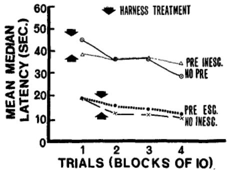
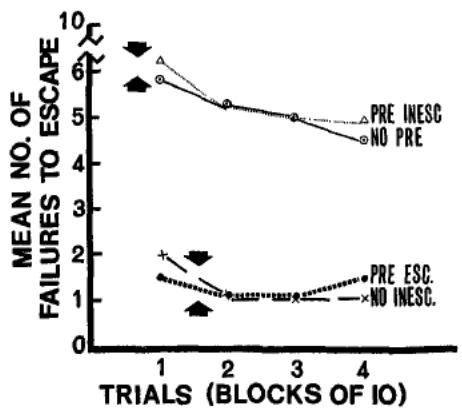
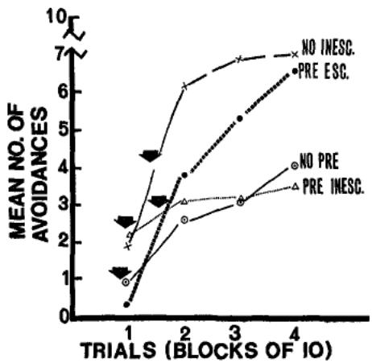

# Journal of Experimental Psychology

VOL. 74, No. 1

MAY 1967

FAILURE TO ESCAPE TRAUMATIC SHOCK1

MARTIN E: P. SELIGMAN 2 AND STEVEN F. MAIER«

University of Pennsylvania

Dogs which had 1st learned to panel press in a harness in order to escape shock subsequently showed normal acquisition of escape/ avoidance behavior in a shuttle box. In contrast, yoked, inescapable shock in the harness produced profound interference with subsequent escape responding in the shuttle box. Initial experience with escape in the shuttle box led to enhanced panel pressing during inescapable shock in the harness and prevented interference with later responding in the shuttle box. Inescapable shock in the harness and failure to escape in the shuttle box produced interference with escape responding after a 7-day rest. These results were interpreted as supporting a learned "helplessness" explanation of interference with escape responding: Ss failed to escape shock in the shuttle box following inescapable shock in the harness because they had learned that shock termination was independent of responding.

Overmier and Seligman (1967) have shown that the prior exposure of dogs to inescapable shock in a Pavlovian harness reliably results in interference with subsequent escape/avoidance learning in a shuttle box. Typically, these dogs do not even escape from shock in the shuttle box. They initially show normal reactivity to shock, but after a few trials, they passively "accept" shock and fail to make escape movements. Moreover, if an escape or avoidance response does occur, it does not reliably predict future escapes or avoidances, as it does in normal dogs.

This pattern of effects is probably not the result of incompatible skeletal responses reinforced during the inescapable shocks, because it can be shown even when the inescapable shocks are delivered while the dogs are paralyzed by curare. This behavior is also probably not the result of adaptation to shock, because it occurs even when escape/avoidance shocks are intensified. However, the fact that interference does not occur if 48 hr. elapse between exposure to inescapable shock in the harness and escape/ avoidance training, suggests that the phenomenon may be partially dependent upon some other temporary process.

Overmier and Seligman (1967) suggested that the degree of control over shock allowed to the animal in the harness may be an important determinant of this interference effect. According to this hypothesis, if shock is terminated independently of S's responses during its initial experience with shock, interference with subsequent escape/avoidance responding should occur. If, however, ,9's responses terminate shock during its initial experience with shock, normal escape/avoidance responding should subsequently occur. Experiment I investigates the effects of escapable as compared with inescapable shock on subsequent escape/avoidance responding.

## EXPERIMENT I

## Method

Subjects,—The 5s were 30 experimentally naive, mongrel dogs, 15-19 in. high at the shoulder, and weighing between 25 and 29 Ib. They were maintained on ad lib food and water in individual cages. Three dogs were discarded from the Escape group, two because they failed to learn to escape shock in the harness (see procedure), and one because of a procedural error. Three dogs were discarded from the "Yoked" control group, two because they were too small at the neck to be adequately restrained in the harness; the third died during treatment. This left 24 5s, eight in each group.

Apparatus.—The apparatus was the same as that described in Overmier and Seligman (1967). It consisted of two distinctively different units, one for escapable/inescapable shock sessions and the other for escape/ avoidance training. The unit in which 5s were exposed to escapable/inescapable shock consisted of a rubberized, cloth hammock located inside a shielded, white, sound-attenuating cubicle. The hammock was constructed so that 5's legs hung down below its body through four holes. The 5's legs were secured in this position, and S was strapped into the hammock. In addition, S"s head was held in position by panels placed on either side and a yoke between the panels across 5's neck. The S could press the panels with its head. For the Escape group pressing the panels terminated shock, while for the "Yoked" control group, panel presses did not effect the preprogrammed shock. The shock source for this unit consisted of 500 v. ac transformer and a parallel voltage divider, with the current applied through a fixed resistance of 20,000 ohms. The shock was applied to 5 through brass plate electrodes coated with commercial electrode paste and taped to the footpads of 5"s hind feet. The shock intensity was 6.0 ma. Shock presentations were controlled by automatic relay circuitry located outside the cubicle.

Escape/avoidance training was conducted in a two-way shuttle box with two black compartments separated by an adjustable barrier (described in Solomon & Wynne, 1953). The barrier height was adjusted to 5"s shoulder height. Each shuttle-box compartment was illuminated by two 50-w. and one 74-w. lamps. The CS consisted of turning off the four 50-w. lamps. The US, electric shock, was administered through the grid floor. A commutator shifted the polarity of the grid bars four times per second. The shock was 550 v. ac applied through a variable current limiting resistor in series with 5. The shock was continually regulated by E at 4.5 ma. Whenever S crossed the barrier, photocell beams were interrupted, a response was automatically recorded, and the trial terminated. Latencies of barrier jumping were measured from CS onset to the nearest .01 sec. by an electric clock. Stimulus presentations and temporal contingencies were controlled by automatic relay circuitry in a nearby room.

White masking noise at approximately 70-db. SPL was presented in both units.

Procedure.—The Escape group received escape training in the harness. Sixty-four unsignaled 6.0 ma. shocks were presented at a mean interval of 90 sec. (range, 60- 120 sec.). If the dog pressed either panel with its head during shock, shock terminated. If the dog failed to press a panel during shock, shock terminated automatically after 30 sec. Two dogs were discarded for failing to escape 18 of the last 20 shocks.\*

\* It might be argued that eliminating these two dogs would bias the data. Thus naive

Twenty-four hours later dogs in the Escape group were given 10 trials of escape/ avoidance training in the shuttle box: 5" was placed in the shuttle box and given 5 min. to adapt before any treatment was begun. Presentation of the CS began each trial. The CS-US interval was 10 sec. If S jumped the barrier during this interval, the CS terminated and no shock was presented. Failure to jump the barrier during the CS-US interval led to shock which remained on until 5 did jump the barrier. If no response occurred within 60 sec. after CS onset, the trial was automatically terminated and a 60- sec. latency recorded. The average intertrial interval was 90 sec. with a range of 60- 120 sec. If 5" failed to cross the barrier on all of the first five trials, it was removed, placed on the other side of the shuttle box, and training then continued. At the end of the tenth trial, 5 was removed from the shuttle box and returned to its home cage.

The Normal control group received only 10 escape/avoidance trials in the shuttle box as described above.

The "Yoked" control group received the same exposure to shock in the harness as did the Escape group, except that panel pressing did not terminate shock. The duration of shock on any given trial was determined by the mean duration of the corresponding trial in the Escape group. Thus each 5" in the "Yoked" control group received a series of shocks of decreasing duration totaling to 226 sec.

Twenty-four hours later, 5s in the "Yoked" control group received 10 escape/ avoidance trials in the shuttle box as described for the Escape group. Seven days later, those Ss in this group which showed the interference effect received 10 more trials in the shuttle box.

## Results 5

The Escape group learned to panel press to terminate shock in the harness. Each 5" in this group showed decreasing latencies of panel pressing over the course of the session $\left( \phi = . 0 0 8 , \right.$ sign test, Trials 1-8 vs. Trials 57-64). Individual records revealed that each 6" learned to escape shock by emitting a single, discrete panel press following shock onset. The -Ss in the "Yoked" control group typically ceased panel pressing altogether after about 30 trials.

TABLE 1  
INDEXES OF SHUTTLE Box ESCAPE/AVOID-ANCE RESPONDING: EXP. I
<table><tr><td rowspan=2 colspan=1>Group</td><td></td><td></td><td></td></tr><tr><td rowspan=1 colspan=1>MeanLatency(in sec.)</td><td rowspan=1 colspan=1>% SsFaiiling toscape Shock onor Moreo of the 10Trials</td><td rowspan=1 colspan=1>Mean No. Failuresto o ESscapeSShock</td></tr><tr><td rowspan=1 colspan=1>EscapeNormal Control&quot;Yoked&quot; Control</td><td rowspan=1 colspan=1>27.00225.9348.22</td><td rowspan=1 colspan=1>012.575</td><td rowspan=1 colspan=1>2.632.257.25</td></tr></table>

• Out of 10 trials.

Table 1 presents the mean latency of shuttle box responding, the mean number of failures to escape shock, and the percentage of Ss which failed to escape nine or more of the 10 trials during escape/avoidance training in the shuttle box for each group. The "Yoked" control group showed marked interference with escape responding in the shuttle box. It differed significantly from the Escape group and from the Normal control group on mean latency and mean number of failures to escape (in both cases, $\phi < . 0 5$ , Duncan's multiple-range test). The Escape group and the Normal control group did not differ on these indexes.

Six 5s in the "Yoked" control group failed to escape shock on 9 or more of the 10 trials in the shuttle box. Seven days after the first shuttle-box treatment, these six 5"s received 10 further trials in the shuttle box. Five of them continued to fail to escape shock on every trial.

## Discussion

The degree of control over shock allowed a dog during its initial exposure to shock was a determinant of whether or not interference occurred with subsequent escape/avoidance learning. Dogs which learned to escape shock by panel pressing in the harness did not differ from untreated dogs in subsequent escape/ avoidance learning in the shuttle box. Dogs for which shock termination was independent of responding in the harness showed interference with subsequent escape learning.

Because the Escape group differed from the "Yoked" control group during their initial exposure to shock only in their control over shock termination, we suggest that differential learning about their control over shock occurred in these two groups. This learning may have acted in the following way: (a) Shock initially elicited active responding in the harness in both groups. (&) 5"s in the "Yoked" control group learned that shock termination was independent of their responding, i.e., that the conditional probability of shock termination in the presence of any given response did not differ from the conditional probability of shock termination in the absence of that response, (c) The incentive for the initiation of active responding in the presence of electric shock is the expectation that responding will increase the probability of shock termination. In the absence of such incentive, the probability that responding will be initiated decreases, (d) Shock in the shuttle box mediated the generalization of b to the new situation for the "Yoked" control group, thus decreasing the probability of escape response initiation in the shuttle box.

Escapable shock in the harness (Escape group) did not produce interference, because 6"s learned that their responding was correlated with shock termination. The incentive for the maintenance of responding was thus present, and escape response initiation occurred normally in the shuttle box.

Learning that shock termination is independent of responding seems related to the concept of learned "helplessness" or "hopelessness" advanced by Richter (1957), Mowrer (1960, p. 197), Cofer and Appley (1964, p. 452), and to the concept of external control of reinforcement discussed by Lefcourt (1966).

In untreated Ss the occurrence of an escape or avoidance response is a reliable predictor of future escape and avoidance responding. Dogs in the "Yoked" control group and in the groups which showed the interference effect in Overmier and Seligman (1967) occasionally made an escape or avoidance response and then reverted to "passively" accepting shock. These dogs did not appear to benefit from the barrier-jumping—shock termination contingency. A possible interpretation of this finding is that the prior learning that shock termination was independent of responding inhibited the formation of the barrier-jumping—shocktermination association.

The SB in the "Yoked" control group which showed the interference effect 24 hr. after inescapable shock in the harness again failed to escape from shock after a further 7-day interval. In contrast, Overmier and Seligman (1967) found that no interference occurred when 48 hr. elapsed between inescapable shock in the harness and shuttle-box training. This time course could result from a temporary state of emotional depletion (Brush, Myer, & Palmer, 1963), which was produced by experience with inescapable shock, and which could be prolonged by being conditioned to the cues of the shuttle box. Such a state might be related to the parasympathetic death which Richter's (1957) "hopeless" rats died. Further research is needed to clarify the relationship between the learning factor, which appears to cause the initial occurrence of the interference effect, and an emotional factor, which may be responsible for the time course of the effect.

The results of Exp. I provide a further disconfirmation of the adaptation explanation of the interference effect. If 5s in the "Yoked" control group had adapted to shock and, therefore, were not sufficiently motivated to respond in the shuttle box, 5"s in the Escape group should also have adapted to shock. Further, the Escape and the "Yoked" control groups were equated for the possibility of adventitious punishment for active responding by shock onset in the harness. Thus it seems unlikely that the "Yoked" control group failed to escape in the shuttle box because it had been adventitiously punished for active responding in the harness.

## EXPERIMENT II

Experiment I provided support for the hypothesis that 5" learned that shock termination was independent of its responding in the harness and that this learning inhibited subsequent escape responding in the shuttle box. Experiment II investigates whether prior experience with escapable shock in the shuttle box will mitigate the effects of inescapable shock in the harness on subsequent escape/avoidance behavior. Such prior experience might be expected (a) to inhibit 6"s learning in the harness that its responding is not correlated with shock termination and (Z?) to allow .\$" to discriminate between the escapability of shock in the shuttle box and the inescapability of shock in the harness.

## Method

Subjects.-—The ,9s were 30 experimentally naive, mongrel dogs, weight, height, and housing as above. Three dogs were discarded: two because of procedural errors and one because of illness. The remaining 27 dogs were randomly assigned to three groups of nine SB each.

Apparatus.—The two units described for Exp. I were used.

Procedure.—The Preescape group received 3 days of treatment. On Day 1, each 5" received 10 escape/avoidance trials in the shuttle box as described in Exp. I. On Day 2, approximately 24 hr. after the shuttlebox treatment, each 6" in this group received an inescapable shock session in the harness. All inescapable shocks were unsignaled. The inescapable shock session consisted of

64, S-sec. shocks, each of 6.0 ma. The average intershock interval was 90 sec. with a range of 60-120 sec. On Day 3, approximately 24 hr. after the inescapable shock, S was returned to the shuttle box and given 30 more escape/avoidance trials, as described for Day 1.

The No Pregroup received no experience in the shuttle box prior to receiving inescapable shock. On the first treatment day for this group, each S was placed in the harness and exposed to an inescapable shock session as described for the Preescape group, Day 2. Approximately 24 hr. later, .? was placed in the shuttle box and given 40 trials of escape/avoidance training as described above. If S failed to respond on all of the first five trials, 61 was moved to the other side of the shuttle box. If 5" continued to fail to respond on all trials, it was put back on the original side after the twenty-fifth trial. Thus, if S1 failed to escape on every trial, it received a total of 2,000 sec. of shock.

The No Inescapable group was treated exactly as the Preescape group except that it received no shock in the harness. On Day 1, 5" received 10 escape/avoidance trials in the shuttle box. On Day 2, it was strapped in the harness for 90 min., but received no shock. On Day 3, it was returned to the shuttle box and given 30 more escape/avoidance trials.

## Results

The No Pregroup showed significant interference with escape/avoidance responding in the shuttle box on Day 3. The Preescape and the No Inescapable groups did not show such interference. Figure 1 presents the mean median latency of jumping responses for the three groups (and a posterior control group, see below) over the four blocks of 10 trials. Analysis of variance on the three groups revealed that the effect of groups, F (2, 24) = 3.55, p < .05, and the effect of trial blocks, -F (3, 72) = 6.84, p < .01, were significant. Duncan's multiple-range test indicated that the No Pregroup differed from the other two groups across all 40 trials both $\phi < . 0 5$ The Preescape and the No Inescapable groups did not differ from each other. Similar results held for the mean of mean latencies. A small, transitory disruption of improvement in shuttle-box performance following inescapable shock in the harness occurred in the Preescape group relative to the No Inescapable group. Difference scores for latencies between consecutive blocks of trials measure improvement in performance. A comparison of the Preescape group with the No Inescapable group on the difference between the mean latency on Trials 1-10 and the mean latency on Trials 11-20 revealed that the No Inescapable group showed significantly more improvement than the Preescape group, Mann-Whitney U test, $U _ { \cdot } = \mathrm { i } \mathbf { \hat { 5 } } ,$ $\dot { p } < \mathsf { . 0 5 }$ No significant differences were found on difference scores for any subsequent blocks of trials.

  
FIG. 1. Mean median latency of escape/ avoidance responding. (The position of the arrow denotes whether the harness treatment occurred 24 hr. before the first or second block of trials.)

  
FIG. 2. Mean number of failures to escape shock. (The position of the arrow denotes whether the harness treatment occurred 24 hr. before the first or second block of trials.)

Figure 2 presents the mean number of failures to escape shock for the three groups across the four blocks of trials. Analysis of variance revealed a significant overall effect of blocks, F (3, 72) $= 5 . 9 4 $ $\phi < . 0 1 $ , and a significant Groups X Blocks interaction, F (6, $7 2 ) \bar { = } 1 7 . 8 2 , \ p < . 0 1$ Duncan's tests indicated that the No Pregroup showed significantly more failures to escape than the other two groups across the 40 trials, both $\phi < . 0 \bar { 5 }$ . The Preescape and the No Inescapable groups did not differ.

Figure 3 presents the total number of avoidance responses for the groups across the blocks of trials. Only the blocks effect was significant in the overall analysis of variance, F (3, 72) $= 2 7 . 9 0 $ $\pmb { \hat { p } < . 0 1 }$ No other effects were significant.

Panel presses made in the harness during the inescapable shock session were counted. On either side of 5"'s head were panels which 5" could press ; panel pressing had no effect on the shock, but merely indicated attempts to respond and/or struggling in the harness. The Preescape group, having received 10 trials with escapable shock in the shuttle box the previous day, made more panel presses during the inescapable shock session than did the No Pregroup, the group for which the inescapable shock in the harness was the first experimental treatment, Mann-Whitney U test, $U = 9 , \phi < . 0 2 .$

  
FIG. 3. Mean number of avoidances. (The position of the arrow denotes whether the harness treatment occurred 24 hr. before the first or second block of trials.)

Posterior control group.—Subsequent to this experiment, a control group was run to determine if the escapability of shock in the shuttle box on Day 1 for the Preescape group was responsible for its enhanced panel pressing in the harness and lack of interference with responding in the shuttle box. Or would the mere occurrence of inescapable shock for a free-moving animal in the shuttle box have produced these results? Nine naive dogs received the following treatment: On Day 1, 5"s were placed in shuttle box and given 10 trials as for the Preescape and the No Inescapable groups. Unlike these groups, however, S's barrier jumping did not (except adventitiously) terminate the shock and CS, because trial durations were programmed independently of ,S"s behavior. The duration of each of the 10 trials for this Preinescapable group corresponded to the mean trial duration for the Preescape and the No Inescapable groups on that trial. On Day 2, 5"s received 64 trials of inescapable shock in the harness. On Day 3, Ss received 40 escape/avoidance trials in the shuttle box.

Figures 1, 2, and 3 present the escape/avoidance performance of the Preinescapable group on Day 3. In general this group performed like the

No Pregroup. This impression was borne out by statistical tests. The Preinescapable group showed significantly slower median latency of barrier jumping than the Preescape and the No Inescapable groups across all 40 trials, both $\dot { \mathfrak { p } } < . 0 5 ,$ Duncan's test. The Preinescapable group did not differ from the No Pregroup. Similar results held for the other indexes.

Analysis of the panel press data showed that the Preinescapable group made significantly fewer panel presses in the harness than the Preescape group, Mann-Whitney U test, $U = { \hat { 1 4 } } ,$ $\phi < . 0 5 ,$ The Preinescapable group did not differ significantly from the No Pregroup, $U = 2 6$

## Discussion

Three main findings emerged from Exp. II: (a) 5s (Preescape), which first received escapable shock in the shuttle box, then inescapable shock in the harness, did not react passively to subsequent shock in the shuttle box, as did 5s which either first received inescapable shock in the shuttle box (Preinescapable) or no treatment prior to shock in the harness (No Pre). (6) The Preescape group, having received experience with escapable shock in the shuttle box, showed enhanced panel pressing when exposed to inescapable shock in the harness, relative to naive 5s given inescapable shock in the harness. Such enhanced panel pressing was specifically the result of the escapability of shock in the shuttle box: The Preinescapable group did not show enhanced panel pressing, (c) The interference effect persisted for 40 trials.

The 5s which have had prior experience with escapable shock in the shuttle box showed more energetic behavior in response to inescapable shock in the harness. This contrasts with the interference effect produced by inescapable shock in 5s which have had no prior experience with shock or in 5s which have had prior experience with inescapable shock. Thus, if an animal first learns that its respending produces shock termination and then faces a situation in which reinforcement is independent of its responding, it is more persistent in its attempts to escape shock than is a naive animal.

## GENERAL DISCUSSION

We have proposed that 5" learned as a consequence of inescapable shock that its responding was independent of shock termination, and therefore the probability of response initiation during shock decreased. Alternative explanations might be offered: (a) Inactivity, somehow, reduces the aversiveness of shock. Thus 5 failed to escape shock in the shuttle box because it had been reinforced for inactivity in the harness. Since the interference effect occurred in 5s which had been curarized during inescapable shock, such an aversiveness-reducing mechanism would have to be located inward of the neuro-myal junction. (&) S failed to escape in the shuttle box because certain responses which facilitate barrier jumping were extinguished in the harness during inescapable shock. In conventional extinction procedures, some response is first explicitly reinforced by correlation with shock termination, and then that response is extinguished by removing shock altogether from the situation. Responding during extinction is conventionally not Mwcorrelated with shock termination; rather, responding is correlated with the total absence of shock. In our harness situation, no response was first explicitly reinforced, and shock was presented throughout the session. A broader concept of extinction, however, might be tenable. On this view, any procedure which decreases the probability of a response by eliminating the incentive to respond is an extinction procedure. If the independence of shock termination and responding eliminates the incentive to respond (as assumed), then our harness procedure could be thought of as an extinction procedure. Such an explanation seems only semantically different from the one we have advanced, since both entail that the probability of responding during shock has decreased because 5 learned that shock termination was independent of its responses.

Learning that one's own responding and reinforcement are independent might be expected to play a role in appetitive situations. If S received extensive pretraining with rewarding brain stimulation delivered independently of its operant responding, would the subsequent acquisition of a bar press to obtain this reward be retarded? Further, might learned "helplessness" transfer from aversive to appetitive situations or vice versa?

If dogs learn in one situation that their active responding is to no avail, and then transfer this training to another shock situation, the opposite type of transfer (avoidance learning sets) might be possible: If a dog first learned a barrier-hurdling response which avoided shock in the shuttle box, would that dog be facilitated in learning to panel press to avoid shock in the harness (to a different CS) ? Our finding, that dogs which first successfully escape shock in the shuttle box later showed enhanced panel pressing in the harness, is consonant with this prediction.

Does learning about response—reinforcement contingencies have its analogs in classical conditioning? If 6" experienced two stimuli randomly interspersed with each other (adventitious pairings possible), would it be retarded in forming an association between the two stimuli once true pairing was begun? Conversely, pretraining in which one stimulus is correlated with a US might facilitate the acquisition of the CR to a new CS. Pavlov (1927, p. 75) remarked that the first establishment of a conditioned inhibitor took longer than any succeeding one.

In conclusion, learning theory has stressed that two operations, explicit contiguity between events (acquisition) and explicit noncontiguity (extinction), produce learning. A third operation that is proposed, independence between events, also produces learning, and such learning may have effects upon behavior that differ from the effects of explicit pairing and explicit nonpairing. Such learning may produce an 5 who does not attempt to escape electric shock; an 51 who, even if he does respond, may not benefit from instrumental contingencies.

## REFERENCES

BRUSH, F. R., MYER, J. S., & PALMER, M. E. Effects of kind of prior training and intersession interval upon subsequent avoidance learning. /. comp. physiol. Psychol., 1963, 56, 539-S4S.

COFER, C. N., & APPLEY, M. H. Motivation: Theory and research. New York: Wiley, 1964.

LEFCOURT, H. M. Internal vs. external control of reinforcement: A review. Psychol. Bull, 1966, 65, 206-221.

MOWRER, O. H. Learning theory and behavior. New York: Wiley, 1960.

OVERMIER, J. B., & SELIGMAN, M. E. P. Effects of inescapable shock on subsequent escape and avoidance learning. J. comp. physiol. Psychol., 1967, 63, 28-33.

PAVLOV, I. P. Conditioned reflexes. New York: Dover, 1927.

RICHTER, C. On the phenomenon of sudden death in animals and man. Psychosom. Med., 19S7, 19, 191-198.

SOLOMON, R. L., & WYNNE, L. C. Traumatic avoidance learning: Acquisition in normal dogs. Psychol. Monogr., 1953, 67(4, Whole No. 3S4).

(Received June 1, 1966)